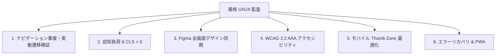

# World-Class UI/UX Review Skill (Rigorous Interactive & Navigation Audit)

単なる静的コード検証にとどまらず、**実際のユーザー操作（クリック遷移、ナビゲーション重複、タブ切り替え、レイアウト破綻）の完全動作を検証**し、甘い自己評価（形式的な満点）を徹底的に排除する厳格な UI/UX 監査プロトコルです。

---

## 🎯 必須検証チェックリスト（甘さの排除）

レビュー実行時は、以下の**「実動ナビゲーション 5 大ゲート」**を必ず検証し、1 つでも不備があれば減点・即時指摘します：

1. **ナビゲーション重複チェック (Duplicate Menu Gate)**:
   - ヘッダー、サイドバー、フッター、ページ内コンテンツ間で同一の機能リンクが重複して混乱を招いていないか。
2. **ルーティング・タブ遷移の実動チェック (Interactive Route Gate)**:
   - 全てのメニュー項目をクリックした際に、意図した専用ビューが正確に表示され、無関係な要素が残留しないか。
3. **App Shell 共通シェルの一貫性 (Shell Consistency Gate)**:
   - 画面を切り替えてもサイドバーや共通枠組みが消失・ガタつき（Layout Shift）を起こさないか。
4. **Figma ワイヤーフレーム全画面同期 (Full Canvas Parity Gate)**:
   - ホーム、営業マッチング、勤怠、診断、管理画面の全画面が Figma 上に漏れなく展開されているか。
5. **過大評価の防止と客観的採点 (Objective Score Gate)**:
   - 形式的な満点（100点）を禁止し、実動作・エルゴノミクス・認知負荷の観点からシビアに採点（実態ベースの厳格評価）。

---

## 🏛️ 6大品質柱の検証プロトコル

### 実行手順
1. `python scripts/audit_figma_design_sync.py`（Figma トークン・全画面整合性）
2. `python scripts/check_accessibility_static.py`（WCAG 静的検証）
3. `python -m pytest tests/test_playwright_ui.py`（実際のブラウザクリック・遷移検証）
4. 不備箇所の抽出と即時修正パッチの適用。
