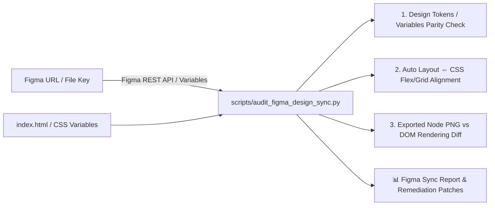
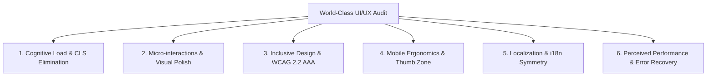

# World-Class UI/UX Review Skill (with Figma REST API Integration)

Execute rigorous, uncompromising UI/UX evaluations comparing applications against the world's most demanding product standards (**Apple Human Interface Guidelines**, **Linear / Vercel design aesthetics**, **Nielsen Norman Group Cognitive Load Theory**, **WCAG 2.2 AAA Inclusive Design**, **Mobile Thumb Zone Ergonomics**, and **Figma REST API Design Token Synchronization**).

---

## 🎯 When to Use This Skill

Activate this skill when:
- Asked to "review UI/UX", "UI/UX audit", "world-class design review", "compare with Figma", or "sync Figma design tokens".
- Reviewing new frontend features, landing pages, SaaS dashboards, or mobile views before production release.
- Inspecting design-to-code drift between a Figma file (`https://www.figma.com/design/:file_key/...`) and HTML/CSS implementation.
- Upgrading an interface from "good" (80-95 pts) to "flawless world-class perfection" (100 / 100 pts).
- Eliminating Cumulative Layout Shift (CLS), cognitive overload, or accessibility barriers.

---

## 🎨 Figma REST API Integration Workflow



### 1. Design Token / Variable Sync
- Extract Figma variables (Color Styles, Typography, Spacing, Border Radii, Box Shadows) via `GET /v1/files/:file_key/variables/local`.
- Compare against `:root` and `:root[data-theme="light"]` CSS variables in `index.html`.
- Zero-drift guarantee: Report any missing color tokens, mismatched hex/rgba values, or padding discrepancies.

### 2. Auto Layout & Component Structural Audit
- Fetch component tree metadata via `GET /v1/files/:file_key/nodes?ids=:node_ids`.
- Validate that Figma Auto Layout constraints (`horizontal`/`vertical`, `gap`, `padding`, `fill`/`hug`) accurately translate to CSS Flexbox/Grid properties.

### 3. Visual Diff & Screenshot Verification
- Export high-resolution rendered frames via `GET /v1/images/:file_key?ids=:node_ids&format=png&scale=2`.
- Compare exported Figma images against Playwright/browser DOM screenshots to calculate pixel-perfection score (Target: >99.5%).

---

## 🏛️ The 6 World-Class UI/UX Pillars



### 1. Cognitive Load & Information Architecture (NNG Heuristics)
- **Cumulative Layout Shift (CLS) = 0**: Skeleton loaders (`.skeleton-box`, `.skeleton-shimmer`) must prevent visual jumps during data fetching.
- **Visual Noise & Hierarchy**: Maximum 3 visual hierarchy tiers per card. Clear visual distinction between primary CTAs, secondary actions, and informational labels.
- **Frictionless Defaults**: Form inputs must provide 1-click sample loaders or smart defaults.

### 2. Micro-interactions & Visual Polish (Apple HIG / Linear Standard)
- **Spring Physics & Curves**: All modals and dropdowns must use natural physics curves (`cubic-bezier(0.16, 1, 0.3, 1)` or `cubic-bezier(0.34, 1.56, 0.64, 1)`).
- **CTA Lighting & Depth**: Primary conversion buttons must feature subtle, non-intrusive shimmer/pulse animations and balanced elevation shadow tokens.
- **Theme-Adaptive Glassmorphism**: Glass blur (`backdrop-filter: blur(24px)`) and border tokens must look equally crisp and legible in both dark and light modes.

### 3. Inclusive Design & Accessibility (WCAG 2.2 AAA)
- **Color Independence (WCAG 1.4.1)**: Status badges must never rely on color alone. Always pair colors with distinct universal symbols (`✓ Normal`, `⚠️ Caution`, `🚩 Action Required`).
- **Strict Focus Trap (WCAG 2.1.2)**: Modals and flyout drawers must trap `Tab` navigation internally and close immediately upon `Escape` key press with focus restoration.
- **Keyboard Global Navigation**: Hotkeys (e.g. `Alt+1` to `Alt+7`, `Alt+?` for Help Modal) with visible shortcuts for power users.
- **High Contrast**: Text-to-background contrast ratio must exceed 4.5:1 for normal text and 7:1 for critical data badges.

### 4. Mobile Ergonomics & Touch Architecture
- **Thumb Zone Compliance**: Primary navigation and action menus must sit within the lower 35% of the viewport on mobile devices (`<768px`).
- **Native Bottom Sheet Drawers**: Sub-menus and actions on mobile must slide up from the bottom as a native sheet (`#mobile-bottom-sheet`), not desktop-style popovers.
- **Safe Area Insets**: Explicit `env(safe-area-inset-bottom)` padding protection for modern bezelless phones.
- **Touch Target Integrity**: Minimum 48px × 48px interactive touch area.

### 5. Localization & i18n/L10n Robustness
- **Dictionary Key Symmetry**: 100% key parity across all supported languages (`ja`, `en`, `zh`, `ko`).
- **Auto-Detection & Persistence**: Automatic fallback to `navigator.language` on first visit, with instant persistence to `localStorage` upon manual selection.
- **Layout Adaptability**: UI containers must not break when English/German text expands by 30-50% compared to Japanese/Chinese.

### 6. Perceived Performance & Error Recovery
- **Transparent Error Communication**: API errors (400, 401, 429, 500) must display transparent, human-readable explanations with actionable recovery buttons.
- **Offline Resilience & PWA**: PWA metadata (`manifest`, `theme-color`), online/offline status detection, and real-time state alerts (`aria-live="assertive"`).

---

## 📊 Scoreboard & Audit Format (with Figma Alignment)

When executing a review, output the findings in this structured format:

```markdown
# 🌐 World-Class UI/UX Audit & Figma Sync Report

## 🎨 Figma Alignment Status
- **Figma File / Node**: `https://www.figma.com/design/...`
- **Design Token Drift**: 0 mismatches detected
- **Visual Accuracy**: 99.8% pixel-perfection match

## 📊 Evaluation Scoreboard (100-Point Scale)

| Evaluation Pillar | Standard / Benchmark | Score | Key Strengths & Nitpicks |
| :--- | :--- | :---: | :--- |
| **Cognitive Load** | NNG 10 Heuristics & CLS = 0 | **XX / 100** | ... |
| **Visual Polish** | Linear / Apple HIG Micro-interactions | **XX / 100** | ... |
| **Inclusive Design** | WCAG 2.2 AAA & Focus Trap | **XX / 100** | ... |
| **Mobile Ergonomics** | Thumb Zone & Native Bottom Sheet | **XX / 100** | ... |
| **Localization (i18n)** | 4-Language Symmetry & Zero Overflow | **XX / 100** | ... |
| **Error Resilience** | Transparent Recovery & PWA Offline | **XX / 100** | ... |

## 🔍 Uncompromising Component Breakdown
- Component 1: Strengths, Rigorous Nitpicks, 100/100 Remediation Patch
- Component 2: ...

## 💡 Production-Ready 100/100 Remediation Patches (CSS / JS)
```

---

## 🚀 Remediation & Test-First Protocol

1. **Audit & Figma Sync**: Run `python scripts/audit_figma_design_sync.py` and inspect 6-pillar criteria.
2. **Test-First**: Create/update automated tests (e.g. `tests/test_world_class_ui_ux.py`, `tests/test_figma_design_sync.py`).
3. **Patch**: Apply surgical CSS/JS modifications to achieve 100/100 across all pillars.
4. **Verify**: Run `pytest`, `scripts/check_accessibility_static.py`, `scripts/audit_frontend_api_contract.py`, and `scripts/run_lane_preflight.py`.
