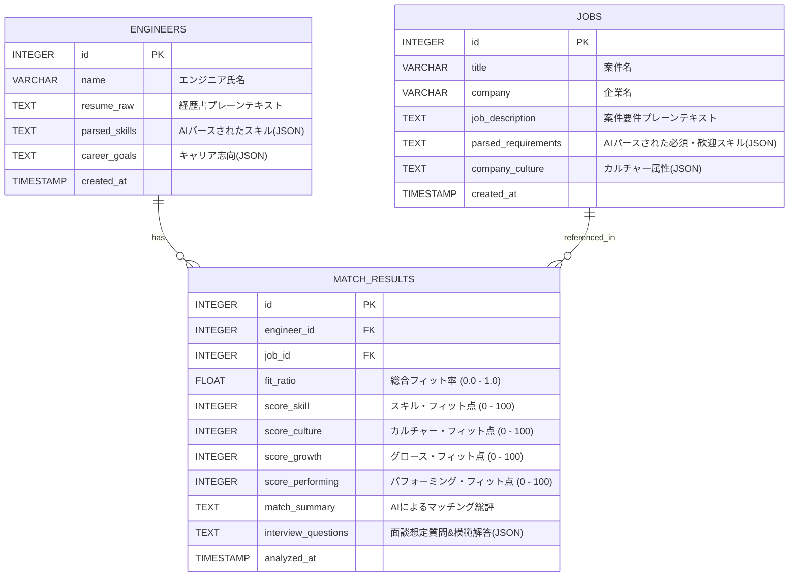

# 💾 Mighty Skill-Bridge: データベース設計書 (database.md)

> **Mighty-Link AI Connect: Project "Mighty Skill-Bridge"**
> *エンジニアと案件の多次元的なフィット情報を蓄積し、テクノロジーの繋がりを記録するデータスキーマ設計*

---

## 1. データベース概要

本プロジェクトでは、フロントエンド（ブラウザ内）での完結、あるいは超軽量なバックエンド構築を想定し、以下のハイブリッド構成を採用します。
1. **IndexedDB (クライアントサイド・データベース)**: ブラウザ上でエンジニア経歴や案件データをセッションを超えて保持し、外部サーバーなしでの爆速動作を実現。
2. **SQLite3 (サーバーサイド・データベース - 互換設計)**: 将来的なサーバー移行を容易にするため、標準的なリレーショナルデータベーススキーマに準拠。

---

## 2. テーブル定義 (Schema Definitions)



---

## 3. 各テーブル詳細

### 3.1 `engineers`（エンジニア情報）
エンジニアの経歴書（PDFや画像）を Gemini がマルチモーダル解析し、構造化したデータを保持します。

| カラム名 | データ型 | 制約 | 説明 |
| :--- | :--- | :--- | :--- |
| `id` | INTEGER | PRIMARY KEY AUTOINCREMENT | エンジニア識別ID |
| `name` | VARCHAR(100) | NOT NULL | 氏名または匿名化ID（例: Engineer_A） |
| `resume_raw` | TEXT | | パース元の生テキスト |
| `parsed_skills` | TEXT (JSON) | | `{"languages": ["Python", "JS"], "frameworks": ["Django"], "cloud": ["AWS"]}` |
| `career_goals` | TEXT (JSON) | | エンジニアが求めるキャリアパスや技術志向 |
| `created_at` | TIMESTAMP | DEFAULT CURRENT_TIMESTAMP | 登録日時 |

### 3.2 `jobs`（案件情報）
案件の募集要項や求人票を構造化したデータを保持します。

| カラム名 | データ型 | 制約 | 説明 |
| :--- | :--- | :--- | :--- |
| `id` | INTEGER | PRIMARY KEY AUTOINCREMENT | 案件識別ID |
| `title` | VARCHAR(255) | NOT NULL | 案件名 |
| `company` | VARCHAR(100) | | 募集企業名 (任意) |
| `job_description` | TEXT | | 募集要項の生テキスト |
| `parsed_requirements` | TEXT (JSON) | | `{"mandatory": ["React", "CSS"], "preferred": ["TypeScript"]}` |
| `company_culture` | TEXT (JSON) | | 開発文化（`{"agile": true, "average_age": 32, "remote_ratio": 0.8}`） |
| `created_at` | TIMESTAMP | DEFAULT CURRENT_TIMESTAMP | 登録日時 |

### 3.3 `match_results`（多次元フィット分析結果）
AIによる4次元フィット分析の結果を記録し、Google Sheets「マッチングログ」へ連携されるベースデータとなります。

| カラム名 | データ型 | 制約 | 説明 |
| :--- | :--- | :--- | :--- |
| `id` | INTEGER | PRIMARY KEY AUTOINCREMENT | 分析結果ID |
| `engineer_id` | INTEGER | FOREIGN KEY REFERENCES `engineers`(`id`) | 対象エンジニアID |
| `job_id` | INTEGER | FOREIGN KEY REFERENCES `jobs`(`id`) | 対象案件ID |
| `fit_ratio` | FLOAT | NOT NULL | 総合マッチ度（例: 0.85 -> 85%） |
| `score_skill` | INTEGER | | スキル・フィット点 (0 - 100) |
| `score_culture` | INTEGER | | カルチャー・フィット点 (0 - 100) |
| `score_growth` | INTEGER | | グロース・フィット点 (0 - 100) |
| `score_performing` | INTEGER | | パフォーミング・フィット点 (0 - 100) |
| `match_summary` | TEXT | | AIが生成した多角的な分析サマリー |
| `interview_questions` | TEXT (JSON) | | 面談想定質問（問と模範回答の配列） |
| `analyzed_at` | TIMESTAMP | DEFAULT CURRENT_TIMESTAMP | 分析実行日時 |

---

## 4. DDL SQL (データ定義言語)

```sql
-- Engineers Table
CREATE TABLE IF NOT EXISTS engineers (
    id INTEGER PRIMARY KEY AUTOINCREMENT,
    name VARCHAR(100) NOT NULL,
    resume_raw TEXT,
    parsed_skills TEXT,
    career_goals TEXT,
    created_at TIMESTAMP DEFAULT CURRENT_TIMESTAMP
);

-- Jobs Table
CREATE TABLE IF NOT EXISTS jobs (
    id INTEGER PRIMARY KEY AUTOINCREMENT,
    title VARCHAR(255) NOT NULL,
    company VARCHAR(100),
    job_description TEXT,
    parsed_requirements TEXT,
    company_culture TEXT,
    created_at TIMESTAMP DEFAULT CURRENT_TIMESTAMP
);

-- Match Results Table
CREATE TABLE IF NOT EXISTS match_results (
    id INTEGER PRIMARY KEY AUTOINCREMENT,
    engineer_id INTEGER,
    job_id INTEGER,
    fit_ratio REAL NOT NULL,
    score_skill INTEGER,
    score_culture INTEGER,
    score_growth INTEGER,
    score_performing INTEGER,
    match_summary TEXT,
    interview_questions TEXT,
    analyzed_at TIMESTAMP DEFAULT CURRENT_TIMESTAMP,
    FOREIGN KEY(engineer_id) REFERENCES engineers(id),
    FOREIGN KEY(job_id) REFERENCES jobs(id)
);
```

---
*Created and approved as part of WBS Task T102.*
