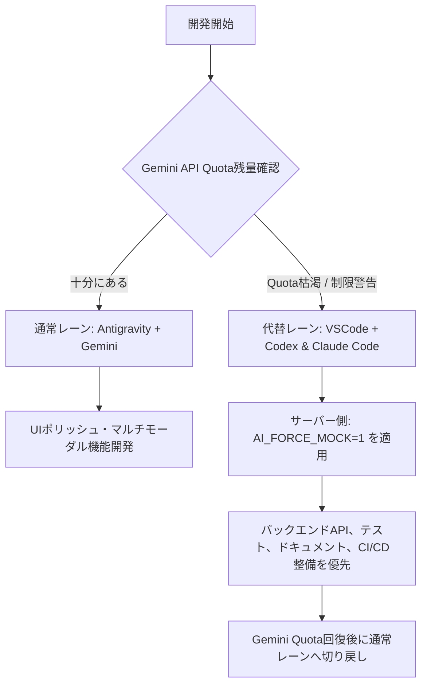

# Mighty Skill-Bridge：3 AIツール並走時におけるクォータ監視およびコスト管理設計書（T687）

**作成日**: 2026年6月3日  
**ステータス**: 完了  
**対象フェーズ**: 7. 次期開発・運用（コスト）  
**関連タスク**: **T687** 3 AIツール並走時のquotaメーター監視と超過レポート設計  
**関連Issue/課題**: [R11](file:///c:/Users/kanta/GitHub/mighty-link-ai-connect/data/issues_tracker.tsv#L12) (3 AIツール並走の月額コスト超過リスク)

---

## 1. 背景と設計方針
本プロジェクトでは、開発効率の最大化と役割の専門化を目的に、以下の3つのAI開発環境を並走させています。
1. **Antigravity + Gemini レーン**: 主にUI/UXのポリッシュ、フロントエンドの実装、およびマルチモーダル処理を担当（Gemini API 依存）。
2. **VSCode + Codex レーン**: 主にFastAPIバックエンド、データ同期スクリプト、GitHub/Google Workspace APIの自動化、およびCI環境整備を担当。
3. **VSCode + Claude Code レーン**: 主に設計ドキュメント整備、WBS状態管理、チェックリスト構築、およびバグトリアージを担当。

これら3つのAI環境が並走するにあたり、API使用量やトークン消費量が急増して予期せぬ「ジャケ買いコスト超過（Bill Shock）」や「API制限（Quota 枯渇）による開発の中断」が発生するのを防ぐため、本設計書において監視手法・通知閾値・クォータ枯渇時の優先開発レーン移行（Traffic Lane Shift）ポリシーを確立します。

---

## 2. 各ツールのクォータ・コスト監視手法

### 2.1 Antigravity (Gemini API)
* **監視対象**: Google AI Studio および Google Cloud Platform (GCP) 上の API Token 数、RPM (Requests Per Minute)、RPD (Requests Per Day)。
* **監視手段**:
  * GCP Billing Alerts（月額予算超過時のSlack/メール通知）。
  * Google AI Studio の Usage ダッシュボードの定期モニタリング。
  * `scripts/monitor_managed_agents_cost.py`（API呼び出しごとの使用トークン数履歴保存PoC）。

### 2.2 VSCode + Claude Code (Anthropic API)
* **監視対象**: Anthropic Console における利用額（USD）およびモデル別のトークン消費量。
* **監視手段**:
  * Anthropic Developer Console の「Spend Alerts」（日次および月次の利用額アラート設定）。
  * アラート閾値：警告リミット $10/月、ハード遮断リミット $20/月。

### 2.3 VSCode + Codex
* **監視対象**: 主に内部ツール（FastAPI）やローカルDB/CIリソース。
* **監視手段**:
  * ローカルの確定的なモック処理が有効になっているか (`AI_FORCE_MOCK=1`) の定期テスト。

---

## 3. 月次コスト実測レポートの標準フォーマット
各セッションおよび月次のAPI消費額・トークン数を可視化するため、毎月 `docs/COST_REPORT_<YYYY-MM>.md` を Codex レーンで作成し、社長へ共有します。

### レポートテンプレート:
```markdown
# 📊 Mighty Skill-Bridge：AI開発コスト月次レポート (YYYY年MM月)

## 1. コスト・クォータ概要
* **総消費額**: $XX.XX / $20.00 (ハード上限)
* **ステータス**: [正常 | 警告 | 制限適用中]

## 2. レーン別詳細

| 開発レーン | プロバイダー | 使用モデル/API | 消費トークン数/コール数 | 当月費用 (USD) | 備考 |
| :--- | :--- | :--- | :--- | :--- | :--- |
| **Antigravity + Gemini** | Google AI | Gemini 1.5/2.0 Flash / Pro | XX,XXX tokens | $X.XX | 主作業環境 |
| **VSCode + Codex** | OpenAI / Local | gpt-4o-mini | XX,XXX tokens | $X.XX | バックエンド / 同期 |
| **VSCode + Claude Code** | Anthropic | claude-3-7-sonnet | XX,XXX tokens | $X.XX | 設計 / トリアージ |

## 3. クォータ警告・遮断イベント発生状況
* [日付 / イベント内容 / 対処した内容]

## 4. 次月のコスト最適化プラン
* [不要なコンテキスト読み込みの削減、キャッシュ適用プランなど]
```

### 2026-06-14 追記: T757 週次コスト配賦ダッシュボード

月次レポートに加えて、`scripts/generate_weekly_cost_dashboard.py` で週次のコスト配賦ビューを生成する運用へ拡張しました。`data/cost_allocation_budgets.tsv` を正本として、AI API / Firebase・Google Cloud / Supabase / Stripe / GitHub Actions / Slack通知のコストセンター、担当レーン、月次予算、警告閾値、請求正本を管理します。

- 出力: `exports/weekly_cost_dashboard.json` / `exports/weekly_cost_dashboard.md`
- 通知ドラフト: `exports/weekly_cost_alert_email.md` / `exports/weekly_cost_slack_payload.json`
- 週次自動検証: `.github/workflows/weekly-cost-dashboard.yml`
- 実請求額の正本: Google Cloud Billing export、Firebase Budgets、Supabase Dashboard、Stripe Dashboard、GitHub Actions usage、BytePlus / Google AI usage
- 実請求export未接続のコストセンターは `unknown` と表示し、ローカル台帳から金額を推測しません。
- Slack webhook URL、SMTP password、API key、請求アカウントIDは成果物・Issue・Sheetsに保存しません。

---

## 4. 優先レーンポリシー (Traffic Lane Shift Policy)
Gemini API または Anthropic API のクォータが制限値に達した場合、開発を停止させることなく安全に継続するための切り戻しルール（handoff規約）を定義します。



### 4.1 制限発生時の切替手順（Failover Flow）
1. **検知と記録**: `Antigravity` が API 制限エラー（429 Too Many Requests 等）を返した際、または `monitor_managed_agents_cost.py` が月次ソフトリミット到達を検知した際、速やかに開発環境を `VSCode + Codex` レーンに切り替えます。
2. **モック適用**: バックエンド起動時に環境変数 `AI_FORCE_MOCK=1` を設定し、実APIへのコールを完全に遮断。ローカルの確定的なフォールバックパイプラインによるシミュレーター動作で単体テストおよびUI検証を継続します。
3. **作業の集中**: 制限中はUIデザインの新規生成を停止し、ドキュメントの整理、WBSの更新、自動テスト（Playwright）の整備、およびCI設定の調整にリソースを集中させます。
4. **切り戻し (Handoff)**: クォータ制限の更新（毎月/毎日特定のタイミング）を確認後、`AI_FORCE_MOCK` を未設定に戻し、再度 Antigravity でのビジュアル開発を再開します。

---

## 5. コストアラート閾値と自動遮断ルール
突発的なループバグやトークン大量消費による請求急増を防ぐため、以下の自動コントロールを導入します。

1. **ソフトリミット (Soft Budget Limit)**:
   * 閾値: **$10.00 / 月**
   * アクション: 開発者に対して警告メッセージをコンソールおよび日次レポートに表示。キャッシュ設定（Gemini Explicit Context Caching等）の徹底を推奨。
2. **ハードリミット (Hard Budget Limit)**:
   * 閾値: **$20.00 / 月**
   * アクション: APIキーの自動無効化（または検証時のAPIコールを全てダミー応答へ強制フォールバック）。社長の特別承認が得られるまで実APIコールのデプロイを停止。
