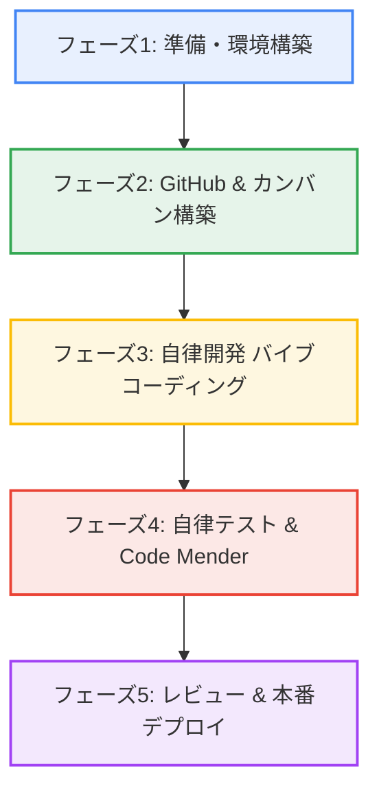

# 🌟 Mighty-Link AI Connect: Antigravity 2.0 & Gemini 3.5 完全開発ロードマップ＆手順書

> [!IMPORTANT]
> **本ドキュメントの目的**
> 株式会社マイティ・リンク（Mighty-Link）のコアビジョンである**「人と人、ビジネスとビジネス、そしてテクノロジーを“力強く繋ぐ”」**を具現化するため、Googleの最新AIスタック（Antigravity 2.0、Gemini 3.5 Flash/Omni/Pro、Code Mender）をフル活用し、企画・設計から本番リリース・プロモーションまでを完全自律型エージェントと共創（バイブコーディング）するための公式ガイドラインです。

---

## 🗺️ 全体ロードマップ概要 (Milestones)



---

## 🛠️ フェーズ1：準備・環境構築（Antigravity 2.0 ＆ 作戦本部のセットアップ）

まずは、並行開発を安全かつ超高速で実行するための「AI作戦本部」をローカルPC上に整えます。

### 1.1 Antigravity 2.0 デスクトップアプリのインストールと立ち上げ
1. スタンドアロン版 **Antigravity 2.0** を起動します。
2. 画面の指示に従い、お持ちの **Google AI Pro / Ultra アカウント** にサインインします。
3. 画面左下に、ご自身のサインイン情報とクォータ情報（Model Quota）が正しく表示されていることを確認します。

### 1.2 Google AI Pro / Ultra アカウント連携とAPIキー設定
Antigravity 2.0 は、お使いのアカウントに付与されている潤沢なAPIクォータを利用して駆動します。

1. アプリ内の **Settings > AI Providers > Google Gemini** を開きます。
2. Google AI Studio または Google One (AI Premium) で発行したAPIキーをセットします。
3. 各エージェントに割り当てるデフォルトの駆動モデルを以下のように定義・指定します。

| 役割・機能 | 採用モデル | 特徴・選択理由 |
| :--- | :--- | :--- |
| **メインチャット＆エージェント駆動** | **Gemini 3.5 Flash** | 爆速、超低コスト、長期コンテキストおよび複雑なエージェント・ワークフローに完全最適化。 |
| **マルチモーダル入出力処理** | **Gemini Omni** | テキスト・画像・音声・動画を1つの世界モデルでシームレスに理解。 |
| **長文推論・高度設計（来月予約）** | **Gemini 3.5 Pro** | 最先端の知能。来月の一般公開と同時にメイン設計エージェントの脳として組み込み予定。 |

> [!TIP]
> Google AI Pro アカウントに紐づくクォータは非常に強力です。長時間の連続開発や、並行サブエージェントの同時実行（数十万トークン規模）でも枯渇の心配なくガシガシ回せます。

> [!IMPORTANT]
> **Gemini quota 制限時の継続方針**
> Antigravity 側で Gemini の baseline quota 制限に達した場合は、開発を中断せず、VSCode + Codex に作業環境を切り替えます。Codex 側で実装、ドキュメント更新、ローカル検証、Git 操作を継続し、FastAPI は `AI_FORCE_MOCK=1` で起動して Gemini API の追加消費を避けます。詳細は `docs/CODEX_CONTINUATION_NOTES.md` を参照してください。

> [!NOTE]
> **3-tool 体制への拡張 (2026-05-22 〜)**
> 上記の Antigravity + Gemini / VSCode + Codex の 2-tool 体制に、第 3 レーンとして **VSCode + Claude Code** が加わりました。Claude Code は docs 整備、WBS 状態調停、PR review、checklist 作成、リスク登録など「Gemini quota を消費しない architect/triage 業務」を担当します。3 ツールの役割分担、ブランチ/コミット/PR の handoff 規約、6/2 CEO プレゼンに向けた day-by-day オーナーシップ表は [docs/MULTI_AI_WORKFLOW.md](MULTI_AI_WORKFLOW.md) を参照してください。

### 1.3 サンドボックス環境とセキュリティ（Code Mender）の設定
エージェントが自律的にコードを書いて実行する際、PC本体の環境を汚さず、安全を担保するための極めて重要な設定です。

1. **隔離サンドボックス（Sandbox）の有効化**
   - `Preferences > Sandbox` を有効にします。エージェントが実行する `npm install` や `pip install`、コードの実行はすべて、隔離された安全なクロスプラットフォームLinuxコンテナ内で行われます。
2. **認証情報マスキング（Credential Masking）**
   - セキュリティ設定でマスキングを有効にします。これによって、`.env` ファイルに記述されたAPIキーやパスワードなどの機密情報が、AIの外部ログやトレースに送信されるのを自動で遮断します。
3. **Code Mender（自律セキュリティ修正エージェント）の常駐**
   - `Security > Enable Code Mender` をオンにします。エージェントがコードを生成した直後、バックグラウンドで脆弱性をスキャンし、問題があれば**AI自身が自動的に修正パッチを当ててコードを最適化**します。

---

## 🛠️ 特別付録：Google Cloud Console ➔ サービスアカウントキー取得マニュアル

スプレッドシートへのWBS自動書き込み（Workspace Live機能）を実現するために、Googleアカウント（`kanta13jp@gmail.com`）を用いてサービスアカウント（秘密鍵）を取得する手順の完全マニュアルです。

### STEP 1. Google Cloud Console へのログインとプロジェクト作成
1. ブラウザで [Google Cloud Console (https://console.cloud.google.com/)](https://console.cloud.google.com/) にアクセスします。
2. アカウントの選択画面が出たら、`kanta13jp@gmail.com` でログインします（※初めての場合は利用規約への同意画面が出ますので、チェックを入れて「同意して続行」をクリックしてください）。
3. 画面の左上（「Google Cloud」のロゴのすぐ右隣）にある **[プロジェクトの選択]**（または既存のプロジェクト名）をクリックします。
4. ポップアップ画面の右上にある **[新しいプロジェクト] (New Project)** をクリックします。
5. プロジェクト名に `mighty-link-ai-connect` と入力し、下部にある青い **[作成]** ボタンをクリックします。
6. 再度、左上のプロジェクト選択メニューから、いま作成した `mighty-link-ai-connect` をクリックして、プロジェクトを切り替えます。

### STEP 2. Google Sheets API と Google Drive API の有効化
1. **Google Sheets API の有効化**:
   - 画面最上部にある検索窓に **`Google Sheets API`** と入力して検索します。
   - 検索結果に表示される **[Google Sheets API]**（「API とサービス」カテゴリ）をクリックします。
   - 画面中央にある青い **[有効にする] (Enable)** ボタンをクリックします。
2. **Google Drive API の有効化**:
   - 有効化が完了すると別の画面に遷移しますので、再度、画面最上部の検索窓に **`Google Drive API`** と入力して検索します。
   - 検索結果の **[Google Drive API]** をクリックします。
   - 同様に、青い **[有効にする] (Enable)** ボタンをクリックします。

### STEP 3. サービスアカウントの作成
1. 画面の左上にある **[三 (ナビゲーションメニュー)]** アイコンをクリックします。
2. メニューから **[IAM と管理] (IAM & Admin)** ➔ **[サービスアカウント] (Service Accounts)** をクリックします。
3. 画面の上部にある **[+ サービスアカウントを作成] (Create Service Account)** ボタンをクリックします。
4. 以下の情報を入力します：
   - **サービスアカウント名**: `mighty-wbs-sync` と入力します。
   - **サービスアカウント ID**: 自動的に `mighty-wbs-sync` と入力されます。
5. 入力できたら、下部にある **[作成して続行] (Create and Continue)** をクリックします。
6. 次のアクセス許可設定（ステップ2・3）は何も入力せず、そのまま一番下にある **[完了] (Done)** ボタンをクリックします。

### STEP 4. サービスアカウントの JSON キー（認証情報）のダウンロード
1. サービスアカウントの一覧画面で、今作成した `mighty-wbs-sync@...gserviceaccount.com` というアカウントを確認します。
2. その行の右端にある **[︙ (アクション/操作)]** アイコンをクリックし、**[鍵を管理] (Manage keys)** をクリックします。
3. 画面中央の **[鍵を追加] (Add Key)** ボタンをクリックし、**[新しい鍵を作成] (Create new key)** を選択します。
4. キーのタイプとして **[JSON]** が選択されていることを確認し、右下の青い **[作成] (Create)** をクリックします。
5. **自動的に JSON ファイルが PC にダウンロードされます。**（「秘密鍵がコンピュータに保存されました」というポップアップが出たら [閉じる] を押します）。

### STEP 5. ファイル配置とスプレッドシートの共有
1. **ファイルの配置**:
   - ダウンロードされた JSON ファイル（`mighty-link-ai-connect-xxxxxx.json`）のファイル名を **`credentials.json`** に変更します。
   - このファイルを、本プロジェクトのルートディレクトリ（`c:\Users\kanta\GitHub\mighty-link-ai-connect`）の直下にコピーして配置します。
2. **スプレッドシートの共有**:
   - ダウンロードした `credentials.json` 内に記載されている `"client_email"`（例: `mighty-wbs-sync@mighty-link-ai-connect.iam.gserviceaccount.com`）のメールアドレスをコピーします。
   - WBS を同期したい Google スプレッドシートの右上にある **「共有」ボタン** から、このメールアドレスに対して **「編集者 (Editor)」** 権限を与えて共有（追加）します。

---

## 📂 フェーズ2：GitHub連携とプロジェクト管理基盤（カンバンボード）の構築

進捗を可視化し、社長様とリアルタイムにタスクを追いかけるためのGit基盤を構築します。

### 2.1 GitHub CLI (`gh`) の認証
Antigravity 内の統合ターミナル（Terminal）、またはお使いのシェルで以下を実行します。
```powershell
gh auth login
```
*画面の指示に従い、GitHubアカウント（kanta13jp1）でのブラウザ認証を完了させます。*

### 2.2 マイティ・リンク専用リポジトリの作成と接続
1. プロジェクトフォルダ `mighty-link-ai-connect` の作成と初期化を行います。
```powershell
# 1. ディレクトリの作成と移動
mkdir mighty-link-ai-connect
cd mighty-link-ai-connect

# 2. Gitの初期化と最初のコミット
git init
echo "# Mighty-Link AI Connect" > README.md
git add README.md
git commit -m "Initial commit"

# 3. GitHub上にプライベートリポジトリを作成してプッシュ
gh repo create mighty-link-ai-connect --private --source=. --remote=origin --push
```

2. **Antigravityへのフォルダー読み込み**
   - アプリ画面中央の `+ Add Folder` ボタンをクリックし、作成した `mighty-link-ai-connect` を選択します。これでエージェントがコードベース全体を視覚的かつ構造的に認識できるようになります。

### 2.3 GitHub Projects（Mighty-Link AI Connect Board）の構築
1. ブラウザで [GitHub Projects](https://github.com/kanta13jp1?tab=projects) にアクセスします。
2. 右上の **[New project]** から **[Board]（カンバン形式）** を選択して作成します。
3. プロジェクト名を **`Mighty-Link AI Connect Board`** に変更します。
4. 進捗管理の列（Status）を、AIエージェント開発に最も最適化された以下の**4列**にカスタマイズします。

```
[ Todo ] --------> [ Agent Working ] --------> [ Reviewing ] --------> [ Done ]
(これからやる)      (AIが自動実装中)            (人間が確認・微調整)      (本番公開・完了)
```

---

## 🤖 フェーズ3：自律開発（バイブコーディングの実行）

環境が整ったら、Antigravity 2.0 のチャットと並行エージェント（Asynchronous Agents）をフル稼働させて実装を開始します。

### 3.1 最初のプロンプト（企画・仕様策定）の投入
Antigravityのメインコンソールに、以下のプロンプトを入力して「要件定義書」と「データベース設計図」を自動生成させます。

> **🚀 投入プロンプトテンプレート:**
> ```text
> 株式会社マイティ・リンク（Mighty-Link）の新規プロジェクト mighty-link-ai-connect を開始します。
> 駆動モデルは Gemini 3.5 Flash を使用してください。
>
> 弊社のホームページ（https://mighty-link.com/）のビジョンである「人と人、ビジネスとビジネス、そしてテクノロジーを“力強く繋ぐ”」をコンセプトとした、[ここに作りたいアプリのアイデア、例：AI進捗自動要約カンバンツール / 顧客とエンジニアのマッチングプラットフォーム] のMVP（最小限の実用プロダクト）の仕様書を `requirements.md` としてルート直下に作成してください。
>
> また、必要なデータベース構造を設計し、テーブル定義やER図（PlantUMLまたはMarkdown形式）を `database.md` に出力してください。
> ```

### 3.2 並行エージェント（Sub-Agents）による超高速同時実装
仕様書が固まったら、Antigravityの `Open Agent Manager` から、役割分担された複数のサブエージェントを立ち上げて並行稼働させます。

* **エージェントA（フロントエンド担当）への指示:**
  > `requirements.md` を読み込み、モダンで洗練されたUI/UXを実装してください。Gemini Omniのマルチモーダル機能（音声・動画）を将来的にシームレスに組み込めるよう、拡張性の高いコンポーネント設計にしてください。
* **エージェントB（バックエンド＆API担当）への指示:**
  > `database.md` 和 `requirements.md` を元に、Managed Agents APIを内部で呼び出せる堅牢なバックエンドAPIを構築してください。

### 3.3 実行ポリシー（Human-in-the-loop）による安全運用
エージェントがコマンドを実行したり、外部ライブラリをインストールしたりする際、画面にポップアップで承認を求めてきます。
- 社長様と一緒にコードやコマンドの内容を画面でチラッと確認し、**[Approve (承認)]** ボタンを押します。
- これにより、AIが勝手に予期しない処理を実行することを防ぎ、安全かつ納得感のあるプロセスで開発が進みます。

---

## 🧪 フェーズ4：自律テスト・自動デバッグとCode Menderの適用

AIが書いたコードは、AI自身に動かしてバグを徹底的に潰させます。人間はテストコードを書いたりデバッグに頭を悩ませたりする必要はありません。

### 4.1 Browser Agent による自律UI/UXテスト
エージェントに以下の指示を出します。
> ローカル開発サーバーを起動し、Browser Agent を立ち上げて、作成したログイン画面や主要機能を自動操作してテストしてください。もし画面崩れやエラーが発生した場合は、コンソールログを自律解析してコードを修正してください。
*Browser Agent が実際にブラウザを起動し、フォームにテストデータを入力したりボタンをクリックしたりして動的検証と自動修正を行います。*

### 4.2 テストコードの自動生成と100% PASS化
> 実装した全機能に対して、単体テスト（Unit Test）と統合テストのスクリプトを自動生成し、サンドボックス内で実行して、すべて『PASS』することを確認してください。
*テスト結果がすべてグリーンになったら、GitHub Projects のカードを **[Reviewing]** に移動します。*

---

## 🚀 フェーズ5：レビューとリリース（本番デプロイ）

開発の最終章。社長様にお披露目し、世界に向けてプロダクトを公開します。

### 5.1 人間による最終レビュー（Review-driven development）
社長様と寛太様で、完成したアプリの画面や動作を最終チェックします。
- 「ここをもっと力強いブルー（マイティ・リンクのブランドカラー）にしてほしい」
- 「文言をもう少しビジネス向けに調整して」
といった修正要望は、チャットで伝えるだけでエージェントが数秒で書き換えます。

### 5.2 CI/CDパイプラインによる自動リリース
エージェントに GitHub Actions のデプロイ設定ファイル（`.github/workflows/deploy.yml`）を作成させ、mainブランチにプッシュします。
```powershell
git add .
git commit -m "feat: complete mvp with antigravity 2.0 and gemini 3.5 flash"
git push origin main
```
*GitHubを経由して, Vercel, Supabase, GCP などの本番環境へ自動デプロイが走り、瞬時に本番リリースされます。*

### 5.3 プレスリリースと告知の自動生成
リリースの瞬間、Gemini 3.5 Flash に広報用コンテンツを爆速で作らせます。
> 今回開発した『Mighty-Link AI Connect』の魅力を最大化する、X（旧Twitter）向けの告知ポスト（ハッシュタグ付き、3パターン）と、IT系メディア向けのプレスリリースのテンプレートを作成してください。

---

## 🚀 2026年 Google I/O 11大イノベーションのプロジェクト導入ロードマップ

今回のプロジェクトにおいて、Google I/Oで発表された怒涛の11大テクノロジーをどのように取り込んでいくかの戦略マップです。

```
                                  【 Google AI フルスタック連携イメージ 】
  
  [フロントエンド]                      [バックエンド / AIコア]                  [セキュリティ / インフラ]
  Gemini Omni (マルチモーダル)   <-->   Gemini 3.5 Flash (メイン駆動)    <-->   Code Mender (脆弱性自動修正)
  (画像・音声・動画入力)                  Managed Agents API ( Linux環境 )       TPU 8t/8i (超低コスト推論)
                                        Gemini 3.5 Pro (長文推論: 来月)
```

### 1️⃣ Gemini 3.5 Flash （即時導入）
- **役割**: 本プロジェクトのすべてのチャット、要約、コード生成、エージェント実行のメインエンジン。
- **恩恵**: 爆速の処理能力と超低コストにより、開発コストをほぼゼロに抑えながら24時間フル稼働。

### 2️⃣ Gemini Omni （実装予定）
- **役割**: アプリのUI/UXに、テキストだけでなく「画像」「音声」「動画」をシームレスに処理するマルチモーダル機能を組み込む。
- **恩恵**: ユーザーがスマートフォンで撮影した動画から状況を自動理解して処理する、異次元の操作体験を提供。

### 3️⃣ Gemini 3.5 Pro （来月導入）
- **役割**: 来月のリリースと同時に、最も高度な知能が必要な「メイン設計アーキテクト」エージェントの頭脳をアップグレード。
- **恩恵**: 複雑なアルゴリズムの設計や長文のコードベースリファクタリングの品質が飛躍的に向上。

### 4️⃣ Antigravity 2.0 （即時導入）
- **役割**: 本プロジェクトの開発プラットフォームそのもの。並行サブエージェントを走らせるためのコントロールタワー。
- **恩恵**: 隔離サンドボックス、認証情報マスキング、Gitポリシー強化により、安全かつ統制された開発を実現。

### 5️⃣ Gemini Spark （将来連携）
- **役割**: 常時稼働する「あなた専用の秘書AI」とのAPI連携。
- **恩恵**: 作成したアプリから、ユーザーのGmail/Docs/Sheetsへ自動でアウトプットを同期・要約して届ける。

### 6️⃣ Managed Agents API ＆ Code Mender （即時導入）
- **役割**: アプリ内部でのAIエージェント自律実行（Managed Agents API）と、開発中のセキュリティ自動最適化（Code Mender）。
- **恩恵**: インフラ構築コストが激減し、AIが生成したコードの脆弱性リスクをゼロに抑え込む。

### 7️⃣ Android XR スマートグラス （将来連携）
- **役割**: 2026年秋の出荷を見据えた、音声主導の「ハンズフリー対話インターフェース」の設計準備。
- **恩恵**: スマートグラスから「マイティ・リンクのアプリを起動して、最新の進捗を報告して」と話しかけるだけで機能する未来の設計。

### 8️⃣ TPU 8t ＆ 8i （インフラ恩恵）
- **役割**: Google Cloudのインフラ上で動作する、超低コストかつ高性能な学習・推論用チップの恩恵をフルに享受。
- **恩恵**: 大規模なAPI利用でも、NVIDIA製GPU依存の他社サービスに比べて圧倒的な価格競争力と可用性を確保。

### 9️⃣ Workspace AI大進化 （業務統合）
- **役割**: Google Docs Live や Gmail Live とのアプリ連携。
- **恩恵**: アプリで生成したビジネスレポートや進捗を、Google Docsへ自動で美しいドキュメントとしてリアルタイム書き出し。

### 🔟 Universal Cart ＆ AP2 (Agent Payments Protocol) （機能組み込み）
- **役割**: エージェントが自動で買い物・決済を行うプロトコルの組み込み。
- **恩恵**: 開発するプロダクトに「予算上限や指定ブランドを守りながら、AIが最適なリソースやツールを自動で購入・契約する」決済機能を先んじて実装。

### 1️⃣1️⃣ Gemini for Science （知見導入）
- **役割**: GitHubとAntigravityで提供される「Science Skills」の活用。
- **恩恵**: ライフサイエンスDBなどの専門知識検索を組み込み、データ分析や専門ビジネスドメインでの確度を高める。

---

> [!TIP]
> **社長様と寛太様へ**
> この `ANTIGRAVITY_GUIDE.md` をプロジェクトのルート直下に配置したことで、Antigravityのエージェント自身も「自分が今どのような規律とフェーズで動くべきか」をこのファイルから直接学習し、賢く振る舞うようになります。
>
> さあ、最先端 of 最先端のAI開発ライフの幕開けです！
