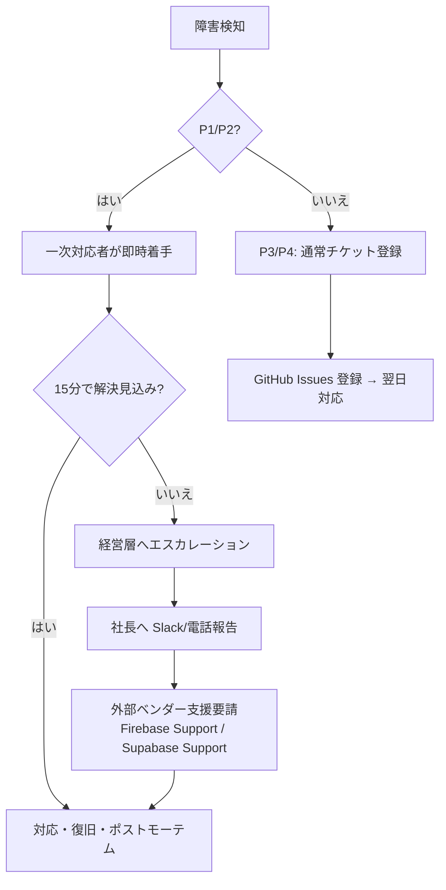

# 本番インフラ障害 エスカレーション連絡網・ディザスタリカバリ（DR）運用計画書 (T749)

本ドキュメントは、**Mighty Skill-Bridge** 本番インフラ（Firebase / Supabase）で障害が発生した際の、**エスカレーション連絡網**と**ディザスタリカバリ（DR）手順**を定義します。

---

## バージョン履歴

| 日付 | バージョン | 内容 | 起稿者 |
| :--- | :--- | :--- | :--- |
| 2026-06-10 | v1.0.0 | 初版作成（障害レベル定義・エスカレーション・DR手順） | Claude Code |

---

## 1. 障害レベル定義（Severity Matrix）

| レベル | 名称 | 定義 | 対応目標時間 |
| :--- | :--- | :--- | :--- |
| **P1** | Critical | サービス全停止・データ損失リスク | 初動: 15分以内 / 復旧: 2時間以内 |
| **P2** | High | 主要機能不全（診断API応答不可・認証不能） | 初動: 30分以内 / 復旧: 4時間以内 |
| **P3** | Medium | 一部機能劣化・パフォーマンス低下 | 初動: 2時間以内 / 復旧: 24時間以内 |
| **P4** | Low | 軽微な表示バグ・ログ異常 | 翌営業日対応 |

---

## 2. エスカレーション連絡網

### 2.1 一次対応（オンコール）

```
障害検知（Sentry / Google Cloud Monitoring アラート）
  │
  ▼
【一次対応者】開発担当（kanta13jp1）
  - Slack: #alerts-mighty-skill-bridge チャンネルを確認
  - メール: k-umezawa@ml-mightylink.com
  - 対応: 15分以内に Slack で "対応中" を宣言
```

### 2.2 エスカレーションフロー



### 2.3 連絡先一覧

| 役割 | 担当 | 連絡手段 | 備考 |
| :--- | :--- | :--- | :--- |
| 開発一次対応 | 梅澤 寛太 | Slack DM / k-umezawa@ml-mightylink.com | 24/7 対応 |
| 経営報告 | 社長 | Slack / 電話 | P1/P2 で即時報告 |
| Firebase サポート | Google Cloud Support | https://firebase.google.com/support | Blaze プラン必須 |
| Supabase サポート | Supabase Support | support@supabase.io | Pro プラン推奨 |

---

## 3. 障害対応フロー（ランブック）

### 3.1 P1: サービス全停止

```
1. Slack #alerts に "P1 障害発生 - 対応開始" を投稿
2. 現象の特定
   - Firebase Hosting 停止? → Firebase Status Dashboard 確認
     https://status.firebase.google.com/
   - Supabase DB 停止? → Supabase Status 確認
     https://status.supabase.com/
   - Cloud Functions 停止? → Google Cloud Console → Cloud Functions ログ確認
3. 一時対応（Traffic 切り替え）
   - Firebase Hosting → メンテナンスページへリダイレクト
     firebase hosting:channel:deploy maintenance --expires 2h
   - Supabase → 読み取り専用モードへの切り替え（Supabase ダッシュボード）
4. 根本原因調査（RCA）
   - Google Cloud Logging でエラーログ抽出
   - Supabase ダッシュボード → Logs でクエリエラー確認
5. 復旧後の確認
   - python scripts/verify_public_demo.py --url https://kanta13jp1.github.io/mighty-link-ai-connect/
   - 診断 API エンドポイントの疎通確認（/api/v1/health）
6. ポストモーテム作成（24時間以内）
   - docs/POSTMORTEM_YYYY-MM-DD.md を新規作成
```

### 3.2 P2: 認証不能（Firebase Auth 障害）

```
1. Firebase Auth コンソール → Authentication → Users でユーザー状態確認
2. Firebase Status Dashboard で Auth サービス状態確認
3. 一時回避策
   - クライアント側で「現在メンテナンス中です」バナーを表示（feature flag）
   - Firebase Auth の代替として、セッショントークンの有効期限を延長
4. 復旧確認: Firebase Auth の signIn テストを実行
```

### 3.3 P2: Supabase DB 接続不能

```
1. Supabase ダッシュボード → Database → Connection Pooling 確認
2. PgBouncer の接続数上限に達していないか確認（デフォルト上限: 200）
3. Cloud Functions から Supabase への接続タイムアウト設定確認（3秒）
4. 一時対応: Cloud Functions を再デプロイしてコネクションプールをリセット
   firebase deploy --only functions
5. 復旧確認: SELECT 1 クエリで疎通確認
```

### 3.4 P3: パフォーマンス低下（レスポンス遅延）

```
1. Supabase ダッシュボード → Reports → Slow Queries でボトルネック特定
2. EXPLAIN ANALYZE でクエリプラン確認
3. インデックスが効いているか確認（SUPABASE_DATABASE_PHYSICAL_AND_INDEX_DESIGN.md 参照）
4. Cloud Functions のコールドスタート対策（min-instances 設定）
5. Gemini API レスポンス遅延の場合: タイムアウトを 30 秒から 60 秒に延長
```

---

## 4. ディザスタリカバリ（DR）計画

### 4.1 RPO / RTO 目標

| 指標 | 目標値 | 説明 |
| :--- | :--- | :--- |
| **RPO** (Recovery Point Objective) | 24時間 | 最大データ損失許容範囲（日次バックアップ） |
| **RTO** (Recovery Time Objective) | 2時間 | P1 障害からの最大復旧目標時間 |

### 4.2 バックアップ体制

| 対象 | 方式 | 頻度 | 保持期間 | 格納先 |
| :--- | :--- | :--- | :--- | :--- |
| Supabase PostgreSQL | Point-in-Time Recovery (PITR) | 継続的 | 7日間 | Supabase 管理（Pro プラン） |
| Supabase DB 手動ダンプ | pg_dump | 日次 AM 03:00 JST | 7世代 | Google Cloud Storage (GCS) |
| Firebase Auth ユーザーデータ | エクスポート | 週次 | 4週間 | GCS |
| コードベース | Git | コミット毎 | 永続 | GitHub |

### 4.3 DB リストア手順（Supabase PITR）

```bash
# 1. Supabase ダッシュボード → Database → Backups
# 2. 復旧したい時刻を指定して "Restore" を実行
# 3. 復旧完了後、接続文字列が変わる場合があるので Cloud Functions の環境変数を更新

# 手動ダンプからのリストア（緊急時）
pg_restore \
  --host=<SUPABASE_DB_HOST> \
  --port=5432 \
  --username=postgres \
  --dbname=postgres \
  --no-password \
  /path/to/backup_YYYY-MM-DD.dump
```

### 4.4 Firebase 障害時のフォールバック

| 障害対象 | フォールバック方針 |
| :--- | :--- |
| Firebase Hosting | GitHub Pages を暫定公開 URL として使用（元々の静的ホスト） |
| Firebase Auth | 障害期間中は既存セッション（JWT）を延長して継続利用 |
| Cloud Functions | Supabase Edge Functions へ一時移行（対応工数: 4〜8時間） |

### 4.5 障害訓練スケジュール

| 訓練内容 | 実施頻度 | 担当 |
| :--- | :--- | :--- |
| DR 手順の机上演習 | 四半期 | 開発担当 + 経営層 |
| バックアップからのリストア実機訓練 | 半年 | 開発担当（T771 参照） |
| P1 障害シミュレーション（Chaos Engineering） | 年次 | 開発担当 |

---

## 5. ポストモーテム テンプレート

障害発生から 24 時間以内に `docs/POSTMORTEM_YYYY-MM-DD.md` を作成する。

```markdown
# ポストモーテム: [障害タイトル] (YYYY-MM-DD)

## 概要
- 発生日時: YYYY-MM-DD HH:MM JST
- 検知日時: YYYY-MM-DD HH:MM JST
- 復旧日時: YYYY-MM-DD HH:MM JST
- 障害レベル: P1 / P2 / P3
- 影響ユーザー数: XX 名

## タイムライン
| 時刻 | 出来事 |
| :--- | :--- |
| HH:MM | 障害検知 |
| HH:MM | 一次対応開始 |
| HH:MM | 根本原因特定 |
| HH:MM | 復旧完了 |

## 根本原因 (RCA)
[根本原因の詳細説明]

## 再発防止策
| 対策 | 担当 | 期限 |
| :--- | :--- | :--- |
| [対策1] | 梅澤 | YYYY-MM-DD |
```

---

## 6. 監視・アラート設定要件

| 監視項目 | ツール | 閾値 | アラート先 |
| :--- | :--- | :--- | :--- |
| Firebase Hosting 応答 | Google Cloud Monitoring | 応答なし 1 分継続 | Slack #alerts |
| Cloud Functions エラー率 | Sentry | エラー率 > 5% | Slack #alerts + メール |
| Supabase DB 接続数 | Supabase Metrics | 接続数 > 150 | Slack #alerts |
| API レスポンスタイム | Sentry Performance | P95 > 5 秒 | Slack #alerts |
| Gemini API エラー | Cloud Functions ログ | 連続 3 回失敗 | Slack #alerts |
| SSL 証明書期限 | Google Cloud Monitoring | 有効期限 30 日前 | メール |

詳細な監視設定は [T743](https://github.com/kanta13jp1/mighty-link-ai-connect/issues) にて実装予定。

---

## 7. 関連ドキュメント

- [本番リリース ロールバック手順書](PRODUCTION_ROLLBACK_RUNBOOK.md)
- [Firebase / Supabase システムアーキテクチャ詳細設計書](FIREBASE_SUPABASE_SYSTEM_ARCHITECTURE.md)
- [ユーザーデータ完全消去フロー設計書](USER_DATA_DELETION_FLOW.md)
- [ユーザー操作ガイド・FAQ・管理者トラブルシューティング](USER_GUIDE_AND_FAQ.md)
- [Supabase Database 物理設計とインデックス設計](SUPABASE_DATABASE_PHYSICAL_AND_INDEX_DESIGN.md)
- [Supabase DB バックアップ・リストア運用 Runbook](SUPABASE_BACKUP_RESTORE_RUNBOOK.md)
