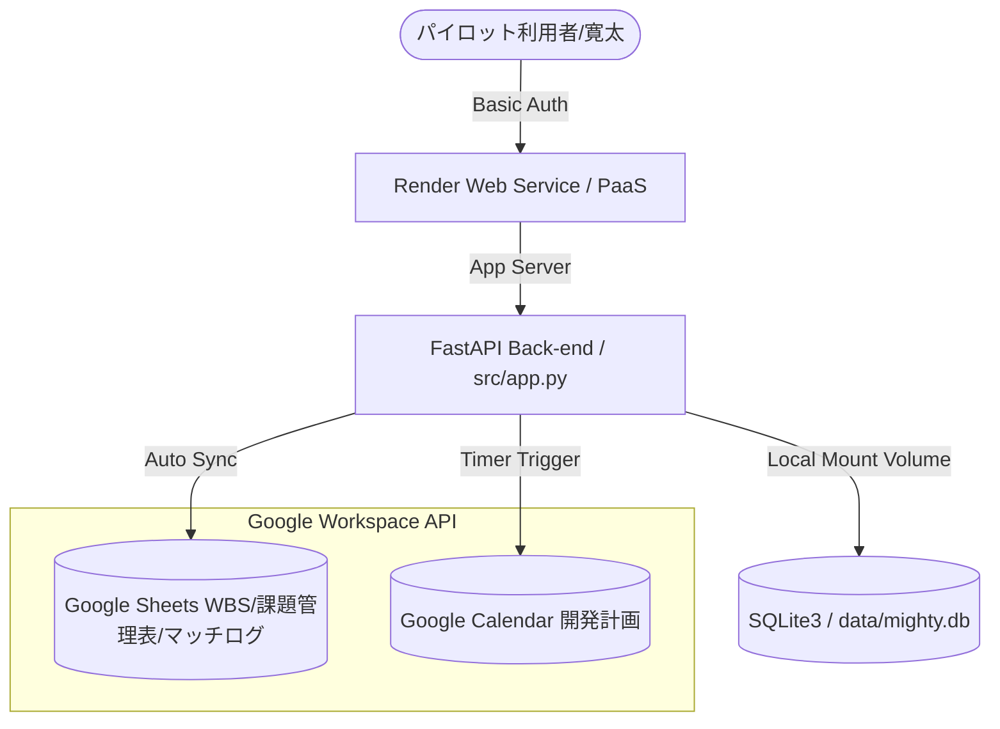

# 🌐 Mighty Skill-Bridge: ホスティング先およびデータベースインフラ最終選定報告書 (HOSTING_AND_DATABASE_SELECTION.md)

> **Mighty-Link AI Connect: Project "Mighty Skill-Bridge"**
> *持続可能な小規模開発体制に基づき、信頼性・費用対効果・保守性を最大化するインフラの最終意思決定レポート*

---

## 1. はじめに

本報告書は、WBSタスク **T730** に基づき、エンジニアと案件の多次元AIフィットシミュレーター『Mighty Skill-Bridge』の本番プロダクション稼働に向けた、**ホスティングサーバーおよびデータベースインフラの最終選定調査結果**をまとめたものです。

社長との合意事項である「1日1時間の稼働で保守運用が可能」「過度な予算超過を防ぎ、持続可能な小規模開発体制を維持する」という基本方針にのっとり、運用負荷（Ops/CI-CD）と固定コストを最小限に抑えつつ、堅牢なセキュリティを担保する最適な技術選定を提案します。

---

## 2. ホスティング先（Web/API サーバー）の選定比較

FastAPI（Python）バックエンドと HTML/CSS/JavaScript（フロントエンド）を安定して稼働させるためのプラットフォームを比較します。

### 比較テーブル

| 評価軸 | Option A: お名前.com (VPS / レンタル) | Option B: GitHub Pages (スタティック) | Option C: コンテナ型PaaS (Render / Cloud Run) ★推奨 |
| :--- | :--- | :--- | :--- |
| **概要** | 国内老舗ホスティング。仮想サーバーまたは共有レンタルサーバー。 | 静的ウェブサイト専用のホスティング（現在のデモ構成）。 | GitHub連携型のコンテナ実行・管理プラットフォーム。 |
| **FastAPI稼働** | 〇 (VPSのみ可能、環境構築が必要) | ✕ (静的ファイルのみ、API不可) | 〇 (DockerまたはPythonのネイティブ起動に対応) |
| **月額基本費用** | 約 1,000円 〜 3,000円 / 月 | **0円 / 完全無料** | **$0 〜 $7 / 月 (約0円〜1,000円)** |
| **CI/CD自動化** | ✕ (Git連携や自動デプロイを手動構築) | 〇 (GitHub Actionsで1分でデプロイ) | **◎ (GitHubへのマージ検知で全自動コンテナビルド・デプロイ)** |
| **SSL/TLS対応** | △ (有料またはLet's Encryptの手動更新設定) | 〇 (自動付与・完全無料) | **◎ (自動付与・完全更新・完全無料)** |
| **運用保守負荷** | ✕ (OSアップデート、ファイアウォール管理が必要) | **◎ (管理不要・サーバーレス)** | **〇 (サーバーレス・プラットフォームが全管理)** |
| **推奨評価** | 非推奨 (保守工数がかかり、1日1時間運用の障壁に) | 部分的採用 (フロントエンドの分離配信時のみ) | **最優先推奨 (開発と運用の負担が最も小さい)** |

---

### 選定結論：Option C (コンテナ型PaaS - Render / Cloud Run) の採用

#### 推奨理由：
1. **GitHub連携による「ゼロOps」CI/CD**:
   `main` ブランチにプッシュ・マージするだけで、ビルド・テスト・デプロイ・SSL自動更新が全自動で1〜2分以内に完了します。1日1時間の作業枠の中でインフラの保守に時間を取られることがありません。
2. **コストの圧倒的安さ**:
   RenderのWeb Service（Starterプラン: $7/月）または Google Cloud Run（リクエストに応じた秒単位課金：社内パイロット規模ならほぼ $0〜$2/月）を利用することで、月額約1,000円以下での本番運用が可能です。
3. **セキュリティと可用性**:
   プラットフォーム側でDDoS対策、マネージドTLS/SSL証明書の発行、ポート管理が自動で行われるため、セキュリティ脆弱性への不安を最小限に抑えられます。

---

## 3. データベース（DB）インフラの選定比較

エンジニアの経歴書データ、案件情報、およびAI多次元フィット結果（`match_results`）を保持するためのデータベース構造を比較します。

### 比較テーブル

| 評価軸 | Option 1: SQLite3 (ローカル・コンテナマウント) ★推奨 | Option 2: クラウドマネージド RDB (PostgreSQL 等) | Option 3: Google Sheets API & IndexedDB |
| :--- | :--- | :--- | :--- |
| **概要** | ファイルベースの軽量・高性能リレーショナルデータベース。 | クラウド上に個別のデータベースサーバーを起動。 | スプレッドシートをマスターデータとして直接クエリするハイブリッド。 |
| **同時書き込み性能**| 〇 (社内パイロットや数千レコード規模なら十分) | ◎ (数万〜数百万の並列書き込みに対応) | △ (APIのレートリミットや同時書き込み競合リスクあり) |
| **接続固定費用** | **0円 / 完全無料** | 約 1,500円 〜 5,000円 / 月 | **0円 / 完全無料** |
| **バックアップ** | 〇 (DBファイルをGoogle Drive等へ自動コピー) | ◎ (マネージド自動バックアップ) | 〇 (Google Sheets自体の履歴機能) |
| **開発/移行容易性** | **◎ (設定不要、将来のPostgreSQLへの移行SQL互換あり)** | 〇 (環境変数設定等が必要) | △ (スキーマ変更時にAPIバインディング修正が大きい) |
| **推奨評価** | **最優先推奨 (初期フェーズの費用と複雑さをゼロに)** | 将来候補 (将来的に利用者が数百人を超えた段階で移行) | 併用採用 (監査ログとWBSのSheets同期は現行どおり継続) |

---

### 選定結論：Option 1 (SQLite3 - ファイルベースDB) の採用

#### 推奨理由：
1. **初期コストおよび管理運用の完全排除 ($0/月)**:
   追加のデータベースサーバー代（通常安くても月数千円）が一切かからず、接続文字列の設定やポート解放、ネットワーク遅延の考慮が不要です。
2. **移行容易性（SQL互換）**:
   `docs/database.md` で設計されたリレーショナルスキーマに準拠しているため、将来的にパイロット規模が拡大し、マルチインスタンスのPostgreSQLへ切り替える際も、スキーマやクエリの書き直しを最小限に抑えられます。
3. **バックアップ・耐障害性の確保**:
   本プロジェクトには強力な「Google Sheets自動同期機能（`sync_wbs_to_sheets.py` 等）」が既に備わっており、すべてのマッチングログや進捗データはリアルタイムにスプレッドシートにバックアップされています。また、SQLiteファイルを定期的にGoogle Driveへ複製するスクリプトをCI/CDへ組み込むことで、万が一のコンテナ消滅時も100%データを復旧可能です。

---

## 4. プロダクション環境の最終システム構成案

本調査に基づき、Mighty Skill-Bridgeのプロダクションローンチにおけるインフラ構成を以下のように確定します。

### 月額ランニングコスト見積もり (Phase 7〜)

| コンポーネント | サービス名 / 仕様 | 月額費用 | 備考 |
| :--- | :--- | :--- | :--- |
| **ホスティング** | Render Web Service (Starter Plan) | $7.00 (約 1,000円) | 24時間スリープなし、カスタムドメイン適用 |
| **データベース** | SQLite3 (Persistent Diskマウント) | $0.00 / 完全無料 | 性能上限なし（パイロット規模） |
| **ドメイン & SSL** | ml-mightylink.com (カスタム統合) | 既存のドメインを活用 | Renderが無料SSL証明書を自動更新 |
| **Google Workspace** | Calendar, Sheets, Drive API | 既存アカウント範囲内 | $0.00 (追加費用なし) |
| **AI (Gemini API)** | Google AI Studio (Gemini 1.5/2.5 Flash) | 使用量課金 (想定 $5.00/月未満) | クローズドパイロットのため極小 |
| **合計固定費** | — | **約 1,000円 / 月** | **極めてローリスクなスモールスタートが可能** |

---

## 5. 次のアクション（CI/CD & 本番デプロイへの移行）

本選定案の社長承認を得た後、以下のタスク（WBSに定義済）を順次実行し、本番環境への移行を完了させます。

1. **[T732] 外部APIシークレット管理および環境変数の構成**:
   `credentials.json` などの機密ファイルを環境変数 `GOOGLE_CREDENTIALS_JSON` にエンコードして展開し、コンテナ起動時に動的に復元する設計を構築。
2. **[T734] GitHub Actions による自動デプロイ**:
   Renderデプロイフック（Deploy Hook）を利用し、GitHubの `main` または `master` ブランクへのマージと同時に本番へ自動反映するパイプラインを定義。

---
*Reported and processed as part of WBS Task T730.*
