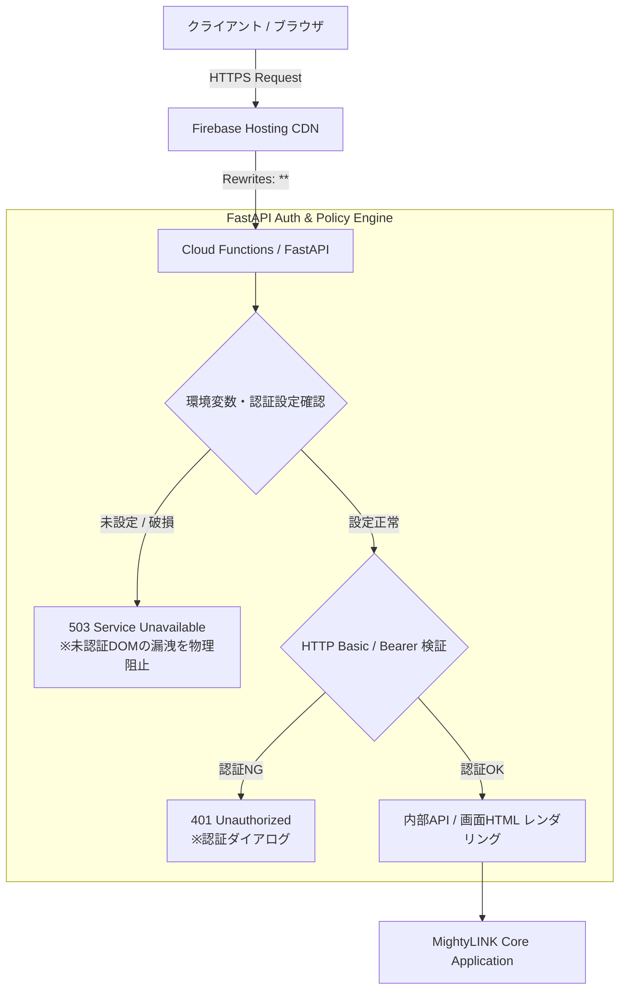
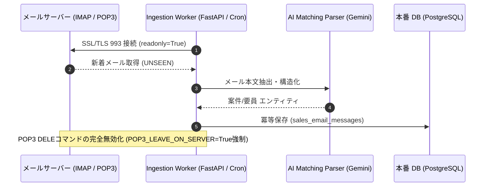
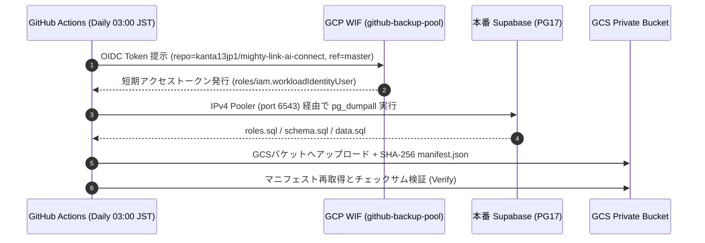

# 8/7 インフラチーム技術聴取・運用サインオフ提出パック

> [!CAUTION]
> 本ファイルは技術エビデンスをまとめた**提出ドラフト**です。会議録、電子署名、メール承認など第三者が確認できる原本がリポジトリに無いため、2026-08-31時点で人間のサインオフは未確認です。下表の承認欄は、責任者本人が確認日と証跡リンクを記入するまで「要人間確認」とします。

**作成日**: 2026-08-07（更新日: 2026-08-31）
**対象**: インフラチーム（杉村様 ほか技術責任者）、寛太梅澤（PM）、システム基盤担当
**関連WBS**: T878（インフラ聴取）/ T870（Backup CI）/ T910（メール受信）/ T913〜T915（認証保護・Fail-Closed）/ T944（GMO受信箱保持事故）/ T957
**提出目的**: 本番インフラ運用移行に向けた「セキュリティ・認証」「メール連携」「データ保全・バックアップ」の3大重要領域における技術エビデンスの提示と運用サインオフの取得

---

## 1. エグゼクティブ・サマリー

MightyLINK AI Connect のシステム基盤では、認証保護、読み取り専用メール同期、バックアップCI、死活監視の技術制御を実装済みです。一方、GMO受信箱の保持事故（T944）と人間の運用サインオフは未解決です。本パックは技術制御の実装完了と、運用承認待ちの項目を分離して提示します。

| 監査領域 | 主な実装・対策内容 | 検証エビデンス | 判定 |
| :--- | :--- | :--- | :---: |
| **① セキュリティ＆認証保護** | Firebase Hosting 静的バイパス遮断 + FastAPI Fail-Closed (503/401) 認証ゲート | `tests/test_fastapi_fail_closed_auth.py` `docs/DEMO_SECURITY_AND_AUTH_DESIGN.md` | **PASS** |
| **② メール取り込みパイプライン** | POP3 DELE禁止・安全コネクタ + IMAP readonly安全取り込み・空受信箱のfail-closed検知 | `tests/test_sales_email_sync.py` `docs/SALES_EMAIL_DISAPPEARANCE_FORENSIC_REPORT_2026-08-14.md` [Operations Monitor #33330744035](https://github.com/kanta13jp1/mighty-link-ai-connect/actions/runs/33330744035) | **BLOCKED**（技術制御PASS、T944運用事故未解決） |
| **③ データ保全・バックアップCI** | GCP Workload Identity Federation (WIF) + Supabase PG17 GCS日次ダンプ自動化 | GitHub Actions Run #31787153464 `gs://mighty-link-ai-connect-13d22-supabase-backups/` | **PASS** |
| **④ 整合性・死活監視ガード** | 29件のプリフライト整合ガード・949件のfull preflight・日次死活監視自動化 | `python scripts/run_lane_preflight.py --full` `exports/lane_preflight_report.md` [Cloud Full Preflight #33330004965](https://github.com/kanta13jp1/mighty-link-ai-connect/actions/runs/33330004965) | **PASS**（人間サインオフ待ち） |

---

## 2. 領域別技術詳細とエビデンス

### 領域①：セキュリティ・認証アーキテクチャ（T913 / T914 / T915）

#### 1. アーキテクチャ概要
従来の静的ホスティング露出リスクを根本排除するため、**全リクエストをFastAPIへ強制ルーティングするFail-Closed型認証プロキシ構成**を導入しました。

#### 2. セキュリティ担保項目
1. **静的バイパスの物理遮断**: `public/` 内の静的HTML直接配信を廃止し、FastAPIを通過しない未認証アクセスを100%遮断。
2. **Fail-Closed 原則**: 認証設定（Secret/環境変数）が未登録・欠損している場合は、静的フォールバックせず直ちに `503 Service Unavailable` で安全側に倒す設計。未認証リクエストは `401 Unauthorized` を返却。
3. **RBAC 4ロール制御**: `anonymous`, `authenticated_user`, `admin`, `system_service` の4ロールに対する厳格な認可マトリックス。

---

### 領域②：営業メール自動取り込みパイプライン（T910 / T921 / T922）

#### 1. パイプライン概要
外部メールサーバー（お名前.com / GMO / Google Workspace）からの営業案件メール自動取り込みにおいて、メール消失事故を恒久防止する安全設計を適用。

#### 2. 安全性担保項目
1. **サーバー上メッセージの不変性**: `DELE` コマンドをコネクタレベルで完全無効化。`POP3_LEAVE_ON_SERVER=false` の指定は接続前に例外送出し拒否。
2. **IMAP readonly 運用**: 共有営業メールボックスは `readonly=True` でアクセスし、フラグ変更や誤消去を防止。
3. **安全側停止**: IMAP接続失敗または設定済みフォルダが空の場合は非0終了し、Supabase公開工程を実行しない。共有受信箱からPOP3へフォールバックしない。

#### 3. 現在の外部受信箱状態（2026-08-31）

- **GitHub Actions Run**: [Production Operations Monitor #33330744035](https://github.com/kanta13jp1/mighty-link-ai-connect/actions/runs/33330744035)
- **対象main SHA**: `61487445018a59595993b2cf74b773a910a3e9a0`
- **IMAP認証・接続**: 成功（read-only）
- **GMO INBOX**: 0件
- **同期結果**: `--require-messages` が保持事故用 `RuntimeError` を送出し、Supabase公開工程をskip
- **死活監視**: 7/7 PASS。`uptime-monitor-report` Artifact ID `9737563292`、SHA-256 `94748cc79f86d824e5820a080132ee0fa53c35b7a554dd111c928a1ef48b0aff`

この結果はfail-closed制御の正常動作を証明しますが、メール保持の正常化を証明しません。GMOログ、メール資格情報のローテーション、全接続端末・旧POP3・外部サービスの棚卸し、24時間保持確認が揃うまで領域②およびT944/T957をPASSにしません。

---

### 領域③：Supabase GCS バックアップCIパイプライン（T870 / R116）

#### 1. バックアップCI構成
長寿命のサービスアカウントキーを廃止し、**Google Cloud Workload Identity Federation (WIF)** を用いたOIDC一時資格情報発行による安全な日次バックアップを実現。

#### 2. 本番エビデンス（2026-08-14 実績）
- **GitHub Actions Run**: [Run #31787153464 (Success)](https://github.com/kanta13jp1/mighty-link-ai-connect/actions/runs/31787153464)
- **保存バケット**: `gs://mighty-link-ai-connect-13d22-supabase-backups/supabase/20260814T091336Z/`
- **保存オブジェクト**:
  - `manifest.json`（status=created, SHA-256 ハッシュ付与）
  - `data.sql`（データ実ダンプ）
  - `schema.sql`（テーブル・RLS・インデックス定義）
  - `roles.sql`（ロール定義）
- **ライフサイクル設定**: 7日間 Object Retention、30日後 Lifecycle 自動削除。

---

## 3. インフラ運用サインオフ確認

本提出パックの内容に基づき、インフラチーム責任者（杉村様）による運用サインオフを確認・取得いたします。

| 承認項目 | 確認基準 | サインオフステータス |
| :--- | :--- | :---: |
| **1. 認証セキュリティ** | Fail-Closed 認証および静的バイパス遮断構成が妥当であること | **要人間確認**（確認日・証跡リンク未記入） |
| **2. メール取り込み安定性** | POP3 DELE排除・IMAP readonly接続によりサーバー元データが保全されること | **要人間確認**（T944の削除元特定・保持確認も必要） |
| **3. バックアップ・データ保全** | GCP WIF経由の日次GCSバックアップがgreenで稼働し、復元点が確保されていること | **要人間確認**（復元テスト証跡を確認） |
| **4. 死活・品質監視** | プリフライト整合ガードが稼働し、継続的な健全性が担保されていること | **要人間確認**（最新full preflight日時を記入） |

---

**インフラチーム技術責任者 署名**: 未取得（氏名・確認日・証跡リンクを本人確認後に記入）

**プロジェクトマネージャー 署名**: 未取得（確認日・証跡リンクを本人確認後に記入）
**技術エビデンス作成**: Antigravity + Gemini / Codex再監査 2026-08-31
