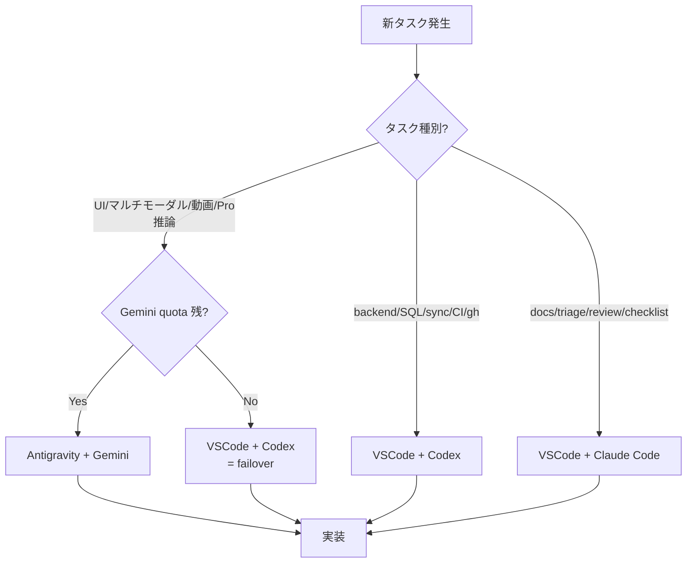

# Multi-AI 開発ワークフロー (3-tool 体制)

作成日: 2026-05-22  
オーナー: VSCode + Claude Code レーン (本ドキュメントの更新責任)  
関連: [ANTIGRAVITY_GUIDE.md](ANTIGRAVITY_GUIDE.md) / [CODEX_CONTINUATION_NOTES.md](CODEX_CONTINUATION_NOTES.md) / [WBS.md](WBS.md) / [CEO_PRESENTATION_PREP_2026-06-02.md](CEO_PRESENTATION_PREP_2026-06-02.md)

---

## 目的

`mighty-link-ai-connect` の開発を **3 つの AI 開発ツール** で並走させるための運用規約を一箇所にまとめる。これまでは Antigravity + Gemini (主) と VSCode + Codex (Gemini quota failover) の 2-tool 構成のみが [ANTIGRAVITY_GUIDE.md](ANTIGRAVITY_GUIDE.md) に記述されており、**VSCode + Claude Code が第 3 レーンとして加わった経緯と役割** が未文書化だった。本書は次の問いに答える:

- どのツールが、どのフェーズで、何を担当するか
- どのように handoff (ブランチ・コミット・PR・状態正本) を行うか
- Gemini quota 切れ・切り戻し時に誰が何を引き取るか
- 3 ツール並走で起きうる競合をどう調停するか

**前提**: 2026-06-02 CEO プレゼンが直近の最重要マイルストーン。本書は 6/2 までは "時限ルール" として日付付きで運用し、6/2 以降に恒久ルールへ昇格させる (`6/2 社長プレゼン向け運用` 節を参照)。

---

## 3-Tool 構成

### Antigravity + Gemini (主力・マルチモーダル)

- **モデル**: Google公式の [Gemini API model docs](https://ai.google.dev/gemini-api/docs/models) で公開中のFlash/Pro/マルチモーダル対応モデルから毎セッション選定する。未確認の未来モデル名は正本にしない。
- **強み**: 並列サブエージェント (frontend / backend / browser-agent)、Code Mender 自律修正、Gemini APIのマルチモーダル処理、Browser Agent による UI 自律テスト
- **担当領域**:
  - フロントエンド UI 実装・polish
  - マルチモーダルデモ (動画・音声・画像)
  - 長文推論が必要な設計判断・サービス方向性議論
  - Browser Agent による E2E 検証
- **制約**: Google AI Pro/Ultra アカウントの baseline quota に依存。枯渇すると Codex へ failover ([ANTIGRAVITY_GUIDE.md:52-54](ANTIGRAVITY_GUIDE.md#L52-L54))。
- **現在の状態 (2026-05-22)**: quota 切れ → 5/27 18:48:10 reset 待ち ([CODEX_CONTINUATION_NOTES.md:7-13](CODEX_CONTINUATION_NOTES.md#L7-L13))

### VSCode + Codex (scoped PR・CI・gh CLI)

- **強み**: Gemini quota を消費しない、`AI_FORCE_MOCK=1` で deterministic fallback を回せる、gh CLI 操作・SQL・CI 整備に強い、既存スクリプト群のオーナーシップ
- **担当領域**:
  - バックエンド実装 (deterministic pipeline 拡張、API 強化)
  - sync スクリプト群の整備・冪等化
  - gh CLI 操作 (Issue / Project / OAuth scope 復旧)
  - Slack / Notion / Drive / NotebookLM の証跡作成
  - `data/WBS.tsv` の書き込み (**唯一の書き込み権限保持者**)
  - CI / GitHub Actions の hardening
- **制約**: フロントエンドの大規模 UI ポリッシュは Antigravity に任せた方が速い。マルチモーダル成果物は生成不可。
- **現在の状態 (2026-05-22)**: 主作業環境。T657 PPTX→Drive upload / T644 gh OAuth リトライ進行中。

### VSCode + Claude Code (アーキテクト・docs・調停)

- **強み**: 長コンテキスト統合 (1M context)、Gemini quota を消費しない、強い意見、計画・docs・review に特化
- **担当領域**:
  - **docs 整備**: 本書のような運用規約、CEO プレゼン資料 review、checklist 作成
  - **WBS 状態の調停**: Sheets / Issues / Notes 間の divergence を日次で reconcile
  - **リスク登録・triage**: blocker の優先順位付け、人間ブロックの切り出し
  - **PR レビュー**: Codex / Antigravity の PR を 3rd party 視点で review
  - **memory / knowledge management**: `MEMORY.md` / Obsidian vault / NotebookLM のメタ運用
- **制約**: 
  - `data/WBS.tsv` への直接書き込み禁止 (Codex のみ)。提案は PR コメントで。
  - `scripts/*.py` / `src/*` への大規模変更は原則しない (Codex/Antigravity のレーン)
  - Gemini API を直接叩かない
- **現在の状態 (2026-05-22)**: 本書を起点として docs/triage レーンを立ち上げ中。

---

## いつ どのツールを使うか (決定木)



### Gemini quota がある場合

- **デフォルト**: Antigravity + Gemini を主作業環境にする ([ANTIGRAVITY_GUIDE.md:50](ANTIGRAVITY_GUIDE.md#L50))。
- フロントエンド / マルチモーダル / 長文推論タスクは Antigravity に集約。
- バックエンドの scoped 修正 / sync スクリプト / gh CLI は Codex に並列で振る (quota セーフ)。
- docs / checklist / triage は Claude Code に振る (quota セーフ かつ Gemini と独立)。

### Gemini quota 切れの場合 (→ Codex フェイルオーバー)

[ANTIGRAVITY_GUIDE.md:52-54](ANTIGRAVITY_GUIDE.md#L52-L54) の規約に従う:

- Antigravity 作業を中断、VSCode + Codex に切り替え。
- FastAPI は `AI_FORCE_MOCK=1` で起動して Gemini API の追加消費を回避 ([CODEX_CONTINUATION_NOTES.md:32-45](CODEX_CONTINUATION_NOTES.md#L32-L45))。
- Codex は実装・docs・ローカル検証・Git 操作を継続。
- マルチモーダル成果物 (動画・音声) は **静止画 + 説明文に fallback**。
- Claude Code は docs / triage を平常運転 (Gemini と独立なので影響なし)。

### docs 整備・調停タスクの場合 (→ Claude Code)

以下に該当するタスクは Claude Code に振る:

- 新規 docs ファイルの起草 (運用規約、checklist、risk register)
- 複数 docs 間の整合性 check (例: README ↔ docs/ ↔ exports/)
- WBS / Issues / Notes の divergence reconcile
- PR review (3rd party 視点)
- memory file の更新 (Obsidian vault / NotebookLM agent brief)

---

## Handoff 規約

### ブランチ命名

```
feat/<tool>-<wbs-id>-<slug>
```

- `feat/codex-t657-pptx-drive`
- `feat/antigravity-t202-radar-polish`
- `feat/claude-docs-multiai`

**tool prefix が必須**: 3 tools が同じ WBS タスクを誤って取り合うのを防ぐ。

### コミット prefix

```
[<tool>] <conventional-commit-type>: <subject>
```

- `[claude] docs: add MULTI_AI_WORKFLOW`
- `[codex] feat: upload pptx to drive`
- `[antigravity] fix(ui): radar chart axis label`

### PR ラベル

| ラベル | 用途 |
|---|---|
| `tool:codex` / `tool:antigravity` / `tool:claude` | 起票元の tool |
| `wbs:T6xx` | 該当 WBS タスク |
| `risk:ceo-blocker` | 6/2 critical path 上のもの (Claude Code が付与判定) |
| `quota:gemini-safe` | Gemini API を消費しない確証あり |

### 状態の正本 (どこを見れば真実か)

| 種類 | 正本 | 補助 |
|---|---|---|
| WBS 進捗 | Google Sheets `Mighty-Link WBS` ([WBS_SYNC_GUIDE.md](WBS_SYNC_GUIDE.md)) | `data/WBS.tsv` (Codex のみ書き込み) |
| blocker / 課題 | GitHub Issues #1-#11 / #13 / #14 / #16 と Google Sheets `課題管理表` | [INTEGRATION_DEMO_EVIDENCE_2026-06-02.md](INTEGRATION_DEMO_EVIDENCE_2026-06-02.md) |
| tool 間 handoff | [CODEX_CONTINUATION_NOTES.md](CODEX_CONTINUATION_NOTES.md) の日付別ログを per-tool で extend | 本書 (Multi-AI Workflow) |
| サービス方向性 | [CEO_PRESENTATION_DECISION_PACK_2026-06-02.md](CEO_PRESENTATION_DECISION_PACK_2026-06-02.md) | NotebookLM agent brief |
| 連携証跡 | [INTEGRATION_DEMO_EVIDENCE_2026-06-02.md](INTEGRATION_DEMO_EVIDENCE_2026-06-02.md) | Notion 証跡ページ |

**Claude Code が divergence を日次で reconcile する**: Sheets と Issues と Notes がずれた場合、Claude Code が正本判定し、不整合 PR コメントを起こす。

---

## Quota セーフ運用

### `AI_FORCE_MOCK=1` 強制ケース

以下のときは必ず `AI_FORCE_MOCK=1` で FastAPI を起動:

- Gemini quota 切れ中の Codex 作業 ([CODEX_CONTINUATION_NOTES.md:22](CODEX_CONTINUATION_NOTES.md#L22))
- sync スクリプトの開発・debug 中
- CI / GitHub Actions の smoke test
- ローカル UI の見た目確認のみで AI 機能を実行する意図がない場合

逆に **OFF にして良い** のは:

- デモリハーサル (Antigravity 主導)
- Gemini 復帰直後の動作確認 ([CODEX_CONTINUATION_NOTES.md:65-67](CODEX_CONTINUATION_NOTES.md#L65-L67))
- 本番デモ (6/2)

### Quota refresh 切り戻し手順 (5/27 18:48 想定)

1. **5/27 18:48 以降に Antigravity を立ち上げ**、Settings > AI Providers > Google Gemini で quota メーターが復活していることを確認。
2. **Codex の進行中タスクを WIP commit** で固定 (push まで)。Codex 側で完結できるものは完結まで進める。
3. **handoff note を Claude Code が発行**: `docs/CODEX_CONTINUATION_NOTES.md` に「YYYY-MM-DD quota 復帰 切り戻し」セクションを追加し、Codex から Antigravity へ移すタスク一覧を明記。
4. **Antigravity が frontend / マルチモーダル / Pro 推論タスクを取り戻す**。Codex は backend / sync / CI に専念。
5. **`AI_FORCE_MOCK=1` を解除** するのはデモリハーサル時のみ。日常開発では維持。

---

## 競合解決ルール

### マージ順序

```
[codex] PR → Claude review → [antigravity] rebase → main
```

- **小さな PR 優先**: Codex の scoped 修正を先に main に入れる。
- **Antigravity-first 禁止**: Antigravity の大規模 refactor が先に入ると、Codex の小修正が rebase 地獄になる。
- **Claude Code の review が中間ゲート**: review 完了 → Codex PR merge → Antigravity rebase。

### Claude Code がレフェリーになるケース

- 同じ WBS タスクを 2 tools が並行で取った疑いがあるとき
- WBS Sheet と Issues と CODEX_CONTINUATION_NOTES がずれているとき
- PR review でツール間の責任が不明確なとき
- 新規 docs を 2 つ作りそうになったとき (重複防止)

---

## 6/2 社長プレゼン向け運用 (時限ルール、~ 2026-06-02)

### Day-by-day オーナーシップ

| Date | Antigravity+Gemini | VSCode+Codex | VSCode+Claude Code |
|---|---|---|---|
| 5/22 Fri | (quota out) | T657 PPTX→Drive、T644 gh OAuth | **本書作成**、Done タグ確認 |
| 5/23 Sat | idle | T646 Slack webhook scaffold、T649 docs 再 sync | T663 checklist 草案、リスク登録 |
| 5/24 Sun | idle | sync script idempotency tests | T605/T606/T611 outline gap triage |
| 5/25 Mon | idle | T659 PPTX Drive verify、T660 Notion evidence | INTEGRATION_DEMO_EVIDENCE 整合性 |
| 5/26 Tue | idle | sync スクリプト CI smoke | スライド内容 review |
| 5/27 Wed 18:48↻ | **復帰**: T202 radar polish、デモ動画 v1 | frontend 引き継ぎ、backend 専念 | 切り戻し checklist 発行 |
| 5/28 Thu | デモ動画 v2 (Gemini API multimodal)、T610 1-pager visual | T630 `/api/knowledge-flow/generate` hardening | T611 決定マトリクス review |
| 5/29 Fri | サービス方向性 pack refinement | T647 Workspace account guard tests | dry-run スクリプト (T640) |
| 5/30 Sat | demo polish、backup screenshots (T613) | exports/knowledge_flow verify | T663 first full review |
| 5/31 Sun | reserve | reserve | reserve |
| 6/1 Mon | **full dry-run** with backup | freeze、tag `ceo-demo-2026-06-02` | T663 sign-off |
| 6/2 Tue | LIVE デモ | LIVE backup operator | LIVE QA notes |

### Dry-run / 凍結タグ運用

- **5/30 freeze**: `requirements.txt` の依存追加を停止。dependency drift 防止。
- **6/1 21:00 JST tag**: `git tag ceo-demo-2026-06-02` を Codex が打つ。以降の変更は cherry-pick のみ。
- **6/2 朝 dry-run**: 全 tool が participate、Claude Code が timer & checklist。

---

## 既知の制約

| 制約 | 影響範囲 | 対応 |
|---|---|---|
| GitHub Project `read:project` scope 不足 ([INTEGRATION_DEMO_EVIDENCE_2026-06-02.md:68-77](INTEGRATION_DEMO_EVIDENCE_2026-06-02.md#L68-L77)) | gh CLI で Project 操作不可 (Issue #5/#8) | `gh auth refresh -s project` の人間ブラウザ承認待ち。5/27 までに未解決なら 6/2 デモから Project ボードを除外 |
| Slack CLI / MCP 未露出 ([CODEX_CONTINUATION_NOTES.md:453](CODEX_CONTINUATION_NOTES.md#L453)) | Slack live 送信不可 (T636/T646/T653/T662) | [exports/knowledge_flow/slack_ceo_update.md](../exports/knowledge_flow/slack_ceo_update.md) の草稿表示で代替。live send は約束しない |
| サービス方向性未確定 | 6/2 で決定するため Claude が決定マトリクス起草、モデル精緻化はGemini API公式Docs確認後にAntigravityで実施 | [CEO_PRESENTATION_DECISION_PACK_2026-06-02.md](CEO_PRESENTATION_DECISION_PACK_2026-06-02.md) |
| 未確認の未来モデル名・公開時期がdocsへ残る | 社長説明や実装判断が古い前提に引っ張られる | 公式Docs確認後に削除または現在形へ置換 |
| `data/WBS.tsv` cartesian INSERT 重複リスク (他プロジェクトで先例) | 3 tools が書き込むと重複 | **Codex のみ書き込み**。他は PR コメント提案 |

---

## 参照

- [ANTIGRAVITY_GUIDE.md](ANTIGRAVITY_GUIDE.md) — Antigravity 2.0 セットアップ、Gemini モデル選択、Code Mender 設定
- [CODEX_CONTINUATION_NOTES.md](CODEX_CONTINUATION_NOTES.md) — Codex 切り替え手順、quota セーフ起動、日付別作業ログ
- [WBS.md](WBS.md) / [WBS_SYNC_GUIDE.md](WBS_SYNC_GUIDE.md) — WBS フェーズ詳細、Sheets 同期手順
- [CEO_PRESENTATION_PREP_2026-06-02.md](CEO_PRESENTATION_PREP_2026-06-02.md) — 6/2 プレゼン構成、デモ導線
- [CEO_PRESENTATION_DECISION_PACK_2026-06-02.md](CEO_PRESENTATION_DECISION_PACK_2026-06-02.md) — 判断マトリクス、議事録テンプレ
- [DEVELOPMENT_KNOWLEDGE_FLOW.md](DEVELOPMENT_KNOWLEDGE_FLOW.md) — NotebookLM / Slack / Notion / Obsidian 連携
- [INTEGRATION_DEMO_EVIDENCE_2026-06-02.md](INTEGRATION_DEMO_EVIDENCE_2026-06-02.md) — CLI/MCP 実施証跡
- [BACKEND_AI_PIPELINE.md](BACKEND_AI_PIPELINE.md) — deterministic fallback、AI 監査ログ

---

## Best Practices Refresh (2026-05-22)

毎セッション開始時に Anthropic / OpenAI / Google / Microsoft / Meta / Amazon / Apple / Kimi / MiMo / DeepSeek / Grok / Seedance / Obsidian / Unity の公式 docs を読み、3-tool 体制への適用可能な best practice を本セクションに追記する (上書きせず日付付きで accrue)。

### Anthropic Claude Code & API ([code.claude.com/docs](https://code.claude.com/docs/en/overview) / [platform.claude.com prompt-caching](https://platform.claude.com/docs/en/build-with-claude/prompt-caching))

- **Auto memory + CLAUDE.md** が公式推奨。本プロジェクトはすでに `C:\Users\kanta\.claude\projects\c--Users-kanta-GitHub-mighty-link-ai-connect\memory\` で feedback / project memory を運用中 — 継続。
- **Skills (slash commands)** で繰り返しワークフローを packaging 推奨 (例: `/review-pr`, `/deploy-staging`)。本プロジェクトでは 6/2 後に `/ceo-dry-run` skill を検討。
- **Hooks** で edit 前後にフォーマッタ・lint を自動実行可能。Codex の `dart format` 相当を本プロジェクトでも検討 (Python は `ruff format` などを Codex レーンが管理)。
- **Prompt caching (2026 更新)**:
  - **Automatic Caching** が 2026 新機能 → `cache_control: ephemeral` を request 最上位に追加すれば breakpoint 管理不要。
  - **5-min TTL = base cost、1-hour TTL = 2x write cost、cache read = 0.1x (90% 削減)**。
  - **Pre-warming**: `max_tokens: 0` で会話開始前にプロンプトをキャッシュへロード可能 → 6/2 デモ直前の "first call latency" 回避策として有効。
  - 最小トークン: Opus 4.7 / Haiku 4.5 = 4,096 / Sonnet 4.6 / 4.5 = 1,024 (本プロジェクトの長文 NotebookLM brief はキャッシュ対象になる)。
- **Agent SDK + Background agents** で複数フルセッション並走監視可。本プロジェクトは VSCode + Claude Code 単一セッション運用なので当面採用不要。
- **MCP** で外部ツール統合 (Slack / Notion / Drive)。Slack MCP 未露出 (R3) は依然ブロッカー。

### Google Antigravity / Gemini / Workspace ([Gemini models](https://ai.google.dev/gemini-api/docs/models) / [Gemini caching](https://ai.google.dev/gemini-api/docs/caching) / [Sheets batchUpdate](https://developers.google.com/workspace/sheets/api/guides/batchupdate))

- **モデル選定は固定名ではなく公式Docs確認ベース**: 毎セッション開始時にGemini APIのモデル一覧を確認し、Flash/Pro/マルチモーダル対応モデルを品質・速度・コスト・quotaで選ぶ。未確認の「来月公開」や旧称は正本にしない。
- **Context caching**: Gemini公式Docsでcontext cachingのTTL、対象モデル、explicit/implicit cachingの条件を確認してから `scripts/sync_docs_to_notebooklm.py` などの長文投入最適化へ反映する。
- **Workspace Sheets**: `sync_wbs_to_sheets.py` はSheets API `batchUpdate` の原子的な一括更新を前提に、`Mighty-Link WBS` / `WBS Summary` / `WBS Timeline` / `課題管理表` / `QA表` を同一OAuthアカウントで同期する。
- **本プロジェクトへのimpact**: R1は特定モデルの公開時期ではなく **未確認モデル前提・古いdocs混入リスク** として扱う。T665で古い記述を削除/更新済み。

### OpenAI Codex CLI ([developers.openai.com/codex best-practices](https://developers.openai.com/codex/learn/best-practices))

- **GPT-5.5** (2026-04-23 launch) + **GPT-5.5 Pro** が現行モデル。Codex CLI 最新は 0.133.0 (2026-05)。
- **AGENTS.md** = レポジトリルートに置く Codex 用設定 (review behavior、coding rules)。
  - **本プロジェクトへの impact**: `AGENTS.md` 新規作成を Codex レーンに依頼推奨。内容は MULTI_AI_WORKFLOW の Codex セクションを抜粋 + `code_review.md` 参照 + `data/WBS.tsv` 排他書き込み規約。
- **layered config**: `~/.codex/config.toml` (personal) + `.codex/config.toml` (repo) + CLI flag (一時)。本プロジェクトはまだ未導入 → 6/2 後に `.codex/config.toml` で `model` / `sandbox_mode` / `approval_policy` を固定化検討。
- **Skills を 2-3 use case に scope する**。本プロジェクトでは Codex の sync スクリプトを skill 化候補 (`/sync-wbs`, `/sync-notebooklm`)。
- **`/review` slash command** で PR を auto レビュー可。GitHub Cloud 接続で `@Codex` mention にも対応。本プロジェクトでは 6/2 後の運用安定後に検討。
- **「One thread per coherent unit of work」**: 1 Codex セッション = 1 コヒーレントタスク。本プロジェクトの Codex セッションは 1 WBS タスク粒度で thread を分ける運用を継続。
- **MCP は必要分のみ追加**。「real workflow を unlock するもの」だけ。Slack/Notion/Drive はすでに workflow 必須 → そのまま。

### 本セッションで即適用したこと

- 本書の Refresh セクション初期化。
- Risks 表 (CEO_PRESENTATION_PREP_2026-06-02.md) の R1 を **未確認モデル前提・古いdocs混入リスク** として再定義済み。Codexレーンでは今後も公式Docs確認後に古い記述を削除/現在形へ更新する。

### 次セッションで適用候補 (Codex レーンへ handoff)

- [x] `AGENTS.md` 新規作成 (Codex 用) — T664で完了
- [ ] `.codex/config.toml` で sandbox / approval / model を固定
- [ ] `scripts/sync_docs_to_notebooklm.py` に Gemini explicit context caching を導入 (1-hour TTL)
- [ ] Codex skills: `/sync-wbs`, `/sync-notebooklm`, `/verify-demo` を packaging
- [ ] Antigravity 復帰後 (5/27) に Antigravity CLI 評価 (旧 Gemini CLI からの移行)

### Light refresh (2026-05-22 2nd pass / 24h 以内差分のみ)

- **Anthropic Claude Code**: [Changelog](https://code.claude.com/docs/en/changelog) で新機能 — `/resume` background sessions / Rewind menu "Summarize up to here" による context 圧縮 / MCP/SDK startup 2s 高速化。
  - **本プロジェクトへの impact**: Claude Code 1M context 運用で長セッションが続く場合、Rewind "Summarize up to here" を採用候補。直近 turn を残しつつ古い context を圧縮できる。
- **Google Antigravity 2.0** (前回未捕捉項目): **JSON hooks** と **live voice transcription** が公式機能化 ([Google Developer Blog](https://developers.googleblog.com/an-important-update-transitioning-gemini-cli-to-antigravity-cli/))。
  - **本プロジェクトへの impact**: JSON hooks は sync スクリプト群 (Codex レーン) の自動起動 trigger 候補。Live voice transcription は 6/2 デモで「社長のフィードバックをリアルタイム議事録化」する見せ場候補 (T640 リハーサルで Antigravity 復帰後評価)。
- **OpenAI Codex**: 変更なし (前回 fetch から 24h 以内、リリースサイクル 0.133.0 維持)。

### Light refresh (2026-05-22 5th pass / Codex cleanup session)

- **Anthropic Claude Code**: `CLAUDE.md` / `AGENTS.md` memory import方針を再確認。共有ルールは `AGENTS.md` に集約し、Claude固有の入口は `CLAUDE.md` に限定する。
- **OpenAI Codex**: `AGENTS.md` と「1 coherent unit of work」方針を再確認。今回のWBS完了単位は `T665 古いドキュメント削除・最新化`。
- **Google Gemini / Workspace**: Gemini models / context caching / Sheets batchUpdateを再確認。未確認の未来モデル名を正本化せず、Sheetsはbatch更新を維持する。
- **stale-doc 削除実施**: `ANTIGRAVITY_GUIDE.md` から未確認の未来モデル導入セクションを物理削除し、NotebookLM 22 source / GitHub Issue #1-#11/#13/#14/#16/#18 の現状へ表記を更新。

### Light refresh (2026-05-22 6th pass / Codex calendar cleanup session)

- **公式Docs確認範囲を拡張**: Anthropic / OpenAI / Google に加え、Microsoft AI Foundry、Meta Llama、Amazon Bedrock、Apple Machine Learning/HIG、Kimi/Moonshot、MiMo、DeepSeek、Grok/xAI、Seedance/ByteDance Seed、Obsidian、Unityを `AGENTS.md` のURL正本へ追加。未確認のモデル名・機能名はdocsへ固定しない。
- **Google Calendar同期ルール**: `sync_wbs_to_calendar.py` は `data/WBS.tsv` の `ステータス` を読み、完了済みWBSに紐づくCalendarイベントを削除する。未完了・実行中・会議イベントは残し、完了履歴はSheets/Docs/Git履歴で追跡する。
- **今回のWBS完了単位**: `T614 事前送付メモ` をClaude Code成果物として完了反映し、`T666 Calendar完了イベント削除` をCodexで実装完了。

### Light refresh (2026-05-22 7th pass / Seedance UI refresh session)

- **Seedance / ByteDance Seed**: 動画生成デモ中心、強いタイポグラフィ、映像AIプロダクトのプレビュー体験を参考にしつつ、ブランド名・素材・文言はMighty Skill-Bridge独自に維持する。
- **Apple / Obsidian / Unity / Amazon**: Apple HIGはインターフェースの明瞭性、Obsidianはローカルvaultの情報分離、Unityは将来3Dデモ検討時の正本、Amazon Bedrockはマルチモデル選定時の候補としてURL正本化した。現時点では機能名をdocsへ固定しない。
- **今回のWBS完了単位**: `T667 Seedance動画デモUI刷新` をCodexで実装完了。`index.html` と `src/index.html` を同時更新し、公開デモガードとPlaywright desktop/mobile表示確認を通した。

---

### Session gate (2026-05-22 Codex pass)

ユーザー指示により、以後の各開発セッションでは以下を必須ゲートとする。

1. `docs/` 配下の関連ドキュメントを読む。
2. Anthropic / OpenAI / Google / Microsoft / Meta / Amazon / Apple / Kimi / MiMo / DeepSeek / Grok / Seedance / Obsidian / Unity の公式Docs最新版を確認する。
   - Anthropic Claude Code: overview / memory / settings / security
   - OpenAI Codex: overview / AGENTS.md / best practices / MCP
   - Google Gemini / Workspace: Gemini models / context caching / Sheets batchUpdate
   - Microsoft AI / Azure AI Foundry: Azure AI Foundry / Azure OpenAI overview
   - Meta Llama: developer docs / getting started
   - Amazon Bedrock / AWS AI: Bedrock user guide
   - Apple Machine Learning / HIG: developer docs and interface guidance
   - Kimi / Moonshot AI: platform docs
   - MiMo: official repository/docs
   - DeepSeek: API docs
   - Grok / xAI: docs
   - Seedance / ByteDance Seed: Seedance product/API docs
   - Obsidian: Help docs for vault and knowledge-base operation
   - Unity: Unity docs/manual for future 3D demo considerations
3. WBS上のタスクを最低1件完了し、`data/WBS.tsv` と `docs/WBS.md` に反映する。
4. 課題・QAが出た場合は `data/issues_tracker.tsv` / `data/qa_tracker.tsv` に反映する。
5. `python scripts/sync_wbs_to_sheets.py 1L99HCBHr4IsVUWqnUuG6OgoUmxEQUdfaYQim1n6etB8` で `Mighty-Link WBS` / `WBS Summary` / `WBS Timeline` / `課題管理表` / `QA表` を同期する。
6. `python scripts/sync_wbs_to_calendar.py` でWBSカレンダーを同期する。完了済みWBSイベントはCalendarから削除されるため、残っている予定をアクションビューとして扱う。
7. 公開URL guardを実行し、CEO共有済みURLのデグレを防ぐ。
8. commit → push `main` → `master`反映まで完了する。

本パスでT664を完了し、`AGENTS.md` と `CLAUDE.md` を追加した。Anthropic公式Docsの推奨どおり、Claude Codeは `CLAUDE.md` から `@AGENTS.md` を import して共通ルールを読む。OpenAI Codexは公式AGENTS.mdの仕組みに合わせ、repo rootの `AGENTS.md` を共通セッションゲートとして読む。

---

## 更新履歴

| 日付 | 変更者 | 内容 |
| --- | --- | --- |
| 2026-05-22 | Claude Code | 初版作成 (3-tool 構成、handoff 規約、6/2 day-by-day) |
| 2026-05-22 | Claude Code | Best Practices Refresh セクション追加 (Anthropic / Google / OpenAI 公式 docs 反映、R1 降格提案、AGENTS.md / context caching 採用候補) |
| 2026-05-22 | Claude Code | Light refresh 2nd pass: Antigravity 2.0 JSON hooks / live voice transcription、Claude Code Rewind "Summarize up to here" 追記 |
| 2026-05-22 | Codex | Session gate追加。AGENTS.md/CLAUDE.md作成、Sheets課題管理表/QA表同期、T664完了を反映 |
| 2026-05-22 | Codex | Light refresh 5th pass: stale-doc削除を実行し、T665完了を反映 |
| 2026-05-22 | Codex | Light refresh 6th pass: 公式Docs確認範囲拡張、Calendar完了イベント削除ルール、T614/T666完了を反映 |
| 2026-05-22 | Codex | Light refresh 7th pass: Amazon/Apple/Obsidian/Unityを公式Docs確認範囲へ追加し、Seedance動画UI刷新とT667完了を反映 |
