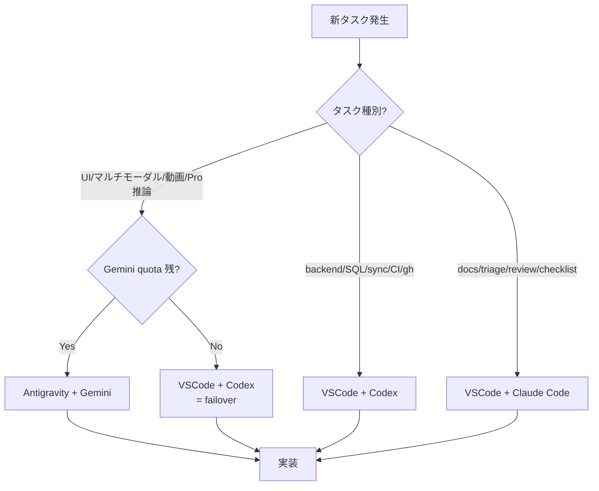

# Multi-AI 開発ワークフロー (3-tool 体制)

作成日: 2026-05-22  
オーナー: VSCode + Claude Code レーン (本ドキュメントの更新責任)  
関連: [ANTIGRAVITY_GUIDE.md](ANTIGRAVITY_GUIDE.md) / [CODEX_CONTINUATION_NOTES.md](CODEX_CONTINUATION_NOTES.md) / [WBS.md](WBS.md) / [CEO_PRESENTATION_PREP_2026-06-02.md](CEO_PRESENTATION_PREP_2026-06-02.md)

---

## 目的

`mighty-link-ai-connect` の開発を **3 つの AI 開発ツール** で並走させるための運用規約を一箇所にまとめる。これまでは Antigravity + Gemini (主) と VSCode + Codex (Gemini quota failover) の 2-tool 構成のみが [ANTIGRAVITY_GUIDE.md](ANTIGRAVITY_GUIDE.md) に記述されており、**VSCode + Claude Code が第 3 レーンとして加わった経緯と役割** が未文書化だった。本書は次の問いに答える:

- どのツールが、どのフェーズで、何を担当するか
- どのように handoff (ブランチ・コミット・PR・状態正本) を行うか
- Gemini quota 切れ・切り戻し時に誰が何を引き取るか
- 3 ツール並走で起きうる競合をどう調停するか

**前提**: 2026-06-02 CEO プレゼンが直近の最重要マイルストーン。本書は 6/2 までは "時限ルール" として日付付きで運用し、6/2 以降に恒久ルールへ昇格させる (`6/2 社長プレゼン向け運用` 節を参照)。

---

## 3-Tool 構成

### Antigravity + Gemini (主力・マルチモーダル)

- **モデル**: Google公式の [Gemini API model docs](https://ai.google.dev/gemini-api/docs/models) で公開中のFlash/Pro/マルチモーダル対応モデルから毎セッション選定する。未確認の未来モデル名は正本にしない。
- **強み**: 並列サブエージェント (frontend / backend / browser-agent)、Code Mender 自律修正、Gemini APIのマルチモーダル処理、Browser Agent による UI 自律テスト
- **担当領域**:
  - フロントエンド UI 実装・polish
  - マルチモーダルデモ (動画・音声・画像)
  - 長文推論が必要な設計判断・サービス方向性議論
  - Browser Agent による E2E 検証
- **制約**: Google AI Pro/Ultra アカウントの baseline quota に依存。枯渇すると Codex へ failover ([ANTIGRAVITY_GUIDE.md:52-54](ANTIGRAVITY_GUIDE.md#L52-L54))。

### VSCode + Codex (scoped PR・CI・gh CLI)

- **強み**: Gemini quota を消費しない、`AI_FORCE_MOCK=1` で deterministic fallback を回せる、gh CLI 操作・SQL・CI 整備に強い、既存スクリプト群のオーナーシップ
- **担当領域**:
  - バックエンド実装 (deterministic pipeline 拡張、API 強化)
  - sync スクリプト群の整備・冪等化
  - gh CLI 操作 (Issue / Project / OAuth scope 復旧)
  - Slack / Notion / Drive / NotebookLM の証跡作成
  - `data/WBS.tsv` の正本管理（主担当。2026-06-11 以降は Claude Code も検証付きで直接更新可）
  - CI / GitHub Actions の hardening
- **制約**: フロントエンドの大規模 UI ポリッシュは Antigravity に任せた方が速い。マルチモーダル成果物は生成不可。

### VSCode + Claude Code (アーキテクト・docs・調停)

- **強み**: 長コンテキスト統合 (1M context)、Gemini quota を消費しない、強い意見、計画・docs・review に特化
- **担当領域**:
  - **docs 整備**: 本書のような運用規約、CEO プレゼン資料 review、checklist 作成
  - **WBS 状態の調停**: Sheets / Issues / Notes 間の divergence を日次で reconcile
  - **リスク登録・triage**: blocker の優先順位付け、人間ブロックの切り出し
  - **PR レビュー**: Codex / Antigravity の PR を 3rd party 視点で review
  - **memory / knowledge management**: `MEMORY.md` / Obsidian vault / NotebookLM のメタ運用
- **制約**:
  - `data/WBS.tsv` の更新は UTF-8/CRLF 維持 + 列数/重複 ID 検証 + `generate_wbs_md.py` 再生成をセットで行う（2026-06-11 に直接更新可へ運用変更。flip の Codex handoff は廃止）
  - `scripts/*.py` / `src/*` への大規模変更は原則しない (Codex/Antigravity のレーン)。実装系の検出事項は WBS タスク + 課題 + Issue を起票して Codex へ handoff
  - Gemini API を直接叩かない

---

## いつ どのツールを使うか (決定木)


```mermaid
graph TD
    Start[新タスク発生] --> Q1{タスク種別?}
    Q1 -->|UI/マルチモーダル/動画/Pro推論| Q2{Gemini quota 残?}
    Q1 -->|backend/SQL/sync/CI/gh| C[VSCode + Codex]
    Q1 -->|docs/triage/review/checklist| CL[VSCode + Claude Code]
    Q2 -->|Yes| A[Antigravity + Gemini]
    Q2 -->|No| C2[VSCode + Codex<br/>= failover]
    A --> END[実装]
    C --> END
    C2 --> END
    CL --> END
```

### Gemini quota がある場合

- **デフォルト**: Antigravity + Gemini を主作業環境にする ([ANTIGRAVITY_GUIDE.md:50](ANTIGRAVITY_GUIDE.md#L50))。
- フロントエンド / マルチモーダル / 長文推論タスクは Antigravity に集約。
- バックエンドの scoped 修正 / sync スクリプト / gh CLI は Codex に並列で振る (quota セーフ)。
- docs / checklist / triage は Claude Code に振る (quota セーフ かつ Gemini と独立)。

### Gemini quota 切れの場合 (→ Codex フェイルオーバー)

[ANTIGRAVITY_GUIDE.md:52-54](ANTIGRAVITY_GUIDE.md#L52-L54) の規約に従う:

- Antigravity 作業を中断、VSCode + Codex に切り替え。
- FastAPI は `AI_FORCE_MOCK=1` で起動して Gemini API の追加消費を回避 ([CODEX_CONTINUATION_NOTES.md:32-45](CODEX_CONTINUATION_NOTES.md#L32-L45))。
- Codex は実装・docs・ローカル検証・Git 操作を継続。
- マルチモーダル成果物 (動画・音声) は **静止画 + 説明文に fallback**。
- Claude Code は docs / triage を平常運転 (Gemini と独立なので影響なし)。

### docs 整備・調停タスクの場合 (→ Claude Code)

以下に該当するタスクは Claude Code に振る:

- 新規 docs ファイルの起草 (運用規約、checklist、risk register)
- 複数 docs 間の整合性 check (例: README ↔ docs/ ↔ exports/)
- WBS / Issues / Notes の divergence reconcile
- PR review (3rd party 視点)
- memory file の更新 (Obsidian vault / NotebookLM agent brief)

---

## Handoff 規約

### ブランチ命名

```
feat/<tool>-<wbs-id>-<slug>
```

- `feat/codex-t657-pptx-drive`
- `feat/antigravity-t202-radar-polish`
- `feat/claude-docs-multiai`

**tool prefix が必須**: 3 tools が同じ WBS タスクを誤って取り合うのを防ぐ。

### コミット prefix

```
[<tool>] <conventional-commit-type>: <subject>
```

- `[claude] docs: add MULTI_AI_WORKFLOW`
- `[codex] feat: upload pptx to drive`
- `[antigravity] fix(ui): radar chart axis label`

### PR ラベル

| ラベル | 用途 |
|---|---|
| `tool:codex` / `tool:antigravity` / `tool:claude` | 起票元の tool |
| `wbs:T6xx` | 該当 WBS タスク |
| `risk:ceo-blocker` | 6/2 critical path 上のもの (Claude Code が付与判定) |
| `quota:gemini-safe` | Gemini API を消費しない確証あり |

### 状態の正本 (どこを見れば真実か)

| 種類 | 正本 | 補助 |
|---|---|---|
| WBS 進捗 | Google Sheets `Mighty-Link WBS` ([WBS_SYNC_GUIDE.md](WBS_SYNC_GUIDE.md)) | `data/WBS.tsv` (Codex のみ書き込み) |
| blocker / 課題 | GitHub Issues #1-#11 / #13 / #14 / #16 と Google Sheets `課題管理表` | [INTEGRATION_DEMO_EVIDENCE_2026-06-02.md](INTEGRATION_DEMO_EVIDENCE_2026-06-02.md) |
| tool 間 handoff | [CODEX_CONTINUATION_NOTES.md](CODEX_CONTINUATION_NOTES.md) の日付別ログを per-tool で extend | 本書 (Multi-AI Workflow) |
| サービス方向性 | [CEO_PRESENTATION_DECISION_PACK_2026-06-02.md](CEO_PRESENTATION_DECISION_PACK_2026-06-02.md) | NotebookLM agent brief |
| 連携証跡 | [INTEGRATION_DEMO_EVIDENCE_2026-06-02.md](INTEGRATION_DEMO_EVIDENCE_2026-06-02.md) | Notion 証跡ページ |

**Claude Code が divergence を日次で reconcile する**: Sheets と Issues と Notes がずれた場合、Claude Code が正本判定し、不整合 PR コメントを起こす。

---

## Quota セーフ運用

### `AI_FORCE_MOCK=1` 強制ケース

以下のときは必ず `AI_FORCE_MOCK=1` で FastAPI を起動:

- Gemini quota 切れ中の Codex 作業 ([CODEX_CONTINUATION_NOTES.md:22](CODEX_CONTINUATION_NOTES.md#L22))
- sync スクリプトの開発・debug 中
- CI / GitHub Actions の smoke test
- ローカル UI の見た目確認のみで AI 機能を実行する意図がない場合

逆に **OFF にして良い** のは:

- デモリハーサル (Antigravity 主導)
- Gemini 復帰直後の動作確認 ([CODEX_CONTINUATION_NOTES.md:65-67](CODEX_CONTINUATION_NOTES.md#L65-L67))
- 本番デモ (6/2)

### Quota refresh 切り戻し手順 (5/27 18:48 想定)

1. **5/27 18:48 以降に Antigravity を立ち上げ**、Settings > AI Providers > Google Gemini で quota メーターが復活していることを確認。
2. **Codex の進行中タスクを WIP commit** で固定 (push まで)。Codex 側で完結できるものは完結まで進める。
3. **handoff note を Claude Code が発行**: `docs/CODEX_CONTINUATION_NOTES.md` に「YYYY-MM-DD quota 復帰 切り戻し」セクションを追加し、Codex から Antigravity へ移すタスク一覧を明記。
4. **Antigravity が frontend / マルチモーダル / Pro 推論タスクを取り戻す**。Codex は backend / sync / CI に専念。
5. **`AI_FORCE_MOCK=1` を解除** するのはデモリハーサル時のみ。日常開発では維持。

---

## 競合解決ルール

### マージ順序

```
[codex] PR → Claude review → [antigravity] rebase → main
```

- **小さな PR 優先**: Codex の scoped 修正を先に main に入れる。
- **Antigravity-first 禁止**: Antigravity の大規模 refactor が先に入ると、Codex の小修正が rebase 地獄になる。
- **Claude Code の review が中間ゲート**: review 完了 → Codex PR merge → Antigravity rebase。

### Claude Code がレフェリーになるケース

- 同じ WBS タスクを 2 tools が並行で取った疑いがあるとき
- WBS Sheet と Issues と CODEX_CONTINUATION_NOTES がずれているとき
- PR review でツール間の責任が不明確なとき
- 新規 docs を 2 つ作りそうになったとき (重複防止)

---

## 既知の制約

| 制約 | 影響範囲 | 対応 |
|---|---|---|
| Slack CLI / MCP 未露出 ([CODEX_CONTINUATION_NOTES.md:453](CODEX_CONTINUATION_NOTES.md#L453)) | Slack live 送信不可 (T636/T646/T653/T662) | [exports/knowledge_flow/slack_ceo_update.md](../exports/knowledge_flow/slack_ceo_update.md) の草稿表示で代替。live send は約束しない |
| 未確認の未来モデル名・公開時期がdocsへ残る | 社長説明や実装判断が古い前提に引っ張られる | 公式Docs確認後に削除または現在形へ置換 |
| `data/WBS.tsv` への同時書き込み重複リスク | 複数レーンが同時に書き込むと重複・ID衝突 (R40 で実例) | 1 セッション 1 レーンで編集し、編集後に列数・重複 ID を検証してからコミット (T785 以降の運用) |

> 6/2 社長プレゼン向けの時限運用ルール (day-by-day オーナーシップ・凍結タグ) は 2026-06-02 で終了したため削除済み。経緯は Git 履歴と [INTEGRATION_DEMO_EVIDENCE_2026-06-02.md](INTEGRATION_DEMO_EVIDENCE_2026-06-02.md) を参照。GitHub Project scope 問題は T794 (R43) で解消済み。

---

## 参照

- [ANTIGRAVITY_GUIDE.md](ANTIGRAVITY_GUIDE.md) — Antigravity 2.0 セットアップ、Gemini モデル選択、Code Mender 設定
- [CODEX_CONTINUATION_NOTES.md](CODEX_CONTINUATION_NOTES.md) — Codex 切り替え手順、quota セーフ起動、日付別作業ログ
- [WBS.md](WBS.md) / [WBS_SYNC_GUIDE.md](WBS_SYNC_GUIDE.md) — WBS フェーズ詳細、Sheets 同期手順
- [CEO_PRESENTATION_PREP_2026-06-02.md](CEO_PRESENTATION_PREP_2026-06-02.md) — 6/2 プレゼン構成、デモ導線
- [CEO_PRESENTATION_DECISION_PACK_2026-06-02.md](CEO_PRESENTATION_DECISION_PACK_2026-06-02.md) — 判断マトリクス、議事録テンプレ
- [DEVELOPMENT_KNOWLEDGE_FLOW.md](DEVELOPMENT_KNOWLEDGE_FLOW.md) — NotebookLM / Slack / Notion / Obsidian 連携
- [INTEGRATION_DEMO_EVIDENCE_2026-06-02.md](INTEGRATION_DEMO_EVIDENCE_2026-06-02.md) — CLI/MCP 実施証跡
- [BACKEND_AI_PIPELINE.md](BACKEND_AI_PIPELINE.md) — deterministic fallback、AI 監査ログ

---

## Best Practices Refresh (2026-06-14)

毎セッション開始時に Anthropic / OpenAI / Google / Microsoft / Meta / Amazon / Apple / Grok / Kimi / MiMo / DeepSeek / BytePlus / GitHub / Slack / Notion / Obsidian / Unity / Figma / Canva / Reddit / InsForge / FireCrawl / Discord / Stripe / Supabase / お名前.com の公式 docs を確認し、3-tool 体制へ適用可能な best practice を日付付きで追記する。**肥大化防止のため、効力を失った古い Refresh 節は要約 1 行を残して削除する**（全文は Git 履歴で参照可能）。

2026-06-14 の反映: T748 に合わせ、Firebase Hosting のアクセスログは Cloud Logging bucket retention で管理し、ローカル/CI の JSONL・`.log` は `scripts/rotate_runtime_logs.py` で gzip 圧縮・90日保持に統一した。T740_3 は `https://mightylink-app.com/` の証明書主体名が `CN=mightylink-app.com` になったことを確認し、販売URLとして確定した。
2026-06-14 追記: T750 に合わせ、Supabase/Postgres の性能診断は `pg_stat_statements`・`pg_stat_user_indexes`・Supabase Index Advisor を根拠にし、`CREATE INDEX CONCURRENTLY` / `REINDEX CONCURRENTLY` は承認・staging検証・migration記録後に適用する運用へ標準化した。
2026-06-14 追記: T743 に合わせ、公開デモ・Firebase Hosting・custom domain の死活監視は `data/uptime_targets.tsv` を正本にし、GitHub Actions の `Public Uptime Monitor` が30分間隔で確認する。Slack webhook は GitHub secret のみから読み、T740_3完了前の `mightylink-app.com` TLS不一致は warning として証跡化する。
2026-06-14 追記: T751 に合わせ、外部API key・Webhook secret・DB接続文字列は `data/secret_rotation_inventory.tsv` のメタデータだけを正本化し、秘密値はGit/Docs/Sheets/Issue/reportへ出さない。`Secret Rotation Review` workflow が年次期限とsecret値混入パターンを週次で検知する。
2026-06-14 追記: T757 に合わせ、週次コスト配賦は `data/cost_allocation_budgets.tsv` を正本にし、実請求未接続は `unknown` として表示、Slack/SMTP secret は環境変数のみで扱い成果物へ保存しない。
2026-06-14 追記: T759 に合わせ、Firebase Functions / Cloud Run から Supabase へは Supavisor transaction pooler (`pooler.supabase.com:6543`) と `psycopg2.pool.ThreadedConnectionPool` の小さなアプリ内poolを併用し、`/api/db-test` は非秘密のpool状態だけを返す。
2026-06-14 追記: T740_3 に合わせ、`mightylink-app.com` の Google Trust Services 証明書発行を確認したため、`data/uptime_targets.tsv` は custom domain を strict TLS / P1 監視へ切り替え、特商法表記の販売URLを `https://mightylink-app.com/` で確定した。
2026-06-15 追記: T761 に合わせ、Supabase Query Performance / Performance Advisor / Index Advisor の確認は `scripts/generate_supabase_query_performance_review.py` と `exports/supabase_query_performance_review.*` に証跡化し、index DDL は Dashboard・`pg_stat_statements`・`supabase inspect`・staging `EXPLAIN`・Issue/rollback note が揃うまで別タスクへ切り出す。

### Anthropic Claude Code & API ([code.claude.com/docs](https://code.claude.com/docs/en/overview) / [platform.claude.com prompt-caching](https://platform.claude.com/docs/en/build-with-claude/prompt-caching))

- **Auto memory + CLAUDE.md** が公式推奨。本プロジェクトはすでに `C:\Users\kanta\.claude\projects\c--Users-kanta-GitHub-mighty-link-ai-connect\memory\` で feedback / project memory を運用中 — 継続。
- **Skills (slash commands)** で繰り返しワークフローを packaging 推奨 (例: `/review-pr`, `/deploy-staging`)。本プロジェクトでは 6/2 後に `/ceo-dry-run` skill を検討。
- **Hooks** で edit 前後にフォーマッタ・lint を自動実行可能。Codex の `dart format` 相当を本プロジェクトでも検討 (Python は `ruff format` などを Codex レーンが管理)。
- **Prompt caching (2026 更新)**:
  - **Automatic Caching** が 2026 新機能 → `cache_control: ephemeral` を request 最上位に追加すれば breakpoint 管理不要。
  - **5-min TTL = base cost、1-hour TTL = 2x write cost、cache read = 0.1x (90% 削減)**。
  - **Pre-warming**: `max_tokens: 0` で会話開始前にプロンプトをキャッシュへロード可能 → 6/2 デモ直前の "first call latency" 回避策として有効。
  - 最小トークン: Opus 4.7 / Haiku 4.5 = 4,096 / Sonnet 4.6 / 4.5 = 1,024 (本プロジェクトの長文 NotebookLM brief はキャッシュ対象になる)。
- **Agent SDK + Background agents** で複数フルセッション並走監視可。本プロジェクトは VSCode + Claude Code 単一セッション運用なので当面採用不要。
- **MCP** で外部ツール統合 (Slack / Notion / Drive)。Slack MCP 未露出 (R3) は依然ブロッカー。

### Google Antigravity / Gemini / Workspace ([Gemini models](https://ai.google.dev/gemini-api/docs/models) / [Gemini caching](https://ai.google.dev/gemini-api/docs/caching) / [Sheets batchUpdate](https://developers.google.com/workspace/sheets/api/guides/batchupdate))

- **モデル選定は固定名ではなく公式Docs確認ベース**: 毎セッション開始時にGemini APIのモデル一覧を確認し、Flash/Pro/マルチモーダル対応モデルを品質・速度・コスト・quotaで選ぶ。未確認の「来月公開」や旧称は正本にしない。
- **Context caching**: Gemini公式Docsでcontext cachingのTTL、対象モデル、explicit/implicit cachingの条件を確認してから `scripts/sync_docs_to_notebooklm.py` などの長文投入最適化へ反映する。
- **Workspace Sheets**: `sync_wbs_to_sheets.py` はSheets API `batchUpdate` の原子的な一括更新を前提に、`Mighty-Link WBS` / `WBS Summary` / `WBS Timeline` / `課題管理表` / `QA表` を同一OAuthアカウントで同期する。
- **本プロジェクトへのimpact**: R1は特定モデルの公開時期ではなく **未確認モデル前提・古いdocs混入リスク** として扱う。T665で古い記述を削除/更新済み。

### OpenAI Codex CLI ([developers.openai.com/codex best-practices](https://developers.openai.com/codex/learn/best-practices))

- **モデル名・CLI版は固定記述しない**: Codex の現行モデル/CLI は公式 docs とローカル `codex --version` を確認して採用する。未確認の将来モデル名や古い版番号を正本にしない。
- **AGENTS.md** = レポジトリルートに置く Codex 用設定 (review behavior、coding rules)。
  - **本プロジェクトへの impact**: `AGENTS.md` 新規作成を Codex レーンに依頼推奨。内容は MULTI_AI_WORKFLOW の Codex セクションを抜粋 + `code_review.md` 参照 + `data/WBS.tsv` 排他書き込み規約。
- **layered config**: `~/.codex/config.toml` (personal) + `.codex/config.toml` (repo) + CLI flag (一時)。T690にてリポジトリレベルの `.codex/config.toml` を新規作成し、`model` / `sandbox_mode` / `approval_policy` を完全に固定化。
- **Skills を 2-3 use case に scope する**。本プロジェクトでは Codex の sync スクリプトを skill 化候補 (`/sync-wbs`, `/sync-notebooklm`)。
- **`/review` slash command** で PR を auto レビュー可。GitHub Cloud 接続で `@Codex` mention にも対応。本プロジェクトでは 6/2 後の運用安定後に検討。
- **「One thread per coherent unit of work」**: 1 Codex セッション = 1 コヒーレントタスク。本プロジェクトの Codex セッションは 1 WBS タスク粒度で thread を分ける運用を継続。
- **MCP は必要分のみ追加**。「real workflow を unlock するもの」だけ。Slack/Notion/Drive はすでに workflow 必須 → そのまま。

### 本セッションで即適用したこと

- 本書の Refresh セクション初期化。
- Risks 表 (CEO_PRESENTATION_PREP_2026-06-02.md) の R1 を **未確認モデル前提・古いdocs混入リスク** として再定義済み。Codexレーンでは今後も公式Docs確認後に古い記述を削除/現在形へ更新する。

### 次セッションで適用候補 (Codex レーンへ handoff)

- [x] `AGENTS.md` 新規作成 (Codex 用) — T664で完了
- [x] `.codex/config.toml` で sandbox / approval / model を固定 (T690で完了)
- [x] `scripts/sync_docs_to_notebooklm.py` に Gemini explicit context caching を導入 (1-hour TTL) (T691で完了)
- [x] Codex skills: `/sync-wbs`, `/sync-notebooklm`, `/verify-demo` を packaging (T692で完了)
- [x] Antigravity 復帰後 (5/27) に Antigravity CLI 評価 (旧 Gemini CLI からの移行) — [docs/ANTIGRAVITY_CLI_EVALUATION_REPORT.md](ANTIGRAVITY_CLI_EVALUATION_REPORT.md) にて完了

### アーカイブ済み Light refresh (2026-05-22 〜 2026-05-23 の 5 節)

6/2 プレゼン準備期の Light refresh 5 節（2nd/5th/6th/7th pass、Seedance navigation polish）は時限的内容のため 2026-06-12 に削除した。確立した恒久ルール — AGENTS.md/CLAUDE.md のセッションゲート、Calendar 完了イベント削除、Sheets batchUpdate 正本運用、Seedance API のコストガード（`SEEDANCE_API_ENABLED=1` 必須）— は本書の各正規セクションと AGENTS.md に反映済み。全文は Git 履歴を参照。

### Refresh (2026-06-11 / Claude Code WBS 整合性監査セッション)

- **Anthropic Claude Code**: Terminal / VS Code / JetBrains に加え Desktop / Web (claude.ai/code) / iOS が正式提供。Routines（managed cron 実行）、Channels（Telegram/Discord/webhook 連携）、GitHub Code Review（PR 自動レビュー）、auto memory が公式機能化。`claude --teleport` でセッション移動可。
- **OpenAI Codex**: Desktop アプリ（プロジェクト管理・レビューパネル）、Chronicle メモリ管理、plugins / skills / subagents、sandboxing + auto-review が公式化。AGENTS.md / MCP は引き続き中核。
- **Google Gemini**: 現行安定版は **Gemini 3.5 Flash**（agentic/coding 最上位）、3.1 Pro は Preview。**Gemini 2.0 Flash 系 / Gemini 3 Pro Preview は廃止予定** — T780 のタスク名から旧モデル名を削除済み。明示キャッシュ最小トークンは 3.5 Flash / 3.1 Pro で 4,096。Antigravity は Gemini API の Agents 系 Preview として公式掲載。
- **GitHub Actions（期限付き・重要）**: **2026-06-16 に runner デフォルトが Node 24 へ切替**（Node 20 は 2026-09-16 削除）。`FORCE_JAVASCRIPT_ACTIONS_TO_NODE24=true` で事前検証可能。→ **T786 を起票**（期限 2026-06-15、Codex レーン）。
- **Firebase Functions**: Python 3.14 ランタイム GA（3.14 以降は requirements インストーラが uv デフォルト）。`functions.config()` は 2027-03 完全廃止。
- **Supabase RLS**: RLS ポリシーで JWT の `user_metadata` クレーム参照は禁忌（ユーザー改変可能）。Firebase Auth 連携は `accessToken` オプション方式が公式。**JWT secret は staging/prod で分離必須** → T788（ステージング環境構築）の要件に反映済み。
- **Stripe**: 最新 API バージョン `2026-05-27.dahlia`。legacy usage records API は廃止済みで**従量課金は Billing Meters API 必須** → T776 設計と T791（課金実装、新規起票）は Meters + API version pin 前提とする。
- **今回の WBS 完了単位**: `T785 WBS 整合性監査`。重複ID（T774/T775 二重定義）が commit 7583bf2 で Phase 9 の未実施タスクを誤って完了化していた問題を解消（課題管理表 R40）。重複タスク T758/T766/T779/T775×2 を削除し、不足工程タスク T786〜T793（Node 24 対応・規約初版・ステージング・監査初回実施・サポート窓口・Stripe 実装・特商法表記・ローンチ告知）を追加。`docs/WBS.md` は `scripts/generate_wbs_md.py` による TSV からの自動生成に移行し、重複 ID は生成時エラーで検出される。

### Refresh (2026-06-11 / Codex GitHub Actions Node 24 対応セッション)

- **GitHub Actions**: GitHub 公式 changelog の Node 20 deprecation に合わせ、`.github/workflows/deploy.yml` と `.github/workflows/public-demo-guard.yml` に `FORCE_JAVASCRIPT_ACTIONS_TO_NODE24=true` を workflow-level env として追加。事前に Node 24 runtime で action 互換性を検証する。
- **公式 action major 更新**: `actions/checkout@v6`、`actions/setup-python@v6`、`actions/setup-node@v6`、`google-github-actions/auth@v3` へ更新。Firebase CLI 用 Node.js は `24` を明示し、不要な npm 自動キャッシュは `package-manager-cache: false` で抑止する。
- **GitHub Project同期メモ**: Issue #68 は作成・クローズ済み。Project #1 への item-add / item-list が一時 401 となったため、課題管理表 `R43` と WBS `T794` へ復旧タスクとして登録した（T794で解消済み）。
- **今回の WBS 完了単位**: `T786 GitHub Actions ランナー Node 24 デフォルト切替（2026-06-16）への対応`。2026-06-16 の切替日前に完了扱いへ前倒しし、後段タスクは Sheets/Calendar 同期で現在の前倒し進捗へ反映する。

### Refresh (2026-06-11 / Codex GitHub Project同期復旧セッション)

- **GitHub Project同期復旧**: `gh project list --owner @me` と `gh project item-list 1 --owner @me` が成功し、Issue #68 `[T786] GitHub Actions Node 24 デフォルト切替対応` が Project #1 `Mighty Skill-Bridge` に配置済みかつ Status=Done であることを確認。
- **T794証跡Issue**: Issue #69 `[T794] GitHub Project item操作 OAuth read:project 再承認・同期復旧` を作成し、Project #1 に `item-add`、`item-edit` で Status=Done、Issue close まで完了。
- **今回の WBS 完了単位**: `T794 GitHub Project item操作 OAuth read:project 再承認・同期復旧`。課題管理表 `R43` は resolved へ更新し、Sheets/Calendar/Project同期対象へ反映する。

### Refresh (2026-06-11 / Codex Firebase/Supabase staging guard セッション)

- **Firebase Hosting preview channel**: `STAGING_ENVIRONMENT_OPERATION_RUNBOOK.md` を追加し、本番 live channel へ出す前に preview channel `staging` で確認する手順、`--expires 7d`、preview channel削除、Functions deploy opt-in の二重確認を明文化した。
- **Supabase staging/prod分離**: Supabase Branching の persistent branch または検証用プロジェクトを staging 正本とし、ephemeral preview branch はPR向け短命検証に限定する。URL・anon key・JWT secret fingerprint・service role key の同一利用を禁止し、RLSでは `user_metadata` を認可判断に使わない。
- **自動検証**: `scripts/verify_staging_environment_config.py` と `tests/test_staging_environment_config.py` を追加。secret値を出力せずに、Firebase preview channel名、Functions deploy opt-in、Supabase staging/prod credential分離をチェックできる。
- **今回の WBS 完了単位**: `T788 ステージング環境（Firebase Hosting preview channel / Supabase 検証用プロジェクト）の構築と運用ルール整備`。前倒し完了としてWBS/Sheets/Calendar/GitHub Issue/Projectへ同期する。

### Refresh (2026-06-11 / Claude Code 本番 502 障害対応セッション)

- **本番障害 R44**: Hosting URL の `/api/*` が全て 502（Cloud Run 直 URL は 504）。原因は `main.py` が import 時に `a2wsgi.ASGIMiddleware` を生成していたこと。本番 runtime（functions-framework → gunicorn）はマスタープロセスで app をロードしてから worker を fork するため、a2wsgi のイベントループスレッドが worker に引き継がれず、全リクエストが永久ブロックしていた。初回リクエスト時の遅延生成に修正し、手動 `firebase deploy --only functions` で復旧。
- **fork 安全性の教訓**: ローカル（Flask dev server / Firebase Emulator / Windows）は fork しないため、この種の障害はローカルテスト・エミュレータテストでは検出できない。Functions デプロイ後は本番 URL で `/api/health` の疎通確認を必須とする。
- **DB 接続の副次調査**: `SUPABASE_DB_URL` が direct 接続（`db.*.supabase.co` / DNS が IPv6 のみ）のため、IPv4 のみの Cloud Run からは到達不可。現状は SQLite `/tmp` フォールバックで稼働。恒久対応は Supavisor session pooler URL への切替（T795 起票）。
- **CI ギャップ**: CI は T784 ゲートにより Hosting のみデプロイのため、コード修正が本番 API に自動反映されない。IAM 整備とゲート解除を T796 として起票。
- **T795 完了（同日対応）**: pooler リージョンをダッシュボードなしで特定（候補リージョンへの接続テストで `aws-1-ap-southeast-1` のみ tenant 認識）。`SUPABASE_DB_URL` を transaction pooler（port 6543, sslmode=require）へ切替え、`USE_SUPABASE=true` を復元して再デプロイ。本番 `/api/db-test` で `direct_postgres_status=success` を確認し、SQLite `/tmp` フォールバックから PostgreSQL 永続化へ移行完了。`init_db` が作成する `engineers`/`jobs`/`match_results` には RLS を有効化（ポリシーなし = anon REST API からのアクセスを全拒否、postgres ロールはオーナーとしてバイパス）。
- **T796 対応（CI Functions デプロイ恒久化）**: `.env` は gitignored のため、CI からの Functions デプロイは本番ランタイム環境変数を消去してしまう罠があった。`FIREBASE_FUNCTIONS_DOTENV` secret に .env を格納し、deploy.yml が functions デプロイ時に .env を復元する（secret 未設定なら fail-fast）よう修正。`FIREBASE_FUNCTIONS_DEPLOY_ENABLED=true` を設定し、main push での自動デプロイを有効化。

### Refresh (2026-06-12 / Claude Code 規約起草・前倒しリスケセッション)

公式 Docs 24 提供元を 3 並列調査で確認。本プロジェクトに影響する差分のみ記載。

- **Anthropic**: Claude Opus 4.8 (5/28)、Claude Fable 5 / Mythos 5 (6/9) リリース。Claude Code は Dynamic Workflows（並列サブエージェント）と Effort Control が利用可能 — Claude Code レーンの大規模調査タスクで採用済み（本セッションの公式 Docs 並列調査）。
- **OpenAI Codex**: GPT-5.5 / GPT-5.4 が Responses API 経由の現行。DALL·E 2/3 スナップショット廃止、Prompt Objects / Evals / Agent Builder 廃止予定 — 本プロジェクトでは未使用のため影響なし。
- **Google Gemini**: Gemini 3.5 Flash がコーディング最適化で現行安定版を維持。Antigravity Agent（Linux サンドボックス実行）と Deep Research Max が Preview。
- **DeepSeek（期限付き）**: 2026-07-24 に `deepseek-chat` / `deepseek-reasoner` 廃止、v4 系へ移行 — 本プロジェクトでは未使用、採用検討時は v4 系を前提にする。
- **GitHub**: Agentic workflows が PAT 不要化 (6/11)。Copilot SDK GA (6/2)。Node 24 切替 (6/16) は T786 対応済みのまま維持。
- **Notion API（破壊的）**: OAuth 認可ごとに一意アクセストークン発行へ変更 (6/8)。新規接続時は従来トークン使い回し前提の実装が壊れる — Notion 証跡ページ運用 (Notion MCP) の再認証時に注意。
- **Slack API**: データテーブルブロック追加 (5/20)。送信 MCP 未露出の制約 (R3) は変わらず。
- **Stripe（T791 前提）**: API v2026-05-27 で Billing Meters イベント値 15 桁超は検証エラー（破壊的）、`billed_until` は明示 expand 必須に。メーター集約 3 分→30 秒へ高速化。T776 設計・T791 実装はこのバージョン pin 前提を維持。
- **Figma / Canva**: Figma Make ベータ（ローカルコードベース接続・MCP 統合）、Figma MCP Server がリモートアクセス対応（デスクトップアプリ不要）— T698 で使った MCP 連携の運用が軽くなる。Canva はブランドテンプレート公開 API・デザイン複製 API 追加（T696 Canva 向け PPTX 運用の代替候補）。
- **Discord（期限付き）**: 特権インテントがユーザー基準へ移行 (6/10)、Voice 非 E2EE 廃止 — 本プロジェクトでは未使用。
- **本セッションの成果**:
  - `T787 利用規約・プライバシーポリシー初版起草` 完了 — `docs/TERMS_OF_SERVICE.md` / `docs/PRIVACY_POLICY.md` を新規作成し、法務確認チェックリスト計 20 論点を整理。法務確認は新タスク T798（R36/R48 連動）へ分離。
  - **前倒しリスケ**: 未着手 34 タスクをレーン別直列（Codex / Antigravity / Claude / 人間）で引き直し、Phase 7〜9 の最終完了見込みを 2026-07-28 → **2026-07-16** へ 12 日短縮。依存関係（T745 規約同意 UI ← T787 本文、T792 特商法 ← T791 有償化前）を保持。
  - **不足工程の追加**: T798 法務確認、T799 アクセシビリティ (WCAG 2.2 AA) 検証、T800 利用状況アナリティクス計測、T801 ローンチ後レトロスペクティブ。
  - **stale-doc 削除**: 6/2 時限運用ルール節・解消済み制約 2 行・旧 Light refresh 5 節を削除し、`generate_wbs_md.py` のガント日付を新スケジュールへ更新。
  - **Calendar 同期の WBS 動的イベント対応**: `sync_wbs_to_calendar.py` の固定イベントリストが T698 までしかカバーせず、リスケ後の未着手 40 件が Calendar に存在しなかった。`data/WBS.tsv` の未完了行から動的にイベントを生成し（タイトル: `【Mighty Skill-Bridge】<タスクID> <タスク名>`）、`wbsIds` private property ベースで完了行のイベントを自動削除するよう拡張。検索ウィンドウも 2026-12-31 まで拡大。以後のリスケは TSV 更新 + 再同期だけで Calendar へ反映される（GitHub Issue #71。sync スクリプトは Codex レーン管轄のため、本変更のレビューを Codex セッションへ依頼）。

---

### Refresh (2026-06-12 / Claude Code 四半期セキュリティ監査セッション)

公式 Docs 24 提供元をバックグラウンド並列調査で確認。本プロジェクトに影響する差分のみ記載。

- **Google（期限付き・最重要）**: **6/18 に Gemini CLI / Gemini Code Assist の個人向け提供が停止**し Antigravity CLI へ移行必須。Firebase の Gemini CLI 向け拡張も同日終了 — **T803 を起票し 6/15〜6/17 で移行対応**。Gemini 3.5 Flash が stable 化（エージェント/コーディング最上位）。
- **Firebase**: AI Logic ハイブリッド推論（オンデバイス+クラウド）GA (5/28)。Admin Node.js SDK v14 は Node 22+ 必須 (6/8)。Firebase ML は 2027-06-15 シャットダウン予告 — 本プロジェクトは未使用で影響なし。
- **Supabase（期限付き）**: 6/15 以降の**新規**プロジェクトは GraphQL introspection デフォルト無効（既存 production/staging プロジェクトは影響なし）。無料枠のメールテンプレートカスタマイズ制限開始 (6/3) — Auth メール本格運用時はカスタム SMTP を検討。Passkeys (WebAuthn) ベータ (5/28) は認証強化の将来候補。
- **GitHub（課金影響）**: 6/1 から Copilot が従量課金 (AI Credits) へ移行し、Copilot code review がプライベートリポジトリで Actions 分を消費。公開デモガード CI と併走するため Actions 消費量の監視を T687/T736 のコスト監視に含める。Copilot SDK GA (6/2)。
- **Anthropic Claude Code**: v2.1.172 でサブエージェント 5 階層ネスト・プラグインマーケットプレイス検索。Routines（クラウド定期実行）/ Channels が正式機能 — セッションクローズアウト（Sheets/Calendar 同期）の定期自動実行候補。
- **OpenAI Codex**: AGENTS.md は 3 層階層（global→project→ディレクトリ）・合計 32KiB 上限・`AGENTS.override.md` による一時上書きが規定された。Codex が Amazon Bedrock 経由でも GA。
- **Microsoft / Amazon**: Azure AI Foundry hosted agents（GA 7 月見込）。Bedrock で GPT-5.5/5.4・Codex が GA — マルチベンダー調達の選択肢拡大のみ、現構成への影響なし。
- **Stripe（T776/T791 前提）**: Sessions 2026 で Checkout Studio・Workflows GA・Agentic Commerce Suite 拡大。T776 設計時に最新 API バージョンの機能セットを再確認する。
- **その他**: Figma キャンバス内ネイティブ AI エージェント (5/20)。Discord 特権インテントの年次再申請制。Apple は WWDC26 で Core ML 後継「Core AI」発表。Kimi K2.6 / DeepSeek V4 / Grok Build 0.1 など競合モデル更新 — いずれも現構成への直接影響なし。
- **本セッションの成果**:
  - `T789 四半期セキュリティ監査（初回）` 完了（予定 6/22 → 6/12 に 10 日前倒し）— 4 軸監査の結果は `docs/SECURITY_AUDIT_REPORT_2026-Q2.md`。bandit High 1 件（SHA1 syncKey）は即日修正、starlette CVE-2026-48710（R49）と requests timeout 17 箇所（R50）は **T802**（Codex、SLA 6/19）へ分離（GitHub Issue #72）。RLS・シークレット漏洩は PASS。
  - **不足工程の追加**: T802 監査検出事項修正、T803 Antigravity CLI 移行（6/18 期限）、T804 料金プラン決定（CEO 承認、Stripe 実装 T791 の前提）、T805 外部ペネトレーションテスト（ローンチ前）、T806 リリースノート・バージョニング運用。
  - **前倒しリスケ**: T789 完了で空いた Claude レーンへ T792 特商法表記を 6/29→**6/22** へ 7 日前倒し（有料化 T791 前の余裕を確保）。

---

### Refresh (2026-06-12 夕 / Claude Code 特商法・課金規約起草セッション)

同日午前の調査からの差分のみ確認（重点: Stripe / 特商法 / Firebase / Supabase / Claude Code / OpenAI / Gemini）。

- **Stripe（T791/T792 直結）**: 特商法表記ページの公開は **Stripe アカウント審査・JCB 審査の前提要件**（公式ガイドで明記）。返金は Refunds API で元の支払方法のみ・着金 5〜10 営業日・**Stripe 決済手数料は返金されない**。最新 API は `2026-05-27.dahlia` のまま（直近 1 週間の新バージョンなし）— T791 のピン留め方針を維持。
- **消費者庁（特商法）**: サブスクは最終確認画面で「無期限/自動更新である旨・支払時期/金額・解約方法」の明示義務（2022 年改正、現行有効）。2026 年の新規改正なし — `docs/TOKUSHOHO_NOTATION.md` の実装要件セクションに反映済。
- **Firebase**: CLI v15.20.0 (6/11)。Firebase ML の 2027-06-15 廃止予告 — 本プロジェクトは未使用で影響なし（grep で確認済）。
- **Supabase**: Realtime Broadcast バイナリ対応 (6/11) のみ。GraphQL/メール制限は変化なし。
- **Claude Code**: v2.1.173〜175 は管理設定・修正系のみで運用影響なし。
- **OpenAI / Gemini**: Gemini 2.0 系モデルは 6/1 廃止済 — リポジトリ内の残存参照を grep し、`gemini-3.5-flash` 使用のみで問題なしを確認。
- **本セッションの成果**:
  - `T792 特商法表記・課金規約・返金ポリシー本文の起草` 完了（予定 6/22 → 6/12 に 10 日前倒し）— `docs/TOKUSHOHO_NOTATION.md` / `docs/BILLING_AND_REFUND_POLICY.md` を新規起草し、利用規約第 7 条と接続（GitHub Issue #78）。事業者情報・価格の確定待ちを **R51** として起票、返金・解約の設計判断を **QA-32** に記録。
  - **不足工程の追加**: T807 サブスク解約・プラン変更フロー（Stripe カスタマーポータル）— 解約導線のダークパターン回避と特商法の解約方法表記の整合に必須だが未起票だった。
  - **T777 スコープ拡張**: 規約 2 ページ → 法定 4 ページ（+特商法表記・課金/返金ポリシー）の実装とフッター統合へ更新。
  - **前倒しリスケ**: T764 月次品質レポートを 6/16 → **6/13** へ前倒し（T792 完了で Claude レーンが空いたため）。
  - 他レーン進捗: Codex が T747（Dependabot + 週次 Bandit/pip-audit スキャン CI）を 6/15 予定 → 6/12 に前倒し完了。

---

### Refresh (2026-06-13 / Claude Code 月次品質レポート実装セッション)

直近 24 時間の差分と T764 直結項目のみ確認。

- **Google Drive API（T764 直結）**: Markdown → Google Docs 変換は `files.create`（multipart）で本文 `text/markdown` + メタデータ `mimeType=application/vnd.google-apps.document` が現行推奨（2024-07 正式対応から変更なし）— 既存 `sync_docs_to_notebooklm.py` パイプラインがこの方式のため、月次レポートは docs/ 配下生成で同期に統合。Sheets API batchUpdate に直近変更なし。
- **Supabase / Firebase / Claude Code / Gemini / OpenAI**: 24 時間以内の運用影響のある変更なし（OpenAI は 6/11 Ona 買収発表のみ、API 変更なし）。その他 19 ベンダーも大型発表なし。
- **本セッションの成果**:
  - `T764 月次品質レポートの定型化と自動生成` 完了（前倒しリスケ後の予定どおり 6/13 着手・同日完了）— `scripts/generate_monthly_quality_report.py` が WBS 進捗・テスト合格率・API 利用/コストガード・課題/セキュリティ・翌月アクションを集計し `docs/MONTHLY_REPORT_2026-06.md` を生成（GitHub Issue #79）。pytest 5 件追加で全 suite 20 件パス。
  - **不足工程の追加**: T808 月次レポートの自動配信（Sheets 月次 KPI タブ・Notion 投稿・Slack 通知 = T767 §2〜4 の実装、6/30〜7/1、Codex）— 生成は自動化されたが配信が手動のままだった。
  - **R52 起票**: pytest 実行時に FastAPI `@app.on_event("startup")` の DeprecationWarning を検出 — lifespan ハンドラ移行を T802（fastapi/starlette 更新）と同時対応として Codex へハンドオフ。
  - リスケ: 追加変更なし。次のボトルネックは人間依存タスク（T740 DNS・T798 法務確認・R51 事業者情報・T804 価格決定）のため、6/16 までに人間側の確定が入れば T777/T791 系をさらに前倒し可能。

---

### Refresh (2026-06-13 午後 / Claude Code WBS 工程網羅性監査セッション)

公式 Docs 24 提供元を確認（同日午前セッションからの差分中心）。本プロジェクトに影響する項目のみ記載。

- **Supabase（期限付き・T811 起票）**: **Postgres 14 サポートが 2026-07-01 終了**（公式 changelog 2026-05-12）。T795 の pooler 切替時に本番プロジェクトの PG メジャーバージョン確認記録がない — **T811（6/27〜6/28、Codex）と課題 R53 を起票**。無料枠メールテンプレート制限 (6/3) は Firebase Auth 利用のため影響なし（QA-33 に記録）。
- **Stripe**: 最新 API は `2026-05-27.dahlia` のまま。Billing Schedules（プリペイド課金）と Activity Logs API (preview) が追加 — T776 設計時に解約フロー（T807）との組み合わせを確認。T791 のバージョン pin 方針は維持。
- **Google Gemini**: Gemini 3.5 Flash 安定版が agentic/coding 最上位を維持、3.1 Pro は Preview のまま — T769/T780 の前提に変更なし。
- **Anthropic / OpenAI**: 運用影響のある変更なし。
- **本セッションの成果（T809 完了）**:
  - **工程網羅性監査（第2回）**: 企画〜保守 7 工程のカバレッジマトリクスを [WBS_PROCESS_COVERAGE_AUDIT_2026-06-13.md](WBS_PROCESS_COVERAGE_AUDIT_2026-06-13.md) に記録。不足 4 工程を特定し **T810（障害ポストモーテム運用）・T811（Supabase PG14 EOL 対応）・T812（本番ロールバック手順書）・T813（インボイス制度・Stripe Tax）** を追加。
  - **前倒しリスケ（第3回）**: T712/T714/T716/T733/T735 の早期完了で空いたレーンへ未着手 31 タスクを引き直し。**ローンチ（T793）7/14 → 7/8（6 日前倒し）、Phase 7〜9 最終完了 7/16 → 7/15**。固定アンカー（T746 Go/No-Go 6/16、T803 外部期限 6/18、T808 月次 7/1）は維持。
  - **stale-doc 削除**: 3-Tool 構成節の「現在の状態 (2026-05-22)」3 行と、廃止済みの「Claude Code は WBS.tsv 書き込み禁止」制約を削除し現行運用（検証付き直接更新）へ更新。
  - クリティカルパスは引き続き人間ゲート（T740 DNS・T798 法務確認・R51 事業者情報・T804 価格決定）。6/16 定例レビューでの確定を依頼。

---

### Refresh (2026-06-13 夜 / Codex インシデント・ポストモーテム運用整備セッション)

公式Docs確認範囲を、Anthropic Claude Code、OpenAI Codex、Google Gemini/Workspace/Firebase、Microsoft Foundry、Meta Llama、Amazon Bedrock、Apple ML/HIG、xAI、Kimi、MiMo、DeepSeek、BytePlus/Seedance、GitHub Projects、Slack、Notion、Obsidian、Unity、Figma、Canva、Reddit Devvit、InsForge、Firecrawl、Discord、Stripe、Supabaseへ拡張して確認した。

- **本セッションの成果（T810 完了）**:
  - R44 本番 `/api/*` 502/504 障害を題材に、[INCIDENT_POSTMORTEM_RUNBOOK.md](INCIDENT_POSTMORTEM_RUNBOOK.md) と [POSTMORTEM_2026-06-11_R44_PRODUCTION_API_502.md](POSTMORTEM_2026-06-11_R44_PRODUCTION_API_502.md) を作成。
  - DR Runbook / SLA定義 / Security Audit Runbook から新ポストモーテム運用へリンクし、復旧後24時間以内の作成、必須メタデータ、課題管理表連携ルールを標準化。
  - **R56** を課題管理表へ追加し、R44の再発防止アクションをWBS・docs・GitHub Issueへ接続する運用を明文化。

---

### Session gate (2026-05-22 Codex pass)

ユーザー指示により、以後の各開発セッションでは以下を必須ゲートとする。

1. `docs/` 配下の関連ドキュメントを読む。
2. Anthropic / OpenAI / Google / Microsoft / Meta / Amazon / Apple / Kimi / MiMo / DeepSeek / Grok / Seedance / Obsidian / Unity の公式Docs最新版を確認する。
   - Anthropic Claude Code: overview / memory / settings / security
   - OpenAI Codex: overview / AGENTS.md / best practices / MCP
   - Google Gemini / Workspace: Gemini models / context caching / Sheets batchUpdate
   - Microsoft AI / Azure AI Foundry: Azure AI Foundry / Azure OpenAI overview
   - Meta Llama: developer docs / getting started
   - Amazon Bedrock / AWS AI: Bedrock user guide
   - Apple Machine Learning / HIG: developer docs and interface guidance
   - Kimi / Moonshot AI: platform docs
   - MiMo: official repository/docs
   - DeepSeek: API docs
   - Grok / xAI: docs
   - Seedance / ByteDance Seed: Seedance product/API docs
   - Obsidian: Help docs for vault and knowledge-base operation
   - Unity: Unity docs/manual for future 3D demo considerations
3. WBS上のタスクを最低1件完了し、`data/WBS.tsv` と `docs/WBS.md` に反映する。
4. 課題・QAが出た場合は `data/issues_tracker.tsv` / `data/qa_tracker.tsv` に反映する。
5. `python scripts/sync_wbs_to_sheets.py 1L99HCBHr4IsVUWqnUuG6OgoUmxEQUdfaYQim1n6etB8` で `Mighty-Link WBS` / `WBS Summary` / `WBS Timeline` / `課題管理表` / `QA表` を同期する。
6. `python scripts/sync_wbs_to_calendar.py` でWBSカレンダーを同期する。完了済みWBSイベントはCalendarから削除されるため、残っている予定をアクションビューとして扱う。
7. 公開URL guardを実行し、CEO共有済みURLのデグレを防ぐ。
8. commit → push `main` → `master`反映まで完了する。

本パスでT664を完了し、`AGENTS.md` と `CLAUDE.md` を追加した。Anthropic公式Docsの推奨どおり、Claude Codeは `CLAUDE.md` から `@AGENTS.md` を import して共通ルールを読む。OpenAI Codexは公式AGENTS.mdの仕組みに合わせ、repo rootの `AGENTS.md` を共通セッションゲートとして読む。

---

## 更新履歴

| 日付 | 変更者 | 内容 |
| --- | --- | --- |
| 2026-05-22 | Claude Code | 初版作成 (3-tool 構成、handoff 規約、6/2 day-by-day) |
| 2026-05-22 | Claude Code | Best Practices Refresh セクション追加 (Anthropic / Google / OpenAI 公式 docs 反映、R1 降格提案、AGENTS.md / context caching 採用候補) |
| 2026-05-22 | Claude Code | Light refresh 2nd pass: Antigravity 2.0 JSON hooks / live voice transcription、Claude Code Rewind "Summarize up to here" 追記 |
| 2026-05-22 | Codex | Session gate追加。AGENTS.md/CLAUDE.md作成、Sheets課題管理表/QA表同期、T664完了を反映 |
| 2026-05-22 | Codex | Light refresh 5th pass: stale-doc削除を実行し、T665完了を反映 |
| 2026-05-22 | Codex | Light refresh 6th pass: 公式Docs確認範囲拡張、Calendar完了イベント削除ルール、T614/T666完了を反映 |
| 2026-05-22 | Codex | Light refresh 7th pass: Amazon/Apple/Obsidian/Unityを公式Docs確認範囲へ追加し、Seedance動画UI刷新とT667完了を反映 |
| 2026-05-23 | Codex | Light refresh: Seedance公式ページのナビ/フッター/スクロール構造をMighty独自UIへ反映し、T676完了を記録 |
| 2026-06-11 | Claude Code | Refresh: Node 24 切替期限 (T786起票)・Stripe Meters API・Supabase RLS user_metadata 禁忌を反映。T785 WBS整合性監査完了、WBS.md 自動生成化 (generate_wbs_md.py) |
| 2026-06-11 | Codex | T786完了: GitHub Actions を Node 24 事前検証モードへ切替。checkout/setup-python/setup-node を v6、google-github-actions/auth を v3 へ更新 |
| 2026-06-11 | Codex | T794完了: GitHub Project item-list/item-add/item-edit を復旧確認し、Issue #68/#69 を Project Done へ同期 |
| 2026-06-12 | Claude Code | T787完了: 利用規約・プライバシーポリシー初版起草。未着手34件の前倒しリスケ (最終完了 7/28→7/16)、T798-T801追加。6/2時限ルール節・旧Light refresh 5節・解消済み制約を削除 |
| 2026-06-11 | Codex | T788完了: Firebase Hosting preview channel と Supabase staging/prod分離のRunbook、検証スクリプト、テストを追加 |
| 2026-06-11 | Claude Code | R44対応: 本番 /api 502 の根本原因（a2wsgi import時生成 × gunicorn fork）を特定・修正・手動デプロイ復旧。T795 (pooler URL)・T796 (CI Functions deploy 有効化) を起票 |
| 2026-06-11 | Claude Code | T795完了: Supabase 接続を aws-1-ap-southeast-1 transaction pooler へ切替、本番 db-test success 確認、app テーブル RLS 有効化。T796: FIREBASE_FUNCTIONS_DOTENV secret + deploy.yml .env 復元でゲート解除 |
| 2026-06-12 | Claude Code | T789完了: 2026-Q2 四半期セキュリティ監査（初回）を 10 日前倒しで実施。SHA1 即日修正、R49/R50 起票 (Issue #72)、T802〜T806 追加（Antigravity CLI 6/18 移行・価格決定・ペンテスト・リリースノート運用）、T792 を 6/22 へ前倒し |
| 2026-06-12 | Codex | T747完了: .github/dependabot.yml (pip/Actions 週次監視) と Weekly Security Scan (Bandit/pip-audit 月曜 07:00 JST) を追加 |
| 2026-06-12 | Claude Code | T792完了: 特商法表記・課金規約・返金ポリシー本文を起草 (Issue #78)。Stripe 審査要件・改正特商法 6 項目を T791/T745 実装要件化。T807 解約フロー追加、T777 を法定 4 ページへ拡張、R51/QA-32 起票、T764 を 6/13 へ前倒し |
| 2026-06-13 | Claude Code | T764完了: generate_monthly_quality_report.py 実装、docs/MONTHLY_REPORT_2026-06.md (中間) 生成 (Issue #79)。pytest 5 件追加 (全 20 件パス)。T808 自動配信を追加、R52 (FastAPI on_event 非推奨) 起票 |
| 2026-06-13 | Claude Code | T809完了: WBS 工程網羅性監査 (第2回) で T810〜T813 追加（ポストモーテム・Supabase PG14 EOL・ロールバック手順書・インボイス対応）、前倒しリスケ (第3回) でローンチ 7/14→7/8・最終完了 7/16→7/15。R53/QA-33 起票、stale レーン規約を削除 |
| 2026-06-13 | Codex | T810完了: R44本番502/504障害のポストモーテム実例と標準Runbookを作成し、DR/SLA/Security Runbook・課題管理表R56・GitHub Issue/Project同期へ接続 |
| 2026-06-15 | Codex | T760完了: Firebase Emulator Suite / Supabase Local CLI のローカル開発Runbook、`supabase/config.toml`、合成seed、検証スクリプト、pytest、GitHub Actions workflowを追加。production DB URLをローカル統合テストから分離 |
| 2026-06-15 | Codex | T761完了: Supabase Query Performance / Performance Advisor / Index Advisor のレビュー成果物生成、Runbook、pytest、週次GitHub Actionsゲートを追加。インデックスDDLは根拠・Issue・migration/rollback note が揃った別タスクへ分離 |

## 💰 コスト監視 & Managed Agents 料金ポリシー

本プロジェクトでは、3-tool体制の並走および将来的な Google Vertex AI Agent Builder (Managed Agents) の導入に備え、以下のコスト管理ポリシーを適用しています。

- **料金ポリシー原本**: [docs/ANTIGRAVITY_MANAGED_AGENTS_COST_POLICY.md](ANTIGRAVITY_MANAGED_AGENTS_COST_POLICY.md)
- **監視体制**:
  - 管理者ダッシュボード（`/admin`）に「Managed Agents コストシミュレーター」を配備し、vCPU、メモリ、セッション、RAGクエリ（Vertex AI Search）に基づく想定コストをリアルタイムに視覚化・監視します。
  - Google Cloud Billing Alertと連携し、1日あたり `$5.00`、または月間 `$100.00` のしきい値超過を自動監視します。
