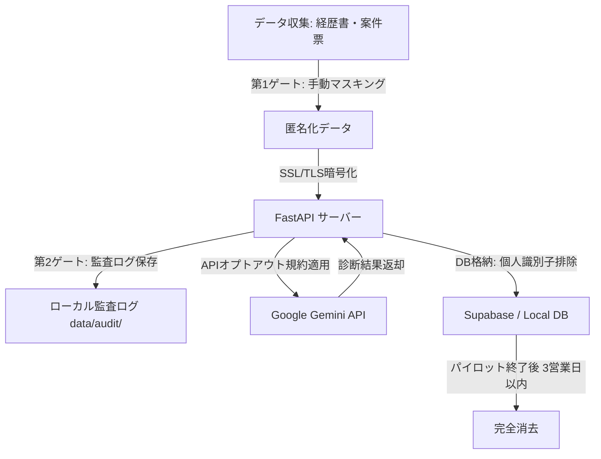

# Mighty Skill-Bridge：社内パイロット・クローズド運用設計書（T685）

**作成日**: 2026年6月3日  
**ステータス**: 完了  
**対象フェーズ**: 7. 次期開発・運用（コンプライアンス）  
**関連タスク**: **T685** 個人情報同意書テンプレート作成とクローズド運用設計  
**関連資料**:
- [PILOT_CONSENT_TEMPLATE.md](file:///c:/Users/kanta/GitHub/mighty-link-ai-connect/docs/PILOT_CONSENT_TEMPLATE.md) (参加同意書テンプレート)
- [PILOT_PARTICIPANTS_SELECTION.md](file:///c:/Users/kanta/GitHub/mighty-link-ai-connect/docs/PILOT_PARTICIPANTS_SELECTION.md) (参加者選定・依頼)

---

## 1. クローズド運用の目的
2026年6月2日の社長打ち合わせにおいて、本プロトタイプは「方向性A：AIフィット診断支援」として推進することが決定されました。  
社内パイロット期間（2026年6月3日〜6月16日）において、実在する経歴書（レジュメ）および案件票を用いてAI診断の精度評価を行います。この際、個人情報（PII）や機密情報が外部に漏洩するリスクをゼロにするため、本設計書に基づき「クローズド運用ループ」を構築し、安全なデータライフサイクル管理を徹底します。

---

## 2. データ管理ライフサイクル設計
データは収集から消去に至るまで、以下のクローズドループ内で処理されます。

### 2.1 データライフサイクル詳細

| フェーズ | 取り扱いルール | 管理主体 |
| :--- | :--- | :--- |
| **1. 収集** | パイロット参加者から提供される経歴書、スキル情報、案件票。 | 寛太梅澤 / 佐藤美咲 / 鈴木健太 |
| **2. 匿名化** | 送信前にすべての個人特定要素を手動でマスキング・ID置換。後述のマスキング基準を適用。 | 参加者本人（提出時） |
| **3. 送信・通信** | 通信経路はすべてHTTPS（SSL/TLS）による暗号化。認証層としてBasic Authを必須化。 | システム管理者（寛太） |
| **4. AI処理** | 送信先は Google Gemini API エンドポイント。データ保護規約に基づき「モデル学習への二次利用不可」のプライベートAPIを使用。 | Google Cloud API |
| **5. 蓄積・永続化** | データベース（Supabase等）に一時保存する際、実名や生データは保存せず、ダミーID（`Candidate-A01` 等）のみで紐付け。 | データベース管理者 |
| **6. 消去・廃棄** | パイロット評価期間終了後、3営業日以内（2026年6月19日 EOD）に生データおよび一時データをDB・サーバーから完全消去。 | システム管理者（寛太） |

---

## 3. データ・マスキング基準（匿名化ガイドライン）
経歴書および案件票を本システムに入力する際、以下のマスキング基準を厳格に適用します。

| 情報項目 | マスキング・置換ルール | 例（修正前 ➡️ 修正後） |
| :--- | :--- | :--- |
| **氏名** | 完全削除、または任意のダミーIDに置換。 | 山田 太郎 ➡️ `Candidate-A01` |
| **生年月日/年齢** | 生年月日は削除し、年代（10歳刻み）のみに一般化。 | 1992年4月1日生（34歳） ➡️ 30代 |
| **連絡先情報** | 電話番号、メールアドレス、住所、SNSアカウント等は完全削除。 | 090-XXXX-XXXX / tokyo@... ➡️ （完全削除） |
| **所属・取引先企業名** | 具体的な会社名は伏せ、業種や企業規模に置き換え。 | 株式会社アクセンチュア ➡️ 外資系コンサルティングファーム |
| **学校・アカデミア名** | 具体的な大学名・学部名は、国公立/私立および文理系統に一般化。 | 東京大学 工学部 ➡️ 国立大学 理系学部 |
| **プロジェクト固有名称** | 製品名や機密性の高い固有名詞は、汎用的な技術スタック名に変換。 | 楽天の「SPUシステム」 ➡️ 大手ECサイトのポイント還元システム |
| **金額情報** | 年収や具体的な取引金額は、レンジ表現（100万円単位）に丸める。 | 年収 685万円 ➡️ 年収 600万〜700万円レンジ |

---

## 4. 権限・アクセス管理（アクセス制限設計）
パイロットプログラムで同期・生成されるドキュメントおよび各種管理ボードのアクセス権限は以下の通り制限されます。

1. **Google Drive / Workspace (Google Docs/Calendar/Sheets)**:
   * オーナーアカウント: `k-umezawa@ml-mightylink.com`
   * アクセス範囲: 社長（梅澤 啓）および開発管理者（寛太）の2名に限定。外部への「リンクを知っている全員に公開」は禁止し、限定共有（閲覧のみ）とします。
2. **Notion 証跡ページ**:
   * 開発用のNotion MCP連携ページは、マイティリンク社内の本プロジェクト関係者（Notion Workspaceメンバー）以外からのアクセスを制限。
3. **GitHub Project / Issues**:
   * リポジトリ `mighty-link-ai-connect` はプライベートリポジトリとして運用され、外部貢献者は追加しません。

---

## 5. 監査およびモニタリング体制
クローズド運用が正しく実行されているか監視するため、以下の監査手順を設けます。

* **日次ログ監査**:
  * `/api/audit/recent` 経由で取得される監査ログ（`data/audit/` 内のJSONLファイル）を寛太が日次で確認。
  * フィルタリングやマスキング漏れによる実名や特定個人の連絡先の混入（PIIリーク）がないか、テキストマイニングにより簡易スキャンを実施。
* **超過・不正アクセス遮断**:
  * 外部API（Gemini/Seedance）の利用枠の上限に達した場合、自動的に `deterministic_fallback` モードへ切り替える遮断回路（サーキットブレイカー）を維持し、意図しない超過課金や大量アクセスを防止します。
