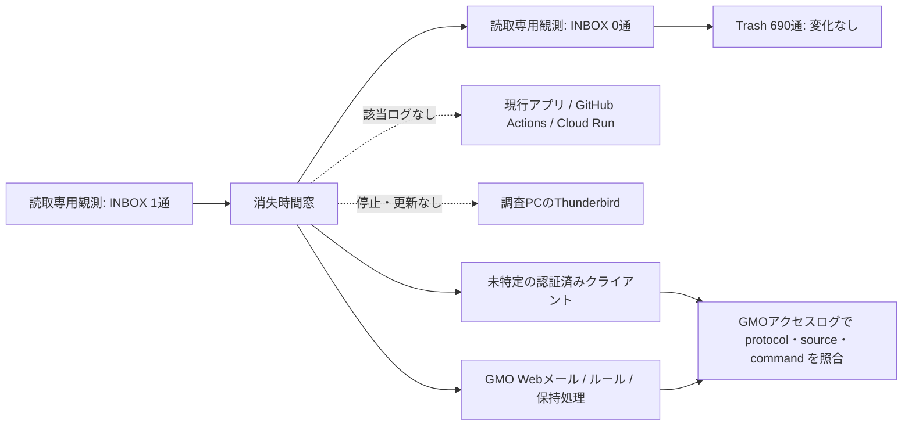

# 営業メール消失 デジタルフォレンジック一次報告

- 作成日: 2026-08-14
- 関連WBS: T922, T943, T944, T950
- 分類: メールボックス保持インシデント
- 状態: 原因経路の封じ込めは未完了

## 結論

2026-08-14の調査中、共有営業メールボックスの `INBOX` が **1通から0通へ変化**した。両観測はIMAPの読取専用選択で行い、`Trash` は690通のまま変化していない。消失時間窓は **2026-08-14 15:00:22～17:52:30 JST（06:00:22～08:52:30 UTC）** である。

この時間窓では、調査PCのThunderbirdは停止しており、Thunderbirdプロファイルの対象ファイルは2026-08-07以降更新されていない。調査PCにメール用ポートへの接続および関連スケジュールタスクはなく、GitHub Actionsは公開URL監視のみ、Cloud Runにも営業メール同期APIの呼出しや同期処理ログはなかった。したがって、**現在のThunderbirdと現行Mighty Skill-Bridge同期経路は、2026-08-14の消失元としてほぼ除外できる**。

現時点の最重要容疑経路は、人物ではなく次の接続経路である。

1. 複数の営業担当が使うPC・スマートフォン・旧端末に残ったPOP3/IMAPクライアント
2. 同じ認証情報を持つ外部サービスまたは自動化
3. GMO Webメールの操作、振り分け・転送設定、またはプロバイダー側保持処理

共有メールボックスのパスワードは過去にチャットへ平文で記載されているため、実際の不正利用の証拠がなくても **漏えい済み認証情報として扱う**。接続元の確定にはGMO側アクセスログが不可欠である。

## 事件図

## 証拠保全

証拠はThunderbirdプロファイル外の次のディレクトリへコピーし、コピー前後のSHA-256を照合した。

`C:\Users\kanta\Documents\Mighty-Link\sales-email-incident-evidence\20260814-144122`

| 証拠 | 性質 | SHA-256 |
| --- | --- | --- |
| `manifest.json` | Thunderbird主要8ファイルの原本・コピー照合 | `4E6658DED87CB6CC4A8D397D7854FFB32D6B2E4C9BE528A6873D6EBB7526F719` |
| `supplemental-manifest.json` | 資格情報メタデータ格納ファイルの保全。復号なし | `601B20896DCED0A26260B4D9B89E5A8623E4EA54C94EF5131C0BFF6388C6550C` |
| `agent-session-manifest.json` | 2026-07-25以降のCodexセッションのライブスナップショット | `14B732D32DEC81C91F7E1484E0A5104E6712D0CC0083E74EB2350E6BC6F618F2` |
| `server-observation-20260814-175230-jst/manifest.json` | 2026-08-14再消失観測とセッションスナップショット | `4A1E4BBBBD56FE38BA7C026EF8008C11109D6FD5A7BBD6E22717C28D9AD1BA06` |
| 同ディレクトリの `observation.json` | INBOX 1→0、Trash 690→690の構造化観測 | `E9F5FFA06458DFABA96B6CFE4F9C884A8952FE5D7EA37E7749F80263372293B1` |
| 同ディレクトリの `corroboration-manifest.json` | PC・GitHub Actions・Cloud Runの反証調査 | `2DCD59150F86941FE4454F9334127F48C7AD0E480C443263A6D4F9364704B572` |
| `credential-provenance/manifest.json` | 2026-07-08接続情報共有記録の値を伏せたメタデータ | `A96304393EE6B9AB60FA33FC0DC77420BB66418CB28207EE522CBF3CA8862545` |
| `credential-provenance/shared-use-manifest.json` | 複数営業担当が利用する共有メールというユーザー供述 | `98F7975C2458077371A36BBDB948C39FE178AF63AF42CED084F471252599C6CE` |

セッションファイルは調査継続中の追記ファイルなので、閉鎖済み原本と同等ではなく「取得時点のライブスナップショット」として扱う。メール本文、件名、送信元、Message-ID、パスワード、接続文字列は本報告へ転記していない。

## 確定タイムライン

### 2026-07-08 接続情報の起点

ユーザー提供の会話記録では、15:01 JSTに共有営業メールボックスのアドレス・ユーザー名・パスワードがチャットで平文共有され、15:13 JSTにSMTPサーバーとPOPサーバーが共有された。一方、IMAP情報、`Leave messages on server`、保持日数、削除禁止、接続端末、受信担当者一覧は記録にない。

また、当該メールボックスは複数の営業担当が受信する共有メールボックスであることが確認された。したがって、**各担当者の端末・メールソフト・プロトコル・削除設定を個別に棚卸ししない限り、1台のPOP3設定または1人のIMAP/Webメール操作が全員の受信状態へ影響する**。この会話記録は、元メッセージのパーマリンクまたはエクスポートを取得するまでは二次証拠として扱う。

### 2026-07-25 第1事案

| JST | UTC | 証拠・出来事 | 評価 |
| --- | --- | --- | --- |
| 16:51～17:01頃 | 07:51～08:01頃 | Thunderbirdローカルmboxに新着3通が残存 | 3通が一度はIMAP経由で取得されたことを示す |
| 17:31:18 | 08:31:18 | 当時の環境値を確認。POP3は構成済み、`POP3_LEAVE_ON_SERVER=true` | この時点の設定ではPOP3 `DELE` 条件を満たさない |
| 17:32:02 | 08:32:02 | 読取専用IMAPで `INBOX=0`、`Trash=690` | 調査接続より前に消失済み |
| 17:49:55 | 08:49:55 | POP3 `DELE` をコードから完全撤去 | 以後の同コード経路を恒久遮断 |
| 19:27:21 | 10:27:21 | IMAP読取専用化とPOP3フォールバック廃止 | 現行経路の安全策 |

2026-07-25 13:33:12の旧コードには、`POP3_LEAVE_ON_SERVER=false` の場合に `client.dele(i)` を実行する能力と、IMAPの新規DB挿入数が0ならPOP3へフォールバックする処理が存在した。ただし、保存セッションは16:10開始で、17:32までに `scripts/sync_sales_emails.py` を実行した記録はない。14:32頃の「同期完了」という過去の説明は16:32に会話文として貼られたもので、このセッション内の実行証跡ではない。

したがって旧コードは **第1事案に限る技術的容疑経路** だが、実行・設定条件の証拠が不足しており、原因と断定できない。

### 2026-08-10 第2事案

| JST | UTC | 証拠・出来事 | 評価 |
| --- | --- | --- | --- |
| 16:56:08 | 07:56:08 | Cloud Run APIが読取専用IMAPで `INBOX=1` を取得 | メール存在の確定観測 |
| 17:35:35 | 08:35:35 | GitHub Actionsが読取専用IMAPで `INBOX=0` を検知 | 39分27秒以内に消失 |
| 18:34頃 | 09:34頃 | `--require-messages` が空INBOXを異常として失敗 | fail-closed動作を確認 |

対象リビジョンは `readonly=True` であり、POP3へフォールバックせず、`STORE`、`EXPUNGE`、`DELE` を持たない。Cloud Runの定期同期サービスには呼出し元となるSchedulerジョブがなく、実行ログもなかった。

### 2026-08-14 第3事案

| JST | UTC | 証拠・出来事 | 評価 |
| --- | --- | --- | --- |
| 15:00:22 | 06:00:22 | 読取専用IMAPで `INBOX=1`、`Trash=690` | メール存在の確定観測 |
| 16:21～16:21 | 07:21～07:21 | GitHub Actionsの公開URL監視 | メール同期処理なし |
| 17:44～17:44 | 08:44～08:44 | GitHub Actionsの公開URL監視 | メール同期処理なし |
| 17:52:30 | 08:52:30 | 読取専用IMAPで `INBOX=0`、`Trash=690` | 2時間52分08秒以内に再消失 |

この時間窓でThunderbirdは停止し、対象プロファイルの `prefs.js`、`INBOX`、`INBOX.msf` は2026-08-07以降更新されていない。調査PCにメールポートへの確立済み接続、関連スケジュールタスク、Sysmon、許可通信のFirewallログはなかった。Cloud Runに `/api/sales-email/sync` リクエストおよび営業メール同期ログはない。

## 容疑経路評価

ここでいう「容疑」は人物への嫌疑ではなく、メールを消し得る技術経路の優先順位である。

| 容疑経路 | 現在の評価 | 支持証拠 | 反証・不足 |
| --- | --- | --- | --- |
| 複数担当の端末・旧クライアントのPOP3 | 最優先 | 7月8日にPOP接続情報のみ共有。Trashを経由しない反復消失と整合 | 利用者・端末台帳と接続元・`DELE` ログ未取得 |
| 別端末・外部サービスのIMAP/Webメール | 最優先 | 認証情報が既知なら `STORE \\Deleted`、`EXPUNGE`、MOVE等が可能 | 操作ログ未取得 |
| GMO Webメールのルール・転送・保持処理 | 要調査 | クライアント外で同様の結果を作れる | コントロールパネルと事業者ログ未確認 |
| 2026-07-25旧POP3同期コード | 第1事案のみ保留 | 当時のコードに条件付き `DELE` とフォールバック能力 | 実行ログなし。17:31時点の設定はleave=true。8月事案の現行コードには削除能力なし |
| 調査PCのThunderbird | 8月事案ではほぼ除外 | 停止中、対象ファイル更新なし、フィルターなし、終了時EXPUNGE/ごみ箱消去オフ | 7月の過去手動操作までは完全否定できない |
| 現行Mighty Skill-Bridge / GitHub Actions / Cloud Run | 8月事案ではほぼ除外 | 読取専用コード、削除命令なし、該当時間の同期呼出しなし | GMO側ログと突合するまでは数学的な完全否定ではない |
| GMO障害・容量・保持ポリシー | 低～中 | サーバー側なら全クライアントから消える | 発生通知、容量証拠、保持ログなし |

## 技術的な削除成立条件

IMAPでは、メッセージへ `\\Deleted` を設定しただけでは通常は物理削除されず、その後の `EXPUNGE` または条件を満たす `CLOSE` で恒久削除される。読取専用で選択したメールボックスでは `CLOSE` でも削除されない。POP3では `DELE` で削除対象にし、正常な `QUIT` で更新が確定するのが典型である。

このためGMOへ依頼するログ項目は、単なるログイン履歴ではなく、プロトコルと削除操作の組合せでなければならない。

## GMOへの照会文

件名: 共有メールボックスの受信メール消失に関するアクセスログ保全・調査・復旧可否のお願い

次の時間帯について、対象共有メールボックスの認証・操作ログを保全し、確認してください。

- 2026-07-25 16:51～17:32 JST（07:51～08:32 UTC）
- 2026-08-10 16:56:08～17:35:35 JST（07:56:08～08:35:35 UTC）
- 2026-08-14 15:00:22～17:52:30 JST（06:00:22～08:52:30 UTC）

確認を依頼する項目:

1. POP3、IMAP、Webメール、管理画面ごとの認証成功・失敗時刻
2. 接続元IP、クライアント識別子またはUser-Agent、接続先ホスト
3. POP3 `DELE` と、その削除を確定した `QUIT`
4. IMAP `STORE +FLAGS \\Deleted`、`EXPUNGE`、`UID EXPUNGE`、`CLOSE`、`MOVE`
5. Webメール上の削除・移動、振り分け、転送、保持期間、容量超過処理
6. 消失メールのバックアップ・スナップショット・復旧可能期間
7. ログ保存期限と、警察・弁護士等からの照会時に必要となる手続き

## 社長へ確認する事項

パスワードそのものは再送・再掲せず、次の回答と原資料を依頼する。

### 最優先

1. 共有メールボックスのパスワードを直ちに変更し、旧資格情報を失効させてよいか。短時間の再設定作業を全営業担当へ案内できるか。
2. 2026-07-08の元メッセージのパーマリンクまたはエクスポート、会話・チャンネル名、当時閲覧可能だったメンバーとBot/外部連携の一覧を提供できるか。
3. 現在および過去にこのメールを受信した全営業担当者、退職・異動者、PC、スマートフォン、タブレット、メールソフト、CRM、複合機、自動化の台帳はあるか。
4. 各端末はPOP3、IMAP、Webメール、転送のどれを使っているか。POP3の場合は「サーバーにメッセージを残す」「何日後に削除」「ローカル削除時にサーバーも削除」の値は何か。
5. 2026-07-25、2026-08-10、2026-08-14の消失時間窓にメールを開いた、削除した、移動した、メールソフトを終了した担当者・端末はあるか。
6. GMOコントロールパネルへ入れる管理者は誰か。GMOへのログ保全依頼、パスワード変更、バックアップ復旧依頼を本日実施できるか。

### 運用確認

7. 複数担当者は1つのメールボックスへ直接ログインしているか、それとも個人メールへ転送しているか。
8. サーバー上の受信メールは「全件を残す」が正式ルールか。削除・アーカイブ・既読化を誰が行ってよいか。
9. GMO Webメールに振り分け、転送、自動削除、保持期間、容量上限の設定があるか。最近変更した人と日時は分かるか。
10. 消失したと分かるメールについて、受信日時、送信元、件名、Message-ID、営業担当者の画面写真、送信者へ再送依頼できる連絡先はあるか。機密値は安全な経路で渡せるか。
11. 7月8日以前にも同じ認証情報を知っていた人・サービスはあるか。パスワードを最後に変更した日時はいつか。
12. 共有アカウントの共通パスワード運用を廃止し、転送または個人識別可能なアクセス方式へ移行する意思はあるか。

## 即時封じ込め

1. GMOへ上記ログの保全依頼を出す。
2. GMOコントロールパネルで共有メールボックスのパスワードを変更する。新パスワードをチャットやリポジトリへ記録しない。
3. 新パスワードは承認済みThunderbird IMAPとGitHub Actionsの専用Secretだけへ再設定する。
4. 古いPC、スマートフォン、Outlook、Thunderbird、CRM、複合機、転送サービス、自動化を全件棚卸しし、旧資格情報を停止する。
5. 一意なテストメールを送り、GMO Webメールと読取専用IMAPで30分以上、かつ定期処理1回をまたいで残存を確認する。
6. 保持確認が終わるまで、ローカルmboxからサーバーへメールを戻さない。

## 公式根拠

- [GMO お名前.com メールソフト設定情報](https://help.onamae.com/answer/20443)
- [GMO お名前.com メールパスワード変更](https://help.onamae.com/answer/20361)
- [Mozilla Thunderbird アカウント設定](https://support.mozilla.org/en-US/kb/configuration-options-accounts)
- [IETF RFC 9051: IMAP4rev2](https://datatracker.ietf.org/doc/html/rfc9051)
- [GitHub Actions ワークフロー実行ログ](https://docs.github.com/en/actions/how-tos/monitor-workflows/use-workflow-run-logs)
- [Google Cloud Run ロギング](https://docs.cloud.google.com/run/docs/logging)

## 限界

本報告は技術的な一次調査であり、刑事責任や個人の故意を認定するものではない。現時点では認証済みのどの接続元が削除命令を発行したかを示すGMO側ログがない。原因確定、法的措置、欠損メールの復旧可否判断には、GMOによるログ保全・回答と、全接続端末の棚卸しが必要である。
