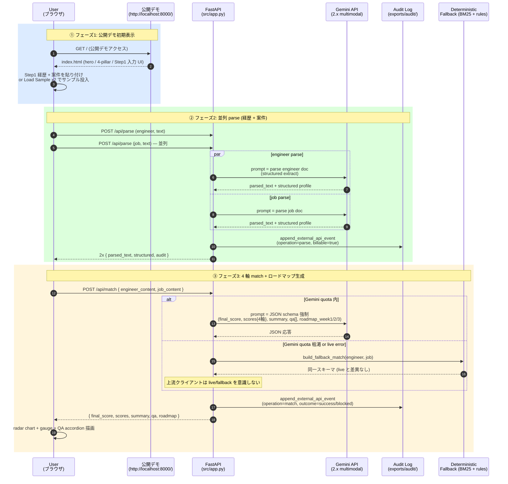
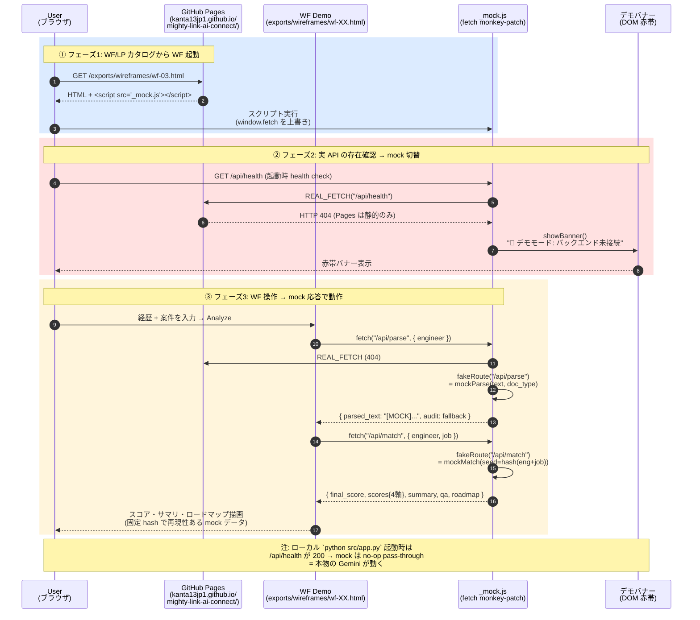
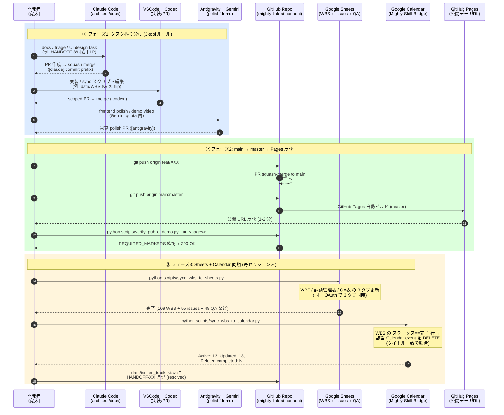
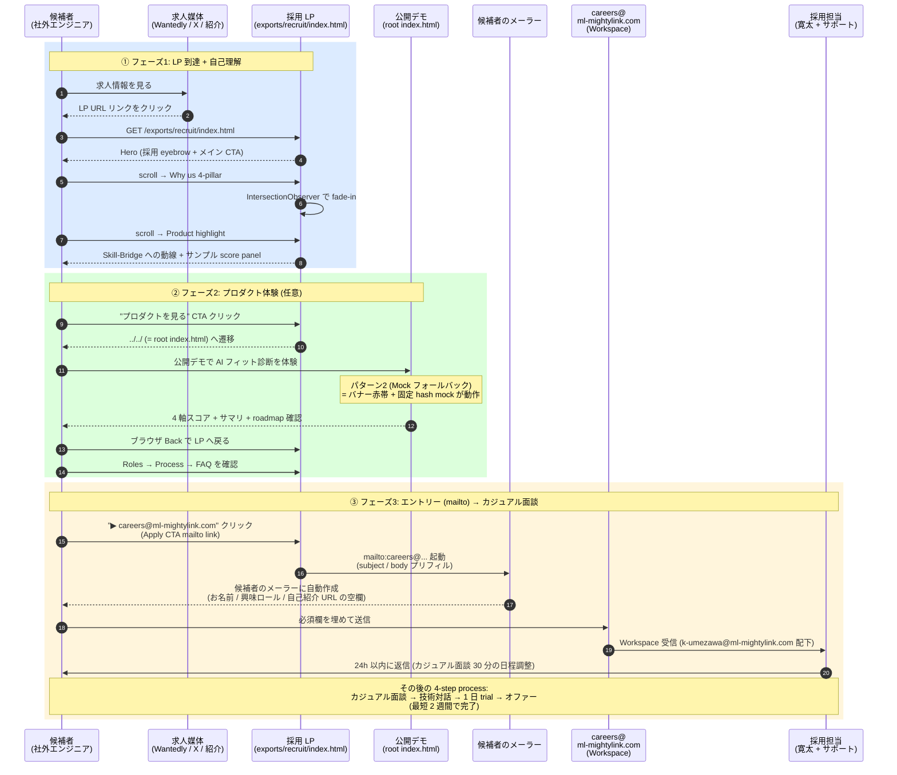

# Mighty Skill-Bridge — シーケンス図集

作成日: 2026-05-26
オーナー: Claude Code レーン (architect / docs)
対象 WBS: T658-extend (関係者向け説明資料)
形式: Mermaid sequence diagram (VSCode + Markdown Preview Mermaid Support / GitHub 標準対応)

---

## 前提

- **本プロジェクト構成**: GitHub Pages (静的公開) + FastAPI (ローカル `python src/app.py`) のハイブリッド
- **認証**: Google Workspace OAuth (`k-umezawa@ml-mightylink.com`) — Sheets / Calendar / Drive / NotebookLM 連携時のみ
- **AI バックエンド**: Gemini 2.x multimodal (live) + 決定的 fallback (同一スキーマ)
- **公開デモのモック動作**: `exports/wireframes/_mock.js` が `fetch()` を monkey-patch し、`/api/*` が 404 のとき固定 hash の mock 応答を返す (バナー赤帯付き)

---

## パターン 1: AI フィット診断フロー (ローカル `python src/app.py`)

> ローカル起動時の本物 Gemini パス。経歴 + 案件 → 4 軸スコア + 推奨質問 + 3 週ロードマップ。

---

## パターン 2: 公開 Pages の Mock フォールバック (バックエンドなし環境)

> GitHub Pages から WF / LP / Recruit カタログにアクセスした場合の動作。`_mock.js` が `/api/*` の 404 を検出して固定 hash mock 応答に切り替える。

---

## パターン 3: 開発フロー (3-tool AI 体制 + WBS / Sheets / Calendar 同期)

> Claude Code (architect/docs/UI) / VSCode + Codex (実装/sync scripts) / Antigravity + Gemini (frontend polish/demo video) の 3-tool 並走。WBS / 課題管理表 / QA表 の 3 タブを Google Sheets に同期、Calendar に WBS イベントを反映 (完了は自動削除)。

---

## パターン 4: 採用 LP エントリーフロー (HANDOFF-36 で新設)

> 掲載型採用前提の 1 枚 LP。エントリー前に弊社特徴を伝え、`careers@ml-mightylink.com` mailto で接点を作る。Workspace ドメインの社内アドレスで受信。

---

## メモ

- **編集方針**: 各図は **1 画面 1 シナリオ**で完結。フェーズ番号 (①/②/③) でストーリーを区切り、関係者+システムを縦軸、時系列を縦方向に並べる。`rect rgb(...)` でフェーズの色分け。
- **Mermaid 標準対応**: GitHub Markdown プレビュー、VSCode 拡張 (`bierner.markdown-mermaid` 等)、Notion (`/mermaid`)、Obsidian でそのまま描画可能。
- **更新トリガ**: API endpoint 追加 / 認証フロー変更 / 開発フロー再編 が起きたら本書を更新。古いシーケンスは「Stale」セクションへ退避ではなく**物理削除**で運用する ([feedback_stale_doc_deletion](../../../.claude/projects/.../memory/feedback_stale_doc_deletion.md) 方針)。
- **関連 docs**:
  - [MULTI_AI_WORKFLOW.md](MULTI_AI_WORKFLOW.md) — 3-tool 体制の handoff 規約
  - [BACKEND_AI_PIPELINE.md](BACKEND_AI_PIPELINE.md) — Gemini live / fallback の設計詳細
  - [SHEETS_TRACKERS_SCHEMA.md](SHEETS_TRACKERS_SCHEMA.md) — Sheets 3 タブのスキーマ
  - [SETUP_GUIDE.md](SETUP_GUIDE.md) — 環境構築と sync スクリプト実行
