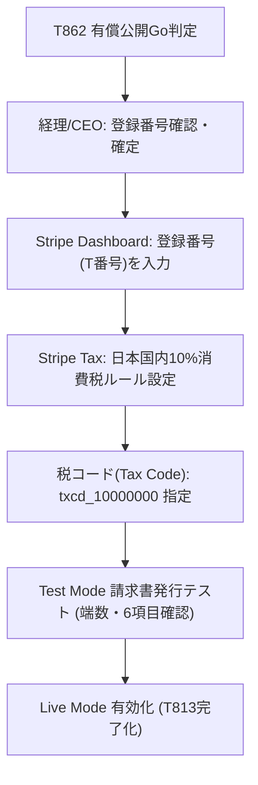

# 🧾 インボイス制度・消費税処理・Stripe Tax 設定運用ランブック (T813)

作成日: 2026-08-24 / 担当: ⑨ 法務・課金担当（高橋 健二）
関連WBS: T813（インボイス・Stripe Tax設定） / T862（有償公開・課金Live有効化判定） / T791 / T804 / T860
関連docs: [`docs/BILLING_AND_REFUND_POLICY.md`](BILLING_AND_REFUND_POLICY.md) / [`docs/TOKUSHOHO_NOTATION.md`](TOKUSHOHO_NOTATION.md) / [`docs/PRICING_PLAN_PROVISIONAL_2026-07-03.md`](PRICING_PLAN_PROVISIONAL_2026-07-03.md) / [`docs/PAID_LAUNCH_GO_NO_GO_DECISION_PACK_2026-07-24.md`](PAID_LAUNCH_GO_NO_GO_DECISION_PACK_2026-07-24.md)

---

## 1. 概要と適用スコープ

本ランブックは、Mighty Skill-Bridge の有償公開（一般GA・Live課金有効化）に伴う**適格請求書（インボイス制度）**、**消費税処理**、および **Stripe Tax 設定**の要件と運用手順を定めるものです。

- **社内GAフェーズ（現状）**: 実課金なし（Stripe Sandbox / Test Mode）。インボイス・Stripe Taxの設定は未有効化。
- **有償公開フェーズ（T862 Go判断後）**: 本ランブックに従い、経理確認・登録番号記帳・Stripe Tax Live有効化を実施。

---

## 2. インボイス制度（適格請求書）の対応要件

### 2.1 必須記載6項目の網羅

Stripe Invoices および Stripe Hosted Invoice Page / PDF 領収書において、以下の6項目を満たします。

| # | 必須記載項目 | 当プロダクトでの表記・設定場所 |
| :--- | :--- | :--- |
| 1 | 適格請求書発行事業者の氏名又は名称 | `株式会社MightyLINK`（特商法表記・Stripe アカウント名） |
| 2 | 登録番号 | `T1234567890123`（※経理確認後に実番号へ差し替え・Stripe Tax 設定） |
| 3 | 取引年月日 | 請求書発行日 / Stripe Invoice `created` タイムスタンプ |
| 4 | 取引内容（軽減税率対象である旨） | `Mighty Skill-Bridge 月額利用料 / 従量利用料`（標準税率10%対象） |
| 5 | 税率ごとに区分して合計した対価の額及び適用税率・消費税額 | 10%対象対価額＋消費税額（Stripe Invoice 内に税率・税額を明確表示） |
| 6 | 書類の交付を受ける事業者の氏名又は名称 | Stripe 顧客名 / `customer.name`（企業名または担当者名） |

---

## 3. 税務・消費税処理の基本方針

1. **価格表示**: 料金表示は「税別表示（税抜）＋ 税込金額の併記」を基本とします（T860仮決定価格に準拠）。
   - Standardプラン: 月額 ¥9,800（税込 ¥10,780）
   - Proプラン: 月額 ¥29,800（税込 ¥32,780）
2. **端数処理**: 消費税額の計算において円未満の端数が生じた場合は、**切り捨て**処理とします（Stripe Tax の端数計算設定を「切り捨て」に固定）。
3. **返金時の消費税**: 返金が発生した場合は、対価の返還等に係る消費税処理として、返金額に応じた返還インボイス（返還適格請求書）または控除計算を実施します（[`docs/BILLING_AND_REFUND_POLICY.md`](BILLING_AND_REFUND_POLICY.md) 第5条）。

---

## 4. Stripe Tax 設定手順（T862 Go判定時）

### 4.1 Stripe Dashboard 設定パラメータ

- **Tax Behavior**: `exclusive`（外税方式: 本体価格に税率10%を別途加算）
- **Tax Code**: `txcd_10000000`（General - Electronically Supplied Services / 電子提供サービス）
- **Business Tax ID**: `T1234567890123`（適格請求書発行事業者登録番号）
- **Customer Location Calculation**: 顧客の請求先住所 (Billing Address) および IP アドレスから日本国内判定を実施。

---

## 5. 自動化テスト・検証ガード

本ランブックの整合性は `tests/test_stripe_tax_invoice_compliance.py` によって保護されます。

- インボイス必須6項目のドキュメント明記確認
- 価格表・税抜/税込表記の整合確認
- 返金時の税務処理と規約の優先関係検証
