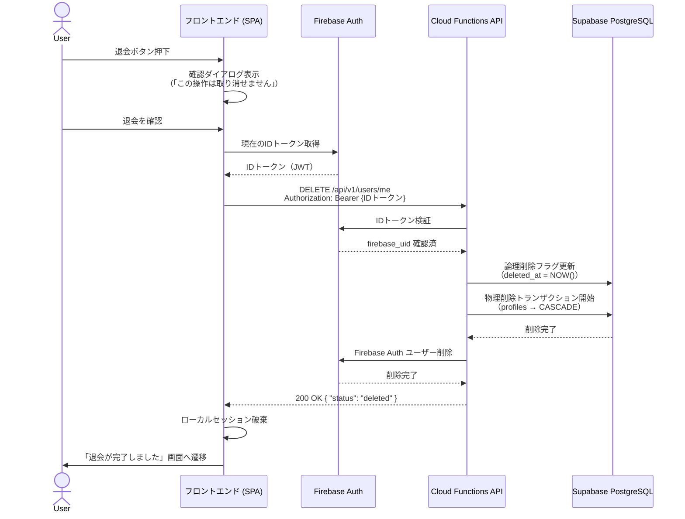

# ユーザーデータ完全消去（退会）フロー設計書 (T742)

本ドキュメントは、**個人情報保護法（改正2022年施行）** および **GDPR（EU一般データ保護規則）Article 17「消去の権利（忘れられる権利）」** に準拠した、Mighty Skill-Bridge サービスの退会・データ削除フローを定義します。

---

## バージョン履歴

| 日付 | バージョン | 内容 | 起稿者 |
| :--- | :--- | :--- | :--- |
| 2026-06-10 | v1.0.0 | 初版作成（論理削除・物理削除・APIエンドポイント設計） | Claude Code |
| 2026-06-27 | v1.1.0 | T847として営業メールAI、社内アンケート、勤怠、サポート、課金、セルフエクスポートを含む全テーブル保持・削除・匿名化照合を追記 | Codex |

---

## 1. 対象データと保護方針

### 1.1 個人情報の分類

| テーブル | 個人情報の種別 | 削除方針 |
| :--- | :--- | :--- |
| `public.profiles` | 氏名・メールアドレス・経歴プロファイル | 物理削除（ON DELETE CASCADE） |
| `public.matches` | マッチング結果・スコア詳細 | 物理削除（profiles との CASCADE） |
| `public.audits` | AI診断ログ（プロンプト・応答） | 物理削除（matches との CASCADE） |
| `public.usage_ledgers` | API利用履歴・コストログ | 匿名化（user_id → NULL へのマスク） |
| Firebase Auth | 認証情報（メール・UID） | Firebase Auth レコード削除 |
| Firebase Functions ログ | Cloud Logging の実行ログ | GCP ログ保持ポリシーで30日後自動削除 |

### 1.2 T847で追加した現行テーブル群

現行サイトでは、初期の `profiles` / `matches` / `audits` 以外に、営業メールAI、社内アンケート、勤怠、問い合わせ、フィードバック、課金、セルフエクスポートの保存先が追加されている。全テーブルの正本は [DATA_RETENTION_DELETION_ANONYMIZATION_RUNBOOK.md](DATA_RETENTION_DELETION_ANONYMIZATION_RUNBOOK.md) とし、退会・削除請求時は次の方針を併用する。

| 領域 | 主な保存先 | 削除・匿名化方針 |
| :--- | :--- | :--- |
| 営業メールAI | `sales_email_messages`, `project_requirements`, `talent_profiles_from_email`, `email_match_results`, `email_match_feedback` | メール本文全文・連絡先実値は保存しない。hash/redacted excerpt/匿名要員keyを、案件・要員・match単位で削除または匿名集計化する。 |
| 社内アンケート | `employee_assessment_responses` | `subject_pseudonym` 単位で削除する。心理/健康スコアや医療情報は保存しない。 |
| 勤怠 | `attendance_punch_events`, `attendance_timesheet_imports` | `subject_pseudonym` 単位で削除する。CSV原本、元ファイル名、生明細は保存しない。 |
| 問い合わせ/フィードバック | `support_requests`, `feedback_events` | 本人メールまたは `session_id` 単位で本文削除・匿名化する。顧客対応や法務上必要な証跡は個人識別子を外す。 |
| 課金 | Stripe Dashboard / Portal session API | Stripe secret、カード番号、短命Portal URLはアプリDBへ保存しない。請求証跡はStripe正本とし、アプリ側はmasked previewのみ扱う。 |
| セルフエクスポート | `GET /api/user-data/export` | Firebase本人確認済みのJSONを利用者端末へ一時生成する。GitHub/Sheets/docs/NotebookLMへ添付しない。 |

### 1.3 T847照合結果

- `employee_assessment_responses`、`attendance_*`、`sales_email_*` はRLS有効、匿名REST直接権限revoke済み。
- `support_requests`、`feedback_events` はRLS有効かつ公開REST policyなしで、FastAPI proxy経由に限定する。
- ローカル/CI監査ログは `scripts/rotate_runtime_logs.py` で7日超または10MB超を圧縮し、90日で削除する。
- Cloud Logging `_Default` は30日保持を標準にする。90日超の長期保存は課題管理表へ起票し、承認後にGCS sink/lifecycleで管理する。

### 1.4 保持が必要なデータ（削除除外）

以下は法的義務・会計要件のため一定期間保持する：

- **課金・請求記録**：消費税法上7年保持義務（user_id を匿名化し保持）
- **不正行為ログ**：不正アクセス禁止法対応のため90日保持（IPアドレス・UA のみ）

---

## 2. 退会フローの全体設計



---

## 3. APIエンドポイント設計

### 3.1 退会リクエスト

```
DELETE /api/v1/users/me
Authorization: Bearer {Firebase ID Token}
Content-Type: application/json
```

**レスポンス**

```json
{
  "status": "deleted",
  "deleted_at": "2026-06-10T12:00:00Z",
  "message": "アカウントとすべての個人情報を削除しました。"
}
```

**エラーレスポンス**

| HTTP Status | エラーコード | 説明 |
| :--- | :--- | :--- |
| 401 | `UNAUTHORIZED` | IDトークン無効・期限切れ |
| 404 | `USER_NOT_FOUND` | ユーザーが存在しない（既に削除済み含む） |
| 409 | `DELETION_IN_PROGRESS` | 削除処理が既に進行中 |
| 500 | `INTERNAL_ERROR` | DB削除中エラー（ロールバック済み） |

### 3.2 削除ステータス確認（退会リクエスト後の非同期確認用）

```
GET /api/v1/users/me/deletion-status
Authorization: Bearer {Firebase ID Token}
```

---

## 4. バックエンド実装仕様

### 4.1 削除処理の手順（トランザクション）

```python
# functions/delete_user.py (Firebase Cloud Functions)

import firebase_admin
from firebase_admin import auth as firebase_auth
from supabase import create_client
import os

def delete_user_account(firebase_uid: str) -> dict:
    """
    ユーザーの全データを完全削除する。
    1. Supabase PostgreSQL の profiles を物理削除（CASCADE で matches/audits も削除）
    2. usage_ledgers は user_id を NULL に匿名化（課金記録保持）
    3. Firebase Auth からユーザーレコードを削除
    """
    supabase = create_client(
        os.environ["SUPABASE_URL"],
        os.environ["SUPABASE_SERVICE_ROLE_KEY"]  # RLS バイパス用 Service Role Key
    )

    # Step 1: usage_ledgers を匿名化（削除前に実行）
    supabase.table("usage_ledgers") \
        .update({"user_id": None}) \
        .eq("user_id", firebase_uid) \
        .execute()

    # Step 2: profiles を物理削除（CASCADE で matches / audits も削除される）
    result = supabase.table("profiles") \
        .delete() \
        .eq("user_id", firebase_uid) \
        .execute()

    if not result.data:
        raise ValueError(f"USER_NOT_FOUND: {firebase_uid}")

    # Step 3: Firebase Auth からユーザー削除
    firebase_auth.delete_user(firebase_uid)

    return {
        "status": "deleted",
        "firebase_uid": firebase_uid
    }
```

### 4.2 Supabase RLS との整合性

退会削除は **Service Role Key** を使用して RLS をバイパスし、Cloud Functions 側で認可済みの firebase_uid に限定して削除を実行する。フロントエンドからの直接削除は RLS により禁止する。

```sql
-- profiles テーブルに対して、フロントエンドからの DELETE を禁止するポリシー
-- （削除は Cloud Functions 経由のみ許可）
CREATE POLICY "profiles_no_direct_delete"
  ON public.profiles
  FOR DELETE
  USING (false);  -- フロントエンドからの直接削除を全面禁止
```

---

## 5. フロントエンド実装仕様

### 5.1 退会フォームUI要件

1. **二段階確認**：「退会する」ボタン押下 → 確認モーダル表示 → 「削除を確定する」ボタン
2. **不可逆性の明示**：「この操作は取り消せません。すべての診断データが削除されます。」
3. **ローディング表示**：削除処理中はボタンをdisable化し、スピナーを表示
4. **完了後のリダイレクト**：削除完了後にサインアウト処理を実行し、トップページへリダイレクト

### 5.2 セッション破棄

```javascript
// 退会完了後の処理
async function handleDeleteComplete() {
  await firebase.auth().signOut();        // Firebase セッション破棄
  localStorage.clear();                   // ローカルストレージ全クリア
  sessionStorage.clear();                 // セッションストレージ全クリア
  window.location.href = '/goodbye';      // 退会完了ページへ
}
```

---

## 6. 論理削除フラグ設計（削除猶予期間対応）

GDPR では削除リクエストを受けてから **30日以内** の完全削除が求められる。運用上の猶予期間を設ける場合は論理削除フラグを使用する。

```sql
-- profiles テーブルへの論理削除カラム追加（マイグレーション）
ALTER TABLE public.profiles
  ADD COLUMN IF NOT EXISTS deleted_at TIMESTAMP WITH TIME ZONE DEFAULT NULL;

-- 論理削除済みレコードをRLSで非表示にするポリシー
CREATE POLICY "profiles_hide_deleted"
  ON public.profiles
  FOR SELECT
  USING (
    deleted_at IS NULL
    AND auth.firebase_uid() = user_id
  );
```

**削除スケジュール**：

| タイミング | 処理内容 |
| :--- | :--- |
| 退会リクエスト受付時 | `deleted_at = NOW()` を設定（論理削除） |
| 退会後 24 時間以内 | 物理削除バッチを実行（Firebase Auth 削除含む） |
| 削除失敗時 | Slack アラート通知 → 管理者が手動対応 |

---

## 7. 開示・訂正・利用停止リクエスト対応

個人情報保護法第32条〜36条（開示・訂正・削除・利用停止）への対応方針：

| 種別 | 対応方法 | SLA |
| :--- | :--- | :--- |
| 開示請求 | 利用者本人は `GET /api/user-data/export` でJSONエクスポート。本人が利用できない場合のみ管理者が監査付きで代理エクスポート | 受付後 2 週間以内 |
| 訂正請求 | 管理者が Supabase ダッシュボードで直接更新 | 受付後 2 週間以内 |
| 削除請求 | 退会 API (`DELETE /api/v1/users/me`) を管理者が代理実行 | 受付後 2 週間以内 |
| 利用停止請求 | Firebase Auth でアカウントを無効化（disabled = true） | 受付後 3 営業日以内 |

---

## 8. テスト要件

| テストケース | 期待結果 |
| :--- | :--- |
| 正常退会 | profiles / matches / audits が物理削除され、Firebase Auth レコードも消える |
| usage_ledgers の匿名化 | user_id が NULL になり、金額データは保持される |
| 未認証での退会リクエスト | 401 UNAUTHORIZED が返る |
| 存在しない user_id での退会 | 404 USER_NOT_FOUND が返る |
| profiles 削除後の matches 存在確認 | CASCADE により matches も削除済みであること |
| 退会後のログイン試行 | Firebase Auth により 403 が返る |

---

## 9. 関連ドキュメント

- [Firebase / Supabase システムアーキテクチャ詳細設計書](FIREBASE_SUPABASE_SYSTEM_ARCHITECTURE.md)
- [Supabase Database 物理設計とインデックス設計](SUPABASE_DATABASE_PHYSICAL_AND_INDEX_DESIGN.md)
- [本番データ保持・削除・匿名化ポリシー全テーブル照合 Runbook](DATA_RETENTION_DELETION_ANONYMIZATION_RUNBOOK.md)
- [個人情報同意書テンプレート](PILOT_CONSENT_TEMPLATE.md)
- [ユーザー操作ガイド・FAQ](USER_GUIDE_AND_FAQ.md)
