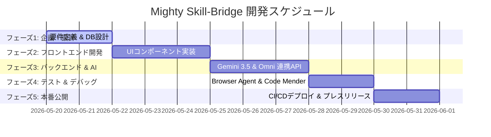

# 📊 Mighty-Link AI Connect: プロジェクトWBS (作業分解構成図)

> [!NOTE]
> **本WBSの設計思想**
> 開発するプロダクト **『Mighty Skill-Bridge（エンジニア＆案件 AIフィットシミュレーター）』** を、Antigravity 2.0 および Gemini 3.5 Flash/Omni を用いて爆速開発するための完全詳細タスクリストです。
> 最新の **Google Workspace AI (Docs/Sheets Live) ＆ Gemini Spark 連携** の思想に基づき、スプレッドシートにコピペするだけで即座に動的なプロジェクト管理ボードとして機能するフォーマットで設計されています。

---

## 📅 WBS フェーズ別サマリー

---

## 📑 WBS 詳細テーブル

*※この表は、`data/WBS.tsv` ファイルからスプレッドシートにコピペするだけで、全く同じレイアウトでスプレッドシート上に再現されます。*

| タスクID | 大フェーズ | 小フェーズ | タスク名 | 担当 | 実行エンジン | Sheets Live 連携アクション |
| :--- | :--- | :--- | :--- | :--- | :--- | :--- |
| **T101** | 1. 企画・設計 | 要件定義 | `requirements.md` の策定 | 人間 + AI | Gemini 3.5 Flash | 完了時に Docs Live へ自動文書書き出し |
| **T102** | 1. 企画・設計 | DB設計 | `database.md` とスキーマ設計 | AIエージェント | Gemini 3.5 Flash | テーブル定義をスプレッドシートへ自動同期 |
| **T201** | 2. フロント開発 | UI/UX実装 | PDF/画像ドラッグ＆ドロップ画面 | AIエージェント | Antigravity 2.0 | 実装進捗を Sheets Live にリアルタイム反映 |
| **T202** | 2. フロント開発 | UI/UX実装 | フィット分析結果（レーダーチャート等） | AIエージェント | Antigravity 2.0 | UIコンポーネントのテスト結果をセルへ記録 |
| **T301** | 3. バックエンド | API開発 | ファイルアップロード＆パースAPI | AIエージェント | Gemini 3.5 Flash | API仕様書を Docs Live に自動同期 |
| **T302** | 3. バックエンド | AIコア連携 | Gemini Omni マルチモーダル解析API | AIエージェント | Gemini Omni | プロンプト応答ログを Sheets Live に蓄積 |
| **T303** | 3. バックエンド | 提案生成 | 面談想定質問＆育成ロードマップ生成 | AIエージェント | Gemini 3.5 Flash | 生成結果のフォーマットを Sheets 側で管理 |
| **T304** | 3. バックエンド | AI基盤肉付け | 構造化プロファイル抽出・4軸スコアリングfallback実装 | Codex | VSCode + Codex | AI復帰時に渡す structured_profile / gap_analysis を Sheets ログへ拡張可能にする |
| **T305** | 3. バックエンド | AI監査基盤 | AI判定監査ログ(JSONL)・recent audit API実装 | Codex | VSCode + Codex | AI評価根拠・matched/missing skills をローカル監査ログへ蓄積し復帰後の改善に利用 |
| **T306** | 3. バックエンド | 公開デモ保護 | GitHub Pages root index ガード・CI検証 | Codex | VSCode + Codex | 社長共有済み公開URLのREADME fallbackを防止し、push前後のUIマーカー検証を必須化 |
| **T307** | 3. バックエンド | WBS可視化強化 | CATS型WBSスプレッドシートUI・集計/タイムラインタブ実装 | Codex | VSCode + Codex | 参照WBSに近い階層・進捗・予定/実績・集計ビューをSheetsへ自動生成 |
| **T401** | 4. 検証・品質 | テスト実行 | Browser Agent による自律UI/UXテスト | AIエージェント | Browser Agent | テスト合格率・バグ率を Sheets Live にプロット |
| **T402** | 4. 検証・品質 | セキュリティ | Code Mender による脆弱性自動修正 | AIエージェント | Code Mender | 脆弱性修復ログを Sheets セキュリティタブに同期 |
| **T501** | 5. デプロイ | インフラ | CI/CD（GitHub Actions）設定 | AIエージェント | Gemini 3.5 Flash | デプロイ成否・本番URLを Sheets に自動書き込み |
| **T502** | 5. デプロイ | リリース | プレスリリース・SNS告知文の自動生成 | 人間 + AI | Gemini 3.5 Flash | 告知文候補（3パターン）を Docs Live に書き出し |

---

## 🤖 Sheets Live & Gemini Spark による自律同期シナリオ

Google Workspace AI & Gemini Spark のパワーを活かし、このWBSは以下のように自律的に同期・稼働します。

1. **リアルタイム進捗更新 (Sheets Live)**
   - Antigravity 2.0 のサブエージェントが各タスクを完了（例：`T201: PDFアップロード画面の実装` がパス）すると、バックグラウンドの Gemini Spark が API を介してスプレッドシートの該当タスクの進捗ステータスを自動的に `[Done]` に書き換え、セルを美しいグリーンに塗り替えます。
2. **要件定義書のライブ同期 (Docs Live)**
   - 最初の要件定義（T101）で合意された `requirements.md` の内容は、Google Docs Live に自動で連携され、社長様とリアルタイムで共同編集・コメントのやり取りが可能な状態になります。
3. **24時間自律セキュリティレポート**
   - Code Mender（T402）が脆弱性を検出して自動でコードを修正すると、その安全レポートがスプレッドシート上の「セキュリティ・監査ログ」シートへ自律的に追加され、社長様に毎朝メールでダイジェストが届きます。
