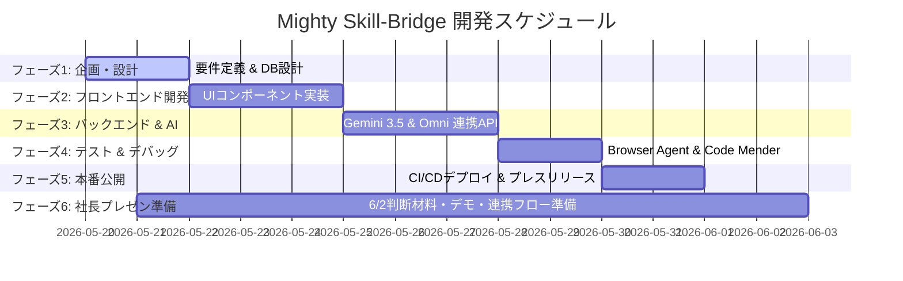

# 📊 Mighty-Link AI Connect: プロジェクトWBS (作業分解構成図)

> [!NOTE]
> **本WBSの設計思想**
> 開発するプロダクト **『Mighty Skill-Bridge（エンジニア＆案件 AIフィットシミュレーター）』** を、Antigravity 2.0 および Gemini 3.5 Flash/Omni を用いて爆速開発するための完全詳細タスクリストです。
> 最新の **Google Workspace AI (Docs/Sheets Live) ＆ Gemini Spark 連携** の思想に基づき、スプレッドシートにコピペするだけで即座に動的なプロジェクト管理ボードとして機能するフォーマットで設計されています。

---

## 📅 WBS フェーズ別サマリー

---

## 📑 WBS 詳細テーブル

*※この表は、`data/WBS.tsv` ファイルからスプレッドシートにコピペするだけで、全く同じレイアウトでスプレッドシート上に再現されます。*

| タスクID | 大フェーズ | 小フェーズ | タスク名 | 担当 | 実行エンジン | Sheets Live 連携アクション |
| :--- | :--- | :--- | :--- | :--- | :--- | :--- |
| **T101** | 1. 企画・設計 | 要件定義 | `requirements.md` の策定 | 人間 + AI | Gemini 3.5 Flash | 完了時に Docs Live へ自動文書書き出し |
| **T102** | 1. 企画・設計 | DB設計 | `database.md` とスキーマ設計 | AIエージェント | Gemini 3.5 Flash | テーブル定義をスプレッドシートへ自動同期 |
| **T201** | 2. フロント開発 | UI/UX実装 | PDF/画像ドラッグ＆ドロップ画面 | AIエージェント | Antigravity 2.0 | 実装進捗を Sheets Live にリアルタイム反映 |
| **T202** | 2. フロント開発 | UI/UX実装 | フィット分析結果（レーダーチャート等） | AIエージェント | Antigravity 2.0 | UIコンポーネントのテスト結果をセルへ記録 |
| **T301** | 3. バックエンド | API開発 | ファイルアップロード＆パースAPI | AIエージェント | Gemini 3.5 Flash | API仕様書を Docs Live に自動同期 |
| **T302** | 3. バックエンド | AIコア連携 | Gemini Omni マルチモーダル解析API | AIエージェント | Gemini Omni | プロンプト応答ログを Sheets Live に蓄積 |
| **T303** | 3. バックエンド | 提案生成 | 面談想定質問＆育成ロードマップ生成 | AIエージェント | Gemini 3.5 Flash | 生成結果のフォーマットを Sheets 側で管理 |
| **T304** | 3. バックエンド | AI基盤肉付け | 構造化プロファイル抽出・4軸スコアリングfallback実装 | Codex | VSCode + Codex | AI復帰時に渡す structured_profile / gap_analysis を Sheets ログへ拡張可能にする |
| **T305** | 3. バックエンド | AI監査基盤 | AI判定監査ログ(JSONL)・recent audit API実装 | Codex | VSCode + Codex | AI評価根拠・matched/missing skills をローカル監査ログへ蓄積し復帰後の改善に利用 |
| **T306** | 3. バックエンド | 公開デモ保護 | GitHub Pages root index ガード・CI検証 | Codex | VSCode + Codex | 社長共有済み公開URLのREADME fallbackを防止し、push前後のUIマーカー検証を必須化 |
| **T307** | 3. バックエンド | WBS可視化強化 | CATS型WBSスプレッドシートUI・集計/タイムラインタブ実装 | Codex | VSCode + Codex | 参照WBSに近い階層・進捗・予定/実績・集計ビューをSheetsへ自動生成 |
| **T401** | 4. 検証・品質 | テスト実行 | Browser Agent による自律UI/UXテスト | AIエージェント | Browser Agent | テスト合格率・バグ率を Sheets Live にプロット |
| **T402** | 4. 検証・品質 | セキュリティ | Code Mender による脆弱性自動修正 | AIエージェント | Code Mender | 脆弱性修復ログを Sheets セキュリティタブに同期 |
| **T501** | 5. デプロイ | インフラ | CI/CD（GitHub Actions）設定 | AIエージェント | Gemini 3.5 Flash | デプロイ成否・本番URLを Sheets に自動書き込み |
| **T502** | 5. デプロイ | リリース | プレスリリース・SNS告知文の自動生成 | 人間 + AI | Gemini 3.5 Flash | 告知文候補（3パターン）を Docs Live に書き出し |
| **T601** | 6. 社長プレゼン準備 | 方針整理 | 6/2打ち合わせの目的・決定事項・判断軸整理 | Codex | VSCode + Codex | プレゼン準備ブリーフをDocs/Sheetsへ同期できる形で整備 |
| **T602** | 6. 社長プレゼン準備 | デモ構成 | 公開URLデモの見せ方・説明順・想定操作シナリオ設計 | Codex | VSCode + Codex | デモシナリオと確認観点をWBS Summaryへ反映 |
| **T603** | 6. 社長プレゼン準備 | 安定稼働確認 | 公開URL・ローカルAPI・Google Sheets同期の本番前ヘルスチェック | Codex | VSCode + Codex | Public Demo Guardと同期結果を作業ログへ記録 |
| **T604** | 6. 社長プレゼン準備 | 資料骨子 | 社長向けプレゼン構成・スライド見出し・説明順の作成 | Codex | VSCode + Codex | 決定前提ではなく判断材料としてプレゼン骨子を管理 |
| **T605** | 6. 社長プレゼン準備 | 選択肢整理 | サービス内容決定前の論点・選択肢・確認質問リスト化 | 人間 + Codex | VSCode + Codex | 6/2で決める事項と未決事項を分離してSheetsへ可視化 |
| **T606** | 6. 社長プレゼン準備 | 運用・体制論点 | 6/2以降の開発体制・運用・リスク・費用感の論点整理 | 人間 + Codex | VSCode + Codex | 社長確認が必要な運用論点をブリーフへ反映 |
| **T607** | 6. 社長プレゼン準備 | 想定QA | 社長からの想定質問・回答方針・保留時の対応整理 | Codex | VSCode + Codex | 想定QAを作業手順書へ追記し、当日回答品質を高める |
| **T608** | 6. 社長プレゼン準備 | 最終リハーサル | 公開デモ・WBS・説明資料の最終確認とバックアップ準備 | 人間 + Codex | VSCode + Codex | 最終チェック結果とバックアップURL/手順を記録 |
| **T609** | 6. 社長プレゼン準備 | 決定事項反映準備 | 6/2打ち合わせ後の決定事項・次期WBS反映テンプレート作成 | Codex | VSCode + Codex | 議事録後すぐWBS/Calendarへ反映できる更新枠を準備 |
| **T610** | 6. 社長プレゼン準備 | スライド化素材 | 1枚絵サマリー・デモ導線・判断ポイントのスライド素材整理 | Codex | VSCode + Codex | プレゼン当日の説明順をDocs化し、未確定内容は選択肢として明記 |
| **T611** | 6. 社長プレゼン準備 | 判断マトリクス | サービス方向性・対象ユーザー・優先機能の判断マトリクス作成 | Codex | VSCode + Codex | 6/2で決める選択肢を比較表として整理 |
| **T612** | 6. 社長プレゼン準備 | 議事録テンプレート | 決定事項・保留事項・次アクション記録テンプレート作成 | Codex | VSCode + Codex | 打ち合わせ直後にWBS/Calendar/Gitへ反映できる議事録枠を準備 |
| **T613** | 6. 社長プレゼン準備 | デモバックアップ | 公開URL障害時のローカル実行・スクリーンショット代替手順整理 | Codex | VSCode + Codex | Public Demo Guard結果と代替導線を本番前チェックリストへ反映 |
| **T614** | 6. 社長プレゼン準備 | 事前送付メモ | 社長へ事前共有する確認ポイント・当日アジェンダ短文作成 | 人間 + Codex | VSCode + Codex | 事前共有文案を確定前ドラフトとして残す |
| **T615** | 6. 社長プレゼン準備 | 決定後ロードマップ枠 | 6/2決定内容別の次期WBS更新パターン準備 | Codex | VSCode + Codex | サービス案確定後に即時差し替えできるロードマップ枠を準備 |
| **T616** | 6. 社長プレゼン準備 | 開発フロー設計 | NotebookLM・Slack・Notion・Obsidian連携の役割分担整理 | Codex | VSCode + Codex | 連携方針を作業手順書へ反映し、6/2の判断材料としてSheetsへ可視化 |
| **T617** | 6. 社長プレゼン準備 | NotebookLM連携 | 社長説明用のNotebookLM投入資料パックと利用シーン整理 | Codex | VSCode + Codex | Google Docs/Drive資料を読み解く候補フローとして判断パックへ反映 |
| **T618** | 6. 社長プレゼン準備 | Slack連携 | 進捗通知・レビュー依頼・決定ログ共有のSlack運用設計 | Codex | VSCode + Codex | 通知先・投稿タイミング・社長確認が必要なメッセージ種別を整理 |
| **T619** | 6. 社長プレゼン準備 | Notion連携 | 仕様・議事録・意思決定DB・バックログ管理のNotion運用設計 | Codex | VSCode + Codex | 決定事項とタスクをNotion DB化する候補として比較表へ反映 |
| **T620** | 6. 社長プレゼン準備 | Obsidian連携 | ローカルナレッジ・ADR・プロンプト資産のObsidian運用設計 | Codex | VSCode + Codex | 個人/開発メモと公式ドキュメントの境界を整理 |
| **T621** | 6. 社長プレゼン準備 | 連携デモ導線 | 4ツール連携を社長へ見せる説明順・画面遷移・価値訴求整理 | Codex | VSCode + Codex | 連携フローを確定機能ではなく判断材料としてプレゼン構成へ追加 |
| **T622** | 6. 社長プレゼン準備 | 権限・情報管理 | NotebookLM/Slack/Notion/Obsidian利用時の権限・機密情報ルール整理 | 人間 + Codex | VSCode + Codex | 外部共有可否・個人情報・認証情報の扱いを社長確認項目へ追加 |
| **T623** | 6. 社長プレゼン準備 | 連携採用判断 | 6/2で決める連携ツール優先順位・導入範囲・責任分担の確認リスト作成 | 人間 + Codex | VSCode + Codex | 採用/保留/後回しを決めるチェックリストを判断材料パックへ反映 |
| **T624** | 6. 社長プレゼン準備 | 連携成果物生成 | NotebookLM/Slack/Notion/Obsidianデモ成果物生成スクリプト実装 | Codex | VSCode + Codex | exports/knowledge_flow配下へ社長説明用ファイルを自動生成 |
| **T625** | 6. 社長プレゼン準備 | NotebookLM実体化 | NotebookLM投入用Source Pack生成と想定質問セット作成 | Codex | VSCode + Codex | notebooklm_source_pack.mdを生成し、社長説明前のQA作成に使える状態にする |
| **T626** | 6. 社長プレゼン準備 | Slack実体化 | 社長レビュー向けSlack進捗投稿案の生成 | Codex | VSCode + Codex | slack_ceo_update.mdとして投稿前確認できる文面を生成 |
| **T627** | 6. 社長プレゼン準備 | Notion実体化 | Notion用意思決定DB・バックログCSVの生成 | Codex | VSCode + Codex | notion_decision_log.csvとnotion_backlog_import.csvを生成 |
| **T628** | 6. 社長プレゼン準備 | Obsidian実体化 | Obsidian vault雛形・ADR・議事録・プロンプトノート生成 | Codex | VSCode + Codex | obsidian_vault配下にローカル知識ベースを作成 |
| **T629** | 6. 社長プレゼン準備 | 連携UIデモ | 公開デモ/ローカルUIへ開発ナレッジ連携デモセクション追加 | Codex | VSCode + Codex | 社長に画面上で4ツール連携の成果物リンクを見せられる状態にする |
| **T630** | 6. 社長プレゼン準備 | 連携APIデモ | FastAPIにKnowledge Flow生成・状態確認APIを追加 | Codex | VSCode + Codex | /api/knowledge-flow/generateで成果物を再生成できるようにする |
| **T631** | 6. 社長プレゼン準備 | 連携成果物検証 | 生成成果物・公開URL・API・Sheets/Calendar同期の総合確認 | Codex | VSCode + Codex | 社長提示前にデモ導線と生成ファイルの存在を確認する |
| **T632** | 6. 社長プレゼン準備 | GitHub Issues連携 | GitHub Issuesに6/2社長デモ向け連携タスクを起票 | Codex | gh CLI | Issue #1-#6を作成し、NotebookLM/Slack/Notion/Obsidian/GitHub Project/WBS連携を追跡可能にする |
| **T633** | 6. 社長プレゼン準備 | GitHub Project連携 | GitHub Project board取得・配置のCLI権限確認 | Codex | gh CLI | `read:project` スコープ不足を確認し、Project復旧タスクをIssue #5として管理する |
| **T634** | 6. 社長プレゼン準備 | NotebookLM実連携 | NotebookLM投入用Source PackをGoogle Drive/Docsへアップロード | Codex | Google Drive MCP | TXTをGoogle Docs化し、NotebookLM source候補としてURLを証跡化する |
| **T635** | 6. 社長プレゼン準備 | Notion実連携 | Notion MCPで社長デモ用の連携証跡ページを作成 | Codex | Notion MCP | Google Doc URL、GitHub Issues、Slack/Projectの到達点、6/2決定事項をNotionページへ記録する |
| **T636** | 6. 社長プレゼン準備 | Slack連携確認 | Slack CLI/MCPの利用可否と投稿先確認フローを整理 | Codex | Slack MCP/CLI確認 | Slack CLI未検出・送信ツール未露出のため、投稿案とIssue #2で投稿先確認を管理する |
| **T637** | 6. 社長プレゼン準備 | Obsidian実連携 | Obsidian vaultとして開ける設定ファイルを追加 | Codex | VSCode + Codex | `.obsidian` 設定を生成対象へ追加し、ローカルvaultの入口を明確化する |
| **T638** | 6. 社長プレゼン準備 | 連携証跡台帳 | CLI/MCP連携の実行結果を社長説明用ドキュメントへ集約 | Codex | VSCode + Codex | Drive Doc、Notionページ、GitHub Issues、Project権限課題、Slack到達点を作業手順書へ反映する |
| **T639** | 6. 社長プレゼン準備 | Issue-WBS運用 | GitHub IssuesとWBSの相互参照ルールを整備 | Codex | VSCode + Codex | Issue #6を起点に、WBSは日程、Issuesは実装タスクとして役割分担を明文化する |
| **T640** | 6. 社長プレゼン準備 | 連携デモリハーサル | NotebookLM/Slack/Notion/Obsidian/GitHubのデモ順を通しで確認 | 人間 + Codex | VSCode + Codex | 6/2に見せる順番、開くURL、確認してもらう判断事項をリハーサルする |
| **T641** | 6. 社長プレゼン準備 | Project正式ボード化 | GitHub Project権限復旧後にCEO Demo IssuesをProjectへ配置 | 人間 + Codex | gh CLI + GitHub Project | `gh auth refresh -s read:project` 後、Project boardを作成/取得してIssue #1-#6を配置する |

---

## 🤖 Sheets Live & Gemini Spark による自律同期シナリオ

Google Workspace AI & Gemini Spark のパワーを活かし、このWBSは以下のように自律的に同期・稼働します。

1. **リアルタイム進捗更新 (Sheets Live)**
   - Antigravity 2.0 のサブエージェントが各タスクを完了（例：`T201: PDFアップロード画面の実装` がパス）すると、バックグラウンドの Gemini Spark が API を介してスプレッドシートの該当タスクの進捗ステータスを自動的に `[Done]` に書き換え、セルを美しいグリーンに塗り替えます。
2. **要件定義書のライブ同期 (Docs Live)**
   - 最初の要件定義（T101）で合意された `requirements.md` の内容は、Google Docs Live に自動で連携され、社長様とリアルタイムで共同編集・コメントのやり取りが可能な状態になります。
3. **24時間自律セキュリティレポート**
   - Code Mender（T402）が脆弱性を検出して自動でコードを修正すると、その安全レポートがスプレッドシート上の「セキュリティ・監査ログ」シートへ自律的に追加され、社長様に毎朝メールでダイジェストが届きます。
