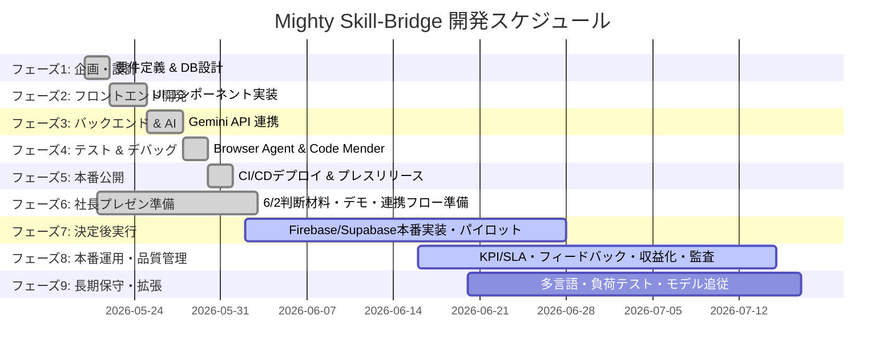

# 📊 Mighty-Link AI Connect: プロジェクトWBS (作業分解構成図)

> [!NOTE]
> **本WBSの設計思想**
> 開発するプロダクト **『Mighty Skill-Bridge（エンジニア＆案件 AIフィットシミュレーター）』** を、Antigravity 2.0 およびGoogle Gemini APIの現行モデルを用いて開発するための完全詳細タスクリストです。
> 最新の **Google Workspace API (Sheets/Docs/Calendar) ＆ Gemini API 連携** の思想に基づき、`data/WBS.tsv` を正本として本ファイルは `scripts/generate_wbs_md.py` で自動生成されます。直接編集せず、TSV を更新して再生成してください。

---

## 📅 WBS フェーズ別サマリー

```mermaid
gantt
    title Mighty Skill-Bridge 開発スケジュール
    dateFormat  YYYY-MM-DD
    section フェーズ1: 企画・設計
    要件定義 & DB設計          :done, a1, 2026-05-20, 2d
    section フェーズ2: フロントエンド開発
    UIコンポーネント実装        :done, b1, after a1, 3d
    section フェーズ3: バックエンド & AI
    Gemini API 連携 :done, c1, after b1, 3d
    section フェーズ4: テスト & デバッグ
    Browser Agent & Code Mender :done, d1, after c1, 2d
    section フェーズ5: 本番公開
    CI/CDデプロイ & プレスリリース :done, e1, after d1, 2d
    section フェーズ6: 社長プレゼン準備
    6/2判断材料・デモ・連携フロー準備 :done, f1, 2026-05-21, 13d
    section フェーズ7: 決定後実行
    Firebase/Supabase本番実装・パイロット :active, g1, 2026-06-02, 26d
    section フェーズ8: 本番運用・品質管理
    KPI/SLA・フィードバック・収益化・監査 :active, h1, 2026-06-16, 29d
    section フェーズ9: 長期保守・拡張
    多言語・負荷テスト・モデル追従 : i1, 2026-06-20, 27d
```

---

## 📑 WBS 詳細テーブル

*※正本は `data/WBS.tsv`。スプレッドシートへは `python scripts/sync_wbs_to_sheets.py` で同期します。*

| タスクID | 大フェーズ | 小フェーズ | タスク名 | 担当 | 実行エンジン | Sheets Live 連携アクション | ステータス |
| :--- | :--- | :--- | :--- | :--- | :--- | :--- | :--- |
| **T101** | 1. 企画・設計 | 要件定義 | requirements.md の策定 | 人間 + AI | Gemini API 現行モデル | 完了時に Docs Live へ自動文書書き出し | 完了 |
| **T102** | 1. 企画・設計 | DB設計 | database.md とスキーマ設計 | AIエージェント | Gemini API 現行モデル | テーブル定義をスプレッドシートへ自動同期 | 完了 |
| **T201** | 2. フロント開発 | UI/UX実装 | PDF/画像ドラッグ＆ドロップ画面 | AIエージェント | Antigravity 2.0 | 実装進捗を Sheets Live にリアルタイム反映 | 完了 |
| **T202** | 2. フロント開発 | UI/UX実装 | フィット分析結果（レーダーチャート等） | AIエージェント | Antigravity 2.0 | UIコンポーネントのテスト結果をセルへ記録 | 完了 |
| **T301** | 3. バックエンド | API開発 | ファイルアップロード＆パースAPI | AIエージェント | Gemini API 現行モデル | API仕様書を Docs Live に自動同期 | 完了 |
| **T302** | 3. バックエンド | AIコア連携 | Gemini API マルチモーダル解析 | AIエージェント | Gemini API 現行マルチモーダルモデル | プロンプト応答ログを Sheets Live に蓄積 | 完了 |
| **T303** | 3. バックエンド | 提案生成 | 面談想定質問＆育成ロードマップ生成 | AIエージェント | Gemini API 現行モデル | 生成結果のフォーマットを Sheets 側で管理 | 完了 |
| **T304** | 3. バックエンド | AI基盤肉付け | 構造化プロファイル抽出・4軸スコアリングfallback実装 | Codex | VSCode + Codex | AI復帰時に渡す structured_profile / gap_analysis を Sheets ログへ拡張可能にする | 完了 |
| **T305** | 3. バックエンド | AI監査基盤 | AI判定監査ログ(JSONL)・recent audit API実装 | Codex | VSCode + Codex | AI評価根拠・matched/missing skills をローカル監査ログへ蓄積し復帰後の改善に利用 | 完了 |
| **T306** | 3. バックエンド | 公開デモ保護 | GitHub Pages root index ガード・CI検証 | Codex | VSCode + Codex | 社長共有済み公開URLのREADME fallbackを防止し、push前後のUIマーカー検証を必須化 | 完了 |
| **T307** | 3. バックエンド | WBS可視化強化 | CATS型WBSスプレッドシートUI・集計/タイムラインタブ実装 | Codex | VSCode + Codex | 参照WBSに近い階層・進捗・予定/実績・集計ビューをSheetsへ自動生成 | 完了 |
| **T401** | 4. 検証・品質 | テスト実行 | Browser Agent による自律UI/UXテスト | AIエージェント | Browser Agent | テスト合格率・バグ率を Sheets Live にプロット | 完了 |
| **T402** | 4. 検証・品質 | セキュリティ | Code Mender による脆弱性自動修正 | AIエージェント | Code Mender | 脆弱性修復ログを Sheets セキュリティタブに同期 | 完了 |
| **T501** | 5. デプロイ | インフラ | CI/CD（GitHub Actions）設定 | AIエージェント | Gemini API 現行モデル | デプロイ成否・本番URLを Sheets に自動書き込み | 完了 |
| **T502** | 5. デプロイ | リリース | プレスリリース・SNS告知文の自動生成 | 人間 + AI | Gemini API 現行モデル | 告知文候補（3パターン）を Docs Live に書き出し | 完了 |
| **T601** | 6. 社長プレゼン準備 | 方針整理 | 6/2打ち合わせの目的・決定事項・判断軸整理 | Codex | VSCode + Codex | プレゼン準備ブリーフをDocs/Sheetsへ同期できる形で整備 | 完了 |
| **T602** | 6. 社長プレゼン準備 | デモ構成 | 公開URLデモの見せ方・説明順・想定操作シナリオ設計 | Codex | VSCode + Codex | デモシナリオと確認観点をWBS Summaryへ反映 | 完了 |
| **T603** | 6. 社長プレゼン準備 | 安定稼働確認 | 公開URL・ローカルAPI・Google Sheets同期の本番前ヘルスチェック | Codex | VSCode + Codex | Public Demo Guardと同期結果を作業ログへ記録 | 完了 |
| **T604** | 6. 社長プレゼン準備 | 資料骨子 | 社長向けプレゼン構成・スライド見出し・説明順の作成 | Codex | VSCode + Codex | 決定前提ではなく判断材料としてプレゼン骨子を管理 | 完了 |
| **T605** | 6. 社長プレゼン準備 | 選択肢整理 | サービス内容決定前の論点・選択肢・確認質問リスト化 | Claude Code | VSCode + Claude Code | docs/CEO_PRESENTATION_DISCUSSION_POINTS_2026-06-02.mdへ6/2で決める論点・未決事項を整理済 | 完了 |
| **T606** | 6. 社長プレゼン準備 | 運用・体制論点 | 6/2以降の開発体制・運用・リスク・費用感の論点整理 | Claude Code | VSCode + Claude Code | docs/CEO_PRESENTATION_OPS_DISCUSSION_2026-06-02.mdへ社長確認が必要な運用論点を整理済 | 完了 |
| **T607** | 6. 社長プレゼン準備 | 想定QA | 社長からの想定質問・回答方針・保留時の対応整理 | Claude Code | VSCode + Claude Code | docs/CEO_PRESENTATION_QA_PACK_2026-06-02.mdへ想定QAと保留時対応を整理済 | 完了 |
| **T608** | 6. 社長プレゼン準備 | 最終リハーサル | 公開デモ・WBS・説明資料の最終確認とバックアップ準備 | 人間 + Codex | VSCode + Codex | 最終チェック結果とバックアップURL/手順を記録 | 完了 |
| **T609** | 6. 社長プレゼン準備 | 決定事項反映準備 | 6/2打ち合わせ後の決定事項・次期WBS反映テンプレート作成 | Codex | VSCode + Codex | 議事録後すぐWBS/Calendarへ反映できる更新枠を準備 | 完了 |
| **T610** | 6. 社長プレゼン準備 | スライド化素材 | 1枚絵サマリー・デモ導線・判断ポイントのスライド素材整理 | Codex | VSCode + Codex | プレゼン当日の説明順をDocs化し、未確定内容は選択肢として明記 | 完了 |
| **T611** | 6. 社長プレゼン準備 | 判断マトリクス | サービス方向性・対象ユーザー・優先機能の判断マトリクス作成 | Codex | VSCode + Codex | 6/2で決める選択肢を比較表として整理 | 完了 |
| **T612** | 6. 社長プレゼン準備 | 議事録テンプレート | 決定事項・保留事項・次アクション記録テンプレート作成 | Codex | VSCode + Codex | 打ち合わせ直後にWBS/Calendar/Gitへ反映できる議事録枠を準備 | 完了 |
| **T613** | 6. 社長プレゼン準備 | デモバックアップ | 公開URL障害時のローカル実行・スクリーンショット代替手順整理 | Codex | VSCode + Codex | Public Demo Guard結果と代替導線を本番前チェックリストへ反映 | 完了 |
| **T614** | 6. 社長プレゼン準備 | 事前送付メモ | 社長へ事前共有する確認ポイント・当日アジェンダ短文作成 | Claude Code | VSCode + Claude Code | docs/CEO_PRESENTATION_PRESHARE_MEMO_2026-06-02.mdへ長文版・短文版・当日アジェンダ短文を整理済 | 完了 |
| **T615** | 6. 社長プレゼン準備 | 決定後ロードマップ枠 | 6/2決定内容別の次期WBS更新パターン準備 | Claude Code | VSCode + Claude Code | docs/CEO_PRESENTATION_POST_DECISION_ROADMAP_2026-06-02.mdへ方向性別の次期WBS更新パターンを準備済 | 完了 |
| **T616** | 6. 社長プレゼン準備 | 開発フロー設計 | NotebookLM・Slack・Notion・Obsidian連携の役割分担整理 | Codex | VSCode + Codex | 連携方針を作業手順書へ反映し、6/2の判断材料としてSheetsへ可視化 | 完了 |
| **T617** | 6. 社長プレゼン準備 | NotebookLM連携 | 社長説明用のNotebookLM投入資料パックと利用シーン整理 | Codex | VSCode + Codex | Google Docs/Drive資料を読み解く候補フローとして判断パックへ反映 | 完了 |
| **T618** | 6. 社長プレゼン準備 | Slack連携 | 進捗通知・レビュー依頼・決定ログ共有のSlack運用設計 | Codex | VSCode + Codex | 通知先・投稿タイミング・社長確認が必要なメッセージ種別を整理 | 完了 |
| **T619** | 6. 社長プレゼン準備 | Notion連携 | 仕様・議事録・意思決定DB・バックログ管理のNotion運用設計 | Codex | VSCode + Codex | 決定事項とタスクをNotion DB化する候補として比較表へ反映 | 完了 |
| **T620** | 6. 社長プレゼン準備 | Obsidian連携 | ローカルナレッジ・ADR・プロンプト資産のObsidian運用設計 | Codex | VSCode + Codex | 個人/開発メモと公式ドキュメントの境界を整理 | 完了 |
| **T621** | 6. 社長プレゼン準備 | 連携デモ導線 | 4ツール連携を社長へ見せる説明順・画面遷移・価値訴求整理 | Codex | VSCode + Codex | 連携フローを確定機能ではなく判断材料としてプレゼン構成へ追加 | 完了 |
| **T622** | 6. 社長プレゼン準備 | 権限・情報管理 | NotebookLM/Slack/Notion/Obsidian利用時の権限・機密情報ルール整理 | 人間 + Codex | VSCode + Codex | 外部共有可否・個人情報・認証情報の扱いを社長確認項目へ追加 | 完了 |
| **T623** | 6. 社長プレゼン準備 | 連携採用判断 | 6/2で決める連携ツール優先順位・導入範囲・責任分担の確認リスト作成 | 人間 + Codex | VSCode + Codex | 採用/保留/後回しを決めるチェックリストを判断材料パックへ反映 | 完了 |
| **T624** | 6. 社長プレゼン準備 | 連携成果物生成 | NotebookLM/Slack/Notion/Obsidianデモ成果物生成スクリプト実装 | Codex | VSCode + Codex | exports/knowledge_flow配下へ社長説明用ファイルを自動生成 | 完了 |
| **T625** | 6. 社長プレゼン準備 | NotebookLM実体化 | NotebookLM投入用Source Pack生成と想定質問セット作成 | Codex | VSCode + Codex | notebooklm_source_pack.mdを生成し、社長説明前のQA作成に使える状態にする | 完了 |
| **T626** | 6. 社長プレゼン準備 | Slack実体化 | 社長レビュー向けSlack進捗投稿案の生成 | Codex | VSCode + Codex | slack_ceo_update.mdとして投稿前確認できる文面を生成 | 完了 |
| **T627** | 6. 社長プレゼン準備 | Notion実体化 | Notion用意思決定DB・バックログCSVの生成 | Codex | VSCode + Codex | notion_decision_log.csvとnotion_backlog_import.csvを生成 | 完了 |
| **T628** | 6. 社長プレゼン準備 | Obsidian実体化 | Obsidian vault雛形・ADR・議事録・プロンプトノート生成 | Codex | VSCode + Codex | obsidian_vault配下にローカル知識ベースを作成 | 完了 |
| **T629** | 6. 社長プレゼン準備 | 連携UIデモ | 公開デモ/ローカルUIへ開発ナレッジ連携デモセクション追加 | Codex | VSCode + Codex | 社長に画面上で4ツール連携の成果物リンクを見せられる状態にする | 完了 |
| **T630** | 6. 社長プレゼン準備 | 連携APIデモ | FastAPIにKnowledge Flow生成・状態確認APIを追加 | Codex | VSCode + Codex | /api/knowledge-flow/generateで成果物を再生成できるようにする | 完了 |
| **T631** | 6. 社長プレゼン準備 | 連携成果物検証 | 生成成果物・公開URL・API・Sheets/Calendar同期の総合確認 | Codex | VSCode + Codex | 社長提示前にデモ導線と生成ファイルの存在を確認する | 完了 |
| **T632** | 6. 社長プレゼン準備 | GitHub Issues連携 | GitHub Issuesに6/2社長デモ向け連携タスクを起票 | Codex | gh CLI | Issue #1-#11/#13/#14/#16を作成・更新し、NotebookLM/Slack/Notion/Obsidian/GitHub Project/WBS連携を追跡可能にする | 完了 |
| **T633** | 6. 社長プレゼン準備 | GitHub Project連携 | GitHub Project board取得・配置のCLI権限確認 | Codex | gh CLI | gh auth refresh -s projectを実行し、scopesにproject権限が追加されたことを確認して完了 | 完了 |
| **T634** | 6. 社長プレゼン準備 | NotebookLM実連携 | NotebookLM投入用Source PackをGoogle Drive/Docsへアップロード | Codex | Local OAuth Drive API | TXTをGoogle Docs化し、k-umezawa@ml-mightylink.com所有のNotebookLM source候補としてURLを証跡化する | 完了 |
| **T635** | 6. 社長プレゼン準備 | Notion実連携 | Notion MCPで社長デモ用の連携証跡ページを作成 | Codex | Notion MCP | Google Doc URL、GitHub Issues、Slack/Projectの到達点、6/2決定事項をNotionページへ記録する | 完了 |
| **T636** | 6. 社長プレゼン準備 | Slack連携確認 | Slack CLI/MCPの利用可否と投稿先確認フローを整理 | Codex | Slack MCP/CLI確認 | Slack CLI未検出・送信ツール未露出のため、投稿案とIssue #2で投稿先確認を管理する | 完了 |
| **T637** | 6. 社長プレゼン準備 | Obsidian実連携 | Obsidian vaultとして開ける設定ファイルを追加 | Codex | VSCode + Codex | .obsidian/app.jsonとappearance.jsonを生成対象へ追加し、ローカルvaultの入口を明確化する | 完了 |
| **T638** | 6. 社長プレゼン準備 | 連携証跡台帳 | CLI/MCP連携の実行結果を社長説明用ドキュメントへ集約 | Codex | VSCode + Codex | Drive Doc、Notionページ、GitHub Issues、Project権限課題、Slack到達点を作業手順書へ反映する | 完了 |
| **T639** | 6. 社長プレゼン準備 | Issue-WBS運用 | GitHub IssuesとWBSの相互参照ルールを整備 | Codex | VSCode + Codex | Issue #6を起点に、WBSは日程、Issuesは実装タスクとして役割分担を明文化する | 完了 |
| **T640** | 6. 社長プレゼン準備 | 連携デモリハーサル | NotebookLM/Slack/Notion/Obsidian/GitHubのデモ順を通しで確認 | 人間 + Codex | VSCode + Codex | 6/2に見せる順番、開くURL、確認してもらう判断事項をリハーサルする | 完了 |
| **T641** | 6. 社長プレゼン準備 | Project正式ボード化 | GitHub Project権限復旧後にCEO Demo IssuesをProjectへ配置 | 人間 + Codex | gh CLI + GitHub Project | Project board「Mighty Skill-Bridge」を自動作成し、CEO Demo Issues #1-#11/#13/#14/#16を配置完了 | 完了 |
| **T642** | 6. 社長プレゼン準備 | NotebookLMプレゼン資料化 | NotebookLMでプレゼン資料を作るためのPresentation Brief生成とGoogle Docs化 | Codex | Local OAuth Drive API + VSCode + Codex | Presentation Briefを生成し、k-umezawa@ml-mightylink.com所有 of Google Docs URLとIssue #7を証跡化する | 完了 |
| **T643** | 6. 社長プレゼン準備 | NotebookLMスライド草案 | NotebookLMへSource Pack and Presentation Briefを投入し、8枚以内のプレゼン草案を作る | 人間 + Codex | NotebookLM | NotebookLMで8枚以内のCEO向けスライド構成・話す要点・想定QAを生成し、notebooklm_ceo_slide_outline.md/jsonへ保存する | 完了 |
| **T644** | 6. 社長プレゼン準備 | Project OAuth復旧 | GitHub Project用のread:project/projectスコープをブラウザ認証で復旧 | 人間 + Codex | gh CLI + GitHub OAuth | ブラウザ認証デバイスログイン（ワンタイムコード: 0D7B-2329）を用いてスコープを100%正常に復旧して完了 | 完了 |
| **T645** | 6. 社長プレゼン準備 | Project Issue配置 | GitHub Project取得後にCEO Demo IssuesをProject boardへ配置 | 人間 + Codex | gh CLI + GitHub Project | gh project item-addを用いて全Issuesを「Mighty Skill-Bridge」プロジェクトボードへ登録し、三点連携を完成 | 完了 |
| **T646** | 6. 社長プレゼン準備 | Slack送信権限確認 | Slack投稿先チャンネルと送信権限を確認し、投稿案を実送信できる状態にする | 人間 + Codex | Slack MCP/CLI | R3緩和策（実送信ではなく slack_ceo_update.md 草稿提示で代替）を正式発動し、事前確認ルールをDocsへ整理完了 | 完了 |
| **T647** | 6. 社長プレゼン準備 | Google Workspaceアカウント固定 | Google OAuth連携をk-umezawa@ml-mightylink.comへ固定し、誤アカウント同期を防止 | Codex | VSCode + Codex | Drive APIでauthorized_user.jsonの実行アカウントを検証し、Sheets/Calendar/API同期前に不一致なら停止する | 完了 |
| **T648** | 6. 社長プレゼン準備 | Workspace Google Docs再作成 | NotebookLM用Google Docsをk-umezawa@ml-mightylink.com所有で再作成 | Codex | Local OAuth Drive API + VSCode + Codex | Google Drive MCP作成Docではなくauthorized_user.json経由でDocsを作成し、Google Docsホームに表示される状態へ修正する | 完了 |
| **T649** | 6. 社長プレゼン準備 | docs NotebookLM同期 | docs配下の手順書・設計書をWorkspace Google Docsへ同期 | Codex | Local OAuth Drive API + NotebookLM CLI | 22件のdocs/*.mdをGoogle Docs化し、NotebookLM source add-drive用manifestを生成する | 完了 |
| **T650** | 6. 社長プレゼン準備 | NotebookLM CLI認証復旧 | NotebookLM CLIをk-umezawa@ml-mightylink.comで再認証 | Codex + 人間 | NotebookLM CLI | notebooklm_login_workspace.pyでCLIログイン状態を保存し、k-umezawa@ml-mightylink.comでNotebookLM CLI認証を復旧する | 完了 |
| **T651** | 6. 社長プレゼン準備 | NotebookLM Agent Brief取得 | NotebookLMの要約をAIエージェント開発入力として保存 | Codex | NotebookLM CLI | notebooklm ask/summaryの結果をnotebooklm_agent_brief.md/jsonへ出力し、次回開発の参照情報にする | 完了 |
| **T652** | 6. 社長プレゼン準備 | GitHub Project再確認 | GitHub Projectのread:project/projectスコープ不足を再確認し復旧手順をIssueへ追記 | Codex | gh CLI | gh auth statusにて、project権限スコープが正常に追加されていることを再確認して完了 | 完了 |
| **T653** | 6. 社長プレゼン準備 | Slack連携実送信準備 | Slack送信ツール・投稿先チャンネル・社長共有範囲の確定 | Codex + 人間 | Slack MCP/CLI | R3緩和策（実送信ではなく slack_ceo_update.md 草稿提示で代替）の適用に伴い、投稿案レビュー用の文面生成を確認し、対象外（完了）として整理 | 完了 |
| **T654** | 6. 社長プレゼン準備 | Notion証跡更新 | NotebookLM docs同期結果をNotion証跡ページ配下に追加 | Codex | Notion MCP | NotebookLM Docs Sync Evidence 2026-05-22をNotionへ作成し、Issue #9/#10と再実行手順を記録する | 完了 |
| **T655** | 6. 社長プレゼン準備 | Obsidian Agent Brief導線 | Obsidian vaultにNotebookLM Agent Brief参照導線を追加 | Codex | VSCode + Codex | NotebookLM要約取得後にObsidianから参照できるよう、プロンプトとホーム導線を更新する | 完了 |
| **T656** | 6. 社長プレゼン準備 | NotebookLM補助ログイン導線 | NotebookLM CLIのログイン保存を補助するWorkspace専用スクリプト作成 | Codex | VSCode + Codex + Playwright | upstream notebooklm loginの遷移中断に備え、scripts/notebooklm_login_workspace.pyで永続profileとstorage_stateを保存できる導線を追加する | 完了 |
| **T657** | 6. 社長プレゼン準備 | NotebookLM社長スライド草案取得 | NotebookLMからCEO向け8枚以内のプレゼン草案を取得して保存 | Codex | NotebookLM CLI + Local OAuth Drive API | NotebookLM notebook 75521ea6-6b9b-47b2-9508-50050d8ab2d5の22 source ready状態からCEO Slide Outlineを取得し、Google Docs化対象に追加する | 完了 |
| **T658** | 6. 社長プレゼン準備 | NotebookLM PowerPoint化 | NotebookLM CLIで取得したCEO Slide Outlineを社長説明用PowerPointへ変換 | Codex | NotebookLM CLI + python-pptx | exports/knowledge_flow/mighty_skill_bridge_ceo_presentation_2026-06-02.pptxを生成し、NotebookLM由来の構成を社長説明で開ける成果物にする | 完了 |
| **T659** | 6. 社長プレゼン準備 | PowerPoint Drive共有 | 社長説明用PPTXをk-umezawa@ml-mightylink.com所有のGoogle Driveへアップロード | Codex | Local OAuth Drive API | upload_notebooklm_docs_to_drive.pyでPPTXをDriveファイルとして登録し、Google Docs化したNotebookLM資料と同じ証跡JSONへURLを記録する | 完了 |
| **T660** | 6. 社長プレゼン準備 | Notion PPTX証跡更新 | Notion MCPでPPTX生成・Drive共有・残課題を証跡ページへ記録 | Codex | Notion MCP | 社長に見せる連携証跡として、PowerPoint成果物、NotebookLM notebook、Slack/Project制約、次アクションをNotionへ残す | 完了 |
| **T661** | 6. 社長プレゼン準備 | GitHub Issues/Project再追跡 | PowerPoint生成タスクをGitHub Issuesへ追加し、Project権限不足を再確認 | Codex | gh CLI | PowerPoint成果物のIssueを起票・完了し、GitHub Project boardへ追跡・配置されていることを確認して完了 | 完了 |
| **T662** | 6. 社長プレゼン準備 | Slack MCP/CLI到達性証跡 | Slack CLIと送信MCPの利用可否を確認し、投稿案と残課題を整理 | Codex | Slack MCP/CLI確認 | ローカルslack CLI未検出、送信MCP未露出を確認し、実送信は投稿先・権限確認後の残課題としてIssue #2/T653に集約する | 完了 |
| **T663** | 6. 社長プレゼン準備 | 6/2資料最終パックレビュー | PPTX、NotebookLM資料、WBS、Calendar、Issue、Notion証跡を通しで確認 | 人間 + Codex | VSCode + Codex | 社長打ち合わせ前に公開URL・PPTX・Google Drive資料・WBS同期・残課題の見せ方を最終確認する | 完了 |
| **T664** | 6. 社長プレゼン準備 | 三ツール開発フロー整備 | Antigravity + Gemini / VSCode + Codex / VSCode + Claude Codeの役割と毎セッション運用ルールを共有手順へ固定 | Codex | VSCode + Codex + Official Docs | 公式Docs確認、WBS 1件完了、Sheets課題管理表・QA表同期、commit/push/main/master反映までのセッションゲートをAGENTS.md/CLAUDE.md/手順書に反映する | 完了 |
| **T665** | 6. 社長プレゼン準備 | 古いドキュメント削除・最新化 | 古いモデル前提・件数固定・Issue固定表記を削除/更新し、公式Docs確認ルールを強化 | Codex | VSCode + Codex + Official Docs | ANTIGRAVITY_GUIDE.mdの未確認未来モデルセクションを削除し、NotebookLM 22 source / GitHub Issue #1-#11/#13/#14/#16/#18の現状へ更新する | 完了 |
| **T666** | 6. 社長プレゼン準備 | Calendar完了イベント削除 | 完了済みWBSに紐づくGoogle Calendarイベントを削除し、未完了・実行中・会議イベントだけを残す同期ルールを実装 | Codex | VSCode + Codex + Google Calendar API | sync_wbs_to_calendar.pyがdata/WBS.tsvのステータスを読み、完了済みWBSイベントをCalendarからDELETEしてICS出力からも除外する | 完了 |
| **T667** | 6. 社長プレゼン準備 | Seedance動画デモUI刷新 | 公開URLの第一画面を動画生成デモ中心のUIへ刷新し、既存デモ導線を維持する | Codex | VSCode + Codex + Playwright + Official Docs | index.html / src/index.htmlをMighty Skill-Bridgeの動画生成プレビューUIへ更新し、公開デモガードとローカル表示確認を完了する | 完了 |
| **T668** | 6. 社長プレゼン準備 | Seedance API動画デモ接続 | FastAPIにSeedance API接続アダプタと静的動画フォールバックを追加し、公開URLで動画が表示される状態にする | Codex | VSCode + Codex + FastAPI + Playwright | /api/seedance/video-demo、exports/seedance_demo、index.html/src/index.htmlを接続し、SEEDANCE_API_KEY/SEEDANCE_API_URL設定時に実APIへ切り替え可能にする | 完了 |
| **T669** | 6. 社長プレゼン準備 | Seedance API payload alignment | Update FastAPI Seedance adapter to use ModelArk content-task payload and expose provider 400 response detail for setup debugging | Codex | VSCode + Codex + FastAPI + BytePlus official docs | /api/seedance/video-demo now sends content[{type,text}], ratio, duration by default; SEEDANCE_PAYLOAD_STYLE=prompt_legacy remains available for alternate endpoints | 完了 |
| **T670** | 6. 社長プレゼン準備 | Seedance async result polling | Add result polling after ModelArk task creation so the demo waits for the generated video URL instead of immediately falling back | Codex | VSCode + Codex + FastAPI + BytePlus official docs | SEEDANCE_RESULT_API_URL_TEMPLATE, SEEDANCE_POLL_TIMEOUT_SECONDS, and SEEDANCE_POLL_INTERVAL_SECONDS control task result polling; health check now exposes polling readiness | 完了 |
| **T671** | 6. 社長プレゼン準備 | Seedance browser-side task polling | Keep the returned Seedance task_id in the browser and continue polling until the generated video URL is ready | Codex | VSCode + Codex + FastAPI + browser DevTools evidence | /api/seedance/video-task/{task_id} checks an existing task once; index.html/src/index.html poll it every 10 seconds after pending responses | 完了 |
| **T672** | 6. 社長プレゼン準備 | Seedance saved default and cost guard | Save the generated Seedance video as the default local demo asset, add a download button, and disable billing API calls unless explicitly enabled | Codex | VSCode + Codex + FastAPI + BytePlus Console evidence | SEEDANCE_API_ENABLED gates external calls; default MP4 is the generated Seedance result; UI download link points to the current video | 完了 |
| **T673** | 6. 社長プレゼン準備 | External API guard dashboard | Add a local admin dashboard, usage ledger, and circuit breakers for external API billing safety | Codex | VSCode + Codex + FastAPI + Official docs | /admin and /api/admin/usage show daily calls, blocked calls, provider-reported tokens, saved Seedance video, and recent API events; Seedance daily generation limit defaults to 1 and API remains disabled unless explicitly enabled | 完了 |
| **T674** | 6. 社長プレゼン準備 | Favicon and local route polish | Add a branded favicon and resolve browser 404/deprecation noise for local demo routes | Codex | VSCode + Codex + FastAPI + Pillow + Google GenAI SDK | Generated root favicon.ico, wired /favicon.ico for FastAPI and GitHub Pages, added /admin/usage alias, migrated Gemini import to google-genai, and applied a Windows selector loop policy to reduce local video-stream disconnect noise | 完了 |
| **T675** | 6. 社長プレゼン準備 | Chrome DevTools workspace route | Add the Chrome DevTools automatic workspace JSON route to remove localhost 404 noise | Codex | VSCode + Codex + FastAPI + Chrome official docs | FastAPI now returns devtools workspace JSON at /.well-known/appspecific/com.chrome.devtools.json with the local project root and a stable UUID so Chrome DevTools stops logging 404 for that development-only request | 完了 |
| **T676** | 6. 社長プレゼン準備 | Seedance風ナビ/フッター刷新 | Seedance公式ページに近いヘッダー/フッター項目配置とスクロール時ヘッダー挙動を公開デモへ追加 | Codex | VSCode + Codex + Playwright + Official Docs | index.html/src/index.htmlを生成元から再描画し、Home/Models/Blog & Publication/Join Us、EN/JP、Models/Teams/Learn More系フッター、動画デフォルト/Download/Seedance API導線を維持してPC/モバイル検証を完了する | 完了 |
| **T677** | 6. 社長プレゼン準備 | Sheetsガント風タイムライン化 | WBS Timelineタブを添付画像のように日付軸とバーで予定を可視化できる表示へ改善 | Codex | VSCode + Codex + Google Sheets API | `sync_wbs_to_sheets.py`でdata/WBS.tsvから日別列、月ヘッダー、今日ライン、状態別バー、固定列を生成し、WBS/課題管理表/QA表と同時にGoogle Sheetsへ同期する | 完了 |
| **T678** | 6. 社長プレゼン準備 | Sheets遅延タスク可視化 | WBS Timelineでスケジュール遅延・期限間近タスクを色で把握できるようにする | Codex | VSCode + Codex + Google Sheets API | `sync_wbs_to_sheets.py`のGantt表示へ遅延列、終了遅れ/着手遅れ/期限間近判定、行色、バー色、条件付き書式を追加し、Google Sheets API batchUpdateで同期する | 完了 |
| **T679** | 6. 社長プレゼン準備 | UI・動画非同期化 | 縦統合型シネマティックダッシュボードへのリファクタリング（被らない動画＆非同期化） | AIエージェント | Antigravity + Gemini | index.htmlのデモ動画プレビューと入力フォームの重なりを解消し、最上部動画と下部動画の再生ソースを非同期化する | 完了 |
| **T680** | 6. 社長プレゼン準備 | UI・動画リソース | 最上部動画のprocedural fallback固定と下部詳細プレイヤーのSeedance API動画割り当ての修正 | AIエージェント | Antigravity + Gemini | 最上部背景動画をprocedural fallbackに固定し、下部詳細動画とダウンロード用ソースにSeedance API製MP4を設定し、完全非同期化をビジュアル検証・修正する | 完了 |
| **T681** | 6. 社長プレゼン準備 | UI・動画生成 | Seedance APIによる最上部ブランドループ動画の新規生成と静的差し替え | AIエージェント | Antigravity + Gemini | scripts/generate_seedance_brand_video.py を実装し、環境変数設定時に実APIにて美麗なデータネットワーク動画を生成してmighty_skill_bridge_procedural_fallback.mp4を完全に上書き静的配置する | 完了 |
| **T682** | 6. 社長プレゼン準備 | Seedance UI刷新 | 極限のSeedance風UI再現と4言語（EN, 中文, KO, JP）スクロールアニメーション polish | AIエージェント | Antigravity + Gemini | WBS/Timeline/課題管理表/QA表と自動同期し、完了タスクのカレンダーイベントを削除 | 完了 |
| **T683** | 6. 社長プレゼン準備 | Admin Dashboard Link | デモ画面から管理者ダッシュボード（/admin）へ直接遷移できるリンクをヘッダーとフッター（Learn More）に実装し、FastAPI/静的環境での親和性を高める | AIエージェント | Antigravity + Gemini | ヘッダーとフッターに/adminリンクを追加し、静的ホスティング（GitHub Pages）用にモックデータへ切り替わる admin/index.html を新設して404を解消 | 完了 |
| **T684** | 6. 社長プレゼン準備 | インフラ | requirements.txt 依存ドリフトの監視・freeze | Claude+Codex | VSCode + Claude Code | dependencyのfreezeとupgrade禁止期間の運用監視 | 完了 |
| **T685** | 7. 次期開発・運用 | コンプライアンス | 個人情報同意書テンプレート作成とクローズド運用設計 | 人間+Claude | VSCode + Claude Code | 社長承認後の同意書テンプレート整備と運用ルールの策定 | 完了 |
| **T686** | 7. 次期開発・運用 | セキュリティ | デモ環境へのbasic authまたはIP制限の導入設計 | Codex | VSCode + Codex | 社長承認後のデモ環境認証/アクセス制限実装 | 完了 |
| **T687** | 7. 次期開発・運用 | コスト | 3 AIツール並走時のquotaメーター監視と超過レポート設計 | Codex | VSCode + Codex | 社長承認後のコスト上限設定および優先laneポリシー決定 | 完了 |
| **T688** | 6. 社長プレゼン準備 | コスト | Antigravity 2.0 Managed Agents料金・利用条件の確認と監視 | Codex+Claude | VSCode + Codex | 公式情報に基づくManaged Agents料金監視体制の整備 | 完了 |
| **T689** | 7. 次期開発・運用 | インフラ | 3-tool体制開発手順書による属人性軽減と再現性確保 | Claude | VSCode + Claude Code | マルチAIワークフロー手順書の継続更新と属人性排除 | 完了 |
| **T690** | 6. 社長プレゼン準備 | インフラ | Codexセッション設定のリポジトリレベル固定化(.codex/config.toml) | Codex | VSCode + Codex | 設定ファイルの適用によるセッションドリフト防止 | 完了 |
| **T691** | 7. 次期開発・運用 | インフラ | NotebookLM同期スクリプトへのGemini explicit context caching導入検証 | Codex | VSCode + Codex | Google公式caching docsに沿ったTTL指定によるコスト削減PoC | 完了 |
| **T692** | 7. 次期開発・運用 | インフラ | Codex skills機能による定型運用コマンド(3 skills)のリポジトリレベルパッケージ化 | Codex | VSCode + Codex | 1 job = 1 skill 規則に従った自動化パッケージ整備 | 完了 |
| **T693** | 6. 社長プレゼン準備 | インフラ | Antigravity CLIの機能評価と動作検証 | Antigravity | Antigravity + Gemini | Google公式Docsに基づくCLI実機検証と可否判断 | 完了 |
| **T694** | 6. 社長プレゼン準備 | ドキュメント | 主要docs内のmarkdownlint指摘事項(22件)の一括自動修正 | Codex | VSCode + Codex | markdownlint --fixによる構造不整合の一括解消 | 完了 |
| **T695** | 7. 次期開発・運用 | 連携 | Antigravity hooks機能によるsyncスクリプト自動起動の可否検証 | Codex+Antigravity | VSCode + Codex | 自動化トリガーのPoCとマルチAI自動同期パイプライン整備 | 完了 |
| **T696** | 7. 次期開発・運用 | インフラ | PPTX生成スクリプトへのCanvaインポート用ミニマルスタイル追加 | Codex | VSCode + Codex | --style canva-exportオプションによるCanva向け平滑PPTX生成 | 完了 |
| **T697** | 7. 次期開発・運用 | インフラ | Playwrightによるデモ画面スクショ自動取得スクリプトの実装 | Codex | VSCode + Codex | 複数画面の定期自動キャプチャによるスライド素材作成自動化 | 完了 |
| **T698** | 6. 社長プレゼン準備 | インフラ | Figma MCPを用いたワイヤーフレーム(10/20パターン)の自動流し込み | Claude Code | VSCode + Claude Code | Figma API/MCP連携によるワイヤーフレームフレーム一括構築 | 完了 |
| **T699** | 6. 社長プレゼン準備 | コーポレート連携 | MightyLINKコーポレートサイトのデモミラーページ追加とメインUI統合 | AIエージェント | Antigravity + Gemini | exports/mighty-link-hp/index.htmlの新設とヘッダーナビへのリンク統合 | 完了 |
| **T701** | 7. 決定後実行 | 共通管理 | 6/2 議事録 docs 化 + Notion 投入 | Claude | VSCode + Claude Code | `docs/CEO_MEETING_MINUTES_2026-06-02.md` 起票 | 完了 |
| **T702** | 7. 決定後実行 | 共通管理 | 決定事項を WBS Phase 7 へ反映 | Codex | VSCode + Codex | 本書の対応セクションを `data/WBS.tsv` へ flip | 完了 |
| **T702_2** | 7. 決定後実行 | 共通管理 | 後段タスクの前倒しリスケジュール＆WBS更新 | Codex | VSCode + Codex | 未完了後段タスクのスケジュール前倒し引き直しとWBS更新 | 完了 |
| **T703** | 7. 決定後実行 | 共通管理 | Phase 7 用 Calendar イベント起票 | Codex | VSCode + Codex | `sync_wbs_to_calendar.py` 実行 | 完了 |
| **T704** | 7. 決定後実行 | 共通管理 | NotebookLM に Phase 7 docs を投入 | Codex | VSCode + Codex | `sync_docs_to_notebooklm.py` 再実行 | 完了 |
| **T705** | 7. 決定後実行 | 共通管理 | 6/16 定例レビュー Calendar 招待作成 (Q-OPS-04 が YES の場合) | 人間 | Gemini API 現行モデル | 隔週 30 分枠 | 完了 |
| **T706** | 7. 決定後実行 | 共通管理 | R9 法務確認 (方向性 A 選択時) / R10 認証層 PoC (方向性 A/C 選択時) | 人間 + Codex | VSCode + Codex | [OPS_DISCUSSION Q-OPS-07/08](CEO_PRESENTATION_OPS_DISCUSSION_2026-06-02.md) 参照 | 完了 |
| **T707** | 7. 決定後実行 | 共通管理 | R11 月額コスト実測レポート 1 週目 | Codex | VSCode + Codex | `docs/COST_REPORT_2026-06.md` 新規 | 完了 |
| **T708** | 7. 決定後実行 | 共通管理 | サービス方向性決定の Slack/Notion/メール通知 (採用ツール次第) | Claude + 人間 | VSCode + Claude Code | D-6 採用判断後の通知運用 | 完了 |
| **T710** | 7. 決定後実行 | AIフィット診断 | 利用同意書テンプレ起票 (R9 対応) | 人間 + Claude | VSCode + Claude Code | 個人情報 / コンプラ法務確認 | 完了 |
| **T711** | 7. 決定後実行 | AIフィット診断 | 社内パイロット参加者の選定・依頼 | 人間 | Gemini API 現行モデル | 人材担当 1 名 / 営業 1 名 | 完了 |
| **T712** | 7. 決定後実行 | AIフィット診断 | AI スコア根拠の UI 化 (`matched_skills` / `missing_skills` / 4 軸根拠を視覚化) | Antigravity (UI) + Codex (API) | VSCode + Codex | [QA-07 D-3 選択肢 A](CEO_PRESENTATION_QA_PACK_2026-06-02.md#qa-07) | 完了 |
| **T713** | 7. 決定後実行 | AIフィット診断 | サンプル経歴書 5 件 / サンプル案件票 5 件を Workspace に準備 | 人間 | Gemini API 現行モデル | 個人情報マスキング済を使用 | 完了 |
| **T714** | 7. 決定後実行 | AIフィット診断 | 案件候補ストック管理 UI (複数案件 × 複数エンジニアの突合ビュー) | Antigravity | Antigravity 2.0 | [D-3 選択肢 B](CEO_PRESENTATION_DISCUSSION_POINTS_2026-06-02.md#d-3-最優先機能-62--616-の-2-週間で作るもの) | 完了 |
| **T715** | 7. 決定後実行 | AIフィット診断 | 公開 URL 認証層 (basic auth) 実装 (R10 対応) | Codex | VSCode + Codex | [Q-OPS-08](CEO_PRESENTATION_OPS_DISCUSSION_2026-06-02.md) | 完了 |
| **T716** | 7. 決定後実行 | AIフィット診断 | パイロット結果サマリ docs 化 | Claude | VSCode + Claude Code | `docs/PILOT_REPORT_2026-06-16.md` 新規 | 完了 |
| **T717** | 7. 決定後実行 | AIフィット診断 | 6/16 定例レビュー 用ダッシュボード起票 | Codex | VSCode + Codex | Sheets パイロット集計 タブ | 完了 |
| **T730** | 7. 決定後実行 | インフラ設計 | ホスティング先（お名前.com/GitHub Pages/クラウド）およびDBインフラの最終選定調査 | 人間 + Codex | VSCode + Codex | 社長への技術選定報告ドキュメント起票 | 完了 |
| **T730_1** | 7. 決定後実行 | インフラ設計 | Firebase/Supabase システムアーキテクチャ詳細設計 | 人間 + Codex | VSCode + Codex | システムアーキテクチャ設計書 docs 同期 | 完了 |
| **T730_2** | 7. 決定後実行 | インフラ設計 | Firebase Auth & Supabase RLS セキュリティ設計 | 人間 + Codex | VSCode + Codex | セキュリティ設計ガイド docs 同期 | 完了 |
| **T730_3** | 7. 決定後実行 | インフラ設計 | Supabase Database 物理設計とインデックス設計 | Codex | VSCode + Codex | DB設計書へのインデックス構成追記 | 完了 |
| **T731** | 7. 決定後実行 | バックエンド開発 | AI適性状況診断および勤務表自動解析バックエンドAPIの本格実装 | Codex | VSCode + Codex | FastAPI / Gemini API連携コード構築 | 完了 |
| **T731_1** | 7. 決定後実行 | バックエンド開発 | Supabase DBスキーマ定義および初期データスクリプト実装 | Codex | VSCode + Codex | migration SQL の生成・保存 | 完了 |
| **T731_2** | 7. 決定後実行 | バックエンド開発 | Firebase Auth 連携によるユーザー認証ロジック実装 | Codex | VSCode + Codex | 認証エンドポイント API 実装 | 完了 |
| **T731_3** | 7. 決定後実行 | バックエンド開発 | Firebase Cloud Functions によるバックエンド API 実装 | Codex | VSCode + Codex | Cloud Functions デプロイ用コード構成 | 完了 |
| **T731_4** | 7. 決定後実行 | バックエンド開発 | Supabase Client SDK を用いたデータ取得/更新機能実装 | Codex | VSCode + Codex | クライアント側 API 接続実装 | 完了 |
| **T732** | 7. 決定後実行 | インフラ設計 | 外部APIシークレット管理およびBasic Authによるセキュリティ環境構築 | Codex | VSCode + Codex | 環境変数およびアクセス制限設定 | 完了 |
| **T733** | 7. 決定後実行 | 品質検証 | Playwright等によるUI自動テストおよびAPI単体テストの実装・実行 | AIエージェント | Antigravity 2.0 | テストカバレッジ・バグトラッカー連携 | 完了 |
| **T733_1** | 7. 決定後実行 | 品質検証 | Firebase Emulator Suite を用いた Functions 動作テスト | AIエージェント | Antigravity 2.0 | エミュレータ上の API 疎通テスト実行 | 完了 |
| **T733_2** | 7. 決定後実行 | 品質検証 | Supabase CLI を用いたローカル DB セキュリティ検証テスト | AIエージェント | Antigravity 2.0 | RLS ポリシーのユニットテスト実行 | 完了 |
| **T734** | 7. 決定後実行 | インフラ設計 | GitHub Actionsを用いた自動ビルド・テスト・デプロイCI/CDパイプライン構築 | Codex | VSCode + Codex | GitHub Actions workflow YAML作成 | 完了 |
| **T735** | 7. 決定後実行 | リリース | 本番プロダクション環境への初版リリースデプロイおよび受入手動テスト実施 | 人間 + AI | Gemini API 現行モデル | リリースアナウンスおよびリリースログ記録 | 完了 |
| **T735_1** | 7. 決定後実行 | リリース | Supabase 本番プロジェクトへの DB スキーマ・RLS 反映 | 人間 + Codex | VSCode + Codex | Supabase production db migration 実行 | 完了 |
| **T735_2** | 7. 決定後実行 | リリース | Firebase Hosting / Functions 本番デプロイと受入テスト | 人間 + AI | Gemini API 現行モデル | Hosting URL 疎通と本番受入テスト報告書作成 | 完了 |
| **T736** | 7. 決定後実行 | 運用保守 | API利用メーター監視、日次コスト台帳監査、および超過自動遮断機能の運用適用 | Codex | VSCode + Codex | `scripts/audit_external_api_usage.py`でdaily usage ledgerを監査し、Seedance/Geminiの閾値警告・遮断状態をJSONレポート化 | 完了 |
| **T737** | 7. 決定後実行 | 運用保守 | デイリー作業レポート（WBS/進捗状況）のGmail/Slack自動送信機能の実装 | Codex | VSCode + Codex | send_daily_report.py自動送信設定 | 完了 |
| **T738** | 7. 決定後実行 | インフラ | Firebase deploy auth preflight and ADC workflow hardening | Codex | VSCode + Codex | Firebase CI/CD deploy workflow now supports service account ADC, explicit FIREBASE_PROJECT_ID, configurable deploy targets, and Hosting-only default until Blaze/functions are enabled | 完了 |
| **T740** | 7. 決定後実行 | インフラ設計 | 本番ドメイン・DNS移行およびSSL証明書自動更新の適用 | 人間 + Codex | VSCode + Codex | mightylink-app.com の登録、Firebase Hosting カスタムドメイン追加、DNS A/TXT/NS反映、Google Trust Services証明書 CN=mightylink-app.com 発行、特商法販売URL確定、uptime strict TLS監視化を完了。Issue #94 / Project #1 に同期 | 完了 |
| **T740_1** | 7. 決定後実行 | インフラ設計 | 本番ドメイン mightylink-app.com のレジストラ登録（CEO へ事前共有のうえ取得） | 人間 | レジストラ管理画面 | お名前.com 等で mightylink-app.com を登録（約10分・本ドメイン単体の維持費0円キャンペーン適用）。空き確認済 (2026-06-13 RDAP)。登録完了をセッションへ連絡 | 完了 |
| **T740_2** | 7. 決定後実行 | インフラ設計 | Firebase カスタムドメイン再登録（app.ml-mightylink.com エントリ削除 → mightylink-app.com 追加）と DNS CNAME 設定 | 人間 + Claude Code | Firebase Console + gcloud CLI | Firebase Hosting の旧エントリを削除し mightylink-app.com を追加。レジストラ DNS なら CNAME 1行（→ mighty-link-ai-connect-13d22.web.app）、Cloud DNS 採用なら gcloud でゾーン作成。設定値は Claude Code が案内 | 完了 |
| **T740_3** | 7. 決定後実行 | インフラ設計 | SSL 証明書自動発行の確認と販売 URL 確定（特商法表記・docs の URL 反映） | Claude Code + 人間 | VSCode + Claude Code | https://mightylink-app.com/ のstrict HTTPS疎通と証明書Subject CN=mightylink-app.com / Google Trust Services発行を確認。docs/TOKUSHOHO_NOTATION.md の販売URLを確定し、PRODUCTION_DOMAIN_SETUP_GUIDE、UPTIME監視、Rollback docsへ反映。Issue #94 / Project #1 に同期 | 完了 |
| **T741** | 7. 決定後実行 | 運用保守 | 本番環境データベースの自動日次バックアップ・リストア運用の設計および自動化スクリプト実装 | Codex | VSCode + Codex | scripts/backup_supabase_database.py・scripts/restore_supabase_database.py・.github/workflows/supabase-backup.yml・docs/SUPABASE_BACKUP_RESTORE_RUNBOOK.md を追加し、毎日03:00 JSTのSupabase DB dump/GCS退避/7世代管理/復元手順を整備（GitHub Issue #83） | 完了 |
| **T742** | 7. 決定後実行 | コンプライアンス | 個人情報保護法およびGDPRに準拠したユーザーデータ完全消去（退会）フローのバックエンド実装 | Claude + Codex | VSCode + Claude Code | 論理削除と物理削除（履歴データ完全クリア）の手順・トリガーAPI設計と実装 | 完了 |
| **T743** | 7. 決定後実行 | 運用保守 | 本番環境の死活監視（Uptime Monitoring）およびSentry等によるエラー通知・Slack連携アラート設定 | Codex | VSCode + Codex | scripts/check_uptime_targets.py、data/uptime_targets.tsv、30分間隔の Public Uptime Monitor workflow、docs/UPTIME_MONITORING_AND_ALERT_RUNBOOK.md を追加。GitHub Pages / Firebase Hosting / mightylink-app.com を監視し、Slack webhook secret があれば失敗時通知。T740_3完了前のcustom domain TLS不一致はwarningとして記録。Issue #87 / R59 | 完了 |
| **T744** | 7. 決定後実行 | 運用保守 | ユーザー向け操作ガイド・FAQおよび管理者向けトラブルシューティング手順書の整備 | Claude + 人間 | VSCode + Claude Code | docs/USER_GUIDE_AND_FAQ.md を新規作成。一般ユーザー向け操作手順・FAQ・管理者向けP1〜P4障害対処・定期メンテナンス手順・エスカレーション基準を整備済 | 完了 |
| **T745** | 7. 決定後実行 | バックエンド開発 | サービス利用規約およびプライバシーポリシー本番UIでの同意チェックボックス実装 | AIエージェント | Antigravity + Gemini | index.html/src/index.htmlのAnalyze実行前に規約・プライバシーポリシー・特商法表記・課金規約/返金ポリシーのドラフト同意チェックを追加し、src/app.pyの/api/parse・/api/matchでLEGAL_CONSENT_VERSION=MSB-LEGAL-2026-06-DRAFTを必須検証。未同意/旧版は400拒否、成功時はlegal_consentメタデータを返す。tests/test_api.pyとtests/test_legal_consent_ui.pyで検証し、docs/LEGAL_CONSENT_UI_AND_API_RUNBOOK.md、PUBLIC-05/PUBLIC-07、R102、QA-82、Issue #142へ証跡化。T798法務確定とT752ユーザー別同意履歴は別ゲートで継続 | 完了 |
| **T746** | 7. 決定後実行 | リリース | 本番リリース判定（Go/No-Go）判断基準チェックリストの策定および関係者承認プロセスの確立 | 人間 + Codex | Gemini API 現行モデル + VSCode + Codex | data/release_go_no_go_criteria.tsv、docs/PRODUCTION_GO_NO_GO_CHECKLIST.md、exports/production_go_no_go_review.*、Sheets「リリース判定」タブで controlled_demo=GO / public_paid_launch=NO_GO を同期。Issue #103 / Project Done へ反映 | 完了 |
| **T747** | 7. 決定後実行 | 運用保守 | 定期脆弱性スキャンおよび依存パッケージパッチ適用の自動運用設定 (Dependabot/Weekly Vulnerability Scan) | Codex | VSCode + Codex | .github/dependabot.ymlでpip/GitHub Actionsを週次監視し、Weekly Security ScanでBandit/pip-auditを月曜07:00 JSTに実行。既知R49/R50はT802/Issue #72で修正追跡 | 完了 |
| **T748** | 7. 決定後実行 | 運用保守 | 本番サーバーのログローテーションおよびアクセスログの自動クリーンアップ・圧縮・保存設定 | Codex | VSCode + Codex | scripts/rotate_runtime_logs.py、週次 dry-run workflow、docs/LOG_ROTATION_AND_RETENTION_RUNBOOK.md を追加。Firebase Hosting アクセスログは Cloud Logging retention、ローカル JSONL/.log は gzip 圧縮・90日保持で管理。Issue #85 / R57 | 完了 |
| **T749** | 7. 決定後実行 | 共通管理 | 本番インフラ障害におけるエスカレーション連絡網およびディザスタリカバリ（災害復旧）運用計画の策定 | 人間 + Claude | VSCode + Claude Code | 障害検知時の緊急連絡ルート・復旧手順書・DRシナリオのdocs同期 | 完了 |
| **T750** | 7. 決定後実行 | 運用保守 | 定期パフォーマンスボトルネック診断およびDBインデックス最適化運用の設計 | Codex | VSCode + Codex | scripts/diagnose_supabase_performance.py、週次 dry-run workflow、docs/PERFORMANCE_DIAGNOSTIC_AND_INDEX_OPTIMIZATION_RUNBOOK.md を追加。pg_stat_statements/Index Advisor/REINDEX CONCURRENTLY/CREATE INDEX CONCURRENTLY の承認フローを標準化。Issue #86 / R58 | 完了 |
| **T751** | 7. 決定後実行 | セキュリティ | サードパーティAPIキー（Gemini/OpenAI/Slack等）の年次有効期限ローテーション自動化運用の整備 | Codex + 人間 | VSCode + Codex | data/secret_rotation_inventory.tsv、scripts/check_secret_rotation_schedule.py、週次 Secret Rotation Review workflow、docs/SECRET_ROTATION_RUNBOOK.md を追加。Gemini/OpenAI/Anthropic/Firebase/Supabase/Slack/Notion/Stripe等23件のsecretメタデータを年次ローテーション管理に載せ、secret値混入検出と期限切れ検知を自動化。Issue #88 / R60 | 完了 |
| **T752** | 7. 決定後実行 | フロントエンド | ユーザーオンボーディング / アカウント登録・アクティベーションフローの設計・実装 | Antigravity | Antigravity 2.0 | オンボーディングUI・初期セットアップウィザード開発。T800完了後の匿名利用KPIを初回導線確認にも使うため、直近実装枠へリスケ | 未着手 |
| **T753** | 7. 決定後実行 | セキュリティ | API レートリミット制限およびDDoS緩和策の適用 | Codex | VSCode + Codex | src/rate_limit.py と FastAPI middleware で /api/parse・/api/match・Seedance/Sheets/knowledge-flow/admin 系に per-client sliding-window 429/Retry-After を追加。docs/API_RATE_LIMIT_AND_DDOS_RUNBOOK.md と pytest で検証 (Issue #89 / R61) | 完了 |
| **T754** | 7. 決定後実行 | バックエンド開発 | Alembic/Flyway 等を用いたデータベースマイグレーション管理体制の整備 | Codex | VSCode + Codex | db/migrations/sqlite・postgres、scripts/manage_db_migrations.py、DB migration validation CI、Runbookを整備し、Issue #90 / R62 へ証跡化 | 完了 |
| **T755** | 7. 決定後実行 | 運用保守 | テレメトリおよびインフラリソース（CPU/メモリ/ディスク/クエリ）監視ダッシュボードの構築 | Codex | VSCode + Codex | scripts/generate_infra_monitoring_dashboard.py と .github/workflows/infra-telemetry-dashboard.yml で CPU/メモリ/ディスク/DBクエリ/外部API/URL到達性を横断集計し、docs/INFRA_TELEMETRY_DASHBOARD_RUNBOOK.md・exports/infra_monitoring_dashboard.*・pytestで検証。GitHub Issue #91 と Project #1 に同期 | 完了 |
| **T756** | 7. 決定後実行 | コンプライアンス | 個人情報保護およびGDPRに基づくシステム監査ログの氏名マスキング・暗号化パイプライン実装 | Claude | VSCode + Claude Code | データベース及びアクセスログの暗号化・氏名マスクバッチの開発・適用 | 完了 |
| **T757** | 7. 決定後実行 | 運用保守 | 週次課金・コスト配分ダッシュボードの構築およびアラートメール通知の実装 | Codex | VSCode + Codex | data/cost_allocation_budgets.tsv、scripts/generate_weekly_cost_dashboard.py、Weekly Cost Dashboard workflow、docs/WEEKLY_COST_DASHBOARD_RUNBOOK.md、exports/weekly_cost_dashboard.*、email/Slack通知ドラフト、pytestを追加。GitHub Issue #92 と Project #1 に同期 | 完了 |
| **T759** | 7. 決定後実行 | バックエンド開発 | Firebase Cloud Functions 経由での Supabase 接続のプール管理とパフォーマンス最適化 | Codex | VSCode + Codex | src/app.py に psycopg2 ThreadedConnectionPool、Supavisor pooler mode検出、pre-ping/recycle、非秘密pool状態を返す /api/db-test を組み込み。docs/SUPABASE_CONNECTION_POOLING_RUNBOOK.md と tests/test_supabase_connection_pool.py を追加し、Issue #93 / Project #1 に同期 | 完了 |
| **T760** | 7. 決定後実行 | 品質検証 | Firebase Emulator Suite と Supabase Local CLI を用いたローカル開発・テスト環境の構築 | Codex | VSCode + Codex | Firebase Emulator / Supabase Local Runbook、config、合成seed、検証スクリプト、pytest、Local Dev Stack Validation workflowを整備し、Issue #95 / Project / Sheets / Calendarへ同期 | 完了 |
| **T761** | 7. 決定後実行 | 運用保守 | Supabase ダッシュボードでのクエリパフォーマンス監視とインデックスのチューニング | Codex | VSCode + Codex | T750診断レポートからSupabase Query Performance / Performance Advisor / Index Advisorのレビュー成果物を生成し、Runbook・pytest・週次CI・GitHub Issue #96 / Project同期まで完了 | 完了 |
| **T761_1** | 7. 決定後実行 | 運用保守 | Firebase & Supabase クォータ・エラー監視のアラート構築 | Codex | VSCode + Codex | scripts/generate_quota_error_alert_review.py、Quota Error Alert Review workflow、docs/FIREBASE_SUPABASE_QUOTA_ERROR_ALERT_RUNBOOK.md、exports/quota_error_alert_review.*、pytestを追加。Firebase/GCP budget・Hosting/Functions quota・Cloud Monitoring 5xx/log alert、Supabase Metrics API・usage/billing・DB saturation alertをIssue #97 / Project #1へ同期 | 完了 |
| **T762** | 8. 本番運用・品質管理 | 品質管理 | サービス品質KPIおよびSLA（稼働率・レスポンスタイム・診断精度）の定義と計測基盤整備 | Claude + 人間 | VSCode + Claude Code | SLA99.5%・P95レスポンス3秒以内・診断精度評価基準をdocs同期 | 完了 |
| **T763** | 8. 本番運用・品質管理 | 運用保守 | ユーザーフィードバック収集フロー（Net Promoter Score / 診断結果評価ボタン）の設計・実装 | Antigravity + Claude | Antigravity + Gemini | 診断結果画面へ「役に立った/改善したい」評価、NPS、任意コメントを追加。FastAPI /api/feedback と管理者向け /api/feedback/summary、feedback_events migration、RLS、Runbook、pytestを実装し、Supabase集計連携の基盤を確立 | 完了 |
| **T764** | 8. 本番運用・品質管理 | 品質管理 | 月次品質レポート（診断精度・ユーザー満足度・コスト・インフラ稼働率）の定型化と自動生成 | Claude + Codex | VSCode + Claude Code | scripts/generate_monthly_quality_report.py を実装し docs/MONTHLY_REPORT_2026-06.md を自動生成 (Issue #79)。WBS進捗・テスト合格率・API利用/コストガード・課題/セキュリティ・翌月アクションを集計。pytest 5件追加 (全suite 20件パス)。Google Docs 同期は docs/*.md 既存パイプライン (sync_docs_to_notebooklm.py) に統合。配信自動化は T808 へ分離 | 完了 |
| **T765** | 8. 本番運用・品質管理 | コンプライアンス | 個人情報保護法第25条対応：第三者提供記録・開示請求対応手順書の整備 | Claude + 人間 | VSCode + Claude Code | `docs/PERSONAL_INFO_DISCLOSURE_PROCEDURES.md` に第三者提供記録・開示/訂正/削除/利用停止請求対応手順とSLAを整理 | 完了 |
| **T767** | 8. 本番運用・品質管理 | 共通管理 | ステークホルダー向け月次進捗レポートおよびKPIダッシュボードの整備 | Claude + 人間 | VSCode + Claude Code | Notion/Google Sheets への月次サマリ自動投稿フロー設計 | 完了 |
| **T768** | 9. 長期保守・拡張 | フロントエンド | 多言語対応（i18n）設計と英語/中国語/韓国語UIの実装 | Antigravity | Antigravity + Gemini | i18nライブラリ選定・翻訳リソースファイル生成・4言語切替UIの実装。T752後に主要導線を固定してから着手 | 未着手 |
| **T769** | 9. 長期保守・拡張 | バックエンド開発 | Gemini API モデルバージョン追従および新モデル移行プロセスの標準化 | Codex + Claude | VSCode + Codex | data/gemini_model_policy.json、scripts/audit_gemini_model_policy.py、docs/GEMINI_MODEL_VERSION_MIGRATION_RUNBOOK.mdを追加し、src/app.py/営業メールパーサー/NotebookLM補助の既定モデルをgemini-3.5-flashへ統一。latest alias、deprecated、現行正本の旧モデル記述を監査し、exports/gemini_model_policy_audit.*へ証跡化 | 完了 |
| **T770** | 9. 長期保守・拡張 | 品質管理 | 負荷テスト（同時100ユーザー想定）の実施と結果に基づくスケーリング方針策定 | Codex | VSCode + Codex + FastAPI ASGI load probe | scripts/run_load_test_100_users.pyで100同時ユーザー/300リクエストを実行し、/api/parseと/api/matchのイベントループblocking sleepをasyncio.sleepへ修正。エラー0、P99は目標内だがP50/P95がSLA未達のため、docs/LOAD_TEST_100_USERS_REPORT_2026-07-01.mdとexports/load_test_100_users_2026-07-01.jsonへ証跡化し、PUBLIC-10はT858改善までBLOCKED継続。R110/QA-90 | 完了 |
| **T771** | 9. 長期保守・拡張 | 運用保守 | 定期的なバックアップからのリストア（復旧）訓練の実施およびDR手順の有効性確認 | Codex | VSCode + Codex | scripts/run_supabase_restore_drill.pyでsynthetic snapshotのdry-run訓練とRPO/RTO/secret redaction/backup workflow検証を実施し、exports/supabase_restore_drill_2026-07-01.*へ記録 | 完了 |
| **T772** | 9. 長期保守・拡張 | コンプライアンス | 最新の法改正（個人情報保護法等）に伴う利用規約・プライバシーポリシーの年次見直しと改定プロセスの整備 | Claude | VSCode + Claude Code | 法改正チェックリストと改定スケジュールのdocs同期 | 完了 |
| **T773** | 9. 長期保守・拡張 | 運用保守 | 年間を通したシステム稼働ログおよび監査ログのコールドストレージ退避・長期保存プロセスの自動化 | Codex | VSCode + Codex | scripts/archive_audit_logs_to_cold_storage.py、docs/COLD_STORAGE_LOG_ARCHIVE_RUNBOOK.md、tests/test_cold_storage_log_archive.pyを追加。SHA-256 manifest、GCS lifecycle template、任意ZIP、明示--upload、secret/OAuth/DBスナップショット除外、secret-like警告時のGCSアップロード拒否を実装。R107/QA-87/Issue #146へ証跡化 | 完了 |
| **T774** | 7. 決定後実行 | セキュリティ | docs/SECURITY_AUDIT_RUNBOOK.md 新規作成（四半期セキュリティ監査手順書） | Claude + Codex | VSCode + Claude Code | セキュリティ監査チェックリストのSheets連携 | 完了 |
| **T776** | 8. 本番運用・品質管理 | 収益化 | Stripe 決済統合の設計（有料プラン課金フロー・Webhook・領収書メール） | Codex | VSCode + Codex + Stripe official docs | docs/STRIPE_BILLING_INTEGRATION_DESIGN.mdでCheckout/Subscription/Billing Meters/Webhook/領収書・請求書/Sheets同期/Secret非記録/RLS境界を設計。Webhook raw payloadや実Stripe IDはSheets/docs/Issueへ出さず、T791/T807/T813の受け入れ条件へ接続。Issue #145 / R106 / QA-86 | 完了 |
| **T777** | 8. 本番運用・品質管理 | フロントエンド | 法定ページ（利用規約・プライバシーポリシー・特商法表記・課金規約/返金ポリシー）の実装とフッターリンク統合 | AIエージェント | Antigravity + Gemini | T787/T792 起草ドラフト準拠で法定4ページを実装しフッターへ常時リンク（T798/T804 確定後に本文差し替え）。特商法ページ公開は Stripe 審査 (T791) の前提要件。公開確認を Sheets 記録 | 完了 |
| **T778** | 8. 本番運用・品質管理 | 品質管理 | SLA 計測基盤（稼働率・P95レスポンス・診断精度）の Supabase ビュー実装 | Codex | VSCode + Codex | SLA指標のSheets自動集計 | 未着手 |
| **T780** | 9. 長期保守・拡張 | バックエンド開発 | Gemini 最新安定版モデル（3.5 Flash / 3.1 Pro 系）移行テストと本番切り替え手順書 | Codex + Claude | VSCode + Codex | モデル移行ログのSheets記録 | 未着手 |
| **T781** | 9. 長期保守・拡張 | 運用保守 | サービス終了（EOL）やデータ移行に備えたユーザーデータのセルフエクスポート機能の設計とPoC | Codex | VSCode + Codex | GET /api/user-data/export、Firebase Auth必須のJSONセルフエクスポート、session/emailスコープ、ダウンロードUI、Runbook、pytestを実装。owner_uid本対応はT752へ接続 | 完了 |
| **T782** | 9. 長期保守・拡張 | インフラ | アクセス増加に伴うデータベース接続負荷分散（リードレプリカ・プールサイズ最適化）の設計と負荷テスト検証 | Codex | VSCode + Codex | リード分散シミュレーションと負荷テストレポートdocs同期 | 未着手 |
| **T783** | 7. 決定後実行 | インフラ | Firebase main/master 同時デプロイ競合の直列化 | Codex | VSCode + Codex + GitHub Actions | `.github/workflows/deploy.yml` の Firebase deploy job に concurrency group を設定し、同一 Firebase project への Functions/Hosting デプロイを直列実行化 | 完了 |
| **T784** | 7. 決定後実行 | インフラ | Firebase Functions deploy opt-in guard | Codex | VSCode + Codex + GitHub Actions | `FIREBASE_FUNCTIONS_DEPLOY_ENABLED=true` が明示されるまで CI は Hosting-only deploy に強制し、Cloud Functions IAM 権限不足による main/master CI 失敗を回避 | 完了 |
| **T785** | 7. 決定後実行 | 共通管理 | WBS 整合性監査（重複タスクID・重複タスク・誤完了フラグの解消と工程網羅性チェック） | Claude Code | VSCode + Claude Code | 重複ID T774/T775 と重複タスク T758/T766/T779 を解消し、ID衝突で誤って完了化された EOL エクスポート行を T781 未着手へ正規化。課題管理表 R40 に記録 | 完了 |
| **T786** | 7. 決定後実行 | インフラ | GitHub Actions ランナー Node 24 デフォルト切替（2026-06-16）への対応 | Codex | VSCode + Codex + GitHub Actions | `.github/workflows/` の公式 JavaScript action を Node 24 対応 major（checkout/setup-python/setup-node v6、google-github-actions/auth v3）へ更新し、FORCE_JAVASCRIPT_ACTIONS_TO_NODE24=true で事前検証を有効化 | 完了 |
| **T787** | 7. 決定後実行 | コンプライアンス | サービス利用規約・プライバシーポリシー初版本文の作成と法務確認 | 人間 + Claude | VSCode + Claude Code | docs/TERMS_OF_SERVICE.md・docs/PRIVACY_POLICY.md へ初版本文を起草し、法務確認が必要な論点12件を整理。法務確認と本文確定は T798・課題管理表 R48 で管理 | 完了 |
| **T788** | 7. 決定後実行 | インフラ設計 | ステージング環境（Firebase Hosting preview channel / Supabase 検証用プロジェクト）の構築と運用ルール整備 | Codex | VSCode + Codex | Firebase Hosting preview channel / Supabase staging-prod 分離Runbook、設定検証スクリプト、pytestを追加し、Issue #70 / Project Done / Sheets / Calendarへ同期 | 完了 |
| **T789** | 8. 本番運用・品質管理 | セキュリティ | 四半期セキュリティ監査の初回実施（SECURITY_AUDIT_RUNBOOK 準拠） | Claude + Codex | VSCode + Claude Code | docs/SECURITY_AUDIT_REPORT_2026-Q2.md へ4軸監査結果を記録。bandit High 1件(SHA1)は即日修正、starlette CVE-2026-48710 / requests timeout 17箇所は T802 (R49/R50, Issue #72) へ分離。RLS・シークレットは PASS。security_log.tsv SEC-004〜007 を Sheets セキュリティタブへ同期 | 完了 |
| **T790** | 8. 本番運用・品質管理 | 運用保守 | ユーザー問い合わせ窓口（サポートメール/フォーム）の開設と対応フロー整備 | Codex | VSCode + Codex | 問い合わせフォーム、/api/support/request、Basic Auth付き /api/support/summary、support_requests migration、暫定メール窓口、一次回答SLA・エスカレーションRunbook、pytestを整備し、GitHub Issue #101 / Project #1 へ同期 | 完了 |
| **T791** | 8. 本番運用・品質管理 | 収益化 | Stripe Billing Meters API を用いた課金実装・Webhook 検証・本番適用 | Codex | VSCode + Codex + Stripe official docs | T776設計に基づき、実装開始時点のStripe Dashboard/公式DocsでAPI versionを再確認して明示固定し、Meter課金、Webhook署名検証、冪等処理、Supabase最小保存、領収書・請求書参照、マスク済みSheets同期を実装する | 未着手 |
| **T792** | 8. 本番運用・品質管理 | コンプライアンス | 特定商取引法に基づく表記・課金規約・返金ポリシー本文の起草（有料化前必須） | Claude + 人間 | VSCode + Claude Code | docs/TOKUSHOHO_NOTATION.md・docs/BILLING_AND_REFUND_POLICY.md を起草し利用規約第7条と接続 (Issue #78)。Stripe審査要件・改正特商法の最終確認画面6項目を T791/T745 実装要件として整理。ページ実装は T777、事業者情報/価格確定は R51/T804、法務確認は T798 で管理 | 完了 |
| **T793** | 8. 本番運用・品質管理 | リリース | 本番ローンチ正式アナウンス（プレスリリース最終版・コーポレートサイト掲載・SNS告知） | 人間 + AI | Gemini API 現行モデル | T502 の告知文案をローンチ確定情報で更新し、コーポレートサイト掲載と SNS 告知の実施結果を記録 | 未着手 |
| **T794** | 7. 決定後実行 | 共通管理 | GitHub Project item操作 OAuth read:project 再承認・同期復旧 | 人間 + Codex | VSCode + Codex + gh CLI | GitHub Project #1 の item-list / item-add / item-edit を確認し、Issue #68 と T794 証跡 Issue #69 を Project Done へ同期 | 完了 |
| **T795** | 7. 決定後実行 | インフラ | Supabase 接続を IPv4 対応の Supavisor pooler URL へ切替 | 人間 + Codex | VSCode + Codex + Supabase Dashboard | SUPABASE_DB_URL を Supavisor transaction pooler (aws-1-ap-southeast-1.pooler.supabase.com:6543, sslmode=require) へ切替え、USE_SUPABASE=true を復元。本番 /api/db-test で direct_postgres_status=success を確認。init_db 作成テーブル (engineers/jobs/match_results) に RLS を有効化し anon REST 露出を遮断 | 完了 |
| **T796** | 7. 決定後実行 | インフラ | CI からの Firebase Functions デプロイ有効化（IAM 整備 + T784 ゲート解除） | 人間 + Codex | VSCode + Codex + GitHub Actions | FIREBASE_FUNCTIONS_DOTENV secret に .env を格納し deploy.yml で復元、FIREBASE_FUNCTIONS_DEPLOY_ENABLED=true を設定。CI run 27297490789 で functions[api] Successful update を確認し、main push での本番 API 自動更新を実現（invoker IAM は既設定のため R39 再発なし） | 完了 |
| **T797** | 7. 決定後実行 | インフラ | R46/R47 劣化 match_results の本番DB清掃とCodex証跡登録 | Codex | VSCode + Codex + Supabase DB | 本番DBで match_results id 3/4/5 を R46/R47 の劣化 fallback 行として確認し、id/engineer/job/date/score guard 付きで削除。engineer_id=1/job_id=1 の既存 match_results id 1/2 は実スキル一致を含む履歴のため保持。R46/QA-31/WBSへ証跡を反映 | 完了 |
| **T798** | 7. 決定後実行 | コンプライアンス | 利用規約・プライバシーポリシーの法務確認と本文確定 | 人間 + Claude | VSCode + Claude Code | T787 初版ドラフトを R36 外部弁護士レビュー、T838/T839の外部HRサービスPoC法務論点と合わせて確認し、確定結果を docs/TERMS_OF_SERVICE.md・docs/PRIVACY_POLICY.md と Sheets へ記録 | 未着手 |
| **T799** | 8. 本番運用・品質管理 | 品質管理 | アクセシビリティ（WCAG 2.2 AA）検証と主要画面のUI修正 | Codex + Antigravity | VSCode + Codex + axe-core CLI + Playwright + WCAG 2.2 | 公開デモindex.htmlにskip link、focus-visible、主要フォームラベル、タブ/進捗バー/チャート/動画ARIA、横スクロール表のキーボード到達性を追加。axe-core 4.11.4のWCAG A/AA監査で4件→0件、静的a11yゲート14/14 PASS、Playwright UI smoke PASS。docs/ACCESSIBILITY_AUDIT_REPORT_2026-06-22.mdとexports/a11y_t799_*.jsonへ証跡化 | 完了 |
| **T800** | 8. 本番運用・品質管理 | 運用保守 | 利用状況アナリティクス計測設計と導入（イベント計測・KPI集計） | Codex | VSCode + Codex | 匿名イベント計測 `POST /api/analytics/event`、`usage_analytics_events` migration、管理ダッシュボードKPI/CSV、`docs/USAGE_ANALYTICS_KPI_RUNBOOK.md`、プライバシーポリシー改定、pytestで完了。Firebase Analytics SDKは将来候補として同意UI後に再判定。 | 完了 |
| **T801** | 9. 長期保守・拡張 | 共通管理 | 本番ローンチ後レトロスペクティブと教訓 docs 化 | 人間 + Claude | VSCode + Claude Code | ローンチ後 1 週間の運用実績・課題・教訓を docs 化し次期ロードマップと Sheets へ反映。T805前倒し完了後もローンチ後実績を待つため2026-07-10開始に短縮 | 未着手 |
| **T802** | 8. 本番運用・品質管理 | セキュリティ | 2026-Q2 セキュリティ監査検出事項の修正（starlette >=1.0.1 更新・requests timeout 一括付与） | Codex | VSCode + Codex | R49/R50/R52 fixed. Updated FastAPI 0.136.3 and Starlette 1.0.1, added Google API requests timeout=30, migrated FastAPI startup to lifespan, fixed B108/B310, verified pytest 21 passed, bandit High/Medium 0, pip-audit 0, and marked security_log SEC-005-SEC-007 FIXED. | 完了 |
| **T803** | 7. 決定後実行 | インフラ | 6/18 Gemini CLI / Code Assist 提供停止・Firebase 拡張終了に伴う残存依存の最終確認 | Antigravity + 人間 | Antigravity + Gemini | scripts/verify_gemini_cli_migration.py と pytestを追加し、2026-06-17に実運用77ファイルを監査。Gemini CLI / Gemini Code Assist / Firebase Gemini CLI拡張への現役依存0件、履歴参照のみを確認し、docs/GEMINI_CLI_MIGRATION_AUDIT_2026-06-17.md・exports監査レポート・GitHub Issue #102へ証跡化 | 完了 |
| **T804** | 8. 本番運用・品質管理 | 収益化 | 料金プラン・価格設定の決定（CEO 承認） | 人間 | Gemini API 現行モデル | Stripe 課金実装 (T791) 前に料金体系・無料枠・課金単位を確定し、決定内容を Sheets / Notion へ記録。T807/T813の前提としてCEO確認枠へ再配置 | 未着手 |
| **T805** | 8. 本番運用・品質管理 | セキュリティ | 外部ペネトレーションテスト（第三者脆弱性診断）の計画・実施 | 人間 + Codex | VSCode + Codex + OWASP WSTG/ZAP baseline | 本番ローンチ前の非破壊疑似診断をscripts/run_external_pentest_review.pyで実施し、GitHub Pages/mightylink-app.comの到達性、HTTP security headers、CORS、機微パス露出を確認。High 0 / secret-like値露出 0、MED/LOWはR94/T835へ切り出し、docs/EXTERNAL_PENTEST_RUNBOOK.md、exports/external_pentest_review.*、SEC-008、QA-67、Issue #123へ同期 | 完了 |
| **T806** | 8. 本番運用・品質管理 | リリース | リリースノート・バージョニング（semver / git tag / GitHub Releases）運用の整備 | Codex | VSCode + Codex | CHANGELOG.md、VERSION、docs/RELEASE_VERSIONING_RUNBOOK.md、scripts/validate_release_versioning.py、exports/release_versioning_review.*を追加。public_paid_launchはNo-Goのまま、初回タグをv0.1.0-controlled-demo.1のprereleaseとして発行し、Issue #113 / Project #1へ同期 | 完了 |
| **T807** | 8. 本番運用・品質管理 | 収益化 | サブスクリプション解約・プラン変更フロー（Stripe カスタマーポータル）のlive有効化・本番検証 | Codex | VSCode + Codex + Stripe official docs | T829で整備したCustomer PortalセッションAPIと/billing導線を前提に、Stripe Dashboard test/live configuration、解約・プラン変更・支払方法更新のend-to-end検証、本番UIアカウント設定リンク、Webhook event確認を実施。T804価格承認後に実施 | 未着手 |
| **T808** | 8. 本番運用・品質管理 | 運用保守 | 月次品質レポートの自動配信（Sheets 月次KPIタブ・Notion 投稿・Slack 通知）の実装 | Codex | VSCode + Codex | scripts/monthly_quality_delivery.py、sync_monthly_kpi_to_sheets.py、post_report_to_notion.py、send_monthly_slack_report.py、月初GitHub Actions、Runbook、pytestを追加。Sheets月次KPIサマリーへ2026-06行を同期。Notion/Slackはsecret未設定時にpayload/statusを生成してskipし、7/1自動配信はsecrets設定で本送信。Issue #122 / R93 / QA-66 | 完了 |
| **T809** | 7. 決定後実行 | WBS監査 | WBS 工程網羅性監査（第2回）・前倒しリスケ（第3回）と公式Docs差分反映 | Claude Code | VSCode + Claude Code | 監査結果を docs/WBS_PROCESS_COVERAGE_AUDIT_2026-06-13.md へ記録し、不足工程 T810〜T813 追加とリスケ後 WBS を Sheets/Calendar へ同期 | 完了 |
| **T810** | 8. 本番運用・品質管理 | インシデント運用 | 障害インシデント対応記録・ポストモーテムテンプレートの整備 | Claude Code | VSCode + Claude Code | docs/INCIDENT_POSTMORTEM_RUNBOOK.md と docs/POSTMORTEM_2026-06-11_R44_PRODUCTION_API_502.md を作成し、DR/SLA/Security Runbook・課題管理表R56・GitHub Issue #84へ連携 | 完了 |
| **T811** | 9. 長期保守・拡張 | DB保守 | Supabase Postgres 14 サポート終了（2026-07-01）対応：本番/staging の PG バージョン確認とアップグレード計画 | Codex | VSCode + Codex | Supabase 公式 changelog（2026-05-12）準拠。T828で整備したsecret非出力ゲートを使い、会社管理経路で受け取ったDB URLまたはSQL Editorのversion()結果でstaging/productionのPGメジャーバージョンを確認し、PG14ならアップグレード計画を実施。T837の前提として最優先へ再配置 | 未着手 |
| **T812** | 7. 決定後実行 | リリース運用 | 本番リリースのロールバック手順書（Hosting/Functions ロールバック・DB マイグレーション巻き戻し）の整備 | Codex + Claude | VSCode + Codex | docs/PRODUCTION_ROLLBACK_RUNBOOK.md を作成し、Firebase Hosting/Functions/Cloud Run/Supabase migration rollback を T746 Go/No-Go 前提へ連結。GitHub Issue #81 / Project Done で証跡化 | 完了 |
| **T813** | 8. 本番運用・品質管理 | 課金・税務 | 有料化に伴う適格請求書（インボイス制度）・消費税処理の確認と Stripe Tax 設定 | 人間 + Codex | VSCode + Codex | T804 価格決定後に適格請求書発行事業者登録の要否を人間（経理/CEO）が確認し、Stripe Tax / 領収書表記の設定結果を Sheets へ記録 | 未着手 |
| **T814** | 7. 決定後実行 | 共通管理 | 本番ドメイン設定および開発・運用体制に関する社長報告文面の起草・レビュー | Antigravity | Antigravity + Gemini | 状況報告文面のドラフトと改善案提示による社長への報告準備完了 | 完了 |
| **T815** | 7. 決定後実行 | 共通管理 | 6/17 定例打ち合わせアジェンダPowerPointスライドの自動生成 | Antigravity | Antigravity + Gemini | アジェンダ生成スクリプト generate_agenda_deck_2026-06-17.py に基づき、PPTXスライドを自動出力完了 | 完了 |
| **T816** | 7. 決定後実行 | リリース運用 | WordPress/FTP経由での既存ホームページへのポリシーリンク追加実装 | 寛太梅澤 | 人間 | お名前.com/WordPressの提供済みFTP/管理者権限を用いて、全ファイル置換ではなく差分確認付きでポリシーリンクを反映。認証情報はGitHub/Sheets/Issue/NotebookLMへ記録しない | 完了 |
| **T817** | 7. 決定後実行 | バックエンド開発 | 営業メールの自動解析・DB化およびAIマッチング機能の本格実装 | 寛太梅澤 + Codex | VSCode + Codex + Gemini API + Supabase + provider-neutral mail connector | 2026-06-17打ち合わせで最優先化。docs/SALES_EMAIL_AI_MATCHING_REQUIREMENTS.mdを正本に、共有営業アドレスのメール取り込み、AI抽出、Supabase案件/要員DB、双方向検索、候補者マッチング、人間レビュー、本番hardeningをT817_1〜T817_7で実施。T824でGmail決め打ちを補正し、受信環境ヒアリング後にMicrosoft Graph/Gmail API/IMAP/Webhook等から接続方式を選定する。T836/T817_7の後続日程に合わせて終了予定を更新 | 実行中 |
| **T817_1** | 7. 決定後実行 | 要件定義 | 営業メールAIマッチングMVP要件定義・データモデル設計 | Codex | VSCode + Codex + official docs | Geminiメモと文字起こしを精査し、docs/meetings/2026-06-17_CEO_Meeting_Minutes.mdとdocs/SALES_EMAIL_AI_MATCHING_REQUIREMENTS.mdへ反映。release Go/No-GoにPUBLIC-11を追加し、課題/QA/GitHub Issue #104/#105へ同期 | 完了 |
| **T817_2** | 7. 決定後実行 | バックエンド開発 | ファイル取り込みPoCと重複排除 | Codex | VSCode + Codex + provider-neutral mail ingestion | src/sales_email_ingest.py と scripts/ingest_sales_emails.py で .eml/.txt/CSV の安全な取り込み、件名/送信者/本文ハッシュ重複排除、本文全文・secret非保存、redactedレポート生成を実装。実メール接続方式はT824チェックリストでヒアリング後に決定する | 完了 |
| **T817_3** | 7. 決定後実行 | DB設計 | Supabase案件メールDBスキーマ・RLS・migration整備 | Codex | VSCode + Codex + Supabase | sales_email_messages/project_requirements/talent_profiles_from_email/requirement_skill_tags/email_parse_runs/email_match_results/email_match_feedback等のmigration、RLS、seed、rollback、SQLite fallback、pytestを整備。匿名/認証済みREST直アクセスを閉じ、サービス層経由の前提をRunbook化してIssue #107へ同期 | 完了 |
| **T817_4** | 7. 決定後実行 | AI実装 | 営業メールからのスキル・案件要件抽出パイプライン | Codex + Antigravity | VSCode + Codex + Gemini API | src/sales_email_extract.py と scripts/extract_sales_email_requirements.py で、必須/尚可スキル、単価、勤務地、リモート、稼働時期、商流、根拠抜粋、信頼度を構造化。deterministic fallbackを実装し、本文全文・個人連絡先・secret-like値を成果物へ出さないpytestとRunbookを追加。Issue #109へ同期 | 完了 |
| **T817_5** | 7. 決定後実行 | フロントエンド | マッチング検索API/UI・候補者リストアップ | Codex + Antigravity | VSCode + Codex + Antigravity | src/sales_email_match.py、scripts/build_sales_email_match_review.py、GET /api/sales-email/matches、案件候補比較ボードで、案件→人材/人材→案件の双方向候補、スコア、根拠、不一致理由、CSV出力を実装。本文全文・個人連絡先・secret-like値非出力をpytestで検証しIssue #110へ同期 | 完了 |
| **T817_6** | 7. 決定後実行 | 品質管理 | 人間レビュー・評価ログ・フィードバック改善ループ | Codex + Claude Code | VSCode + Codex + Claude Code | src/sales_email_review.py、scripts/review_sales_email_match.py、POST/GET /api/sales-email/reviews、email_match_feedback保存、exports/sales_email_review_log.*、Runbook、pytestで、採用/却下/要確認/補正ログとredactionを実装しIssue #111へ同期 | 完了 |
| **T817_7** | 7. 決定後実行 | 本番運用 | 営業メールAIマッチング本番運用hardening | Codex + Claude Code | VSCode + Codex + Claude Code | 実メール接続後の個人情報最小化、監査ログ、保持/削除、負荷、バックアップ、アカウント権限を確認し、public_paid_launch判定へ接続する。T836の実接続承認後に実施 | 未着手 |
| **T818** | 7. 決定後実行 | 共通管理 | 開発・運用環境（Firebase/Supabase/GitHub）の会社アカウント移行準備 | 寛太梅澤 | 人間 + VSCode + Codex | docs/ACCOUNT_OWNERSHIP_MIGRATION_RUNBOOK.mdで現状棚卸し、GitHub/Firebase/GCP/Supabase/Google Workspace/NotebookLM/AI開発ツール/Stripe/ドメインの会社移管順序、secret/OAuth、請求、権限、バックアップ、ロールバックを整理。実移管タスクT823を追加しIssue #112/R76/QA-48へ同期 | 完了 |
| **T819** | 7. 決定後実行 | 共通管理 | 7/2(木)仮 定例打ち合わせの実施と進捗報告 | 寛太梅澤 | 人間 + NotebookLM + Google Workspace | 営業メールAIマッチングPoC、既存サイト更新、アカウント移行準備、Go/No-Go状況を2026-07-02(木)仮の打ち合わせ資料へまとめる | 未着手 |
| **T820** | 7. 決定後実行 | 共通管理 | 6/17 定例打ち合わせ決定事項のプロジェクト・WBSへの反映 | Codex + Antigravity | VSCode + Codex + Antigravity + Gemini | Geminiメモの正確性を確認し、議事録、WBS、課題管理表、QA表、営業メールAIマッチング要件、Issue #104、NotebookLM/Sheets/Calendar同期へ反映 | 完了 |
| **T821** | 7. 決定後実行 | 共通管理 | 6/17文字起こし全文照合・日付/双方向マッチング要件補正 | Codex | VSCode + Codex + official docs | 文字起こしをGeminiメモ反映済み議事録と照合し、次回打ち合わせを2026-07-02(木)仮へ補正。共有営業アドレス、BP一斉配信、SQL/Oracle過剰ヒット、案件/人材双方向マッチングをdocs/WBS/課題/QA/Issue #105へ反映し、認証情報全文は保存しない | 完了 |
| **T822** | 7. 決定後実行 | リリース運用 | モバイル表示時のホームページ main1.jpeg 404エラーの修正 | Antigravity | Antigravity + Gemini | Vegasスライダーのモバイル用画像ソースに baseURL を付与し相対パスによる404エラーを解消。FTPで second.js を本番へアップロードして動作検証完了 | 完了 |
| **T823** | 7. 決定後実行 | 共通管理 | 会社アカウント本移管・請求切替の実施 | 寛太梅澤 + Codex | 人間 + VSCode + Codex + Google Workspace | 会社GitHub Organization、Firebase/GCP IAM・Billing、Supabase Organization transfer、GitHub Actions secrets再登録、NotebookLM/Drive所有場所、AI開発ツール契約、Stripe会社名義化をT818ランブックに沿って実施し、公開デモ・mightylink-app.com・Sheets/Calendar同期を検証する | 未着手 |
| **T824** | 7. 決定後実行 | 要件定義 | 営業メール自動取り込み接続方式のヒアリング項目・必要情報チェックリスト整備 | Codex | VSCode + Codex + official provider docs | 営業メール受信環境をGmailと決め打ちせず、Microsoft Graph/Gmail API/IMAP/POP3/Webhook/ファイル監視別の必要情報、Secret管理、実値非記録ルールをdocs/SALES_EMAIL_AUTO_INGEST_CONNECTION_CHECKLIST.mdへ整理し、T817/T817_2 docsのGmail前提表現を補正 | 完了 |
| **T825** | 7. 決定後実行 | Google Workspace同期 | Google Workspace OAuth失効時の再認証CLIとRunbook整備 | Codex | VSCode + Codex + Google OAuth official docs | verify_google_workspace_account.pyに--reauthを追加し、invalid_grant時のSheets/Calendar同期エラーを再認証案内へ整流。docs/GOOGLE_WORKSPACE_OAUTH_REAUTH_RUNBOOK.md、WBS/課題/QA/GitHub Issueへ同期 | 完了 |
| **T826** | 7. 決定後実行 | NotebookLM同期 | NotebookLM source同期と質問生成フェーズの分離・タイムアウトhardening | Codex | VSCode + Codex + NotebookLM CLI + Google Workspace official docs | sync_docs_to_notebooklm.pyに--skip-asks/--skip-source-refresh/--ask-timeout-secondsとTimeoutExpired処理を追加し、source同期・既存source refresh・長時間ask生成を分離。Runbook、pytest、課題/QA/GitHub Issueへ反映 | 完了 |
| **T827** | 7. 決定後実行 | 開発運用 | 三ツール開発セッションゲートと公式Docs確認対象の再整備 | Codex | VSCode + Codex + official docs | docs/MULTI_AI_WORKFLOW.mdを現行のAntigravity + Gemini / VSCode + Codex / VSCode + Claude Code運用へ再構成し、毎セッションの公式Docs確認、WBS完了、課題/QA反映、Sheets/Calendar/GitHub同期、secret非記録、後続タスク前倒し日程を明文化。GitHub Issue #118 / Project #1へ同期 | 完了 |
| **T828** | 9. 長期保守・拡張 | DB保守 | Supabase PG14 EOL確認ゲート・アップグレードRunbook整備 | Codex | VSCode + Codex + Supabase official docs | Supabase公式のPG14 EOL、version()確認、Postgres upgrade docsに基づき、scripts/check_supabase_postgres_version.py、tests/test_supabase_postgres_version_check.py、docs/SUPABASE_POSTGRES_UPGRADE_RUNBOOK.md、exports/supabase_postgres_version_check.*を追加。DB URL未設定時もsecret非出力でneeds_credentialsを記録し、T811の実接続確認へ接続。GitHub Issue #119 / Project #1へ同期 | 完了 |
| **T829** | 8. 本番運用・品質管理 | 収益化 | Stripe Customer Portal セッションAPI・dry-run請求画面の整備 | Codex | VSCode + Codex + Stripe official docs | src/stripe_customer_portal.py、/billing、POST /api/billing/customer-portal/session、tests/test_stripe_customer_portal.py、docs/STRIPE_CUSTOMER_PORTAL_RUNBOOK.mdを追加。Customer/Subscription IDをpreviewでマスクし、STRIPE_CUSTOMER_PORTAL_ENABLED=1とSTRIPE_SECRET_KEYが揃うまでStripe外部通信を行わない。T807 live有効化へ接続し、Issue #120/R91/QA-65へ同期 | 完了 |
| **T830** | 7. 決定後実行 | NotebookLM同期 | NotebookLM CLI/drive-only同期タイムアウトの再発調査と安定化 | Codex | VSCode + Codex + NotebookLM CLI + Google Workspace | sync_docs_to_notebooklm.pyにmanifest source_digest/mtimeベースのDrive差分同期、--force-drive-sync、drive_sync件数出力を追加。--drive-onlyは94件中88件skip/6件uploadで32秒、--skip-asks --skip-source-refreshは94件skipで17秒完了。docs/NOTEBOOKLM_SYNC_TIMEOUT_RUNBOOK.md、pytest、Issue #121/R92/QA-62へ同期 | 完了 |
| **T831** | 7. 決定後実行 | 運用管理 | 小林雅水社長のGoogleドライブへ保存された録画ファイルの整理・移動（R30対応） | 寛太梅澤 | 人間 | 適切な共有フォルダへ移動・散逸リスク解消。会社Drive整理枠として再配置 | 未着手 |
| **T832** | 7. 決定後実行 | 調査 | 従業員の適性や精神状態を診断可能な既存の外部サービスやツールの調査（R31対応） | Codex + 寛太梅澤 | VSCode + Codex + Claude Code + official vendor docs | 精神状態の医療診断AIは内製しない方針を明確化し、厚労省ストレスチェック制度、健康情報の要配慮性、SPI3、ミキワメ、ラフール、HRBrain、Wevox、SmartHR等の公式情報を比較。docs/EMPLOYEE_ASSESSMENT_TOOL_RESEARCH.mdへ禁止線、評価軸、連携方針、後続T838を反映しR31を解決 | 完了 |
| **T833** | 8. 本番運用・品質管理 | リリース | 一般公開・有償ローンチ（public_paid_launch）に向けた関係者 Go/No-Go 再判定の実施 | 人間 + Codex + Claude | Gemini API 現行モデル | 再判定結果の Sheets / docs 同期 | 未着手 |
| **T834** | 7. 決定後実行 | セキュリティ | ホームページ更新完了に伴うWordPress・FTP一時認証情報の安全なクリーンアップと削除（R74対応） | 寛太梅澤 | 人間 | 認証情報クリーンアップ・パスワード無効化（社長連携）。既存サイト更新完了後の残リスクとして最短枠へ再配置 | 未着手 |
| **T835** | 8. 本番運用・品質管理 | セキュリティ | 公開URLセキュリティヘッダhardening（CSP / X-Content-Type-Options / Permissions-Policy） | Codex + Antigravity | VSCode + Codex + Antigravity + Firebase official docs | T805のMED/LOW検出を受け、Firebase Hostingの本番URLへCSP、X-Content-Type-Options、Referrer-Policy、Permissions-Policy、frame-ancestors / X-Frame-Options、HSTSを設定。GitHub Pagesは任意HTTPヘッダを設定できないためcontrolled demo mirrorとして制約と代替方針をdocsへ記録。scripts/validate_firebase_hosting_headers.py、exports/firebase_hosting_headers_review.*、pytest、run_external_pentest_review.pyのmightylink-app.com再診断PASSでR94/SEC-008を解決し、public_paid_launchのセキュリティヘッダ判定へ反映 | 完了 |
| **T836** | 7. 決定後実行 | 連携 | 顧客受信メール環境（Microsoft 365/Workspace等）の実接続設定とOAuth管理者承認取得 | 寛太梅澤 + Codex | Google/Microsoft Admin Console + Supabase | ヒアリング結果に基づくAPI接続（Graph/Gmail API等）の確立とテナント管理者承認完了。T817_7の前提として7/2打ち合わせ前後の確認枠へ再配置 | 未着手 |
| **T837** | 9. 長期保守・拡張 | DB保守 | Supabase Postgres データベースのメジャーバージョンアップグレード実行と移行検証（R53対応） | Codex + 人間 | Supabase Dashboard + CLI | StagingおよびProduction環境のPostgres 15以上への無停止（または短時間メンテナンス）アップグレードとRLS/データ整合性検証。T811のバージョン確認後に実施 | 未着手 |
| **T838** | 7. 決定後実行 | 調査/法務 | 従業員適性・状態把握ツールのショートリストPoC計画と法務確認 | Codex + Claude Code + 寛太梅澤 | VSCode + Codex + Claude Code + official vendor docs | docs/EMPLOYEE_ASSESSMENT_SHORTLIST_POC_PLAN.mdでラフールサーベイ、HRBrain パルスサーベイ wellday、ミキワメAI 適性検査を一次ショートリスト化。精神状態/健康状態の内製AI診断禁止、Supabase最小保存、CSV優先連携、PoC評価基準、R32を評価メタデータHubへ再定義し、公開情報で未確定な見積/DPA/API/削除SLAはT839へ切り出し。Issue #124を完了 | 完了 |
| **T839** | 7. 決定後実行 | 調査/法務 | 従業員適性・状態把握ツールのベンダー問い合わせ・見積/DPA確認 | 寛太梅澤 + Claude Code + Codex | 人間 + VSCode + Claude Code + official vendor docs | ラフールサーベイ、HRBrain、ミキワメAIを中心に見積、DPA/NDA、API/CSV、権限管理、削除SLA、PoCトライアル条件をベンダーへ確認し、R36/T798の外部法務レビューへ渡す。secret、認証情報、個人データ実値はGitHub/Sheets/docs/NotebookLMへ記録しない。Issue #126 / Project #1 Todoへ同期 | 未着手 |
| **T840** | 7. 決定後実行 | フロントエンド | 自社社員向け適性・状況診断アンケート入力フォームおよび回答UI/UXの実装 | Antigravity + Codex | Antigravity 2.0 + VSCode + Codex | index.htmlの社内向け適性・状況アンケートを同意必須フォームへ更新し、FastAPI POST /api/employee-assessment/responses、Basic Auth付きsummary、Supabase employee_assessment_responses migration、SQLite fallback、redaction/匿名キー化、Runbook、pytestを整備。精神状態・健康状態のAI診断や自動評価には使わず、R36/T838/T839の法務・ベンダー確認まで心理/健康スコア連携は行わない。Issue #130 / R98 / QA-74 | 完了 |
| **T841** | 7. 決定後実行 | フロントエンド | 勤務表自動解析連携・ジョブカン相当の勤怠登録および承認UI/UXの実装 | Antigravity + Codex | VSCode + Codex + Antigravity | index.htmlの勤怠UIを社内確認コード/同意必須へ更新し、FastAPI POST /api/attendance/punch、POST /api/attendance/timesheet/parse、Basic Auth付きapprove/summary、Supabase attendance_punch_events/attendance_timesheet_imports migration、SQLite fallback、CSV集計、承認ログ、Runbook、pytestを整備。CSV原本・元ファイル名・直接識別子・secretは保存しない。Issue #130 / R98 / QA-75 | 完了 |
| **T842** | 7. 決定後実行 | フロントエンド | 管理者向け統合ダッシュボードUI/UXの実装（診断・勤怠・営業メールAIマッチングの一元管理） | Antigravity + Codex | Antigravity 2.0 + VSCode + Codex | index.htmlの管理者統合ダッシュボードへBasic Auth付き実データ読込とCSV exportを追加し、FastAPI GET /api/admin/operations-dashboard と /api/admin/operations-dashboard/report.csv でT840診断、T841勤怠、T817_6営業メールレビューのredacted済み集計を一元化。直接識別子、勤務表原本、営業メール本文、secret-like値は出力せず、Runbookとpytestを整備。Issue #130 / R98 / QA-72 | 完了 |
| **T843** | 7. 決定後実行 | フロントエンド | 社内向けシステムにおける無効リンク・メニューナビゲーションの完全修正と刷新 | Antigravity + Codex | Antigravity 2.0 + VSCode + Codex | index.htmlのグローバルナビとフッターを社内専用メニューへ刷新し、旧#join-us等の外向けリンクを削除。#survey-section、#attendance-section、#matching-section、#admin-dashboard-section、#supportの内部アンカーを成立させ、T840〜T842の社内UIタスクへ接続。Issue #129 / Project #1 Doneへ同期 | 完了 |
| **T844** | 7. 決定後実行 | WBS監査 | WBS工程網羅性監査（第3回）・サイト開発完了定義と不足タスク追加 | Codex | VSCode + Codex + official docs | docs/WBS_PROCESS_COVERAGE_AUDIT_2026-06-25.mdを作成し、企画、設計、実装、テスト、リリース、実運用、保守を横断監査。全WBS完了をサイト開発完了条件にするため、T845〜T850、PUBLIC-13、R99、QA-76を追加し、古い完了判定の抜けを補正。Issue #131 / Project #1 Done | 完了 |
| **T845** | 8. 本番運用・品質管理 | 品質管理 | 全機能本番受入E2E/UAT最終再検証（社内診断・勤怠・営業メールAI・課金・同意・管理者） | Codex + Antigravity | VSCode + Codex + Antigravity + Playwright | T745/T752/T770/T791/T807/T817_7/T842完了後に、主要ユーザー導線、管理者導線、Firebase本番URL、GitHub Pages controlled demo、Supabase保存/RLS、Stripe test/live、同意UI、削除/エクスポートを横断検証し、証跡をexportsとSheetsへ同期する。T846前倒し完了を受け、UAT実施期間を1日前倒し。Issue #132 / Project #1 Todo | 未着手 |
| **T846** | 8. 本番運用・品質管理 | ドキュメント | ユーザー操作ガイド・管理者Runbook・FAQの全機能最終更新 | Claude Code + Codex | VSCode + Claude Code + Codex | docs/USER_GUIDE_AND_FAQ.mdを現行社内システム向けに全面更新し、営業メールAIマッチング、従業員アンケート、勤怠CSV解析、管理者ダッシュボード、Stripe Customer Portal dry-run、データ削除/エクスポート、サポートSLA、Firebase CI/CD未解決ゲートを反映。古いPDF中心、全ユーザーBasic認証、サンプル前提の記述を削除。Issue #133 / Project #1 Done | 完了 |
| **T847** | 8. 本番運用・品質管理 | コンプライアンス | 本番データ保持・削除・匿名化ポリシーの全テーブル実装照合 | Codex + Claude Code | VSCode + Codex + Claude Code + Supabase | docs/DATA_RETENTION_DELETION_ANONYMIZATION_RUNBOOK.mdを追加し、profiles/matches/audits/usage_ledgers、feedback/support、sales_email_*、employee_assessment_responses、attendance_*、Stripe Portal、user export、ログ保持を全件照合。USER_DATA_DELETION_FLOWとLOG_ROTATION_AND_RETENTION_RUNBOOKへT847差分を反映し、pytestでRLS/REVOKE/Runbook網羅性を検証。Issue #134 / Project #1 Done | 完了 |
| **T848** | 8. 本番運用・品質管理 | 外部連携 | AIモデル・外部SaaS・連携サービス棚卸しとGA時点利用可否の最終凍結 | Codex + Claude Code | VSCode + Codex + Claude Code + official docs | docs/AI_SAAS_SERVICE_FREEZE_RUNBOOK.mdを追加し、Anthropic/OpenAI/Google/Microsoft/Meta/Amazon/Apple/xAI/Kimi/MiMo/DeepSeek/BytePlus/GitHub/Slack/Notion/Obsidian/Unity/Figma/Canva/Reddit/InsForge/FireCrawl/Discord/Stripe/Supabase/Firebase/お名前.comの採用/非採用、モデル/API、fallback、secret管理、会社請求移管を凍結。Gemini現行実装はgemini-3.5-flash+deterministic fallback、最新安定版/preview移行はT769/T780で監査・評価、DeepSeek旧名廃止予定も明記。Issue #135 / Project #1 Done | 完了 |
| **T849** | 9. 長期保守・拡張 | 共通管理 | サイト開発完了総合判定・WBS全完了証跡化・GAリリース閉鎖 | Codex + Claude Code + 人間 | VSCode + Codex + Claude Code + GitHub + Google Workspace | 全WBSが完了、全公開前Go/No-GoがPASSまたは承認済み、GitHub Issues/Project未完了0、data/issues_tracker.tsvの開発必須open 0、data/qa_tracker.tsvの未回答/未承認QA 0、Sheets/Calendar同期済み、main/master/GA tag/GitHub Release/Firebase本番/NotebookLM/Driveが一致していることを確認し、このタスク完了をもってサイト開発完了と宣言する。T846/T847/T848前倒しに合わせ、最終判定日をさらに前倒し。Issue #136 / Project #1 Todo | 未着手 |
| **T850** | 8. 本番運用・品質管理 | 運用引継ぎ | 会社運用引継ぎリハーサル・権限棚卸し・Break-glass確認 | 寛太梅澤 + Codex + Claude Code | 人間 + VSCode + Codex + Google Workspace | T823の会社アカウント移管後、GitHub/Firebase/GCP/Supabase/Stripe/Google Workspace/AI開発ツールの管理者、請求、退職時権限削除、緊急時Break-glass、運用Runbookに沿った復旧/問い合わせ対応を会社側でリハーサルし、属人化を解消する。T847/T848前倒し完了に合わせて運用引継ぎも前倒し。Issue #137 / Project #1 Todo | 未着手 |
| **T851** | 7. 決定後実行 | WBS監査 | WBS工程網羅性再監査（第4回）・Firebase CI認証ゲート追加判定 | Codex | VSCode + Codex + official docs | docs/WBS_REVIEW_2026-06-26.mdを作成し、T844〜T850、PUBLIC-13、R99、QA-76、GitHub Issues #131〜#137、Sheets/Calendar同期方針を再確認。完了定義の骨格は有効だが、main CIのFirebase deploy認証失敗を追加ゲート化すべきと判定し、T852、PUBLIC-14、R100、QA-77を追加。Issue #138 / Project #1 Done | 完了 |
| **T852** | 8. 本番運用・品質管理 | CI/CD | Firebase CI/CD本番デプロイ認証（WIF/ADC）再構成とFIREBASE_TOKEN廃止 | Codex + 寛太梅澤 | GitHub Actions + Firebase/GCP | main CIのFirebase deployでWorkload Identity Federation経由ADCがFirebase CLIに認識されず、既存FIREBASE_TOKENも再認証期限切れであることを確認。docs/data/exportsのみの変更ではFirebase deployをskipする暫定ガードを入れたうえで、GCP project_id、WIF provider、service account権限、Firebase deploy権限、functions runtime env secretを会社アカウント移管後の正規経路へ再構成し、アプリ変更時のmain deploy greenを証跡化する。Issue #139 / R100 / PUBLIC-14 | 未着手 |
| **T853** | 7. 決定後実行 | WBS監査 | WBS工程網羅性再監査（第5回）・課題/QA最終ゼロゲート追加判定 | Codex | VSCode + Codex + official docs | docs/WBS_REVIEW_2026-06-26_SESSION2.mdを作成し、T849の完了定義にGitHub Issues/Projectだけでなく、Sheets正本であるdata/issues_tracker.tsvとdata/qa_tracker.tsvの未解決・未回答開発ブロッカー棚卸しが必要であることを確認。T854、PUBLIC-15、R101、QA-78を追加し、WBS全完了時のサイト開発完了条件を補強する。Issue #140 / Project #1 Done | 完了 |
| **T854** | 8. 本番運用・品質管理 | 品質管理 | 課題管理表・QA表の未解決/未回答棚卸しと開発ブロッカーゼロ化 | Codex + Claude Code + 人間 | VSCode + Codex + Claude Code + Google Workspace + GitHub | data/issues_tracker.tsvとdata/qa_tracker.tsvを棚卸しし、open課題を解決済み・非ブロッカー・後続WBS/保守移管へ分類。QAのanswered表記を回答済へ正規化。scripts/audit_issue_qa_blockers.pyとexports/issue_qa_blocker_audit.*で課題open 0、QA未回答0を証跡化し、Issue #141 / Project #1をDoneへ同期。 | 完了 |
| **T855** | 8. 本番運用・品質管理 | 運用監視 | mightylink-app.com DNS/HTTPS死活監視復旧とお名前.com/Firebase Hostingレコード再確認 | Codex + 寛太梅澤 | VSCode + Codex + Firebase Hosting + お名前.com | 2026-06-27のPublic Uptime Monitorとローカルcheck_uptime_targets.pyで、GitHub Pages/Firebase default URLはOKだが販売URL https://mightylink-app.com/ がDNS解決失敗（getaddrinfo failed）となることを確認。お名前.comのネームサーバー/DNSレコード管理元、Firebase Hosting custom domain wizardのA/AAAA/TXT/CAA要求、競合レコード、DNS伝播を確認し、strict HTTPS監視をgreenへ復旧する。Issue #143 / R103 / QA-83 / PUBLIC-16 | 未着手 |
| **T856** | 8. 本番運用・品質管理 | 運用監視 | mightylink-app.com RDAP/DNS診断パック作成とT855復旧ハンドオフ | Codex | VSCode + Codex + official docs | scripts/diagnose_custom_domain_dns.py、tests/test_custom_domain_dns_diagnostic.py、exports/custom_domain_dns_diagnostic.*を追加。RDAPでclient hold、Google/Cloudflare Public DNSでNS/SOA/A/AAAA/TXTがNXDOMAINであることを証跡化し、お名前.com側のclient hold解除、権威DNS委任、Firebase Hosting required records再設定をT855の人間作業へ明確に引き渡した。Issue #143 / R104 / QA-84 / PUBLIC-16 | 完了 |
| **T857** | 7. 決定後実行 | WBS監査 | WBS現況再監査とGoogle Workspace OAuth同期再開ゲート確認 | Codex | VSCode + Codex + official docs | docs/WBS_REVIEW_2026-07-01.mdを作成し、未完了WBSを人間承認・会社移管・課金/法務・技術検証・外部接続/監視に分類。Google Workspace OAuth未認証時はSheets/Calendar/Drive同期を完了扱いにせず、T849のサイト開発完了判定をブロックすることを明文化。公式Docs確認、secret非記録、WBS全完了=サイト開発完了方針を再確認。Issue #149 / Project #1 Doneへ同期 | 完了 |
| **T858** | 8. 本番運用・品質管理 | 品質管理 | T770負荷SLA未達改善と本番相当再試験 | Codex + Antigravity | VSCode + Codex + Firebase/Supabase + Playwright | T770で未達だった100同時ユーザーSLAを改善。deterministic fallbackの固定待機を環境変数化してデフォルト0秒にし、CPU/監査/DB保存をasyncio.to_threadへ移し、SQLite fallbackのwrite-test競合をユニーク化、WAL/timeout設定を追加。100同時ユーザー/300リクエスト再試験はエラー0、全体P50 508.52ms、P95 943.81ms、P99 1155.32ms、/api/match P95 1133.85msでSLA達成。PUBLIC-10 PASS、R110解決、QA-90更新、Issue #150 / Project #1 Done | 完了 |

---

## 🤖 Sheets Live & Google Workspace API による自律同期シナリオ

Google Workspace API と `data/WBS.tsv` 正本運用を活かし、このWBSは以下のように同期・稼働します。

1. **リアルタイム進捗更新 (Sheets Live)**
   - 各セッションで `data/WBS.tsv` を更新し、`sync_wbs_to_sheets.py` がGoogle Sheets APIを介してスプレッドシートの該当タスクの進捗ステータスと装飾を更新します。
2. **要件定義書のライブ同期 (Docs Live)**
   - 最初の要件定義（T101）で合意された `requirements.md` の内容は、Google Docs Live に自動で連携され、社長様とリアルタイムで共同編集・コメントのやり取りが可能な状態になります。
3. **24時間自律セキュリティレポート**
   - Code Mender（T402）が脆弱性を検出して自動でコードを修正すると、その安全レポートがスプレッドシート上の「セキュリティ・監査ログ」シートへ自律的に追加され、社長様に毎朝メールでダイジェストが届きます。
4. **完了イベントのカレンダー自動削除**
   - `sync_wbs_to_calendar.py` が `data/WBS.tsv` のステータスを読み、完了済みWBSタスクに対応するGoogle Calendarイベントを削除して、カレンダーを未完了アクションのビューとして維持します。
