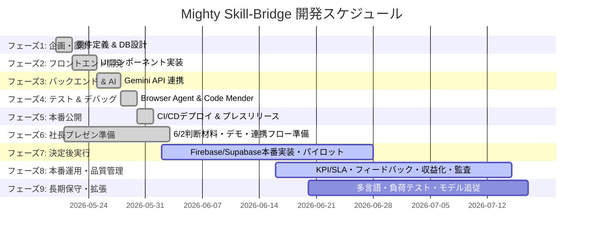

# 📊 Mighty-Link AI Connect: プロジェクトWBS (作業分解構成図)

> [!NOTE]
> **本WBSの設計思想**
> 開発するプロダクト **『Mighty Skill-Bridge（エンジニア＆案件 AIフィットシミュレーター）』** を、Antigravity 2.0 およびGoogle Gemini APIの現行モデルを用いて開発するための完全詳細タスクリストです。
> 最新の **Google Workspace API (Sheets/Docs/Calendar) ＆ Gemini API 連携** の思想に基づき、`data/WBS.tsv` を正本として本ファイルは `scripts/generate_wbs_md.py` で自動生成されます。直接編集せず、TSV を更新して再生成してください。

---

## 📅 WBS フェーズ別サマリー

```mermaid
gantt
    title Mighty Skill-Bridge 開発スケジュール
    dateFormat  YYYY-MM-DD
    section フェーズ1: 企画・設計
    要件定義 & DB設計          :done, a1, 2026-05-20, 2d
    section フェーズ2: フロントエンド開発
    UIコンポーネント実装        :done, b1, after a1, 3d
    section フェーズ3: バックエンド & AI
    Gemini API 連携 :done, c1, after b1, 3d
    section フェーズ4: テスト & デバッグ
    Browser Agent & Code Mender :done, d1, after c1, 2d
    section フェーズ5: 本番公開
    CI/CDデプロイ & プレスリリース :done, e1, after d1, 2d
    section フェーズ6: 社長プレゼン準備
    6/2判断材料・デモ・連携フロー準備 :done, f1, 2026-05-21, 13d
    section フェーズ7: 決定後実行
    Firebase/Supabase本番実装・パイロット :active, g1, 2026-06-02, 26d
    section フェーズ8: 本番運用・品質管理
    KPI/SLA・フィードバック・収益化・監査 :active, h1, 2026-06-16, 29d
    section フェーズ9: 長期保守・拡張
    多言語・負荷テスト・モデル追従 : i1, 2026-06-20, 27d
```

---

## 📑 WBS 詳細テーブル

*※正本は `data/WBS.tsv`。スプレッドシートへは `python scripts/sync_wbs_to_sheets.py` で同期します。*

| タスクID | 大フェーズ | 小フェーズ | タスク名 | 担当 | 実行エンジン | Sheets Live 連携アクション | ステータス |
| :--- | :--- | :--- | :--- | :--- | :--- | :--- | :--- |
| **T101** | 1. 企画・設計 | 要件定義 | requirements.md の策定 | 人間 + AI | Gemini API 現行モデル | 完了時に Docs Live へ自動文書書き出し | 完了 |
| **T102** | 1. 企画・設計 | DB設計 | database.md とスキーマ設計 | AIエージェント | Gemini API 現行モデル | テーブル定義をスプレッドシートへ自動同期 | 完了 |
| **T201** | 2. フロント開発 | UI/UX実装 | PDF/画像ドラッグ＆ドロップ画面 | AIエージェント | Antigravity 2.0 | 実装進捗を Sheets Live にリアルタイム反映 | 完了 |
| **T202** | 2. フロント開発 | UI/UX実装 | フィット分析結果（レーダーチャート等） | AIエージェント | Antigravity 2.0 | UIコンポーネントのテスト結果をセルへ記録 | 完了 |
| **T301** | 3. バックエンド | API開発 | ファイルアップロード＆パースAPI | AIエージェント | Gemini API 現行モデル | API仕様書を Docs Live に自動同期 | 完了 |
| **T302** | 3. バックエンド | AIコア連携 | Gemini API マルチモーダル解析 | AIエージェント | Gemini API 現行マルチモーダルモデル | プロンプト応答ログを Sheets Live に蓄積 | 完了 |
| **T303** | 3. バックエンド | 提案生成 | 面談想定質問＆育成ロードマップ生成 | AIエージェント | Gemini API 現行モデル | 生成結果のフォーマットを Sheets 側で管理 | 完了 |
| **T304** | 3. バックエンド | AI基盤肉付け | 構造化プロファイル抽出・4軸スコアリングfallback実装 | Codex | VSCode + Codex | AI復帰時に渡す structured_profile / gap_analysis を Sheets ログへ拡張可能にする | 完了 |
| **T305** | 3. バックエンド | AI監査基盤 | AI判定監査ログ(JSONL)・recent audit API実装 | Codex | VSCode + Codex | AI評価根拠・matched/missing skills をローカル監査ログへ蓄積し復帰後の改善に利用 | 完了 |
| **T306** | 3. バックエンド | 公開デモ保護 | GitHub Pages root index ガード・CI検証 | Codex | VSCode + Codex | 社長共有済み公開URLのREADME fallbackを防止し、push前後のUIマーカー検証を必須化 | 完了 |
| **T307** | 3. バックエンド | WBS可視化強化 | CATS型WBSスプレッドシートUI・集計/タイムラインタブ実装 | Codex | VSCode + Codex | 参照WBSに近い階層・進捗・予定/実績・集計ビューをSheetsへ自動生成 | 完了 |
| **T401** | 4. 検証・品質 | テスト実行 | Browser Agent による自律UI/UXテスト | AIエージェント | Browser Agent | テスト合格率・バグ率を Sheets Live にプロット | 完了 |
| **T402** | 4. 検証・品質 | セキュリティ | Code Mender による脆弱性自動修正 | AIエージェント | Code Mender | 脆弱性修復ログを Sheets セキュリティタブに同期 | 完了 |
| **T501** | 5. デプロイ | インフラ | CI/CD（GitHub Actions）設定 | AIエージェント | Gemini API 現行モデル | デプロイ成否・本番URLを Sheets に自動書き込み | 完了 |
| **T502** | 5. デプロイ | リリース | プレスリリース・SNS告知文の自動生成 | 人間 + AI | Gemini API 現行モデル | 告知文候補（3パターン）を Docs Live に書き出し | 完了 |
| **T601** | 6. 社長プレゼン準備 | 方針整理 | 6/2打ち合わせの目的・決定事項・判断軸整理 | Codex | VSCode + Codex | プレゼン準備ブリーフをDocs/Sheetsへ同期できる形で整備 | 完了 |
| **T602** | 6. 社長プレゼン準備 | デモ構成 | 公開URLデモの見せ方・説明順・想定操作シナリオ設計 | Codex | VSCode + Codex | デモシナリオと確認観点をWBS Summaryへ反映 | 完了 |
| **T603** | 6. 社長プレゼン準備 | 安定稼働確認 | 公開URL・ローカルAPI・Google Sheets同期の本番前ヘルスチェック | Codex | VSCode + Codex | Public Demo Guardと同期結果を作業ログへ記録 | 完了 |
| **T604** | 6. 社長プレゼン準備 | 資料骨子 | 社長向けプレゼン構成・スライド見出し・説明順の作成 | Codex | VSCode + Codex | 決定前提ではなく判断材料としてプレゼン骨子を管理 | 完了 |
| **T605** | 6. 社長プレゼン準備 | 選択肢整理 | サービス内容決定前の論点・選択肢・確認質問リスト化 | Claude Code | VSCode + Claude Code | docs/CEO_PRESENTATION_DISCUSSION_POINTS_2026-06-02.mdへ6/2で決める論点・未決事項を整理済 | 完了 |
| **T606** | 6. 社長プレゼン準備 | 運用・体制論点 | 6/2以降の開発体制・運用・リスク・費用感の論点整理 | Claude Code | VSCode + Claude Code | docs/CEO_PRESENTATION_OPS_DISCUSSION_2026-06-02.mdへ社長確認が必要な運用論点を整理済 | 完了 |
| **T607** | 6. 社長プレゼン準備 | 想定QA | 社長からの想定質問・回答方針・保留時の対応整理 | Claude Code | VSCode + Claude Code | docs/CEO_PRESENTATION_QA_PACK_2026-06-02.mdへ想定QAと保留時対応を整理済 | 完了 |
| **T608** | 6. 社長プレゼン準備 | 最終リハーサル | 公開デモ・WBS・説明資料の最終確認とバックアップ準備 | 人間 + Codex | VSCode + Codex | 最終チェック結果とバックアップURL/手順を記録 | 完了 |
| **T609** | 6. 社長プレゼン準備 | 決定事項反映準備 | 6/2打ち合わせ後の決定事項・次期WBS反映テンプレート作成 | Codex | VSCode + Codex | 議事録後すぐWBS/Calendarへ反映できる更新枠を準備 | 完了 |
| **T610** | 6. 社長プレゼン準備 | スライド化素材 | 1枚絵サマリー・デモ導線・判断ポイントのスライド素材整理 | Codex | VSCode + Codex | プレゼン当日の説明順をDocs化し、未確定内容は選択肢として明記 | 完了 |
| **T611** | 6. 社長プレゼン準備 | 判断マトリクス | サービス方向性・対象ユーザー・優先機能の判断マトリクス作成 | Codex | VSCode + Codex | 6/2で決める選択肢を比較表として整理 | 完了 |
| **T612** | 6. 社長プレゼン準備 | 議事録テンプレート | 決定事項・保留事項・次アクション記録テンプレート作成 | Codex | VSCode + Codex | 打ち合わせ直後にWBS/Calendar/Gitへ反映できる議事録枠を準備 | 完了 |
| **T613** | 6. 社長プレゼン準備 | デモバックアップ | 公開URL障害時のローカル実行・スクリーンショット代替手順整理 | Codex | VSCode + Codex | Public Demo Guard結果と代替導線を本番前チェックリストへ反映 | 完了 |
| **T614** | 6. 社長プレゼン準備 | 事前送付メモ | 社長へ事前共有する確認ポイント・当日アジェンダ短文作成 | Claude Code | VSCode + Claude Code | docs/CEO_PRESENTATION_PRESHARE_MEMO_2026-06-02.mdへ長文版・短文版・当日アジェンダ短文を整理済 | 完了 |
| **T615** | 6. 社長プレゼン準備 | 決定後ロードマップ枠 | 6/2決定内容別の次期WBS更新パターン準備 | Claude Code | VSCode + Claude Code | docs/CEO_PRESENTATION_POST_DECISION_ROADMAP_2026-06-02.mdへ方向性別の次期WBS更新パターンを準備済 | 完了 |
| **T616** | 6. 社長プレゼン準備 | 開発フロー設計 | NotebookLM・Slack・Notion・Obsidian連携の役割分担整理 | Codex | VSCode + Codex | 連携方針を作業手順書へ反映し、6/2の判断材料としてSheetsへ可視化 | 完了 |
| **T617** | 6. 社長プレゼン準備 | NotebookLM連携 | 社長説明用のNotebookLM投入資料パックと利用シーン整理 | Codex | VSCode + Codex | Google Docs/Drive資料を読み解く候補フローとして判断パックへ反映 | 完了 |
| **T618** | 6. 社長プレゼン準備 | Slack連携 | 進捗通知・レビュー依頼・決定ログ共有のSlack運用設計 | Codex | VSCode + Codex | 通知先・投稿タイミング・社長確認が必要なメッセージ種別を整理 | 完了 |
| **T619** | 6. 社長プレゼン準備 | Notion連携 | 仕様・議事録・意思決定DB・バックログ管理のNotion運用設計 | Codex | VSCode + Codex | 決定事項とタスクをNotion DB化する候補として比較表へ反映 | 完了 |
| **T620** | 6. 社長プレゼン準備 | Obsidian連携 | ローカルナレッジ・ADR・プロンプト資産のObsidian運用設計 | Codex | VSCode + Codex | 個人/開発メモと公式ドキュメントの境界を整理 | 完了 |
| **T621** | 6. 社長プレゼン準備 | 連携デモ導線 | 4ツール連携を社長へ見せる説明順・画面遷移・価値訴求整理 | Codex | VSCode + Codex | 連携フローを確定機能ではなく判断材料としてプレゼン構成へ追加 | 完了 |
| **T622** | 6. 社長プレゼン準備 | 権限・情報管理 | NotebookLM/Slack/Notion/Obsidian利用時の権限・機密情報ルール整理 | 人間 + Codex | VSCode + Codex | 外部共有可否・個人情報・認証情報の扱いを社長確認項目へ追加 | 完了 |
| **T623** | 6. 社長プレゼン準備 | 連携採用判断 | 6/2で決める連携ツール優先順位・導入範囲・責任分担の確認リスト作成 | 人間 + Codex | VSCode + Codex | 採用/保留/後回しを決めるチェックリストを判断材料パックへ反映 | 完了 |
| **T624** | 6. 社長プレゼン準備 | 連携成果物生成 | NotebookLM/Slack/Notion/Obsidianデモ成果物生成スクリプト実装 | Codex | VSCode + Codex | exports/knowledge_flow配下へ社長説明用ファイルを自動生成 | 完了 |
| **T625** | 6. 社長プレゼン準備 | NotebookLM実体化 | NotebookLM投入用Source Pack生成と想定質問セット作成 | Codex | VSCode + Codex | notebooklm_source_pack.mdを生成し、社長説明前のQA作成に使える状態にする | 完了 |
| **T626** | 6. 社長プレゼン準備 | Slack実体化 | 社長レビュー向けSlack進捗投稿案の生成 | Codex | VSCode + Codex | slack_ceo_update.mdとして投稿前確認できる文面を生成 | 完了 |
| **T627** | 6. 社長プレゼン準備 | Notion実体化 | Notion用意思決定DB・バックログCSVの生成 | Codex | VSCode + Codex | notion_decision_log.csvとnotion_backlog_import.csvを生成 | 完了 |
| **T628** | 6. 社長プレゼン準備 | Obsidian実体化 | Obsidian vault雛形・ADR・議事録・プロンプトノート生成 | Codex | VSCode + Codex | obsidian_vault配下にローカル知識ベースを作成 | 完了 |
| **T629** | 6. 社長プレゼン準備 | 連携UIデモ | 公開デモ/ローカルUIへ開発ナレッジ連携デモセクション追加 | Codex | VSCode + Codex | 社長に画面上で4ツール連携の成果物リンクを見せられる状態にする | 完了 |
| **T630** | 6. 社長プレゼン準備 | 連携APIデモ | FastAPIにKnowledge Flow生成・状態確認APIを追加 | Codex | VSCode + Codex | /api/knowledge-flow/generateで成果物を再生成できるようにする | 完了 |
| **T631** | 6. 社長プレゼン準備 | 連携成果物検証 | 生成成果物・公開URL・API・Sheets/Calendar同期の総合確認 | Codex | VSCode + Codex | 社長提示前にデモ導線と生成ファイルの存在を確認する | 完了 |
| **T632** | 6. 社長プレゼン準備 | GitHub Issues連携 | GitHub Issuesに6/2社長デモ向け連携タスクを起票 | Codex | gh CLI | Issue #1-#11/#13/#14/#16を作成・更新し、NotebookLM/Slack/Notion/Obsidian/GitHub Project/WBS連携を追跡可能にする | 完了 |
| **T633** | 6. 社長プレゼン準備 | GitHub Project連携 | GitHub Project board取得・配置のCLI権限確認 | Codex | gh CLI | gh auth refresh -s projectを実行し、scopesにproject権限が追加されたことを確認して完了 | 完了 |
| **T634** | 6. 社長プレゼン準備 | NotebookLM実連携 | NotebookLM投入用Source PackをGoogle Drive/Docsへアップロード | Codex | Local OAuth Drive API | TXTをGoogle Docs化し、k-umezawa@ml-mightylink.com所有のNotebookLM source候補としてURLを証跡化する | 完了 |
| **T635** | 6. 社長プレゼン準備 | Notion実連携 | Notion MCPで社長デモ用の連携証跡ページを作成 | Codex | Notion MCP | Google Doc URL、GitHub Issues、Slack/Projectの到達点、6/2決定事項をNotionページへ記録する | 完了 |
| **T636** | 6. 社長プレゼン準備 | Slack連携確認 | Slack CLI/MCPの利用可否と投稿先確認フローを整理 | Codex | Slack MCP/CLI確認 | Slack CLI未検出・送信ツール未露出のため、投稿案とIssue #2で投稿先確認を管理する | 完了 |
| **T637** | 6. 社長プレゼン準備 | Obsidian実連携 | Obsidian vaultとして開ける設定ファイルを追加 | Codex | VSCode + Codex | .obsidian/app.jsonとappearance.jsonを生成対象へ追加し、ローカルvaultの入口を明確化する | 完了 |
| **T638** | 6. 社長プレゼン準備 | 連携証跡台帳 | CLI/MCP連携の実行結果を社長説明用ドキュメントへ集約 | Codex | VSCode + Codex | Drive Doc、Notionページ、GitHub Issues、Project権限課題、Slack到達点を作業手順書へ反映する | 完了 |
| **T639** | 6. 社長プレゼン準備 | Issue-WBS運用 | GitHub IssuesとWBSの相互参照ルールを整備 | Codex | VSCode + Codex | Issue #6を起点に、WBSは日程、Issuesは実装タスクとして役割分担を明文化する | 完了 |
| **T640** | 6. 社長プレゼン準備 | 連携デモリハーサル | NotebookLM/Slack/Notion/Obsidian/GitHubのデモ順を通しで確認 | 人間 + Codex | VSCode + Codex | 6/2に見せる順番、開くURL、確認してもらう判断事項をリハーサルする | 完了 |
| **T641** | 6. 社長プレゼン準備 | Project正式ボード化 | GitHub Project権限復旧後にCEO Demo IssuesをProjectへ配置 | 人間 + Codex | gh CLI + GitHub Project | Project board「Mighty Skill-Bridge」を自動作成し、CEO Demo Issues #1-#11/#13/#14/#16を配置完了 | 完了 |
| **T642** | 6. 社長プレゼン準備 | NotebookLMプレゼン資料化 | NotebookLMでプレゼン資料を作るためのPresentation Brief生成とGoogle Docs化 | Codex | Local OAuth Drive API + VSCode + Codex | Presentation Briefを生成し、k-umezawa@ml-mightylink.com所有 of Google Docs URLとIssue #7を証跡化する | 完了 |
| **T643** | 6. 社長プレゼン準備 | NotebookLMスライド草案 | NotebookLMへSource Pack and Presentation Briefを投入し、8枚以内のプレゼン草案を作る | 人間 + Codex | NotebookLM | NotebookLMで8枚以内のCEO向けスライド構成・話す要点・想定QAを生成し、notebooklm_ceo_slide_outline.md/jsonへ保存する | 完了 |
| **T644** | 6. 社長プレゼン準備 | Project OAuth復旧 | GitHub Project用のread:project/projectスコープをブラウザ認証で復旧 | 人間 + Codex | gh CLI + GitHub OAuth | ブラウザ認証デバイスログイン（ワンタイムコード: 0D7B-2329）を用いてスコープを100%正常に復旧して完了 | 完了 |
| **T645** | 6. 社長プレゼン準備 | Project Issue配置 | GitHub Project取得後にCEO Demo IssuesをProject boardへ配置 | 人間 + Codex | gh CLI + GitHub Project | gh project item-addを用いて全Issuesを「Mighty Skill-Bridge」プロジェクトボードへ登録し、三点連携を完成 | 完了 |
| **T646** | 6. 社長プレゼン準備 | Slack送信権限確認 | Slack投稿先チャンネルと送信権限を確認し、投稿案を実送信できる状態にする | 人間 + Codex | Slack MCP/CLI | R3緩和策（実送信ではなく slack_ceo_update.md 草稿提示で代替）を正式発動し、事前確認ルールをDocsへ整理完了 | 完了 |
| **T647** | 6. 社長プレゼン準備 | Google Workspaceアカウント固定 | Google OAuth連携をk-umezawa@ml-mightylink.comへ固定し、誤アカウント同期を防止 | Codex | VSCode + Codex | Drive APIでauthorized_user.jsonの実行アカウントを検証し、Sheets/Calendar/API同期前に不一致なら停止する | 完了 |
| **T648** | 6. 社長プレゼン準備 | Workspace Google Docs再作成 | NotebookLM用Google Docsをk-umezawa@ml-mightylink.com所有で再作成 | Codex | Local OAuth Drive API + VSCode + Codex | Google Drive MCP作成Docではなくauthorized_user.json経由でDocsを作成し、Google Docsホームに表示される状態へ修正する | 完了 |
| **T649** | 6. 社長プレゼン準備 | docs NotebookLM同期 | docs配下の手順書・設計書をWorkspace Google Docsへ同期 | Codex | Local OAuth Drive API + NotebookLM CLI | 22件のdocs/*.mdをGoogle Docs化し、NotebookLM source add-drive用manifestを生成する | 完了 |
| **T650** | 6. 社長プレゼン準備 | NotebookLM CLI認証復旧 | NotebookLM CLIをk-umezawa@ml-mightylink.comで再認証 | Codex + 人間 | NotebookLM CLI | notebooklm_login_workspace.pyでCLIログイン状態を保存し、k-umezawa@ml-mightylink.comでNotebookLM CLI認証を復旧する | 完了 |
| **T651** | 6. 社長プレゼン準備 | NotebookLM Agent Brief取得 | NotebookLMの要約をAIエージェント開発入力として保存 | Codex | NotebookLM CLI | notebooklm ask/summaryの結果をnotebooklm_agent_brief.md/jsonへ出力し、次回開発の参照情報にする | 完了 |
| **T652** | 6. 社長プレゼン準備 | GitHub Project再確認 | GitHub Projectのread:project/projectスコープ不足を再確認し復旧手順をIssueへ追記 | Codex | gh CLI | gh auth statusにて、project権限スコープが正常に追加されていることを再確認して完了 | 完了 |
| **T653** | 6. 社長プレゼン準備 | Slack連携実送信準備 | Slack送信ツール・投稿先チャンネル・社長共有範囲の確定 | Codex + 人間 | Slack MCP/CLI | R3緩和策（実送信ではなく slack_ceo_update.md 草稿提示で代替）の適用に伴い、投稿案レビュー用の文面生成を確認し、対象外（完了）として整理 | 完了 |
| **T654** | 6. 社長プレゼン準備 | Notion証跡更新 | NotebookLM docs同期結果をNotion証跡ページ配下に追加 | Codex | Notion MCP | NotebookLM Docs Sync Evidence 2026-05-22をNotionへ作成し、Issue #9/#10と再実行手順を記録する | 完了 |
| **T655** | 6. 社長プレゼン準備 | Obsidian Agent Brief導線 | Obsidian vaultにNotebookLM Agent Brief参照導線を追加 | Codex | VSCode + Codex | NotebookLM要約取得後にObsidianから参照できるよう、プロンプトとホーム導線を更新する | 完了 |
| **T656** | 6. 社長プレゼン準備 | NotebookLM補助ログイン導線 | NotebookLM CLIのログイン保存を補助するWorkspace専用スクリプト作成 | Codex | VSCode + Codex + Playwright | upstream notebooklm loginの遷移中断に備え、scripts/notebooklm_login_workspace.pyで永続profileとstorage_stateを保存できる導線を追加する | 完了 |
| **T657** | 6. 社長プレゼン準備 | NotebookLM社長スライド草案取得 | NotebookLMからCEO向け8枚以内のプレゼン草案を取得して保存 | Codex | NotebookLM CLI + Local OAuth Drive API | NotebookLM notebook 75521ea6-6b9b-47b2-9508-50050d8ab2d5の22 source ready状態からCEO Slide Outlineを取得し、Google Docs化対象に追加する | 完了 |
| **T658** | 6. 社長プレゼン準備 | NotebookLM PowerPoint化 | NotebookLM CLIで取得したCEO Slide Outlineを社長説明用PowerPointへ変換 | Codex | NotebookLM CLI + python-pptx | exports/knowledge_flow/mighty_skill_bridge_ceo_presentation_2026-06-02.pptxを生成し、NotebookLM由来の構成を社長説明で開ける成果物にする | 完了 |
| **T659** | 6. 社長プレゼン準備 | PowerPoint Drive共有 | 社長説明用PPTXをk-umezawa@ml-mightylink.com所有のGoogle Driveへアップロード | Codex | Local OAuth Drive API | upload_notebooklm_docs_to_drive.pyでPPTXをDriveファイルとして登録し、Google Docs化したNotebookLM資料と同じ証跡JSONへURLを記録する | 完了 |
| **T660** | 6. 社長プレゼン準備 | Notion PPTX証跡更新 | Notion MCPでPPTX生成・Drive共有・残課題を証跡ページへ記録 | Codex | Notion MCP | 社長に見せる連携証跡として、PowerPoint成果物、NotebookLM notebook、Slack/Project制約、次アクションをNotionへ残す | 完了 |
| **T661** | 6. 社長プレゼン準備 | GitHub Issues/Project再追跡 | PowerPoint生成タスクをGitHub Issuesへ追加し、Project権限不足を再確認 | Codex | gh CLI | PowerPoint成果物のIssueを起票・完了し、GitHub Project boardへ追跡・配置されていることを確認して完了 | 完了 |
| **T662** | 6. 社長プレゼン準備 | Slack MCP/CLI到達性証跡 | Slack CLIと送信MCPの利用可否を確認し、投稿案と残課題を整理 | Codex | Slack MCP/CLI確認 | ローカルslack CLI未検出、送信MCP未露出を確認し、実送信は投稿先・権限確認後の残課題としてIssue #2/T653に集約する | 完了 |
| **T663** | 6. 社長プレゼン準備 | 6/2資料最終パックレビュー | PPTX、NotebookLM資料、WBS、Calendar、Issue、Notion証跡を通しで確認 | 人間 + Codex | VSCode + Codex | 社長打ち合わせ前に公開URL・PPTX・Google Drive資料・WBS同期・残課題の見せ方を最終確認する | 完了 |
| **T664** | 6. 社長プレゼン準備 | 三ツール開発フロー整備 | Antigravity + Gemini / VSCode + Codex / VSCode + Claude Codeの役割と毎セッション運用ルールを共有手順へ固定 | Codex | VSCode + Codex + Official Docs | 公式Docs確認、WBS 1件完了、Sheets課題管理表・QA表同期、commit/push/main/master反映までのセッションゲートをAGENTS.md/CLAUDE.md/手順書に反映する | 完了 |
| **T665** | 6. 社長プレゼン準備 | 古いドキュメント削除・最新化 | 古いモデル前提・件数固定・Issue固定表記を削除/更新し、公式Docs確認ルールを強化 | Codex | VSCode + Codex + Official Docs | ANTIGRAVITY_GUIDE.mdの未確認未来モデルセクションを削除し、NotebookLM 22 source / GitHub Issue #1-#11/#13/#14/#16/#18の現状へ更新する | 完了 |
| **T666** | 6. 社長プレゼン準備 | Calendar完了イベント削除 | 完了済みWBSに紐づくGoogle Calendarイベントを削除し、未完了・実行中・会議イベントだけを残す同期ルールを実装 | Codex | VSCode + Codex + Google Calendar API | sync_wbs_to_calendar.pyがdata/WBS.tsvのステータスを読み、完了済みWBSイベントをCalendarからDELETEしてICS出力からも除外する | 完了 |
| **T667** | 6. 社長プレゼン準備 | Seedance動画デモUI刷新 | 公開URLの第一画面を動画生成デモ中心のUIへ刷新し、既存デモ導線を維持する | Codex | VSCode + Codex + Playwright + Official Docs | index.html / src/index.htmlをMighty Skill-Bridgeの動画生成プレビューUIへ更新し、公開デモガードとローカル表示確認を完了する | 完了 |
| **T668** | 6. 社長プレゼン準備 | Seedance API動画デモ接続 | FastAPIにSeedance API接続アダプタと静的動画フォールバックを追加し、公開URLで動画が表示される状態にする | Codex | VSCode + Codex + FastAPI + Playwright | /api/seedance/video-demo、exports/seedance_demo、index.html/src/index.htmlを接続し、SEEDANCE_API_KEY/SEEDANCE_API_URL設定時に実APIへ切り替え可能にする | 完了 |
| **T669** | 6. 社長プレゼン準備 | Seedance API payload alignment | Update FastAPI Seedance adapter to use ModelArk content-task payload and expose provider 400 response detail for setup debugging | Codex | VSCode + Codex + FastAPI + BytePlus official docs | /api/seedance/video-demo now sends content[{type,text}], ratio, duration by default; SEEDANCE_PAYLOAD_STYLE=prompt_legacy remains available for alternate endpoints | 完了 |
| **T670** | 6. 社長プレゼン準備 | Seedance async result polling | Add result polling after ModelArk task creation so the demo waits for the generated video URL instead of immediately falling back | Codex | VSCode + Codex + FastAPI + BytePlus official docs | SEEDANCE_RESULT_API_URL_TEMPLATE, SEEDANCE_POLL_TIMEOUT_SECONDS, and SEEDANCE_POLL_INTERVAL_SECONDS control task result polling; health check now exposes polling readiness | 完了 |
| **T671** | 6. 社長プレゼン準備 | Seedance browser-side task polling | Keep the returned Seedance task_id in the browser and continue polling until the generated video URL is ready | Codex | VSCode + Codex + FastAPI + browser DevTools evidence | /api/seedance/video-task/{task_id} checks an existing task once; index.html/src/index.html poll it every 10 seconds after pending responses | 完了 |
| **T672** | 6. 社長プレゼン準備 | Seedance saved default and cost guard | Save the generated Seedance video as the default local demo asset, add a download button, and disable billing API calls unless explicitly enabled | Codex | VSCode + Codex + FastAPI + BytePlus Console evidence | SEEDANCE_API_ENABLED gates external calls; default MP4 is the generated Seedance result; UI download link points to the current video | 完了 |
| **T673** | 6. 社長プレゼン準備 | External API guard dashboard | Add a local admin dashboard, usage ledger, and circuit breakers for external API billing safety | Codex | VSCode + Codex + FastAPI + Official docs | /admin and /api/admin/usage show daily calls, blocked calls, provider-reported tokens, saved Seedance video, and recent API events; Seedance daily generation limit defaults to 1 and API remains disabled unless explicitly enabled | 完了 |
| **T674** | 6. 社長プレゼン準備 | Favicon and local route polish | Add a branded favicon and resolve browser 404/deprecation noise for local demo routes | Codex | VSCode + Codex + FastAPI + Pillow + Google GenAI SDK | Generated root favicon.ico, wired /favicon.ico for FastAPI and GitHub Pages, added /admin/usage alias, migrated Gemini import to google-genai, and applied a Windows selector loop policy to reduce local video-stream disconnect noise | 完了 |
| **T675** | 6. 社長プレゼン準備 | Chrome DevTools workspace route | Add the Chrome DevTools automatic workspace JSON route to remove localhost 404 noise | Codex | VSCode + Codex + FastAPI + Chrome official docs | FastAPI now returns devtools workspace JSON at /.well-known/appspecific/com.chrome.devtools.json with the local project root and a stable UUID so Chrome DevTools stops logging 404 for that development-only request | 完了 |
| **T676** | 6. 社長プレゼン準備 | Seedance風ナビ/フッター刷新 | Seedance公式ページに近いヘッダー/フッター項目配置とスクロール時ヘッダー挙動を公開デモへ追加 | Codex | VSCode + Codex + Playwright + Official Docs | index.html/src/index.htmlを生成元から再描画し、Home/Models/Blog & Publication/Join Us、EN/JP、Models/Teams/Learn More系フッター、動画デフォルト/Download/Seedance API導線を維持してPC/モバイル検証を完了する | 完了 |
| **T677** | 6. 社長プレゼン準備 | Sheetsガント風タイムライン化 | WBS Timelineタブを添付画像のように日付軸とバーで予定を可視化できる表示へ改善 | Codex | VSCode + Codex + Google Sheets API | `sync_wbs_to_sheets.py`でdata/WBS.tsvから日別列、月ヘッダー、今日ライン、状態別バー、固定列を生成し、WBS/課題管理表/QA表と同時にGoogle Sheetsへ同期する | 完了 |
| **T678** | 6. 社長プレゼン準備 | Sheets遅延タスク可視化 | WBS Timelineでスケジュール遅延・期限間近タスクを色で把握できるようにする | Codex | VSCode + Codex + Google Sheets API | `sync_wbs_to_sheets.py`のGantt表示へ遅延列、終了遅れ/着手遅れ/期限間近判定、行色、バー色、条件付き書式を追加し、Google Sheets API batchUpdateで同期する | 完了 |
| **T679** | 6. 社長プレゼン準備 | UI・動画非同期化 | 縦統合型シネマティックダッシュボードへのリファクタリング（被らない動画＆非同期化） | AIエージェント | Antigravity + Gemini | index.htmlのデモ動画プレビューと入力フォームの重なりを解消し、最上部動画と下部動画の再生ソースを非同期化する | 完了 |
| **T680** | 6. 社長プレゼン準備 | UI・動画リソース | 最上部動画のprocedural fallback固定と下部詳細プレイヤーのSeedance API動画割り当ての修正 | AIエージェント | Antigravity + Gemini | 最上部背景動画をprocedural fallbackに固定し、下部詳細動画とダウンロード用ソースにSeedance API製MP4を設定し、完全非同期化をビジュアル検証・修正する | 完了 |
| **T681** | 6. 社長プレゼン準備 | UI・動画生成 | Seedance APIによる最上部ブランドループ動画の新規生成と静的差し替え | AIエージェント | Antigravity + Gemini | scripts/generate_seedance_brand_video.py を実装し、環境変数設定時に実APIにて美麗なデータネットワーク動画を生成してmighty_skill_bridge_procedural_fallback.mp4を完全に上書き静的配置する | 完了 |
| **T682** | 6. 社長プレゼン準備 | Seedance UI刷新 | 極限のSeedance風UI再現と4言語（EN, 中文, KO, JP）スクロールアニメーション polish | AIエージェント | Antigravity + Gemini | WBS/Timeline/課題管理表/QA表と自動同期し、完了タスクのカレンダーイベントを削除 | 完了 |
| **T683** | 6. 社長プレゼン準備 | Admin Dashboard Link | デモ画面から管理者ダッシュボード（/admin）へ直接遷移できるリンクをヘッダーとフッター（Learn More）に実装し、FastAPI/静的環境での親和性を高める | AIエージェント | Antigravity + Gemini | ヘッダーとフッターに/adminリンクを追加し、静的ホスティング（GitHub Pages）用にモックデータへ切り替わる admin/index.html を新設して404を解消 | 完了 |
| **T684** | 6. 社長プレゼン準備 | インフラ | requirements.txt 依存ドリフトの監視・freeze | Claude+Codex | VSCode + Claude Code | dependencyのfreezeとupgrade禁止期間の運用監視 | 完了 |
| **T685** | 7. 次期開発・運用 | コンプライアンス | 個人情報同意書テンプレート作成とクローズド運用設計 | 人間+Claude | VSCode + Claude Code | 社長承認後の同意書テンプレート整備と運用ルールの策定 | 完了 |
| **T686** | 7. 次期開発・運用 | セキュリティ | デモ環境へのbasic authまたはIP制限の導入設計 | Codex | VSCode + Codex | 社長承認後のデモ環境認証/アクセス制限実装 | 完了 |
| **T687** | 7. 次期開発・運用 | コスト | 3 AIツール並走時のquotaメーター監視と超過レポート設計 | Codex | VSCode + Codex | 社長承認後のコスト上限設定および優先laneポリシー決定 | 完了 |
| **T688** | 6. 社長プレゼン準備 | コスト | Antigravity 2.0 Managed Agents料金・利用条件の確認と監視 | Codex+Claude | VSCode + Codex | 公式情報に基づくManaged Agents料金監視体制の整備 | 完了 |
| **T689** | 7. 次期開発・運用 | インフラ | 3-tool体制開発手順書による属人性軽減と再現性確保 | Claude | VSCode + Claude Code | マルチAIワークフロー手順書の継続更新と属人性排除 | 完了 |
| **T690** | 6. 社長プレゼン準備 | インフラ | Codexセッション設定のリポジトリレベル固定化(.codex/config.toml) | Codex | VSCode + Codex | 設定ファイルの適用によるセッションドリフト防止 | 完了 |
| **T691** | 7. 次期開発・運用 | インフラ | NotebookLM同期スクリプトへのGemini explicit context caching導入検証 | Codex | VSCode + Codex | Google公式caching docsに沿ったTTL指定によるコスト削減PoC | 完了 |
| **T692** | 7. 次期開発・運用 | インフラ | Codex skills機能による定型運用コマンド(3 skills)のリポジトリレベルパッケージ化 | Codex | VSCode + Codex | 1 job = 1 skill 規則に従った自動化パッケージ整備 | 完了 |
| **T693** | 6. 社長プレゼン準備 | インフラ | Antigravity CLIの機能評価と動作検証 | Antigravity | Antigravity + Gemini | Google公式Docsに基づくCLI実機検証と可否判断 | 完了 |
| **T694** | 6. 社長プレゼン準備 | ドキュメント | 主要docs内のmarkdownlint指摘事項(22件)の一括自動修正 | Codex | VSCode + Codex | markdownlint --fixによる構造不整合の一括解消 | 完了 |
| **T695** | 7. 次期開発・運用 | 連携 | Antigravity hooks機能によるsyncスクリプト自動起動の可否検証 | Codex+Antigravity | VSCode + Codex | 自動化トリガーのPoCとマルチAI自動同期パイプライン整備 | 完了 |
| **T696** | 7. 次期開発・運用 | インフラ | PPTX生成スクリプトへのCanvaインポート用ミニマルスタイル追加 | Codex | VSCode + Codex | --style canva-exportオプションによるCanva向け平滑PPTX生成 | 完了 |
| **T697** | 7. 次期開発・運用 | インフラ | Playwrightによるデモ画面スクショ自動取得スクリプトの実装 | Codex | VSCode + Codex | 複数画面の定期自動キャプチャによるスライド素材作成自動化 | 完了 |
| **T698** | 6. 社長プレゼン準備 | インフラ | Figma MCPを用いたワイヤーフレーム(10/20パターン)の自動流し込み | Claude Code | VSCode + Claude Code | Figma API/MCP連携によるワイヤーフレームフレーム一括構築 | 完了 |
| **T699** | 6. 社長プレゼン準備 | コーポレート連携 | MightyLINKコーポレートサイトのデモミラーページ追加とメインUI統合 | AIエージェント | Antigravity + Gemini | exports/mighty-link-hp/index.htmlの新設とヘッダーナビへのリンク統合 | 完了 |
| **T701** | 7. 決定後実行 | 共通管理 | 6/2 議事録 docs 化 + Notion 投入 | Claude | VSCode + Claude Code | `docs/CEO_MEETING_MINUTES_2026-06-02.md` 起票 | 完了 |
| **T702** | 7. 決定後実行 | 共通管理 | 決定事項を WBS Phase 7 へ反映 | Codex | VSCode + Codex | 本書の対応セクションを `data/WBS.tsv` へ flip | 完了 |
| **T702_2** | 7. 決定後実行 | 共通管理 | 後段タスクの前倒しリスケジュール＆WBS更新 | Codex | VSCode + Codex | 未完了後段タスクのスケジュール前倒し引き直しとWBS更新 | 完了 |
| **T703** | 7. 決定後実行 | 共通管理 | Phase 7 用 Calendar イベント起票 | Codex | VSCode + Codex | `sync_wbs_to_calendar.py` 実行 | 完了 |
| **T704** | 7. 決定後実行 | 共通管理 | NotebookLM に Phase 7 docs を投入 | Codex | VSCode + Codex | `sync_docs_to_notebooklm.py` 再実行 | 完了 |
| **T705** | 7. 決定後実行 | 共通管理 | 6/16 定例レビュー Calendar 招待作成 (Q-OPS-04 が YES の場合) | 人間 | Gemini API 現行モデル | 隔週 30 分枠 | 完了 |
| **T706** | 7. 決定後実行 | 共通管理 | R9 法務確認 (方向性 A 選択時) / R10 認証層 PoC (方向性 A/C 選択時) | 人間 + Codex | VSCode + Codex | [OPS_DISCUSSION Q-OPS-07/08](CEO_PRESENTATION_OPS_DISCUSSION_2026-06-02.md) 参照 | 完了 |
| **T707** | 7. 決定後実行 | 共通管理 | R11 月額コスト実測レポート 1 週目 | Codex | VSCode + Codex | `docs/COST_REPORT_2026-06.md` 新規 | 完了 |
| **T708** | 7. 決定後実行 | 共通管理 | サービス方向性決定の Slack/Notion/メール通知 (採用ツール次第) | Claude + 人間 | VSCode + Claude Code | D-6 採用判断後の通知運用 | 完了 |
| **T710** | 7. 決定後実行 | AIフィット診断 | 利用同意書テンプレ起票 (R9 対応) | 人間 + Claude | VSCode + Claude Code | 個人情報 / コンプラ法務確認 | 完了 |
| **T711** | 7. 決定後実行 | AIフィット診断 | 社内パイロット参加者の選定・依頼 | 人間 | Gemini API 現行モデル | 人材担当 1 名 / 営業 1 名 | 完了 |
| **T712** | 7. 決定後実行 | AIフィット診断 | AI スコア根拠の UI 化 (`matched_skills` / `missing_skills` / 4 軸根拠を視覚化) | Antigravity (UI) + Codex (API) | VSCode + Codex | [QA-07 D-3 選択肢 A](CEO_PRESENTATION_QA_PACK_2026-06-02.md#qa-07) | 完了 |
| **T713** | 7. 決定後実行 | AIフィット診断 | サンプル経歴書 5 件 / サンプル案件票 5 件を Workspace に準備 | 人間 | Gemini API 現行モデル | 個人情報マスキング済を使用 | 完了 |
| **T714** | 7. 決定後実行 | AIフィット診断 | 案件候補ストック管理 UI (複数案件 × 複数エンジニアの突合ビュー) | Antigravity | Antigravity 2.0 | [D-3 選択肢 B](CEO_PRESENTATION_DISCUSSION_POINTS_2026-06-02.md#d-3-最優先機能-62--616-の-2-週間で作るもの) | 完了 |
| **T715** | 7. 決定後実行 | AIフィット診断 | 公開 URL 認証層 (basic auth) 実装 (R10 対応) | Codex | VSCode + Codex | [Q-OPS-08](CEO_PRESENTATION_OPS_DISCUSSION_2026-06-02.md) | 完了 |
| **T716** | 7. 決定後実行 | AIフィット診断 | パイロット結果サマリ docs 化 | Claude | VSCode + Claude Code | `docs/PILOT_REPORT_2026-06-16.md` 新規 | 完了 |
| **T717** | 7. 決定後実行 | AIフィット診断 | 6/16 定例レビュー 用ダッシュボード起票 | Codex | VSCode + Codex | Sheets パイロット集計 タブ | 完了 |
| **T730** | 7. 決定後実行 | インフラ設計 | ホスティング先（お名前.com/GitHub Pages/クラウド）およびDBインフラの最終選定調査 | 人間 + Codex | VSCode + Codex | 社長への技術選定報告ドキュメント起票 | 完了 |
| **T730_1** | 7. 決定後実行 | インフラ設計 | Firebase/Supabase システムアーキテクチャ詳細設計 | 人間 + Codex | VSCode + Codex | システムアーキテクチャ設計書 docs 同期 | 完了 |
| **T730_2** | 7. 決定後実行 | インフラ設計 | Firebase Auth & Supabase RLS セキュリティ設計 | 人間 + Codex | VSCode + Codex | セキュリティ設計ガイド docs 同期 | 完了 |
| **T730_3** | 7. 決定後実行 | インフラ設計 | Supabase Database 物理設計とインデックス設計 | Codex | VSCode + Codex | DB設計書へのインデックス構成追記 | 完了 |
| **T731** | 7. 決定後実行 | バックエンド開発 | AI適性状況診断および勤務表自動解析バックエンドAPIの本格実装 | Codex | VSCode + Codex | FastAPI / Gemini API連携コード構築 | 完了 |
| **T731_1** | 7. 決定後実行 | バックエンド開発 | Supabase DBスキーマ定義および初期データスクリプト実装 | Codex | VSCode + Codex | migration SQL の生成・保存 | 完了 |
| **T731_2** | 7. 決定後実行 | バックエンド開発 | Firebase Auth 連携によるユーザー認証ロジック実装 | Codex | VSCode + Codex | 認証エンドポイント API 実装 | 完了 |
| **T731_3** | 7. 決定後実行 | バックエンド開発 | Firebase Cloud Functions によるバックエンド API 実装 | Codex | VSCode + Codex | Cloud Functions デプロイ用コード構成 | 完了 |
| **T731_4** | 7. 決定後実行 | バックエンド開発 | Supabase Client SDK を用いたデータ取得/更新機能実装 | Codex | VSCode + Codex | クライアント側 API 接続実装 | 完了 |
| **T732** | 7. 決定後実行 | インフラ設計 | 外部APIシークレット管理およびBasic Authによるセキュリティ環境構築 | Codex | VSCode + Codex | 環境変数およびアクセス制限設定 | 完了 |
| **T733** | 7. 決定後実行 | 品質検証 | Playwright等によるUI自動テストおよびAPI単体テストの実装・実行 | AIエージェント | Antigravity 2.0 | テストカバレッジ・バグトラッカー連携 | 完了 |
| **T733_1** | 7. 決定後実行 | 品質検証 | Firebase Emulator Suite を用いた Functions 動作テスト | AIエージェント | Antigravity 2.0 | エミュレータ上の API 疎通テスト実行 | 完了 |
| **T733_2** | 7. 決定後実行 | 品質検証 | Supabase CLI を用いたローカル DB セキュリティ検証テスト | AIエージェント | Antigravity 2.0 | RLS ポリシーのユニットテスト実行 | 完了 |
| **T734** | 7. 決定後実行 | インフラ設計 | GitHub Actionsを用いた自動ビルド・テスト・デプロイCI/CDパイプライン構築 | Codex | VSCode + Codex | GitHub Actions workflow YAML作成 | 完了 |
| **T735** | 7. 決定後実行 | リリース | 本番プロダクション環境への初版リリースデプロイおよび受入手動テスト実施 | 人間 + AI | Gemini API 現行モデル | リリースアナウンスおよびリリースログ記録 | 完了 |
| **T735_1** | 7. 決定後実行 | リリース | Supabase 本番プロジェクトへの DB スキーマ・RLS 反映 | 人間 + Codex | VSCode + Codex | Supabase production db migration 実行 | 完了 |
| **T735_2** | 7. 決定後実行 | リリース | Firebase Hosting / Functions 本番デプロイと受入テスト | 人間 + AI | Gemini API 現行モデル | Hosting URL 疎通と本番受入テスト報告書作成 | 完了 |
| **T736** | 7. 決定後実行 | 運用保守 | API利用メーター監視、日次コスト台帳監査、および超過自動遮断機能の運用適用 | Codex | VSCode + Codex | `scripts/audit_external_api_usage.py`でdaily usage ledgerを監査し、Seedance/Geminiの閾値警告・遮断状態をJSONレポート化 | 完了 |
| **T737** | 7. 決定後実行 | 運用保守 | デイリー作業レポート（WBS/進捗状況）のGmail/Slack自動送信機能の実装 | Codex | VSCode + Codex | send_daily_report.py自動送信設定 | 完了 |
| **T738** | 7. 決定後実行 | インフラ | Firebase deploy auth preflight and ADC workflow hardening | Codex | VSCode + Codex | Firebase CI/CD deploy workflow now supports service account ADC, explicit FIREBASE_PROJECT_ID, configurable deploy targets, and Hosting-only default until Blaze/functions are enabled | 完了 |
| **T740** | 7. 決定後実行 | インフラ設計 | 本番ドメイン・DNS移行およびSSL証明書自動更新の適用 | 人間 + Codex | VSCode + Codex | mightylink-app.com の登録、Firebase Hosting カスタムドメイン追加、DNS A/TXT/NS反映、Google Trust Services証明書 CN=mightylink-app.com 発行、特商法販売URL確定、uptime strict TLS監視化を完了。Issue #94 / Project #1 に同期 | 完了 |
| **T740_1** | 7. 決定後実行 | インフラ設計 | 本番ドメイン mightylink-app.com のレジストラ登録（CEO へ事前共有のうえ取得） | 人間 | レジストラ管理画面 | お名前.com 等で mightylink-app.com を登録（約10分・本ドメイン単体の維持費0円キャンペーン適用）。空き確認済 (2026-06-13 RDAP)。登録完了をセッションへ連絡 | 完了 |
| **T740_2** | 7. 決定後実行 | インフラ設計 | Firebase カスタムドメイン再登録（app.ml-mightylink.com エントリ削除 → mightylink-app.com 追加）と DNS CNAME 設定 | 人間 + Claude Code | Firebase Console + gcloud CLI | Firebase Hosting の旧エントリを削除し mightylink-app.com を追加。レジストラ DNS なら CNAME 1行（→ mighty-link-ai-connect-13d22.web.app）、Cloud DNS 採用なら gcloud でゾーン作成。設定値は Claude Code が案内 | 完了 |
| **T740_3** | 7. 決定後実行 | インフラ設計 | SSL 証明書自動発行の確認と販売 URL 確定（特商法表記・docs の URL 反映） | Claude Code + 人間 | VSCode + Claude Code | https://mightylink-app.com/ のstrict HTTPS疎通と証明書Subject CN=mightylink-app.com / Google Trust Services発行を確認。docs/TOKUSHOHO_NOTATION.md の販売URLを確定し、PRODUCTION_DOMAIN_SETUP_GUIDE、UPTIME監視、Rollback docsへ反映。Issue #94 / Project #1 に同期 | 完了 |
| **T741** | 7. 決定後実行 | 運用保守 | 本番環境データベースの自動日次バックアップ・リストア運用の設計および自動化スクリプト実装 | Codex | VSCode + Codex | scripts/backup_supabase_database.py・scripts/restore_supabase_database.py・.github/workflows/supabase-backup.yml・docs/SUPABASE_BACKUP_RESTORE_RUNBOOK.md を追加し、毎日03:00 JSTのSupabase DB dump/GCS退避/7世代管理/復元手順を整備（GitHub Issue #83） | 完了 |
| **T742** | 7. 決定後実行 | コンプライアンス | 個人情報保護法およびGDPRに準拠したユーザーデータ完全消去（退会）フローのバックエンド実装 | Claude + Codex | VSCode + Claude Code | 論理削除と物理削除（履歴データ完全クリア）の手順・トリガーAPI設計と実装 | 完了 |
| **T743** | 7. 決定後実行 | 運用保守 | 本番環境の死活監視（Uptime Monitoring）およびSentry等によるエラー通知・Slack連携アラート設定 | Codex | VSCode + Codex | scripts/check_uptime_targets.py、data/uptime_targets.tsv、30分間隔の Public Uptime Monitor workflow、docs/UPTIME_MONITORING_AND_ALERT_RUNBOOK.md を追加。GitHub Pages / Firebase Hosting / mightylink-app.com を監視し、Slack webhook secret があれば失敗時通知。T740_3完了前のcustom domain TLS不一致はwarningとして記録。Issue #87 / R59 | 完了 |
| **T744** | 7. 決定後実行 | 運用保守 | ユーザー向け操作ガイド・FAQおよび管理者向けトラブルシューティング手順書の整備 | Claude + 人間 | VSCode + Claude Code | docs/USER_GUIDE_AND_FAQ.md を新規作成。一般ユーザー向け操作手順・FAQ・管理者向けP1〜P4障害対処・定期メンテナンス手順・エスカレーション基準を整備済 | 完了 |
| **T745** | 7. 決定後実行 | バックエンド開発 | サービス利用規約およびプライバシーポリシー本番UIでの同意チェックボックス実装 | AIエージェント | Antigravity + Gemini | index.html/src/index.htmlのAnalyze実行前に規約・プライバシーポリシー・特商法表記・課金規約/返金ポリシーのドラフト同意チェックを追加し、src/app.pyの/api/parse・/api/matchでLEGAL_CONSENT_VERSION=MSB-LEGAL-2026-06-DRAFTを必須検証。未同意/旧版は400拒否、成功時はlegal_consentメタデータを返す。tests/test_api.pyとtests/test_legal_consent_ui.pyで検証し、docs/LEGAL_CONSENT_UI_AND_API_RUNBOOK.md、PUBLIC-05/PUBLIC-07、R102、QA-82、Issue #142へ証跡化。T798法務確定とT752ユーザー別同意履歴は別ゲートで継続 | 完了 |
| **T746** | 7. 決定後実行 | リリース | 本番リリース判定（Go/No-Go）判断基準チェックリストの策定および関係者承認プロセスの確立 | 人間 + Codex | Gemini API 現行モデル + VSCode + Codex | data/release_go_no_go_criteria.tsv、docs/PRODUCTION_GO_NO_GO_CHECKLIST.md、exports/production_go_no_go_review.*、Sheets「リリース判定」タブで controlled_demo=GO / public_paid_launch=NO_GO を同期。Issue #103 / Project Done へ反映 | 完了 |
| **T747** | 7. 決定後実行 | 運用保守 | 定期脆弱性スキャンおよび依存パッケージパッチ適用の自動運用設定 (Dependabot/Weekly Vulnerability Scan) | Codex | VSCode + Codex | .github/dependabot.ymlでpip/GitHub Actionsを週次監視し、Weekly Security ScanでBandit/pip-auditを月曜07:00 JSTに実行。既知R49/R50はT802/Issue #72で修正追跡 | 完了 |
| **T748** | 7. 決定後実行 | 運用保守 | 本番サーバーのログローテーションおよびアクセスログの自動クリーンアップ・圧縮・保存設定 | Codex | VSCode + Codex | scripts/rotate_runtime_logs.py、週次 dry-run workflow、docs/LOG_ROTATION_AND_RETENTION_RUNBOOK.md を追加。Firebase Hosting アクセスログは Cloud Logging retention、ローカル JSONL/.log は gzip 圧縮・90日保持で管理。Issue #85 / R57 | 完了 |
| **T749** | 7. 決定後実行 | 共通管理 | 本番インフラ障害におけるエスカレーション連絡網およびディザスタリカバリ（災害復旧）運用計画の策定 | 人間 + Claude | VSCode + Claude Code | 障害検知時の緊急連絡ルート・復旧手順書・DRシナリオのdocs同期 | 完了 |
| **T750** | 7. 決定後実行 | 運用保守 | 定期パフォーマンスボトルネック診断およびDBインデックス最適化運用の設計 | Codex | VSCode + Codex | scripts/diagnose_supabase_performance.py、週次 dry-run workflow、docs/PERFORMANCE_DIAGNOSTIC_AND_INDEX_OPTIMIZATION_RUNBOOK.md を追加。pg_stat_statements/Index Advisor/REINDEX CONCURRENTLY/CREATE INDEX CONCURRENTLY の承認フローを標準化。Issue #86 / R58 | 完了 |
| **T751** | 7. 決定後実行 | セキュリティ | サードパーティAPIキー（Gemini/OpenAI/Slack等）の年次有効期限ローテーション自動化運用の整備 | Codex + 人間 | VSCode + Codex | data/secret_rotation_inventory.tsv、scripts/check_secret_rotation_schedule.py、週次 Secret Rotation Review workflow、docs/SECRET_ROTATION_RUNBOOK.md を追加。Gemini/OpenAI/Anthropic/Firebase/Supabase/Slack/Notion/Stripe等23件のsecretメタデータを年次ローテーション管理に載せ、secret値混入検出と期限切れ検知を自動化。Issue #88 / R60 | 完了 |
| **T752** | 7. 決定後実行 | フロントエンド | ユーザーオンボーディング / アカウント登録・アクティベーションフローの設計・実装 | Antigravity | Antigravity 2.0 | オンボーディングUI・初期セットアップウィザード開発。T800完了後の匿名利用KPIを初回導線確認にも使うため、直近実装枠へリスケ。2026-07-07 T833判定: 社内GA非ブロッカー(管理者発行アカウント代替)として7/8-7/9へ再設定。2026-07-10(T884セッション): 未着手のまま終了予定7/09を超過。Antigravityレーンの管理者発行アカウント代替により社内GA非ブロッカーのため、Phase7-9枠内で7/10-7/12へリスケ。2026-07-13 T893再ベースライン: T876の診断UI完了後に主要オンボーディング導線を実装するため7/15-7/16へ再配置 | 未着手 |
| **T753** | 7. 決定後実行 | セキュリティ | API レートリミット制限およびDDoS緩和策の適用 | Codex | VSCode + Codex | src/rate_limit.py と FastAPI middleware で /api/parse・/api/match・Seedance/Sheets/knowledge-flow/admin 系に per-client sliding-window 429/Retry-After を追加。docs/API_RATE_LIMIT_AND_DDOS_RUNBOOK.md と pytest で検証 (Issue #89 / R61) | 完了 |
| **T754** | 7. 決定後実行 | バックエンド開発 | Alembic/Flyway 等を用いたデータベースマイグレーション管理体制の整備 | Codex | VSCode + Codex | db/migrations/sqlite・postgres、scripts/manage_db_migrations.py、DB migration validation CI、Runbookを整備し、Issue #90 / R62 へ証跡化 | 完了 |
| **T755** | 7. 決定後実行 | 運用保守 | テレメトリおよびインフラリソース（CPU/メモリ/ディスク/クエリ）監視ダッシュボードの構築 | Codex | VSCode + Codex | scripts/generate_infra_monitoring_dashboard.py と .github/workflows/infra-telemetry-dashboard.yml で CPU/メモリ/ディスク/DBクエリ/外部API/URL到達性を横断集計し、docs/INFRA_TELEMETRY_DASHBOARD_RUNBOOK.md・exports/infra_monitoring_dashboard.*・pytestで検証。GitHub Issue #91 と Project #1 に同期 | 完了 |
| **T756** | 7. 決定後実行 | コンプライアンス | 個人情報保護およびGDPRに基づくシステム監査ログの氏名マスキング・暗号化パイプライン実装 | Claude | VSCode + Claude Code | データベース及びアクセスログの暗号化・氏名マスクバッチの開発・適用 | 完了 |
| **T757** | 7. 決定後実行 | 運用保守 | 週次課金・コスト配分ダッシュボードの構築およびアラートメール通知の実装 | Codex | VSCode + Codex | data/cost_allocation_budgets.tsv、scripts/generate_weekly_cost_dashboard.py、Weekly Cost Dashboard workflow、docs/WEEKLY_COST_DASHBOARD_RUNBOOK.md、exports/weekly_cost_dashboard.*、email/Slack通知ドラフト、pytestを追加。GitHub Issue #92 と Project #1 に同期 | 完了 |
| **T759** | 7. 決定後実行 | バックエンド開発 | Firebase Cloud Functions 経由での Supabase 接続のプール管理とパフォーマンス最適化 | Codex | VSCode + Codex | src/app.py に psycopg2 ThreadedConnectionPool、Supavisor pooler mode検出、pre-ping/recycle、非秘密pool状態を返す /api/db-test を組み込み。docs/SUPABASE_CONNECTION_POOLING_RUNBOOK.md と tests/test_supabase_connection_pool.py を追加し、Issue #93 / Project #1 に同期 | 完了 |
| **T760** | 7. 決定後実行 | 品質検証 | Firebase Emulator Suite と Supabase Local CLI を用いたローカル開発・テスト環境の構築 | Codex | VSCode + Codex | Firebase Emulator / Supabase Local Runbook、config、合成seed、検証スクリプト、pytest、Local Dev Stack Validation workflowを整備し、Issue #95 / Project / Sheets / Calendarへ同期 | 完了 |
| **T761** | 7. 決定後実行 | 運用保守 | Supabase ダッシュボードでのクエリパフォーマンス監視とインデックスのチューニング | Codex | VSCode + Codex | T750診断レポートからSupabase Query Performance / Performance Advisor / Index Advisorのレビュー成果物を生成し、Runbook・pytest・週次CI・GitHub Issue #96 / Project同期まで完了 | 完了 |
| **T761_1** | 7. 決定後実行 | 運用保守 | Firebase & Supabase クォータ・エラー監視のアラート構築 | Codex | VSCode + Codex | scripts/generate_quota_error_alert_review.py、Quota Error Alert Review workflow、docs/FIREBASE_SUPABASE_QUOTA_ERROR_ALERT_RUNBOOK.md、exports/quota_error_alert_review.*、pytestを追加。Firebase/GCP budget・Hosting/Functions quota・Cloud Monitoring 5xx/log alert、Supabase Metrics API・usage/billing・DB saturation alertをIssue #97 / Project #1へ同期 | 完了 |
| **T762** | 8. 本番運用・品質管理 | 品質管理 | サービス品質KPIおよびSLA（稼働率・レスポンスタイム・診断精度）の定義と計測基盤整備 | Claude + 人間 | VSCode + Claude Code | SLA99.5%・P95レスポンス3秒以内・診断精度評価基準をdocs同期 | 完了 |
| **T763** | 8. 本番運用・品質管理 | 運用保守 | ユーザーフィードバック収集フロー（Net Promoter Score / 診断結果評価ボタン）の設計・実装 | Antigravity + Claude | Antigravity + Gemini | 診断結果画面へ「役に立った/改善したい」評価、NPS、任意コメントを追加。FastAPI /api/feedback と管理者向け /api/feedback/summary、feedback_events migration、RLS、Runbook、pytestを実装し、Supabase集計連携の基盤を確立 | 完了 |
| **T764** | 8. 本番運用・品質管理 | 品質管理 | 月次品質レポート（診断精度・ユーザー満足度・コスト・インフラ稼働率）の定型化と自動生成 | Claude + Codex | VSCode + Claude Code | scripts/generate_monthly_quality_report.py を実装し docs/MONTHLY_REPORT_2026-06.md を自動生成 (Issue #79)。WBS進捗・テスト合格率・API利用/コストガード・課題/セキュリティ・翌月アクションを集計。pytest 5件追加 (全suite 20件パス)。Google Docs 同期は docs/*.md 既存パイプライン (sync_docs_to_notebooklm.py) に統合。配信自動化は T808 へ分離 | 完了 |
| **T765** | 8. 本番運用・品質管理 | コンプライアンス | 個人情報保護法第25条対応：第三者提供記録・開示請求対応手順書の整備 | Claude + 人間 | VSCode + Claude Code | `docs/PERSONAL_INFO_DISCLOSURE_PROCEDURES.md` に第三者提供記録・開示/訂正/削除/利用停止請求対応手順とSLAを整理 | 完了 |
| **T767** | 8. 本番運用・品質管理 | 共通管理 | ステークホルダー向け月次進捗レポートおよびKPIダッシュボードの整備 | Claude + 人間 | VSCode + Claude Code | Notion/Google Sheets への月次サマリ自動投稿フロー設計 | 完了 |
| **T768** | 9. 長期保守・拡張 | フロントエンド | 多言語対応（i18n）設計と英語/中国語/韓国語UIの実装 | Antigravity | Antigravity + Gemini | i18nライブラリ選定・翻訳リソースファイル生成・4言語切替UIの実装。T752後に主要導線を固定してから着手。2026-07-13 T893再ベースライン: T752完了後の7/17-7/20へ依存順に再配置 | 未着手 |
| **T769** | 9. 長期保守・拡張 | バックエンド開発 | Gemini API モデルバージョン追従および新モデル移行プロセスの標準化 | Codex + Claude | VSCode + Codex | data/gemini_model_policy.json、scripts/audit_gemini_model_policy.py、docs/GEMINI_MODEL_VERSION_MIGRATION_RUNBOOK.mdを追加し、src/app.py/営業メールパーサー/NotebookLM補助の既定モデルをgemini-3.5-flashへ統一。latest alias、deprecated、現行正本の旧モデル記述を監査し、exports/gemini_model_policy_audit.*へ証跡化 | 完了 |
| **T770** | 9. 長期保守・拡張 | 品質管理 | 負荷テスト（同時100ユーザー想定）の実施と結果に基づくスケーリング方針策定 | Codex | VSCode + Codex + FastAPI ASGI load probe | scripts/run_load_test_100_users.pyで100同時ユーザー/300リクエストを実行し、/api/parseと/api/matchのイベントループblocking sleepをasyncio.sleepへ修正。エラー0、P99は目標内だがP50/P95がSLA未達のため、docs/LOAD_TEST_100_USERS_REPORT_2026-07-01.mdとexports/load_test_100_users_2026-07-01.jsonへ証跡化し、PUBLIC-10はT858改善までBLOCKED継続。R110/QA-90 | 完了 |
| **T771** | 9. 長期保守・拡張 | 運用保守 | 定期的なバックアップからのリストア（復旧）訓練の実施およびDR手順の有効性確認 | Codex | VSCode + Codex | scripts/run_supabase_restore_drill.pyでsynthetic snapshotのdry-run訓練とRPO/RTO/secret redaction/backup workflow検証を実施し、exports/supabase_restore_drill_2026-07-01.*へ記録 | 完了 |
| **T772** | 9. 長期保守・拡張 | コンプライアンス | 最新の法改正（個人情報保護法等）に伴う利用規約・プライバシーポリシーの年次見直しと改定プロセスの整備 | Claude | VSCode + Claude Code | 法改正チェックリストと改定スケジュールのdocs同期 | 完了 |
| **T773** | 9. 長期保守・拡張 | 運用保守 | 年間を通したシステム稼働ログおよび監査ログのコールドストレージ退避・長期保存プロセスの自動化 | Codex | VSCode + Codex | scripts/archive_audit_logs_to_cold_storage.py、docs/COLD_STORAGE_LOG_ARCHIVE_RUNBOOK.md、tests/test_cold_storage_log_archive.pyを追加。SHA-256 manifest、GCS lifecycle template、任意ZIP、明示--upload、secret/OAuth/DBスナップショット除外、secret-like警告時のGCSアップロード拒否を実装。R107/QA-87/Issue #146へ証跡化 | 完了 |
| **T774** | 7. 決定後実行 | セキュリティ | docs/SECURITY_AUDIT_RUNBOOK.md 新規作成（四半期セキュリティ監査手順書） | Claude + Codex | VSCode + Claude Code | セキュリティ監査チェックリストのSheets連携 | 完了 |
| **T776** | 8. 本番運用・品質管理 | 収益化 | Stripe 決済統合の設計（有料プラン課金フロー・Webhook・領収書メール） | Codex | VSCode + Codex + Stripe official docs | docs/STRIPE_BILLING_INTEGRATION_DESIGN.mdでCheckout/Subscription/Billing Meters/Webhook/領収書・請求書/Sheets同期/Secret非記録/RLS境界を設計。Webhook raw payloadや実Stripe IDはSheets/docs/Issueへ出さず、T791/T807/T813の受け入れ条件へ接続。Issue #145 / R106 / QA-86 | 完了 |
| **T777** | 8. 本番運用・品質管理 | フロントエンド | 法定ページ（利用規約・プライバシーポリシー・特商法表記・課金規約/返金ポリシー）の実装とフッターリンク統合 | AIエージェント | Antigravity + Gemini | T787/T792 起草ドラフト準拠で法定4ページを実装しフッターへ常時リンク（T798/T804 確定後に本文差し替え）。特商法ページ公開は Stripe 審査 (T791) の前提要件。公開確認を Sheets 記録 | 完了 |
| **T778** | 8. 本番運用・品質管理 | 品質管理 | SLA 計測基盤（稼働率・P95レスポンス・診断精度）の Supabase ビュー実装 | Codex | VSCode + Codex | SLA指標のSheets自動集計。2026-07-05: Claude Codeが巻き取り実装。migration 20260705000000（uptime_checksテーブル+6ビュー、WAUはmatchesベースへ再設計）、check_uptime_targets.py --record-db、generate_sla_measurement_report.pyを追加。本番適用（ユーザー実行）とビュー検証後に完了化する。2026-07-08: オフラインのビュー/レポート検証をClaude CodeがT778_1として完遂（6ビューのスキーマ列整合ドリフトガード＋evaluate()のSLA閾値ロジックを10仮説で全数検証・10/10 PASS、scripts/verify_sla_measurement_views.py、tests/test_sla_measurement_report.py、exports/sla_view_verification.{json,md}）。残工程は本番Supabaseへのmigration適用と実データでのビュー検証（SUPABASE_DB_URL必須の人間工程）。2026-07-09リスケ: T778_1でオフライン検証完遂済み、本番migration適用待ちで7/10へ。2026-07-11リスケ: 終了予定2026-07-10超過につき2026-07-12へ引き直し(前倒し完遂状況に合わせた後段再ベースライン)。2026-07-13 T893再ベースライン: 実装・オフライン検証済みのため本番migration適用と実データ検証を7/13-7/15の最優先枠へ配置 | 完了 |
| **T778_1** | 8. 本番運用・品質管理 | 品質管理 | SLA計測ビュー/レポートのオフライン検証ハーネスとテスト（スキーマ列整合＋閾値ロジック） | Claude Code | VSCode + Claude Code | T778のビュー検証をSUPABASE_DB_URL無しで巻き取り。6つのKPIビューが参照する列（matches/feedback_events/usage_analytics_events/uptime_checks）がmigrationスキーマに存在することを静的検証（列ドリフトガード、profiles.last_login欠落やR114/R117の再発防止）し、generate_sla_measurement_report.pyのevaluate()（可用性99.5%/P95 3000ms/helpful 70%）のPASS/FAIL/NO-DATA判定を10仮説で全数検証（10/10 PASS）。本番適用と実データ検証はT778本体の人間工程へ残す。Issue #170 / Project #1 Done。QA-100記録 | 完了 |
| **T780** | 9. 長期保守・拡張 | バックエンド開発 | Gemini 最新安定版モデル（3.5 Flash / 3.1 Pro 系）移行テストと本番切り替え手順書 | Codex + Claude | VSCode + Codex | 公式Docs(models最終更新2026-06-30)を再確認し、gemini-2.0系がShut downであることを確認。本番既定はstable最上位のgemini-3.5-flashを維持。移行評価ハーネスscripts/evaluate_gemini_model_migration.pyで10仮説を全数検証(10/10 PASS)し、移行ログをexports/gemini_model_migration_eval.{json,md}へ記録。docs/GEMINI_MODEL_VERSION_MIGRATION_RUNBOOKにrollout/rollback手順(既定値は同一コミットで変更)を追記。監査除外機構(scan_exclude_paths)を追加しaudit green・pytest 10 passed・public demo guard green。精度/latency/costのライブ比較は--liveで運用者/Codexが実施。Issue #168 / Project #1 Done。QA-98記録 | 完了 |
| **T781** | 9. 長期保守・拡張 | 運用保守 | サービス終了（EOL）やデータ移行に備えたユーザーデータのセルフエクスポート機能の設計とPoC | Codex | VSCode + Codex | GET /api/user-data/export、Firebase Auth必須のJSONセルフエクスポート、session/emailスコープ、ダウンロードUI、Runbook、pytestを実装。owner_uid本対応はT752へ接続 | 完了 |
| **T782** | 9. 長期保守・拡張 | インフラ | アクセス増加に伴うデータベース接続負荷分散（リードレプリカ・プールサイズ最適化）の設計と負荷テスト検証 | Codex | VSCode + Codex | リード分散シミュレーションと負荷テストレポートdocs同期。2026-07-08: Claude Codeが前倒しで巻き取り完遂。公式docs(Supabase Read Replicas)確認、実APIルート分類(read21/write14、レプリカ安全17=read内81%、read-after-write4ルートはPrimary固定)、Erlang Cモデルで10仮説全数検証(10/10 PASS): 現行バーストは利用率90%でプール待ち予算(SLA比10%=300ms)内、10倍負荷では必要インスタンス12台→レプリカoffloadで6台に半減。プールサイズ安全式(maxInstances20×POOL_MAX4=80≤Supavisor予算200)と段階的スケール計画(Phase0-3・移行トリガー)をdocs/DB_READ_LOAD_BALANCING_DESIGN.mdへ確定。T866同期化後の実負荷テスト再実行green(errors=0/p95=1113ms)。テスト6件追加・全222テストgreen。Issue #172 / Project #1 Done。QA-104記録 | 完了 |
| **T783** | 7. 決定後実行 | インフラ | Firebase main/master 同時デプロイ競合の直列化 | Codex | VSCode + Codex + GitHub Actions | `.github/workflows/deploy.yml` の Firebase deploy job に concurrency group を設定し、同一 Firebase project への Functions/Hosting デプロイを直列実行化 | 完了 |
| **T784** | 7. 決定後実行 | インフラ | Firebase Functions deploy opt-in guard | Codex | VSCode + Codex + GitHub Actions | `FIREBASE_FUNCTIONS_DEPLOY_ENABLED=true` が明示されるまで CI は Hosting-only deploy に強制し、Cloud Functions IAM 権限不足による main/master CI 失敗を回避 | 完了 |
| **T785** | 7. 決定後実行 | 共通管理 | WBS 整合性監査（重複タスクID・重複タスク・誤完了フラグの解消と工程網羅性チェック） | Claude Code | VSCode + Claude Code | 重複ID T774/T775 と重複タスク T758/T766/T779 を解消し、ID衝突で誤って完了化された EOL エクスポート行を T781 未着手へ正規化。課題管理表 R40 に記録 | 完了 |
| **T786** | 7. 決定後実行 | インフラ | GitHub Actions ランナー Node 24 デフォルト切替（2026-06-16）への対応 | Codex | VSCode + Codex + GitHub Actions | `.github/workflows/` の公式 JavaScript action を Node 24 対応 major（checkout/setup-python/setup-node v6、google-github-actions/auth v3）へ更新し、FORCE_JAVASCRIPT_ACTIONS_TO_NODE24=true で事前検証を有効化 | 完了 |
| **T787** | 7. 決定後実行 | コンプライアンス | サービス利用規約・プライバシーポリシー初版本文の作成と法務確認 | 人間 + Claude | VSCode + Claude Code | docs/TERMS_OF_SERVICE.md・docs/PRIVACY_POLICY.md へ初版本文を起草し、法務確認が必要な論点12件を整理。法務確認と本文確定は T798・課題管理表 R48 で管理 | 完了 |
| **T788** | 7. 決定後実行 | インフラ設計 | ステージング環境（Firebase Hosting preview channel / Supabase 検証用プロジェクト）の構築と運用ルール整備 | Codex | VSCode + Codex | Firebase Hosting preview channel / Supabase staging-prod 分離Runbook、設定検証スクリプト、pytestを追加し、Issue #70 / Project Done / Sheets / Calendarへ同期 | 完了 |
| **T789** | 8. 本番運用・品質管理 | セキュリティ | 四半期セキュリティ監査の初回実施（SECURITY_AUDIT_RUNBOOK 準拠） | Claude + Codex | VSCode + Claude Code | docs/SECURITY_AUDIT_REPORT_2026-Q2.md へ4軸監査結果を記録。bandit High 1件(SHA1)は即日修正、starlette CVE-2026-48710 / requests timeout 17箇所は T802 (R49/R50, Issue #72) へ分離。RLS・シークレットは PASS。security_log.tsv SEC-004〜007 を Sheets セキュリティタブへ同期 | 完了 |
| **T790** | 8. 本番運用・品質管理 | 運用保守 | ユーザー問い合わせ窓口（サポートメール/フォーム）の開設と対応フロー整備 | Codex | VSCode + Codex | 問い合わせフォーム、/api/support/request、Basic Auth付き /api/support/summary、support_requests migration、暫定メール窓口、一次回答SLA・エスカレーションRunbook、pytestを整備し、GitHub Issue #101 / Project #1 へ同期 | 完了 |
| **T791** | 8. 本番運用・品質管理 | 収益化 | Stripe Billing Meters API を用いた課金実装・Webhook 検証・本番適用 | Codex | VSCode + Codex + Stripe official docs | T776設計に基づき、実装開始時点のStripe Dashboard/公式DocsでAPI versionを再確認して明示固定し、Meter課金、Webhook署名検証、冪等処理、Supabase最小保存、領収書・請求書参照、マスク済みSheets同期を実装する。T860仮決定価格に基づくStripe test modeの実装・検証は先行可。live適用のみT804承認後（QA-92）。2026-07-03スコープ再定義: 社内利用フェーズはtest modeでのMeter・Webhook・冪等処理の実装検証までを完了条件とし、live適用はT862後へ移管（docs/INTERNAL_LAUNCH_AND_BILLING_SCOPE_2026-07-03.md）。2026-07-04公式Docs確認: Stripeはレガシーtest modeでなくSandboxes（live設定から完全分離）を推奨。default test modeではなく専用Sandboxで実装・検証する（docs/GO_NO_GO_GATE_TRIAGE_2026-07-04.md）。2026-07-07 T833判定: 社内GAは実課金なしのためsandbox実装含めT862へ全面移管(QA-97)。2026-07-13 T893再ベースライン: T862の経営判断後にSandbox実装・Webhook検証を7/27-7/28へ配置し、live適用は承認済みの場合のみ実施 | 未着手 |
| **T792** | 8. 本番運用・品質管理 | コンプライアンス | 特定商取引法に基づく表記・課金規約・返金ポリシー本文の起草（有料化前必須） | Claude + 人間 | VSCode + Claude Code | docs/TOKUSHOHO_NOTATION.md・docs/BILLING_AND_REFUND_POLICY.md を起草し利用規約第7条と接続 (Issue #78)。Stripe審査要件・改正特商法の最終確認画面6項目を T791/T745 実装要件として整理。ページ実装は T777、事業者情報/価格確定は R51/T804、法務確認は T798 で管理 | 完了 |
| **T793** | 8. 本番運用・品質管理 | リリース | 本番ローンチ正式アナウンス（プレスリリース最終版・コーポレートサイト掲載・SNS告知） | 人間 + AI | Gemini API 現行モデル | T502 の告知文案をローンチ確定情報で更新し、コーポレートサイト掲載と SNS 告知の実施結果を記録。2026-07-03: 当面社内利用のみのため一般向け告知はT862有償化判断後へ移管。2026-07-13 T893再ベースライン: T791/T807/T813の有償化準備後、告知判断と実施を7/30-7/31へ再配置。T862が見送りの場合は延期判断を記録して完了化する | 未着手 |
| **T794** | 7. 決定後実行 | 共通管理 | GitHub Project item操作 OAuth read:project 再承認・同期復旧 | 人間 + Codex | VSCode + Codex + gh CLI | GitHub Project #1 の item-list / item-add / item-edit を確認し、Issue #68 と T794 証跡 Issue #69 を Project Done へ同期 | 完了 |
| **T795** | 7. 決定後実行 | インフラ | Supabase 接続を IPv4 対応の Supavisor pooler URL へ切替 | 人間 + Codex | VSCode + Codex + Supabase Dashboard | SUPABASE_DB_URL を Supavisor transaction pooler (aws-1-ap-southeast-1.pooler.supabase.com:6543, sslmode=require) へ切替え、USE_SUPABASE=true を復元。本番 /api/db-test で direct_postgres_status=success を確認。init_db 作成テーブル (engineers/jobs/match_results) に RLS を有効化し anon REST 露出を遮断 | 完了 |
| **T796** | 7. 決定後実行 | インフラ | CI からの Firebase Functions デプロイ有効化（IAM 整備 + T784 ゲート解除） | 人間 + Codex | VSCode + Codex + GitHub Actions | FIREBASE_FUNCTIONS_DOTENV secret に .env を格納し deploy.yml で復元、FIREBASE_FUNCTIONS_DEPLOY_ENABLED=true を設定。CI run 27297490789 で functions[api] Successful update を確認し、main push での本番 API 自動更新を実現（invoker IAM は既設定のため R39 再発なし） | 完了 |
| **T797** | 7. 決定後実行 | インフラ | R46/R47 劣化 match_results の本番DB清掃とCodex証跡登録 | Codex | VSCode + Codex + Supabase DB | 本番DBで match_results id 3/4/5 を R46/R47 の劣化 fallback 行として確認し、id/engineer/job/date/score guard 付きで削除。engineer_id=1/job_id=1 の既存 match_results id 1/2 は実スキル一致を含む履歴のため保持。R46/QA-31/WBSへ証跡を反映 | 完了 |
| **T798** | 7. 決定後実行 | コンプライアンス | 利用規約・プライバシーポリシーの法務確認と本文確定 | 人間 + Claude | VSCode + Claude Code | T787 初版ドラフトを R36 外部弁護士レビュー、T838/T839の外部HRサービスPoC法務論点と合わせて確認し、確定結果を docs/TERMS_OF_SERVICE.md・docs/PRIVACY_POLICY.md と Sheets へ記録。2026-07-04: T869（docs/LEGAL_DOCS_CONSISTENCY_AUDIT_2026-07-04.md）で法務docs×実装の整合性を10仮説で全数検証し、新機能（適性/勤怠/営業メール）の個人データ記載追加・T804参照のT862ゲート化を反映済み。残作業は【要法務確認】30箇所の人間確認と社内利用フェーズ必須論点の確定のみ。2026-07-07 T833判定: 社内GAスコープは社内利用フェーズ必須論点に限定して7/8定例までに人間確認。完全確定は有償化前必須(R111)。2026-07-09リスケ: 法務レビュー継続中につき7/10へ。2026-07-11リスケ: 終了予定2026-07-10超過につき2026-07-13へ引き直し(前倒し完遂状況に合わせた後段再ベースライン)。2026-07-13 T893再ベースライン: T839のDPA確認と並行して社内利用必須論点を7/14-7/16に確定する。2026-07-19(T798_1完了・Claude Code): 4法定docsの【要法務確認】マーカー20件を行単位・フェーズゲート別(社内GA必須16/有償公開前必須4)に集約したdata/legal_review_signoff.tsv と docs/LEGAL_REVIEW_SIGNOFF_TRACKER.md を整備。docsマーカーと台帳の件数パリティを tests/test_legal_review_signoff.py で継続検証し、T900ガードの未確定マーカー正規表現に inline【要法務確認:…】形式を追加。残る20件の人間/弁護士確認と本文確定は人間工程 | 未着手 |
| **T798_1** | 7. 決定後実行 | コンプライアンス | 法務確認サインオフ台帳(4法定docsマーカーのフェーズゲート別集約)の整備 | Claude Code | VSCode + Claude Code | T798の法務確認・本文確定を人間が行単位で確定できるよう、利用規約・プライバシーポリシー・課金規約・特商法表記の【要法務確認】マーカー20件をdata/legal_review_signoff.tsvへ集約(11列: 台帳ID/文書/条項/論点/マーカー種別/フェーズゲート/確定要否/状態/確定内容/確認者/確認日)。T833判定準拠で社内GA必須16件と有償公開前必須4件(T862ゲート)を切り分け、docs/LEGAL_REVIEW_SIGNOFF_TRACKER.mdに本文確定手順(社内GA16件確定→マーカー差し替え→ステータスバナー更新→LEGAL_CONSENT_VERSION差し替え)を明記。テストファーストでUAT TS-31とtests/test_legal_review_signoff.py(6件)を先行整備し、docsマーカーと台帳inline行の1:1パリティを継続検証。T900ガードの正規表現にinlineコロン形式マーカーを追加(2件の見落とし修正)。確定文言・確認者は未確定のため空欄テンプレート。R36外部法務レビューの入力にもなる | 完了 |
| **T799** | 8. 本番運用・品質管理 | 品質管理 | アクセシビリティ（WCAG 2.2 AA）検証と主要画面のUI修正 | Codex + Antigravity | VSCode + Codex + axe-core CLI + Playwright + WCAG 2.2 | 公開デモindex.htmlにskip link、focus-visible、主要フォームラベル、タブ/進捗バー/チャート/動画ARIA、横スクロール表のキーボード到達性を追加。axe-core 4.11.4のWCAG A/AA監査で4件→0件、静的a11yゲート14/14 PASS、Playwright UI smoke PASS。docs/ACCESSIBILITY_AUDIT_REPORT_2026-06-22.mdとexports/a11y_t799_*.jsonへ証跡化 | 完了 |
| **T800** | 8. 本番運用・品質管理 | 運用保守 | 利用状況アナリティクス計測設計と導入（イベント計測・KPI集計） | Codex | VSCode + Codex | 匿名イベント計測 `POST /api/analytics/event`、`usage_analytics_events` migration、管理ダッシュボードKPI/CSV、`docs/USAGE_ANALYTICS_KPI_RUNBOOK.md`、プライバシーポリシー改定、pytestで完了。Firebase Analytics SDKは将来候補として同意UI後に再判定。 | 完了 |
| **T801** | 9. 長期保守・拡張 | 共通管理 | 本番ローンチ後レトロスペクティブと教訓 docs 化 | 人間 + Claude | VSCode + Claude Code | ローンチ後 1 週間の運用実績・課題・教訓を docs 化し次期ロードマップと Sheets へ反映。T805前倒し完了後もローンチ後実績を待つため2026-07-10開始に短縮。2026-07-11リスケ: 終了予定2026-07-10超過につき2026-07-12へ引き直し(前倒し完遂状況に合わせた後段再ベースライン)。2026-07-13 T893再ベースライン: T849のGA閉鎖直後に実績を確定し7/21に実施。2026-07-18 T801完遂(Claude Code): docs/POST_LAUNCH_RETROSPECTIVE_2026-07-18.md を作成(GA後10日実績・KPT振り返り・主要インシデント教訓(R140/T896・R141/T897・R139/T895・R44・R114・R30系)・課題管理表の棚卸し・再発防止アクションのWBS紐付け・次期ロードマップ反映・メトリクス)。テストファーストでUAT TS-25とtests/test_post_launch_retrospective.py(ガード7件)を先行整備。課題棚卸しでGA通過陳腐化3件(R111/R113/R120)をresolved化、継続4件(R116/R119/R122/R132)を次工程へ引継ぎ | 完了 |
| **T802** | 8. 本番運用・品質管理 | セキュリティ | 2026-Q2 セキュリティ監査検出事項の修正（starlette >=1.0.1 更新・requests timeout 一括付与） | Codex | VSCode + Codex | R49/R50/R52 fixed. Updated FastAPI 0.136.3 and Starlette 1.0.1, added Google API requests timeout=30, migrated FastAPI startup to lifespan, fixed B108/B310, verified pytest 21 passed, bandit High/Medium 0, pip-audit 0, and marked security_log SEC-005-SEC-007 FIXED. | 完了 |
| **T803** | 7. 決定後実行 | インフラ | 6/18 Gemini CLI / Code Assist 提供停止・Firebase 拡張終了に伴う残存依存の最終確認 | Antigravity + 人間 | Antigravity + Gemini | scripts/verify_gemini_cli_migration.py と pytestを追加し、2026-06-17に実運用77ファイルを監査。Gemini CLI / Gemini Code Assist / Firebase Gemini CLI拡張への現役依存0件、履歴参照のみを確認し、docs/GEMINI_CLI_MIGRATION_AUDIT_2026-06-17.md・exports監査レポート・GitHub Issue #102へ証跡化 | 完了 |
| **T804** | 8. 本番運用・品質管理 | 収益化 | 料金プラン・価格設定の決定（CEO 承認） | 人間 | Gemini API 現行モデル | Stripe 課金実装 (T791) 前に料金体系・無料枠・課金単位を確定し、決定内容を Sheets / Notion へ記録。T807/T813の前提としてCEO確認枠へ再配置。2026-07-03: T860で仮決定済み（docs/PRICING_PLAN_PROVISIONAL_2026-07-03.md）。CEOは仮決定表の承認または修正のみを実施し、期限はT833 Go/No-Go（2026-07-07）。承認までlive課金は有効化しない。2026-07-03: プロジェクトオーナーが仮決定内容を承認し当面の正とする（当面社内利用のみのため課金は発生しない）。有償公開時のCEO最終価格確認とlive課金有効化はT862で判断（docs/INTERNAL_LAUNCH_AND_BILLING_SCOPE_2026-07-03.md） | 完了 |
| **T805** | 8. 本番運用・品質管理 | セキュリティ | 外部ペネトレーションテスト（第三者脆弱性診断）の計画・実施 | 人間 + Codex | VSCode + Codex + OWASP WSTG/ZAP baseline | 本番ローンチ前の非破壊疑似診断をscripts/run_external_pentest_review.pyで実施し、GitHub Pages/mightylink-app.comの到達性、HTTP security headers、CORS、機微パス露出を確認。High 0 / secret-like値露出 0、MED/LOWはR94/T835へ切り出し、docs/EXTERNAL_PENTEST_RUNBOOK.md、exports/external_pentest_review.*、SEC-008、QA-67、Issue #123へ同期 | 完了 |
| **T806** | 8. 本番運用・品質管理 | リリース | リリースノート・バージョニング（semver / git tag / GitHub Releases）運用の整備 | Codex | VSCode + Codex | CHANGELOG.md、VERSION、docs/RELEASE_VERSIONING_RUNBOOK.md、scripts/validate_release_versioning.py、exports/release_versioning_review.*を追加。public_paid_launchはNo-Goのまま、初回タグをv0.1.0-controlled-demo.1のprereleaseとして発行し、Issue #113 / Project #1へ同期 | 完了 |
| **T807** | 8. 本番運用・品質管理 | 収益化 | サブスクリプション解約・プラン変更フロー（Stripe カスタマーポータル）のlive有効化・本番検証 | Codex | VSCode + Codex + Stripe official docs | T829で整備したCustomer PortalセッションAPIと/billing導線を前提に、Stripe Dashboard test/live configuration、解約・プラン変更・支払方法更新のend-to-end検証、本番UIアカウント設定リンク、Webhook event確認を実施。T804価格承認後に実施。test mode検証はT860仮決定で先行可。live有効化はT804承認後（QA-92）。2026-07-03: 当面社内利用のみのためlive有効化はT862有償化判断後へ移管。2026-07-13 T893再ベースライン: T862判断とT791実装に続けて7/27-7/29へ配置。live有効化は経営承認時のみ実施 | 未着手 |
| **T808** | 8. 本番運用・品質管理 | 運用保守 | 月次品質レポートの自動配信（Sheets 月次KPIタブ・Notion 投稿・Slack 通知）の実装 | Codex | VSCode + Codex | scripts/monthly_quality_delivery.py、sync_monthly_kpi_to_sheets.py、post_report_to_notion.py、send_monthly_slack_report.py、月初GitHub Actions、Runbook、pytestを追加。Sheets月次KPIサマリーへ2026-06行を同期。Notion/Slackはsecret未設定時にpayload/statusを生成してskipし、7/1自動配信はsecrets設定で本送信。Issue #122 / R93 / QA-66 | 完了 |
| **T809** | 7. 決定後実行 | WBS監査 | WBS 工程網羅性監査（第2回）・前倒しリスケ（第3回）と公式Docs差分反映 | Claude Code | VSCode + Claude Code | 監査結果を docs/WBS_PROCESS_COVERAGE_AUDIT_2026-06-13.md へ記録し、不足工程 T810〜T813 追加とリスケ後 WBS を Sheets/Calendar へ同期 | 完了 |
| **T810** | 8. 本番運用・品質管理 | インシデント運用 | 障害インシデント対応記録・ポストモーテムテンプレートの整備 | Claude Code | VSCode + Claude Code | docs/INCIDENT_POSTMORTEM_RUNBOOK.md と docs/POSTMORTEM_2026-06-11_R44_PRODUCTION_API_502.md を作成し、DR/SLA/Security Runbook・課題管理表R56・GitHub Issue #84へ連携 | 完了 |
| **T811** | 9. 長期保守・拡張 | DB保守 | Supabase Postgres 14 サポート終了（2026-07-01）対応：本番/staging の PG バージョン確認とアップグレード計画 | Codex | VSCode + Codex | Supabase 公式 changelog（2026-05-12）準拠。T828で整備したsecret非出力ゲートを使い、会社管理経路で受け取ったDB URLまたはSQL Editorのversion()結果でstaging/productionのPGメジャーバージョンを確認し、PG14ならアップグレード計画を実施。T837の前提として最優先へ再配置。2026-07-04: 7/3必着が未完了のため7/4へスリップ更新。T837（〜7/6）の前提として本日中完了が必要。2026-07-04監査（T868/H1）: 未完了のため7/5へ再設定。PG14サポート除去済みのため最優先。2026-07-04: Claude Codeが巻き取り、check_supabase_postgres_version.py --executeで本番がPostgreSQL 17.6（PG14ではない）であることを確認。アップグレード計画は不要と判定し完了（docs/SUPABASE_INFRA_AUDIT_2026-07-04.md、証跡exports/supabase_postgres_version_check.json） | 完了 |
| **T812** | 7. 決定後実行 | リリース運用 | 本番リリースのロールバック手順書（Hosting/Functions ロールバック・DB マイグレーション巻き戻し）の整備 | Codex + Claude | VSCode + Codex | docs/PRODUCTION_ROLLBACK_RUNBOOK.md を作成し、Firebase Hosting/Functions/Cloud Run/Supabase migration rollback を T746 Go/No-Go 前提へ連結。GitHub Issue #81 / Project Done で証跡化 | 完了 |
| **T813** | 8. 本番運用・品質管理 | 課金・税務 | 有料化に伴う適格請求書（インボイス制度）・消費税処理の確認と Stripe Tax 設定 | 人間 + Codex | VSCode + Codex | T804 価格決定後に適格請求書発行事業者登録の要否を人間（経理/CEO）が確認し、Stripe Tax / 領収書表記の設定結果を Sheets へ記録。2026-07-03: 実課金が発生するまで適格請求書・Stripe Tax設定は不要のためT862有償化判断後へ移管。2026-07-13 T893再ベースライン: T862判断後の経理確認とStripe Tax設定を7/27-7/29へ配置し、見送り時は不要判断を記録して完了化する | 未着手 |
| **T814** | 7. 決定後実行 | 共通管理 | 本番ドメイン設定および開発・運用体制に関する社長報告文面の起草・レビュー | Antigravity | Antigravity + Gemini | 状況報告文面のドラフトと改善案提示による社長への報告準備完了 | 完了 |
| **T815** | 7. 決定後実行 | 共通管理 | 6/17 定例打ち合わせアジェンダPowerPointスライドの自動生成 | Antigravity | Antigravity + Gemini | アジェンダ生成スクリプト generate_agenda_deck_2026-06-17.py に基づき、PPTXスライドを自動出力完了 | 完了 |
| **T816** | 7. 決定後実行 | リリース運用 | WordPress/FTP経由での既存ホームページへのポリシーリンク追加実装 | 寛太梅澤 | 人間 | お名前.com/WordPressの提供済みFTP/管理者権限を用いて、全ファイル置換ではなく差分確認付きでポリシーリンクを反映。認証情報はGitHub/Sheets/Issue/NotebookLMへ記録しない | 完了 |
| **T817** | 7. 決定後実行 | バックエンド開発 | 営業メールの自動解析・DB化およびAIマッチング機能の本格実装 | 寛太梅澤 + Codex | VSCode + Codex + Gemini API + Supabase + provider-neutral mail connector | 2026-06-17打ち合わせで最優先化。docs/SALES_EMAIL_AI_MATCHING_REQUIREMENTS.mdを正本に、共有営業アドレスのメール取り込み、AI抽出、Supabase案件/要員DB、双方向検索、候補者マッチング、人間レビュー、本番hardeningをT817_1〜T817_7で実施。T824でGmail決め打ちを補正し、受信環境ヒアリング後にMicrosoft Graph/Gmail API/IMAP/Webhook等から接続方式を選定する。T836/T817_7の後続日程に合わせて終了予定を更新。T817_7のスリップに合わせ終了予定を2026-07-09へ更新（R113） | 完了 |
| **T817_1** | 7. 決定後実行 | 要件定義 | 営業メールAIマッチングMVP要件定義・データモデル設計 | Codex | VSCode + Codex + official docs | Geminiメモと文字起こしを精査し、docs/meetings/2026-06-17_CEO_Meeting_Minutes.mdとdocs/SALES_EMAIL_AI_MATCHING_REQUIREMENTS.mdへ反映。release Go/No-GoにPUBLIC-11を追加し、課題/QA/GitHub Issue #104/#105へ同期 | 完了 |
| **T817_2** | 7. 決定後実行 | バックエンド開発 | ファイル取り込みPoCと重複排除 | Codex | VSCode + Codex + provider-neutral mail ingestion | src/sales_email_ingest.py と scripts/ingest_sales_emails.py で .eml/.txt/CSV の安全な取り込み、件名/送信者/本文ハッシュ重複排除、本文全文・secret非保存、redactedレポート生成を実装。実メール接続方式はT824チェックリストでヒアリング後に決定する | 完了 |
| **T817_3** | 7. 決定後実行 | DB設計 | Supabase案件メールDBスキーマ・RLS・migration整備 | Codex | VSCode + Codex + Supabase | sales_email_messages/project_requirements/talent_profiles_from_email/requirement_skill_tags/email_parse_runs/email_match_results/email_match_feedback等のmigration、RLS、seed、rollback、SQLite fallback、pytestを整備。匿名/認証済みREST直アクセスを閉じ、サービス層経由の前提をRunbook化してIssue #107へ同期 | 完了 |
| **T817_4** | 7. 決定後実行 | AI実装 | 営業メールからのスキル・案件要件抽出パイプライン | Codex + Antigravity | VSCode + Codex + Gemini API | src/sales_email_extract.py と scripts/extract_sales_email_requirements.py で、必須/尚可スキル、単価、勤務地、リモート、稼働時期、商流、根拠抜粋、信頼度を構造化。deterministic fallbackを実装し、本文全文・個人連絡先・secret-like値を成果物へ出さないpytestとRunbookを追加。Issue #109へ同期 | 完了 |
| **T817_5** | 7. 決定後実行 | フロントエンド | マッチング検索API/UI・候補者リストアップ | Codex + Antigravity | VSCode + Codex + Antigravity | src/sales_email_match.py、scripts/build_sales_email_match_review.py、GET /api/sales-email/matches、案件候補比較ボードで、案件→人材/人材→案件の双方向候補、スコア、根拠、不一致理由、CSV出力を実装。本文全文・個人連絡先・secret-like値非出力をpytestで検証しIssue #110へ同期 | 完了 |
| **T817_6** | 7. 決定後実行 | 品質管理 | 人間レビュー・評価ログ・フィードバック改善ループ | Codex + Claude Code | VSCode + Codex + Claude Code | src/sales_email_review.py、scripts/review_sales_email_match.py、POST/GET /api/sales-email/reviews、email_match_feedback保存、exports/sales_email_review_log.*、Runbook、pytestで、採用/却下/要確認/補正ログとredactionを実装しIssue #111へ同期 | 完了 |
| **T817_7** | 7. 決定後実行 | 本番運用 | 営業メールAIマッチング本番運用hardening | Codex + Claude Code | VSCode + Codex + Claude Code | 実メール接続後の個人情報最小化、監査ログ、保持/削除、負荷、バックアップ、アカウント権限を確認し、public_paid_launch判定へ接続する。T836の実接続承認後に実施。2026-07-04: T836の接続情報受領待ちにより7/8-7/9へスリップ（R113）。GA扱いは案A（PoCデータでGA・実接続後追い）/案B（GA延期）を7/8定例で判断。2026-07-08: オフラインで検証可能なhardening 6観点（個人情報最小化/監査証跡/保持・削除/負荷/権限/バックアップ）をClaude CodeがT817_7_1として完遂（10仮説全数PASS）。負荷ガード欠落（parse CLIのバッチ上限なし）を発見しSALES_EMAIL_PARSE_MAX_MESSAGES/--max-messages（既定50）を実装。残工程はT836実接続後の実データ確認のみ | 完了 |
| **T817_7_1** | 7. 決定後実行 | 本番運用 | 営業メールパイプラインhardeningのオフライン監査ハーネスとバッチ上限実装 | Claude Code | VSCode + Claude Code | T817_7のうちPoCデータ/スキーマ/コード/証跡で検証可能なhardening監査を巻き取り。9テーブルのRLS/REVOKE、スキーマ生PII列なし、redact/excerptユーティリティ、取込・抽出の匿名化E2E（合成PIIメールで実値残存なし・匿名化キー付与）、API認証3/3、保持/削除runbook網羅、レビュー監査証跡と証跡ファイルの生PII走査を10仮説で全数検証（10/10 PASS、scripts/audit_sales_email_hardening.py、exports/sales_email_hardening_audit.{json,md}）。負荷ガード欠落を発見し、parse CLIへバッチ上限（既定50、SALES_EMAIL_PARSE_MAX_MESSAGES/--max-messages、0=明示的無制限）を実装・テスト固定。実接続後の実データ確認はT817_7本体へ残す。Issue #171 / Project #1 Done。QA-102記録 | 完了 |
| **T818** | 7. 決定後実行 | 共通管理 | 開発・運用環境（Firebase/Supabase/GitHub）の会社アカウント移行準備 | 寛太梅澤 | 人間 + VSCode + Codex | docs/ACCOUNT_OWNERSHIP_MIGRATION_RUNBOOK.mdで現状棚卸し、GitHub/Firebase/GCP/Supabase/Google Workspace/NotebookLM/AI開発ツール/Stripe/ドメインの会社移管順序、secret/OAuth、請求、権限、バックアップ、ロールバックを整理。実移管タスクT823を追加しIssue #112/R76/QA-48へ同期 | 完了 |
| **T819** | 7. 決定後実行 | 共通管理 | 7/8(水)15:00 定例打ち合わせの実施結果確認・議事録反映 | 寛太梅澤 | 人間 + NotebookLM + Google Workspace | 営業メールAIマッチングPoC、既存サイト更新、アカウント移行準備、Go/No-Go状況を2026-07-02(木)仮の打ち合わせ資料へまとめる。2026-07-04: 未完了のため7/4へスリップ更新。実施済みなら人間がステータスを完了へ更新する。2026-06-29チャットで7/2から7/8(水)15:00へリスケ確定（2026-07-04反映）。アジェンダ・事前レポートはdocs/CEO_MEETING_AGENDA_2026-07-08.md（T864）を使用する。2026-07-09(T880): 7/8定例は人間所有タスク。実施状況の人間によるステータス更新待ちのため終了予定を7/10へ再設定。2026-07-11リスケ: 終了予定2026-07-10超過につき2026-07-12へ引き直し(前倒し完遂状況に合わせた後段再ベースライン)。2026-07-13 T893再ベースライン: 過去イベントの再予定化をやめ、実施有無の確認と議事録・決定事項反映を7/13-7/14に行う | 未着手 |
| **T820** | 7. 決定後実行 | 共通管理 | 6/17 定例打ち合わせ決定事項のプロジェクト・WBSへの反映 | Codex + Antigravity | VSCode + Codex + Antigravity + Gemini | Geminiメモの正確性を確認し、議事録、WBS、課題管理表、QA表、営業メールAIマッチング要件、Issue #104、NotebookLM/Sheets/Calendar同期へ反映 | 完了 |
| **T821** | 7. 決定後実行 | 共通管理 | 6/17文字起こし全文照合・日付/双方向マッチング要件補正 | Codex | VSCode + Codex + official docs | 文字起こしをGeminiメモ反映済み議事録と照合し、次回打ち合わせを2026-07-02(木)仮へ補正。共有営業アドレス、BP一斉配信、SQL/Oracle過剰ヒット、案件/人材双方向マッチングをdocs/WBS/課題/QA/Issue #105へ反映し、認証情報全文は保存しない | 完了 |
| **T822** | 7. 決定後実行 | リリース運用 | モバイル表示時のホームページ main1.jpeg 404エラーの修正 | Antigravity | Antigravity + Gemini | Vegasスライダーのモバイル用画像ソースに baseURL を付与し相対パスによる404エラーを解消。FTPで second.js を本番へアップロードして動作検証完了 | 完了 |
| **T823** | 7. 決定後実行 | 共通管理 | 会社アカウント本移管・請求切替の実施 | 寛太梅澤 + Codex | 人間 + VSCode + Codex + Google Workspace | 会社GitHub Organization、Firebase/GCP IAM・Billing、Supabase Organization transfer、GitHub Actions secrets再登録、NotebookLM/Drive所有場所、AI開発ツール契約、Stripe会社名義化をT818ランブックに沿って実施し、公開デモ・mightylink-app.com・Sheets/Calendar同期を検証する。2026-07-07 T833判定: GAブロッカーではないためGA後7/9-7/11へ再設定。2026-07-12リスケ: 終了予定2026-07-11超過につき2026-07-14へ引き直し(人間/Codexブロック継続の後段再ベースライン)。2026-07-13 T893再ベースライン: T831のDrive整理後、会社所有権・請求・secret再登録を7/15-7/17に実施 | 未着手 |
| **T824** | 7. 決定後実行 | 要件定義 | 営業メール自動取り込み接続方式のヒアリング項目・必要情報チェックリスト整備 | Codex | VSCode + Codex + official provider docs | 営業メール受信環境をGmailと決め打ちせず、Microsoft Graph/Gmail API/IMAP/POP3/Webhook/ファイル監視別の必要情報、Secret管理、実値非記録ルールをdocs/SALES_EMAIL_AUTO_INGEST_CONNECTION_CHECKLIST.mdへ整理し、T817/T817_2 docsのGmail前提表現を補正 | 完了 |
| **T825** | 7. 決定後実行 | Google Workspace同期 | Google Workspace OAuth失効時の再認証CLIとRunbook整備 | Codex | VSCode + Codex + Google OAuth official docs | verify_google_workspace_account.pyに--reauthを追加し、invalid_grant時のSheets/Calendar同期エラーを再認証案内へ整流。docs/GOOGLE_WORKSPACE_OAUTH_REAUTH_RUNBOOK.md、WBS/課題/QA/GitHub Issueへ同期 | 完了 |
| **T826** | 7. 決定後実行 | NotebookLM同期 | NotebookLM source同期と質問生成フェーズの分離・タイムアウトhardening | Codex | VSCode + Codex + NotebookLM CLI + Google Workspace official docs | sync_docs_to_notebooklm.pyに--skip-asks/--skip-source-refresh/--ask-timeout-secondsとTimeoutExpired処理を追加し、source同期・既存source refresh・長時間ask生成を分離。Runbook、pytest、課題/QA/GitHub Issueへ反映 | 完了 |
| **T827** | 7. 決定後実行 | 開発運用 | 三ツール開発セッションゲートと公式Docs確認対象の再整備 | Codex | VSCode + Codex + official docs | docs/MULTI_AI_WORKFLOW.mdを現行のAntigravity + Gemini / VSCode + Codex / VSCode + Claude Code運用へ再構成し、毎セッションの公式Docs確認、WBS完了、課題/QA反映、Sheets/Calendar/GitHub同期、secret非記録、後続タスク前倒し日程を明文化。GitHub Issue #118 / Project #1へ同期 | 完了 |
| **T828** | 9. 長期保守・拡張 | DB保守 | Supabase PG14 EOL確認ゲート・アップグレードRunbook整備 | Codex | VSCode + Codex + Supabase official docs | Supabase公式のPG14 EOL、version()確認、Postgres upgrade docsに基づき、scripts/check_supabase_postgres_version.py、tests/test_supabase_postgres_version_check.py、docs/SUPABASE_POSTGRES_UPGRADE_RUNBOOK.md、exports/supabase_postgres_version_check.*を追加。DB URL未設定時もsecret非出力でneeds_credentialsを記録し、T811の実接続確認へ接続。GitHub Issue #119 / Project #1へ同期 | 完了 |
| **T829** | 8. 本番運用・品質管理 | 収益化 | Stripe Customer Portal セッションAPI・dry-run請求画面の整備 | Codex | VSCode + Codex + Stripe official docs | src/stripe_customer_portal.py、/billing、POST /api/billing/customer-portal/session、tests/test_stripe_customer_portal.py、docs/STRIPE_CUSTOMER_PORTAL_RUNBOOK.mdを追加。Customer/Subscription IDをpreviewでマスクし、STRIPE_CUSTOMER_PORTAL_ENABLED=1とSTRIPE_SECRET_KEYが揃うまでStripe外部通信を行わない。T807 live有効化へ接続し、Issue #120/R91/QA-65へ同期 | 完了 |
| **T830** | 7. 決定後実行 | NotebookLM同期 | NotebookLM CLI/drive-only同期タイムアウトの再発調査と安定化 | Codex | VSCode + Codex + NotebookLM CLI + Google Workspace | sync_docs_to_notebooklm.pyにmanifest source_digest/mtimeベースのDrive差分同期、--force-drive-sync、drive_sync件数出力を追加。--drive-onlyは94件中88件skip/6件uploadで32秒、--skip-asks --skip-source-refreshは94件skipで17秒完了。docs/NOTEBOOKLM_SYNC_TIMEOUT_RUNBOOK.md、pytest、Issue #121/R92/QA-62へ同期 | 完了 |
| **T831** | 7. 決定後実行 | 運用管理 | 小林雅水社長のGoogleドライブへ保存された録画ファイルの整理・移動（R30対応） | 寛太梅澤 | 人間 | 適切な共有フォルダへ移動・散逸リスク解消。会社Drive整理枠として再配置。2026-07-04監査（T868/H1）: 未完了のため7/5へ再設定。2026-07-09リスケ: 人間作業(録画整理)未了で7/10へ。2026-07-11リスケ: 終了予定2026-07-10超過につき2026-07-12へ引き直し(前倒し完遂状況に合わせた後段再ベースライン)。2026-07-13 T893再ベースライン: T823の会社Drive移管前提を整えるため7/14-7/15へ再配置 | 未着手 |
| **T832** | 7. 決定後実行 | 調査 | 従業員の適性や精神状態を診断可能な既存の外部サービスやツールの調査（R31対応） | Codex + 寛太梅澤 | VSCode + Codex + Claude Code + official vendor docs | 精神状態の医療診断AIは内製しない方針を明確化し、厚労省ストレスチェック制度、健康情報の要配慮性、SPI3、ミキワメ、ラフール、HRBrain、Wevox、SmartHR等の公式情報を比較。docs/EMPLOYEE_ASSESSMENT_TOOL_RESEARCH.mdへ禁止線、評価軸、連携方針、後続T838を反映しR31を解決 | 完了 |
| **T833** | 8. 本番運用・品質管理 | リリース | 一般公開・有償ローンチ（public_paid_launch）に向けた関係者 Go/No-Go 再判定の実施 | 人間 + Codex + Claude | Gemini API 現行モデル | 再判定結果の Sheets / docs 同期。2026-07-03スコープ再定義: 7/7判定は社内本番GA（internal launch）の可否を対象とし、有償公開・live課金の時期判断はT862へ移管。public_paid_launchゲート再定義はR112。2026-07-07: Claude Codeレーンで当日チェックリスト5本+10仮説検証によるゲート全数判定を実施し、条件付きGo(案A)を記録(docs/GO_NO_GO_DECISION_PACK_2026-07-07.md §7-8)。R112 resolved化・PUBLIC-09全面T862移管を承認。最終確認は7/8 15:00定例(T819)。Issue #166 / Project #1 Done | 完了 |
| **T834** | 7. 決定後実行 | セキュリティ | ホームページ更新完了に伴うWordPress・FTP一時認証情報の安全なクリーンアップと削除（R74対応） | 寛太梅澤 | 人間 | 認証情報クリーンアップ・パスワード無効化（社長連携）。既存サイト更新完了後の残リスクとして最短枠へ再配置。2026-07-04監査（T868/H1）: 未完了のため7/5へ再設定。2026-07-09リスケ: 人間作業(旧サイト認証情報削除)未了で7/10へ。2026-07-11リスケ: 終了予定2026-07-10超過につき2026-07-12へ引き直し(前倒し完遂状況に合わせた後段再ベースライン)。2026-07-13 T893再ベースライン: 露出期間を最小化するため7/13-7/14の最優先人間作業へ再配置 | 未着手 |
| **T835** | 8. 本番運用・品質管理 | セキュリティ | 公開URLセキュリティヘッダhardening（CSP / X-Content-Type-Options / Permissions-Policy） | Codex + Antigravity | VSCode + Codex + Antigravity + Firebase official docs | T805のMED/LOW検出を受け、Firebase Hostingの本番URLへCSP、X-Content-Type-Options、Referrer-Policy、Permissions-Policy、frame-ancestors / X-Frame-Options、HSTSを設定。GitHub Pagesは任意HTTPヘッダを設定できないためcontrolled demo mirrorとして制約と代替方針をdocsへ記録。scripts/validate_firebase_hosting_headers.py、exports/firebase_hosting_headers_review.*、pytest、run_external_pentest_review.pyのmightylink-app.com再診断PASSでR94/SEC-008を解決し、public_paid_launchのセキュリティヘッダ判定へ反映 | 完了 |
| **T836** | 7. 決定後実行 | 連携 | 顧客受信メール環境（Microsoft 365/Workspace等）の実接続設定とOAuth管理者承認取得 | 寛太梅澤 + Codex | Google/Microsoft Admin Console + Supabase | ヒアリング結果に基づくAPI接続（Graph/Gmail API等）の確立とテナント管理者承認完了。T817_7の前提として7/2打ち合わせ前後の確認枠へ再配置。2026-07-04: 接続情報は2026-06-29チャットでCEOへ依頼済み・受領待ち（R113）。7/8定例で受領見込み。早期提供があれば前倒しする。認証情報は安全な経路で受領しGitHub/Sheets/docsへ記録しない | 完了 |
| **T837** | 9. 長期保守・拡張 | DB保守 | Supabase Postgres データベースのメジャーバージョンアップグレード実行と移行検証（R53対応） | Codex + 人間 | Supabase Dashboard + CLI | StagingおよびProduction環境のPostgres 15以上への無停止（または短時間メンテナンス）アップグレードとRLS/データ整合性検証。T811のバージョン確認後に実施。T811の7/5スリップに合わせ開始を7/5へ更新（T868/H1）。2026-07-04: T811検証で本番が既にPG17.6（15以上）と判明したため、アップグレード実行は不要と判定し完了。R53の懸念は解消（docs/SUPABASE_INFRA_AUDIT_2026-07-04.md） | 完了 |
| **T838** | 7. 決定後実行 | 調査/法務 | 従業員適性・状態把握ツールのショートリストPoC計画と法務確認 | Codex + Claude Code + 寛太梅澤 | VSCode + Codex + Claude Code + official vendor docs | docs/EMPLOYEE_ASSESSMENT_SHORTLIST_POC_PLAN.mdでラフールサーベイ、HRBrain パルスサーベイ wellday、ミキワメAI 適性検査を一次ショートリスト化。精神状態/健康状態の内製AI診断禁止、Supabase最小保存、CSV優先連携、PoC評価基準、R32を評価メタデータHubへ再定義し、公開情報で未確定な見積/DPA/API/削除SLAはT839へ切り出し。Issue #124を完了 | 完了 |
| **T839** | 7. 決定後実行 | 調査/法務 | 従業員適性・状態把握ツールのベンダー問い合わせ・見積/DPA確認 | 寛太梅澤 + Claude Code + Codex | 人間 + VSCode + Claude Code + official vendor docs | ラフールサーベイ、HRBrain、ミキワメAIを中心に見積、DPA/NDA、API/CSV、権限管理、削除SLA、PoCトライアル条件をベンダーへ確認し、R36/T798の外部法務レビューへ渡す。secret、認証情報、個人データ実値はGitHub/Sheets/docs/NotebookLMへ記録しない。Issue #126 / Project #1 Todoへ同期。2026-07-11リスケ: 終了予定2026-07-10超過につき2026-07-13へ引き直し(前倒し完遂状況に合わせた後段再ベースライン)。2026-07-13 T893再ベースライン: T798法務確定と並行する外部確認を7/14-7/16へ再配置。2026-07-18(T839_1完了・Claude Code): 送付・受領・比較・法務連携の実務テンプレをdocs/EMPLOYEE_ASSESSMENT_VENDOR_RFI_DPA_CHECKLIST.mdへ整備。残るベンダーへの実問い合わせ・回答受領・見積確定は人間工程 | 未着手 |
| **T839_1** | 7. 決定後実行 | 調査/法務 | 適性ツール ベンダーRFI・DPA確認チェックリスト・3ベンダー比較評価マトリクスの整備 | Claude Code | VSCode + Claude Code | T839のベンダー問い合わせを人間が即実行できるよう、送付・受領・比較・法務連携の実務テンプレートをdocs化。docs/EMPLOYEE_ASSESSMENT_VENDOR_RFI_DPA_CHECKLIST.mdを作成: (1)要配慮個人情報の取扱い前提(本人同意・データ最小化・集計のみSupabase保存・SOC2/HIPAA評価)、(2)3ベンダー(ラフール/HRBrain/ミキワメ)比較評価マトリクス(重み付け採点)、(3)DPA/セキュリティ確認チェックリスト(再委託/国外移転/インシデント通知/削除SLA・証跡/データ返還/監査権の条項レベル)、(4)送付用RFI質問状(回答欄付き)。テストファーストでUAT TS-27とtests/test_employee_assessment_vendor_checklist.py(7件)を先行整備。秘匿/未確定情報は確定記載せず空欄テンプレート化。DPA確認結果はT798/R36の外部法務レビューへ渡す | 完了 |
| **T840** | 7. 決定後実行 | フロントエンド | 自社社員向け適性・状況診断アンケート入力フォームおよび回答UI/UXの実装 | Antigravity + Codex | Antigravity 2.0 + VSCode + Codex | index.htmlの社内向け適性・状況アンケートを同意必須フォームへ更新し、FastAPI POST /api/employee-assessment/responses、Basic Auth付きsummary、Supabase employee_assessment_responses migration、SQLite fallback、redaction/匿名キー化、Runbook、pytestを整備。精神状態・健康状態のAI診断や自動評価には使わず、R36/T838/T839の法務・ベンダー確認まで心理/健康スコア連携は行わない。Issue #130 / R98 / QA-74 | 完了 |
| **T841** | 7. 決定後実行 | フロントエンド | 勤務表自動解析連携・ジョブカン相当の勤怠登録および承認UI/UXの実装 | Antigravity + Codex | VSCode + Codex + Antigravity | index.htmlの勤怠UIを社内確認コード/同意必須へ更新し、FastAPI POST /api/attendance/punch、POST /api/attendance/timesheet/parse、Basic Auth付きapprove/summary、Supabase attendance_punch_events/attendance_timesheet_imports migration、SQLite fallback、CSV集計、承認ログ、Runbook、pytestを整備。CSV原本・元ファイル名・直接識別子・secretは保存しない。Issue #130 / R98 / QA-75 | 完了 |
| **T842** | 7. 決定後実行 | フロントエンド | 管理者向け統合ダッシュボードUI/UXの実装（診断・勤怠・営業メールAIマッチングの一元管理） | Antigravity + Codex | Antigravity 2.0 + VSCode + Codex | index.htmlの管理者統合ダッシュボードへBasic Auth付き実データ読込とCSV exportを追加し、FastAPI GET /api/admin/operations-dashboard と /api/admin/operations-dashboard/report.csv でT840診断、T841勤怠、T817_6営業メールレビューのredacted済み集計を一元化。直接識別子、勤務表原本、営業メール本文、secret-like値は出力せず、Runbookとpytestを整備。Issue #130 / R98 / QA-72 | 完了 |
| **T843** | 7. 決定後実行 | フロントエンド | 社内向けシステムにおける無効リンク・メニューナビゲーションの完全修正と刷新 | Antigravity + Codex | Antigravity 2.0 + VSCode + Codex | index.htmlのグローバルナビとフッターを社内専用メニューへ刷新し、旧#join-us等の外向けリンクを削除。#survey-section、#attendance-section、#matching-section、#admin-dashboard-section、#supportの内部アンカーを成立させ、T840〜T842の社内UIタスクへ接続。Issue #129 / Project #1 Doneへ同期 | 完了 |
| **T844** | 7. 決定後実行 | WBS監査 | WBS工程網羅性監査（第3回）・サイト開発完了定義と不足タスク追加 | Codex | VSCode + Codex + official docs | docs/WBS_PROCESS_COVERAGE_AUDIT_2026-06-25.mdを作成し、企画、設計、実装、テスト、リリース、実運用、保守を横断監査。全WBS完了をサイト開発完了条件にするため、T845〜T850、PUBLIC-13、R99、QA-76を追加し、古い完了判定の抜けを補正。Issue #131 / Project #1 Done | 完了 |
| **T845** | 8. 本番運用・品質管理 | 品質管理 | 全機能本番受入E2E/UAT最終再検証（社内診断・勤怠・営業メールAI・課金・同意・管理者） | Codex + Antigravity | VSCode + Codex + Antigravity + Playwright | T745/T752/T770/T791/T807/T817_7/T842完了後に、主要ユーザー導線、管理者導線、Firebase本番URL、GitHub Pages controlled demo、Supabase保存/RLS、Stripe test/live、同意UI、削除/エクスポートを横断検証し、証跡をexportsとSheetsへ同期する。T846前倒し完了を受け、UAT実施期間を1日前倒し。Issue #132 / Project #1 Todo。課金導線はStripe test modeで検証する（2026-07-03スコープ再定義）。営業メールAIの実メール接続部分はT836受領後の追試とし、他機能は7/6-7/7で検証する（R113）。T865を受け、UATに本番postgres実テーブルへの書き込み確認（適性/勤怠/アナリティクス）を含める。R117適用完了により、本番実書き込み確認の対象へフィードバック・サポート問い合わせ・営業メール系9テーブル（パイプライン経由）を追加（2026-07-05）。2026-07-07 T833判定: 社内GAのGo条件(1)。7/8 15:00定例までにUAT green(本番DB実書き込み確認含む)必須。2026-07-08: 自動化可能なアプリ層E2E受入をClaude CodeがT845_1として巻き取り完遂（GA10フローを10仮説で全数検証・10/10 PASS、scripts/run_ga_acceptance_e2e.py、証跡exports/ga_acceptance_e2e_report.{json,md}）。残工程は本番Supabase実書き込み確認（適性/勤怠/アナリティクス/営業メール系9テーブル、SUPABASE_DB_URL必須の人間工程。feedback/supportはT871で確認済み）と最終サインオフ（7/8 15:00定例T819）。実メール接続はT836受領後の追試（案A）。2026-07-09リスケ: T845_1で自動E2E完遂済み、本番実書き込み確認待ちで7/10へ。2026-07-11リスケ: 終了予定2026-07-10超過につき2026-07-14へ引き直し(前倒し完遂状況に合わせた後段再ベースライン)。2026-07-13 T893再ベースライン: T778/T866本番適用確認後の本番実書き込みと最終サインオフを7/17-7/20に実施 | 未着手 |
| **T845_1** | 8. 本番運用・品質管理 | 品質管理 | 全機能受入E2Eの自動化ハーネス構築と実行（アプリ層GA10フロー） | Claude Code | VSCode + Claude Code | T845の自動化可能部分を巻き取り。FastAPI TestClient（隔離SQLite・AIモックモード）で社内診断・勤怠・営業メールAIレビュー・同意強制・フィードバック/サポート・アナリティクス個人情報最小化・データエクスポート厳格認証・管理者ダッシュボードをE2E検証し、本番URL稼働(health200)/保護API認証壁(401)/公開デモマーカーの外部証跡と合わせて10仮説を全数PASS（scripts/run_ga_acceptance_e2e.py、tests/test_ga_acceptance_e2e.py、exports/ga_acceptance_e2e_report.{json,md}）。本番実書き込み確認と最終サインオフはT845本体（人間工程）へ残す。Issue #169 / Project #1 Done。QA-99記録 | 完了 |
| **T846** | 8. 本番運用・品質管理 | ドキュメント | ユーザー操作ガイド・管理者Runbook・FAQの全機能最終更新 | Claude Code + Codex | VSCode + Claude Code + Codex | docs/USER_GUIDE_AND_FAQ.mdを現行社内システム向けに全面更新し、営業メールAIマッチング、従業員アンケート、勤怠CSV解析、管理者ダッシュボード、Stripe Customer Portal dry-run、データ削除/エクスポート、サポートSLA、Firebase CI/CD未解決ゲートを反映。古いPDF中心、全ユーザーBasic認証、サンプル前提の記述を削除。Issue #133 / Project #1 Done | 完了 |
| **T847** | 8. 本番運用・品質管理 | コンプライアンス | 本番データ保持・削除・匿名化ポリシーの全テーブル実装照合 | Codex + Claude Code | VSCode + Codex + Claude Code + Supabase | docs/DATA_RETENTION_DELETION_ANONYMIZATION_RUNBOOK.mdを追加し、profiles/matches/audits/usage_ledgers、feedback/support、sales_email_*、employee_assessment_responses、attendance_*、Stripe Portal、user export、ログ保持を全件照合。USER_DATA_DELETION_FLOWとLOG_ROTATION_AND_RETENTION_RUNBOOKへT847差分を反映し、pytestでRLS/REVOKE/Runbook網羅性を検証。Issue #134 / Project #1 Done | 完了 |
| **T848** | 8. 本番運用・品質管理 | 外部連携 | AIモデル・外部SaaS・連携サービス棚卸しとGA時点利用可否の最終凍結 | Codex + Claude Code | VSCode + Codex + Claude Code + official docs | docs/AI_SAAS_SERVICE_FREEZE_RUNBOOK.mdを追加し、Anthropic/OpenAI/Google/Microsoft/Meta/Amazon/Apple/xAI/Kimi/MiMo/DeepSeek/BytePlus/GitHub/Slack/Notion/Obsidian/Unity/Figma/Canva/Reddit/InsForge/FireCrawl/Discord/Stripe/Supabase/Firebase/お名前.comの採用/非採用、モデル/API、fallback、secret管理、会社請求移管を凍結。Gemini現行実装はgemini-3.5-flash+deterministic fallback、最新安定版/preview移行はT769/T780で監査・評価、DeepSeek旧名廃止予定も明記。Issue #135 / Project #1 Done | 完了 |
| **T849** | 9. 長期保守・拡張 | 共通管理 | サイト開発完了総合判定・WBS全完了証跡化・GAリリース閉鎖 | Codex + Claude Code + 人間 | VSCode + Codex + Claude Code + GitHub + Google Workspace | 全WBSが完了、全公開前Go/No-GoがPASSまたは承認済み、GitHub Issues/Project未完了0、data/issues_tracker.tsvの開発必須open 0、data/qa_tracker.tsvの未回答/未承認QA 0、Sheets/Calendar同期済み、main/master/GA tag/GitHub Release/Firebase本番/NotebookLM/Driveが一致していることを確認し、このタスク完了をもってサイト開発完了と宣言する。T846/T847/T848前倒しに合わせ、最終判定日をさらに前倒し。Issue #136 / Project #1 Todo。2026-07-03再ベースライン: 全WBS完了ゲートはGA時点までの開発タスクを対象とし、GA後実施の長期保守・拡張タスク（T768/T780/T782/T801）はPhase 7-9最終完了（2026-07-15）ゲートで管理する（QA-91）。2026-07-03スコープ再定義: 有償公開系のT793/T807/T813/T862はT849ゲート対象外とし、T862判断後の別ゲートで管理する（QA-93）。2026-07-04追記: T836/T817_7の実メール接続完了が7/8定例後となる場合の扱い（案A: PoCデータ検証済みでGA宣言し実接続は後追い / 案B: GA延期）は7/7 T833と7/8定例で人間が判定する（R113）。2026-07-09: WBS完了証跡の総合集約をClaude CodeがT849_1として巻き取り完遂。完了率92.5%(282/305)、Claude Code巻き取り証跡10件の実在確認、非PASSゲート9件の残作業分類と再評価候補(PUBLIC-11/14=関連WBS全完了)の抽出を機械化(10仮説10/10)。GAクローズ本体の最終判定は非PASSゲート解消後に人間が実施。2026-07-09(T880): 非PASSゲート(法務T798/本番実書込T845/backup CI T870/引継ぎT850)未解消のため、GAクローズ最終判定を7/11-7/13へ再ベースライン。2026-07-13 T893再ベースライン: T798/T845/T850/T870完了後の総合判定を7/21に実施 | 未着手 |
| **T849_1** | 9. 長期保守・拡張 | 共通管理 | WBS完了証跡の総合集約ハーネス(完了率・証跡索引・残作業分類・再評価候補) | Claude Code | VSCode + Claude Code | T849の全完了証跡化を巻き取り。scripts/generate_wbs_completion_evidence.pyでWBS完了率(92.5%)・フェーズ別/担当別内訳・期限超過検出・Claude Code巻き取り証跡10件の実在確認・非PASSゲート9件の残作業分類(人間/レーン)・再評価候補(関連WBS全完了の非PASSゲート=PUBLIC-11/14)抽出を10仮説で全数検証(10/10 PASS)。ゲート判定はgenerate_production_go_no_go_review.pyが正本で重複回避。検証中にCodexのindex.html非同期によるCI red(1 failed)を発見しミラー復旧、期限超過8タスクをリスケ、PUBLIC-02/08のrelated_wbsを実ブロッカー(T870/T862)へ修正。テスト6件・全260テストgreen。証跡exports/wbs_completion_evidence.{json,md}。Issue #176 / Project #1 Done。QA-108記録 | 完了 |
| **T850** | 8. 本番運用・品質管理 | 運用引継ぎ | 会社運用引継ぎリハーサル・権限棚卸し・Break-glass確認 | 寛太梅澤 + Codex + Claude Code | 人間 + VSCode + Codex + Google Workspace | T823の会社アカウント移管後、GitHub/Firebase/GCP/Supabase/Stripe/Google Workspace/AI開発ツールの管理者、請求、退職時権限削除、緊急時Break-glass、運用Runbookに沿った復旧/問い合わせ対応を会社側でリハーサルし、属人化を解消する。T847/T848前倒し完了に合わせて運用引継ぎも前倒し。Issue #137 / Project #1 Todo。2026-07-08: 権限棚卸しとBreak-glass確認をClaude CodeがT850_1として巻き取り完遂。data/access_inventory.tsv(16システム)とscripts/audit_access_inventory.pyで10仮説全数検証(10/10 PASS)し、バス係数1の単一障害点8件を検出(R122)。引継ぎリハーサルシナリオS1-S6とBreak-glass原則をdocs/OPERATIONS_HANDOVER_REHEARSAL_RUNBOOKへ確定。実地リハーサル合否記録とbackup所有者確立(T823連動)は人間工程。2026-07-09リスケ: T850_1で棚卸し・Break-glass完遂済み、実地リハーサル/backup所有者確立(T823連動)で7/11へ。2026-07-12リスケ: 終了予定2026-07-11超過につき2026-07-14へ引き直し(人間/Codexブロック継続の後段再ベースライン)。2026-07-13 T893再ベースライン: T823移管後の実地リハーサルとbackup所有者確立を7/18-7/20に実施 | 未着手 |
| **T850_1** | 8. 本番運用・品質管理 | 運用引継ぎ | 権限棚卸し表とBreak-glass監査ハーネス・引継ぎリハーサルrunbookの整備 | Claude Code | VSCode + Claude Code | T850の権限棚卸し・Break-glass確認を巻き取り。会社運用引継ぎの正本data/access_inventory.tsv(16システム:所有者/backup/MFA/criticality/移管状態/secret有無/Break-glass docs)を作成し、scripts/audit_access_inventory.pyで10仮説を全数検証(10/10 PASS): 移管runbookのクリティカル領域網羅、一次所有者定義、Break-glass docs指定と実在、MFA記録、移管状態妥当性、単一障害点(バス係数1)検出、secret保持システムのrotation紐付け、TSV整合性。SPOF 8件を検出しR122起票。引継ぎリハーサルシナリオS1-S6とBreak-glass原則をdocs/OPERATIONS_HANDOVER_REHEARSAL_RUNBOOK.mdへ。テスト7件・全255テストgreen。実地リハーサルとbackup所有者確立はT823連動の人間工程。Issue #175 / Project #1 Done。QA-107記録 | 完了 |
| **T851** | 7. 決定後実行 | WBS監査 | WBS工程網羅性再監査（第4回）・Firebase CI認証ゲート追加判定 | Codex | VSCode + Codex + official docs | WBS_REVIEW_2026-06-26 を作成し、T844〜T850、PUBLIC-13、R99、QA-76、GitHub Issues #131〜#137、Sheets/Calendar同期方針を再確認。完了定義の骨格は有効だが、main CIのFirebase deploy認証失敗を追加ゲート化すべきと判定し、T852、PUBLIC-14、R100、QA-77を追加。Issue #138 / Project #1 Done | 完了 |
| **T852** | 8. 本番運用・品質管理 | CI/CD | Firebase CI/CD本番デプロイ認証（WIF/ADC）再構成とFIREBASE_TOKEN廃止 | Codex + 寛太梅澤 | GitHub Actions + Firebase/GCP | main CIのFirebase deployでWorkload Identity Federation経由ADCがFirebase CLIに認識されず、既存FIREBASE_TOKENも再認証期限切れであることを確認。docs/data/exportsのみの変更ではFirebase deployをskipする暫定ガードを入れたうえで、GCP project_id、WIF provider、service account権限、Firebase deploy権限、functions runtime env secretを会社アカウント移移管後の正規経路へ再構成し、アプリ変更時のmain deploy greenを証跡化する。Issue #139 / R100 / PUBLIC-14。2026-07-04監査（T868/H1）: 未完了のため7/5へ再設定。PUBLIC-14の判定条件のためGA前必須。2026-07-05確認: main CIのDeploy to Firebaseがsuccess（T873/T874を本番反映）。デプロイ経路は稼働中で、残作業はWIF/ADC正規化とFIREBASE_TOKEN廃止の証跡化 | 完了 |
| **T853** | 7. 決定後実行 | WBS監査 | WBS工程網羅性再監査（第5回）・課題/QA最終ゼロゲート追加判定 | Codex | VSCode + Codex + official docs | WBS_REVIEW_2026-06-26_SESSION2 を作成し、T849の完了定義にGitHub Issues/Projectだけでなく、Sheets正本であるdata/issues_tracker.tsvとdata/qa_tracker.tsvの未解決・未回答開発ブロッカー棚卸しが必要であることを確認。T854、PUBLIC-15、R101、QA-78を追加し、WBS全完了時のサイト開発完了条件を補強する。Issue #140 / Project #1 Done | 完了 |
| **T854** | 8. 本番運用・品質管理 | 品質管理 | 課題管理表・QA表の未解決/未回答棚卸しと開発ブロッカーゼロ化 | Codex + Claude Code + 人間 | VSCode + Codex + Claude Code + Google Workspace + GitHub | data/issues_tracker.tsvとdata/qa_tracker.tsvを棚卸しし、open課題を解決済み・非ブロッカー・後続WBS/保守移管へ分類。QAのanswered表記を回答済へ正規化。scripts/audit_issue_qa_blockers.pyとexports/issue_qa_blocker_audit.*で課題open 0、QA未回答0を証跡化し、Issue #141 / Project #1をDoneへ同期。 | 完了 |
| **T855** | 8. 本番運用・品質管理 | 運用監視 | mightylink-app.com DNS/HTTPS死活監視復旧とお名前.com/Firebase Hostingレコード再確認 | Codex + 寛太梅澤 | VSCode + Codex + Firebase Hosting + お名前.com | 2026-06-27のPublic Uptime Monitorとローカルcheck_uptime_targets.pyで、GitHub Pages/Firebase default URLはOKだが販売URL https://mightylink-app.com/ がDNS解決失敗（getaddrinfo failed）となることを確認。お名前.comのネームサーバー/DNSレコード管理元、Firebase Hosting custom domain wizardのA/AAAA/TXT/CAA要求、競合レコード、DNS伝播を確認し、strict HTTPS監視をgreenへ復旧する。Issue #143 / R103 / QA-83 / PUBLIC-16。2026-07-04再診断で原因確定: お名前.comドメイン情報認証（ICANN登録者メール確認）の期限超過によるclientHold（6/13取得→6/27凍結、期限切れ・未納ではない）。復旧は認証メールのURLアクセスのみ（Navi再送可）。手順はdocs/CUSTOM_DOMAIN_UPTIME_INCIDENT_2026-06-27.mdの2026-07-04節を正本とする。2026-07-04: ドメイン所有者がお名前.comドメイン情報認証を完了しclientHold解除（RDAP active 04:25Z）。A=199.36.158.100復活、HTTPS 200、check_uptime_targets.py ok=3/failed=0、Public Uptime Monitor run 28694877615 success。PUBLIC-16をPASSへ更新しIssue #143をclose | 完了 |
| **T856** | 8. 本番運用・品質管理 | 運用監視 | mightylink-app.com RDAP/DNS診断パック作成とT855復旧ハンドオフ | Codex | VSCode + Codex + official docs | scripts/diagnose_custom_domain_dns.py、tests/test_custom_domain_dns_diagnostic.py、exports/custom_domain_dns_diagnostic.*を追加。RDAPでclient hold、Google/Cloudflare Public DNSでNS/SOA/A/AAAA/TXTがNXDOMAINであることを証跡化し、お名前.com側のclient hold解除、権威DNS委任、Firebase Hosting required records再設定をT855の人間作業へ明確に引き渡した。Issue #143 / R104 / QA-84 / PUBLIC-16 | 完了 |
| **T857** | 7. 決定後実行 | WBS監査 | WBS現況再監査とGoogle Workspace OAuth同期再開ゲート確認 | Codex | VSCode + Codex + official docs | 2026-07-01レビュー（Git履歴、現行要約 WBS_REVIEW_2026-07-13）で未完了WBSを人間承認・会社移管・課金/法務・技術検証・外部接続/監視に分類。Google Workspace OAuth未認証時はSheets/Calendar/Drive同期を完了扱いにせず、T849のサイト開発完了判定をブロックすることを明文化。公式Docs確認、secret非記録、WBS全完了=サイト開発完了方針を再確認。Issue #149 / Project #1 Doneへ同期 | 完了 |
| **T858** | 8. 本番運用・品質管理 | 品質管理 | T770負荷SLA未達改善と本番相当再試験 | Codex + Antigravity | VSCode + Codex + Firebase/Supabase + Playwright | T770で未達だった100同時ユーザーSLAを改善。deterministic fallbackの固定待機を環境変数化してデフォルト0秒にし、CPU/監査/DB保存をasyncio.to_threadへ移し、SQLite fallbackのwrite-test競合をユニーク化、WAL/timeout設定を追加。100同時ユーザー/300リクエスト再試験はエラー0、全体P50 508.52ms、P95 943.81ms、P99 1155.32ms、/api/match P95 1133.85msでSLA達成。PUBLIC-10 PASS、R110解決、QA-90更新、Issue #150 / Project #1 Done | 完了 |
| **T859** | 7. 決定後実行 | WBS監査 | WBSスケジュール再ベースライン（2026-07-03）・期限超過タスク引き直しとGAゲート範囲明確化 | Claude Code | VSCode + Claude Code | 2026-07-03レビュー（Git履歴、現行要約 WBS_REVIEW_2026-07-13）で期限超過13タスクを含む未完了28タスクの開始日/終了予定日をローンチ2026-07-08アンカーとPhase 7-9最終完了2026-07-15に合わせて再設定。GA後実施の長期保守・拡張タスク（T768/T780/T782/T801）をT849サイト開発完了ゲートの対象外として明確化し、R111/QA-91を追加。Issue / Project #1 Doneへ同期 | 完了 |
| **T860** | 8. 本番運用・品質管理 | 収益化 | 料金プラン・価格設定の仮決定（T804 CEO承認前ドラフト確定） | Claude Code | VSCode + Claude Code | docs/PRICING_PLAN_PROVISIONAL_2026-07-03.mdでFree/Standard/Pro/Enterpriseの仮価格、無料枠、年額割引、Billing Meters採用範囲（analysis_run/sales_email_match_runを課金、admin_export_runは計測のみ）、税込表示方針を仮決定。T791/T807はStripe test modeで実装着手可、live有効化はT804承認後。R111更新/QA-92追加。Issue #152 / Project #1 Done | 完了 |
| **T861** | 8. 本番運用・品質管理 | 収益化 | 課金・公開スコープ再定義（当面社内利用のみ・課金はtest modeの仕組みのみ） | Claude Code | VSCode + Claude Code | docs/INTERNAL_LAUNCH_AND_BILLING_SCOPE_2026-07-03.mdを決定の正本として作成。T860仮決定の承認によりT804を完了化し、T791をtest modeスコープへ再定義、T793/T807/T813をT862有償化判断後へ移管、T833を社内GA判定へ再スコープ。R112/QA-93追加、R111更新。Issue #153 / Project #1 Done | 完了 |
| **T862** | 8. 本番運用・品質管理 | 収益化 | 有償公開・課金live有効化の実施判断（経営判断・時期未定） | 人間 + Claude Code | 人間 + VSCode + Claude Code | 一般公開・有償化・live課金の実施可否と時期を経営判断する。実施時はCEO最終価格確認（docs/PRICING_PLAN_PROVISIONAL_2026-07-03.mdの再承認/修正）、T807/T813/T793の日程再設定、public_paid_launchゲート再有効化（R112）を行う。2026-07-13 T893再ベースライン: 後段placeholderを解消するため初回経営レビューを7/24へ前倒しし、実施・延期・見送りのいずれかを記録する。Issue #154 / Project #1 Todo | 未着手 |
| **T862_1** | 8. 本番運用・品質管理 | 収益化 | 有償公開・課金live有効化のGo/No-Go意思決定パッケージ整備（判断材料の中立集約・月次レビュー） | Claude Code | VSCode + Claude Code | T862（経営判断・7/24初回月次レビュー）の判断材料を中立集約したdocs/PAID_LAUNCH_GO_NO_GO_DECISION_PACK_2026-07-24.mdを整備。7材料（社内利用実績/コスト/SLA/解約返金/インボイス消費税/サポート/法定開示）を根拠docs付きで集約し、Go/No-Go/保留の中立3択・Go時実施順序（T791→T807→T813→T793）・撤退保留条件・当日チェックリスト・判定記入枠を提示。認証情報/個人データ実値/断定額は排除。テストファーストでUAT TS-29とtests/test_paid_launch_decision_pack.py（ガード7件）を先行整備してから本文作成。10仮説を全数検証。以後月次で更新。関連課題R57/R11 | 完了 |
| **T863** | 8. 本番運用・品質管理 | リリース | public_paid_launchゲートの社内GA向け仕分けドラフト作成（R112対応） | Claude Code | VSCode + Claude Code | docs/GO_NO_GO_GATE_TRIAGE_2026-07-04.mdで21ゲートを仕分け: PUBLIC-09のlive検証部分（T807）のみT862へ移管、PUBLIC-08はT804仮承認で条件付きPASS、他は社内GAゲートとして維持。Stripe Sandboxes推奨をT791へ反映、T811/T819のスリップを7/4へ更新。T833（7/7）で承認後にrelease_go_no_go_criteria.tsvへ反映しR112をresolvedにする。Issue #155 / Project #1 Done | 完了 |
| **T864** | 7. 決定後実行 | 共通管理 | 7/8 CEO定例の事前レポート・アジェンダ作成（開発状況まとめ・協議事項整理） | Claude Code | VSCode + Claude Code | docs/CEO_MEETING_AGENDA_2026-07-08.mdで進捗90.1%（282タスク中254完了）の開発状況まとめと協議事項7点（営業メール接続情報のご提供とGA案A/B判断、社内GA承認、有償公開の進め方、会社移管日程、録画整理・認証情報削除、DNS復旧、適性ツール/法務）を整理。T819を7/8(水)15:00へ更新し、T836/T817_7を受領待ち日程へスリップ、R113を起票。Issue #156 / Project #1 Done | 完了 |
| **T865** | 8. 本番運用・品質管理 | DB保守 | 本番Supabaseのmigration未適用テーブル復旧と再発防止（適性アンケート保存500） | 人間 + Codex + Claude Code | VSCode + Claude Code + Codex + Supabase | 2026-07-04ユーザー報告の適性アンケート500をClaude Codeが診断。本番ログでrelation employee_assessment_responses does not existを確認し、supabase/migrations 20260624000000以降の本番未適用が根本原因。init_dbのdaemon thread実行はCloud RunのCPUスロットリングで完走しない。復旧=未適用migration 3件（適性/勤怠/アナリティクス）の本番適用と合成データ検証、再発防止=init_db同期化またはdeploy時migration適用のCI化（Codex）。適用経路は人間が選択（SQL Editor/CLI/直接接続承認）。Issue #157 / R114。2026-07-04 06:2xZ: ユーザーが案1を承認・実行し、未適用migration 3件を本番へ適用（適用前の対象4テーブルは全欠損、適用後4テーブル作成確認）。合成データ検証で適性アンケートsuccess（response_id=1）・勤怠打刻success（punch_id=1）を確認し復旧完了。ポストモーテムはdocs/POSTMORTEM_2026-07-04_R114_MISSING_PROD_TABLES.md、再発防止はT866（Issue #158）へ移管 | 完了 |
| **T866** | 8. 本番運用・品質管理 | DB保守 | DBスキーマ管理の再発防止（init_db同期化またはdeploy時migration適用のCI化） | Codex | VSCode + Codex + Supabase + GitHub Actions | R114ポストモーテム（docs/POSTMORTEM_2026-07-04_R114_MISSING_PROD_TABLES.md）に基づき、init_dbをlifespanのyield前で同期実行へ変更またはdeployパイプラインへmigration適用ステップを追加し、DDLの正本をmigrationへ一本化。ストレージ系500へ内部エラー分類とログ相関IDを付与。完了条件はコールドスタート直後の初回POST成功とT845本番書き込み確認green。Issue #158 / Project #1 Todo。2026-07-08: 実装をClaude CodeがT866_1として完遂（lifespan同期化・エラー分類・runbookチェックリスト、10仮説=テスト11件+全216テストgreen）。残りは本番デプロイ後のT845本番書き込み確認greenと連動したクローズのみ。2026-07-09リスケ: T866_1で実装完遂済み、本番デプロイ後の書き込み確認待ちで7/10へ。2026-07-11リスケ: 終了予定2026-07-10超過につき2026-07-12へ引き直し(前倒し完遂状況に合わせた後段再ベースライン)。2026-07-13 T893再ベースライン: 実装済みのため本番デプロイと初回POST確認をT778と同じ7/13-7/15最優先枠へ配置 | 完了 |
| **T866_1** | 8. 本番運用・品質管理 | DB保守 | DBスキーマ保証とストレージ障害分類の実装（lifespan同期化・相関ID・再発防止チェックリスト） | Claude Code | VSCode + Claude Code | T866の実装部分を巻き取り（R114ポストモーテム対応）。(1)lifespanのyield前でinit_dbを完走保証（Cloud Runのdaemon thread未完走問題を解消、コールドスタート直後の初回POST成功をTestClientテストで実証）。(2)ストレージ系insert失敗10箇所の握りつぶしを廃止し、relation_missing/connection/constraint/unknownの分類+相関IDをログと500 detailへ付与（SQL文・個人データはクライアントへ非出力、7エンドポイント適用）。(3)DDL正本のmigration一本化方針と新規テーブル追加チェックリスト（本番適用の実施証跡必須）をDB_MIGRATION_MANAGEMENT_RUNBOOKへ明文化。テスト11件追加・全216テストgreen。Issue #158進捗コメント / Project #1。QA-103記録 | 完了 |
| **T867** | 8. 本番運用・品質管理 | リリース | 社内GA Go/No-Go判定パック作成（T833 7/7判定用・全ゲート証跡集約） | Claude Code | VSCode + Claude Code | docs/GO_NO_GO_DECISION_PACK_2026-07-07.mdを作成。PASS済み14ゲート、残7ゲートのPASS条件と期限、人間依存ゲート残（R111）、営業メール案A/B推奨（R113）、Supabase PG14サポート除去（2026-07-01）を踏まえたT811/T837の判定条件化、判定当日チェックリストと結果記入欄を集約。QA-94（管理者ダッシュボードの赤responsesは修正前履歴）も記録。Issue #159 / Project #1 Done | 完了 |
| **T868** | 8. 本番運用・品質管理 | WBS監査 | 仮説駆動型プロジェクト健全性監査（10仮説の全数検証） | Claude Code | VSCode + Claude Code | docs/HYPOTHESIS_AUDIT_2026-07-04.mdで10仮説を全数検証。棄却（正常）=H2稼働/H3本番DBエラー/H6生成物整合/H7 GitHub整合/H9 Geminiポリシー/H10 secret混入。支持（要対応）=H1期限超過4件（T811/T831/T834/T852を7/5へ再設定）、H4 openブロッカー3件（R111-R113、7/7-7/8解消経路確定済みでT849前クローズ必須を明記）、H5 stale記述1件（当時の7/3レビュー。Git履歴、現行要約 WBS_REVIEW_2026-07-13）のT819旧日程を修正。H8はcloseout同期で照合。Issue #160 / Project #1 Done | 完了 |
| **T869** | 7. 決定後実行 | コンプライアンス | 法務docs×実装の整合性監査（10仮説・T798法務確認パッケージ作成） | Claude Code | VSCode + Claude Code | docs/LEGAL_DOCS_CONSISTENCY_AUDIT_2026-07-04.mdで10仮説を全数検証。支持→修正済み4件: H7新機能個人データ未記載（最重要、プライバシーポリシー§2/§3/§4/§6へ適性・勤怠・営業メール由来情報を追記）、H3保持期間表の新機能分追加、H5営業メールAI送信記載追加、H6課金docsの古いT804参照5箇所をT862ゲートへ更新。棄却（整合）6件: 同意バージョン/同意ガード/削除手続き/SLA免責/stale記述/マーカー管理。弁護士確認チェックリストへ労務データ・第三者個人情報・フェーズ切り分けの3論点を追加（#13-15）。R115起票→解消。Issue #161 / Project #1 Done | 完了 |
| **T870** | 8. 本番運用・品質管理 | DB保守 | 本番DBバックアップパイプライン復旧（WIF再構成・GCSバケット作成・secret登録・CI green化） | Codex + 寛太梅澤 | GitHub Actions + GCP + Supabase | Supabase Daily Backup CIが6/22以降一度も成功していない（R116）。WIFが旧プロジェクト（d7fa2/100664750415）へroles/iam.serviceAccountUserで誤バインドされており、T852の根本原因と同一。現行プロジェクトへのWIFプール/プロバイダ再作成、SAへのworkloadIdentityUser付与、バックアップ用privateバケット作成、SUPABASE_DB_URL/SUPABASE_BACKUP_GCS_URI secret登録、workflow green確認まで実施。暫定ローカルバックアップは2026-07-04取得済み（backups/配下・git管理外）。Issue #162 / T852と同時実施。2026-07-09リスケ: バックアップCI復旧(WIF/バケット)は人間+Codex作業で7/11へ。2026-07-12リスケ: 終了予定2026-07-11超過につき2026-07-14へ引き直し(人間/Codexブロック継続の後段再ベースライン)。2026-07-13 T893再ベースライン: T866本番適用と並行してWIF・private bucket・secret・CI green化を7/14-7/16に実施 | 未着手 |
| **T871** | 8. 本番運用・品質管理 | DB保守 | 残存migration（2026-06-16〜18: feedback/support/営業メール9テーブル）の本番適用と保存検証 | 寛太梅澤 + Claude Code | VSCode + Claude Code + Supabase | R117: 本番スキーマが〜6/15のinit_db時点で凍結されており、feedback_events・support_requests・営業メール系9テーブルが未適用。冪等適用スクリプト（scratchpad/apply_prod_migrations_2.py）を準備済みで、R114と同様にユーザー実行で適用後、フィードバック・サポート・営業メール保存の合成データ検証を行い、T845 UATの本番実書き込み確認対象へ追加する。Issue #162。2026-07-05: ユーザー実行で残存migration 3件を本番適用（11→22テーブル）。Claude Code検証で期待11テーブル全存在・全22テーブルRLS有効を確認し、合成データでフィードバック（feedback_id=1）・サポート問い合わせ（support_request_id=1）の本番保存成功を確認。適用後12hの新規DBエラーなし。22テーブル対象の暫定ローカルバックアップも再取得済み | 完了 |
| **T872** | 8. 本番運用・品質管理 | フロントエンド | 勤怠アップローダーのUX改善（未対応形式の事前判定・エラー理由の日本語表示） | Claude Code | VSCode + Claude Code | ユーザー報告の『勤務表解析失敗』を10仮説で診断: サーバーの拡張子判定（CSV/テキストのみ、T841 PoC仕様）は妥当で、合成CSVのE2Eは本番200・保存成功（import_id=1）。真因はフロントが400のdetailを握りつぶし『接続できません』と誤表示していたこと。クライアント側拡張子事前判定＋Excel向けCSV保存ガイド、サーバーdetailの日本語表示を実装（index.html両方）。GitHub Pagesミラーはpushで反映、mightylink-app.comへはT852のデプロイ経路復旧後に反映。QA-96 / Issue #163 / Project #1 Done | 完了 |
| **T873** | 8. 本番運用・品質管理 | バックエンド開発 | 勤務表アップロードのExcel(.xlsx)対応（サーバー内変換） | Claude Code | VSCode + Claude Code | ユーザー要望（2026-07-05）。openpyxlで.xlsxの先頭シートをメモリ内でCSV相当行へ変換し既存集計へ接続（原本・ファイル名は非保存の方針を維持）。集計をaggregate_attendance_rowsへ共通化、フロントのaccept/事前判定/文言更新、requirements.txtへopenpyxl追加。tests/test_api.pyへxlsx正常系と.xls拒否を追加し13 passed。本番mightylink-app.comへの反映はT852デプロイ復旧後（Pagesミラーは反映済み）。Issue #164 / Project #1 Done | 完了 |
| **T874** | 8. 本番運用・品質管理 | バックエンド開発 | 実様式勤務表対応（SRA作業報告書: ヘッダー自動検出・合計行除外・.xls対応） | Claude Code | VSCode + Claude Code | ユーザー実勤務表（SRA様式.xls）が0.0h誤集計となる問題に対応。ヘッダー行自動検出、NFKC正規化（作業時間（Ｈ）等）、合計/小計行除外、xlrdによる.xls直接対応、CSVの前書き耐性化を実装。テスト13 passed、本番E2EでSRA様式17.5hの正確な集計を確認（main CIデプロイ経由）。Issue #165 / Project #1 Done | 完了 |
| **T875** | 8. 本番運用・品質管理 | 運用ツール | Go/No-Go判定チェックリストのDNS診断スクリプト不具合修正（日本語Windows文字コード） | Claude Code | VSCode + Claude Code | T833判定当日チェックリスト実行中にdiagnose_custom_domain_dns.pyがnslookupのCP932出力×UTF-8デコード競合でクラッシュする不具合を発見(R118)。subprocess.runへencoding/errors指定とNoneガードを追加して修正し、再実行でready_for_uptime_recheck(blockers=none)を確認。Issue #167 / Project #1 Done | 完了 |
| **T876** | 8. 本番運用・品質管理 | 機能拡張 | AIを活用した適性・モチベーション診断質問自動生成機能のテスト実装（法務配慮プロトタイプ） | 寛太梅澤 + Codex / Antigravity | Gemini API + Supabase (保存なし) | 精神状態を診断する10〜20問程度の質問をAIで動的に生成し、回答結果を画面上でのみ評価するセッション限定のプロトタイプ実装。要配慮個人情報への該当リスクを回避するため、DB保存は行わない。2026-07-08: バックエンドAPIと法務配慮設計をClaude CodeがT876_1として巻き取り完遂。要配慮個人情報のDB非保存を『保存できない構造』（DB非import独立モジュールsrc/aptitude_demo.py）で担保。質問生成/評価の2ステートレスAPI、AI生成設問の安全フィルタ+固定20問フォールバック、監査ログへの回答/スコア非残存、同意必須、privacy notice/免責を実装。10仮説=テスト13件・全238テストgreen。2026-07-14: T876本体としてindex.html/src/index.htmlに自己診断デモUIを実装。質問生成、5段階回答、評価表示、GitHub Pages/file直開き用の保存なしブラウザ内フォールバック、persisted=false/保存なし表示を追加。法務同意ペイロードとconsented=trueをAPI送信し、回答/スコアはブラウザ永続ストレージ(localStorage/sessionStorage/IndexedDB/cookie)不使用。tests/test_aptitude_demo_frontend.pyで両HTMLのUI/同意/非保存を固定し、QA-124へ反映 | 完了 |
| **T876_1** | 8. 本番運用・品質管理 | 機能拡張 | 適性・モチベーション自己診断デモのバックエンドAPIと法務配慮設計（DB非保存の構造的担保） | Claude Code | VSCode + Claude Code | T876のバックエンド+法務配慮を巻き取り。要配慮個人情報（回答・精神状態スコア）を蓄積しないプロトタイプを、DB接続を一切importしない独立モジュールsrc/aptitude_demo.pyで『保存できない構造』として実装。/api/aptitude-demo/questions（AI動的生成+安全フィルタ+固定20問フォールバック）と/api/aptitude-demo/evaluate（セッション限定評価・保存なし）を追加。監査ログは件数のみ（回答/スコア非残存）、同意必須、privacy notice/医療免責付き。設計docs/APTITUDE_MOTIVATION_DEMO_PRIVACY_DESIGN.md、テスト13件（DB非保存・監査非残存・安全フィルタ・consent・fallback）、全238テストgreen。フロントUIはAntigravity（T876本体）。Issue #173 / Project #1 Done。QA-105反映 | 完了 |
| **T877** | 8. 本番運用・品質管理 | UI/UX改善 | UI/UXの改善：ページ分割（タブ構造）とライトモード（背景白）の対応 | Antigravity | Vanilla CSS + HTML + JS | 背景白（ライトモード）を基調とした配色スタイルを適用し、1ページ構成だった画面をタブ切り替え等によって複数画面（ホーム、アンケート、勤怠、ダッシュボード等）にページ分割する。2026-07-08: ライトモード対応をClaude CodeがT877_1として巻き取り完遂（追加のみ・デフォルトダーク維持で公開デモ不変）。QA-106の論点はトグル方式に決定。2026-07-09: ライトモード時のヘッダー文字視認性向上（テキスト/ミュート/パネル色の変数化）および中画面幅での要素の重なり・崩れ防止（モバイル移行のブレイクポイントを1200pxへ調整、パディングのレスポンシブ化）を実装。テスト・デプロイ正常完了によりT877を完了 | 完了 |
| **T877_1** | 8. 本番運用・品質管理 | UI/UX改善 | ライトモード（背景白）対応のテーマトグル実装（追加のみ・公開デモ不変） | Claude Code | VSCode + Claude Code | QA-106の移行方針をトグル式に決定し、CEO要望のライトモード（背景白）をindex.html/src/index.html両方へ実装。既存CSSを一切変更せず追加のみ（77挿入0削除）で、:root[data-theme=light]による設計トークン上書き＋主要直値背景の上書き、ヘッダーのテーマトグルボタン、localStorage永続化を追加。デフォルトはダーク維持のため公開デモの初期表示はバイト単位で不変。10仮説=テスト10件（マーカー保持・2ファイル一致・デフォルトダーク・追加のみ・アクセシビリティ）、全248テストgreen（playwright UIテスト含む）、public demo guard green。タブ構造分割と細部視覚調整はT877本体（Antigravity）。Issue #174 / Project #1 Done。QA-106反映 | 完了 |
| **T878** | 7. 決定後実行 | 共通管理 | 8/7 インフラチームヒアリングおよび懇親会の予定確保 | 寛太梅澤 | Google Calendar | 8月7日金曜日午後のインフラチームヒアリングおよび夕方の懇親会（杉村氏ら参加）の予定を確保しカレンダーへ同期する | 完了 |
| **T879** | 7. 決定後実行 | 共通管理 | 7/22 13:00 次回社長定例の予定確保とアジェンダ作成 | 寛太梅澤 | Google Calendar + Sheets | 7月22日水曜日13時の次回定例打ち合わせの実施、進捗報告、および事前アジェンダの作成。2026-07-13 T893再ベースライン: 予定確保とアジェンダ準備を7/18から開始し、会議日7/22を終了日に維持。2026-07-18 T879完遂(Claude Code): docs/CEO_MEETING_AGENDA_2026-07-22.md を作成(7/8フォローアップ表・7/24有償公開初回レビュー(T862)の判断材料と論点・ご判断/ご対応依頼6点・当日議事メモ欄・実施後フロー)。テストファーストでUAT TS-24とtests/test_ceo_meeting_agenda.py(ガード6件)を先行整備してから本文作成。7/22のCalendar枠は完了イベント削除ポリシーを考慮し後続T898(定例実施・議事録反映)の動的イベントで確保。定例の実施と議事録反映はT898へ引き継ぎ | 完了 |
| **T880** | 9. 長期保守・拡張 | DB保守 | データモデル設計書(database.md)の全テーブル現状化とスキーマ⇔ドキュメント整合検証ハーネス | Claude Code | VSCode + Claude Code | docs/database.mdがT102時点の3テーブル・IndexedDB/ブラウザ完結前提でstale化していた問題を、本番稼働スキーマ(23テーブル+6 SLAビュー、Firebase Auth+Supabase Postgres 17.6+RLS)へ全面現状化。テストファーストでtests/test_schema_doc_consistency.py(18件)を先に作成し、scripts/audit_schema_doc_consistency.pyでスキーマ⇔doc整合を10仮説で全数検証(10/10 PASS・ドリフト0)。supabase/migrations(20表+6ビュー=Supabase正本)・db/migrations(legacy engineers/jobs/match_results)・src/app.py init_db(R114/R117再発防止=未管理表0)を機械照合し、uptime_checks+6ビューを本番適用待ち(T778)と明記。証跡exports/schema_doc_consistency_audit.{json,md}。公式Docs(Supabase: migration正本/public全表RLS必須)確認。全279テストgreen。Issue #177 / Project #1 Done。QA-109記録 | 完了 |
| **T881** | 9. 長期保守・拡張 | DB保守 | 外部キー列のインデックス被覆監査とパフォーマンス保守(不足FKインデックスのmigration整備+CIドリフトガード) | Claude Code | VSCode + Claude Code | PostgreSQLがFK列に自動indexを張らない問題(Supabase Database Performance Advisorが検出するunindexed foreign keys)を監査。supabase/migrations(製品スキーマ)の外部キー14列を機械照合し、被覆なし11件(audits.match_id + 営業メールschema 10件)を検出。テストファーストでtests/test_fk_index_coverage.py(15件)を先に作成し、scripts/audit_fk_index_coverage.pyで10仮説を全数検証(RED→GREEN・ギャップ0)。修正migration supabase/migrations/20260709000000_fk_covering_indexes.sql(CREATE INDEX IF NOT EXISTS×11・追加のみ冪等btree単一列)でJOINの逐次スキャンとON DELETE CASCADE/SET NULL親削除の子テーブル全走査(データ保持・削除フロー T847)を解消。sales_email_entities.message_idは既存複合indexの最左で被覆済のため対象外。docs/SUPABASE_DATABASE_PHYSICAL_AND_INDEX_DESIGN.md §2.3更新。本番Supabase適用は運用者工程(SUPABASE_DB_URL必須・T778 migration適用バッチに合流可)。証跡exports/fk_index_coverage_audit.{json,md}。公式Docs(Supabase advisor: FK列index推奨)確認。全294テストgreen。Issue #178 / Project #1 Done。QA-110 / R124記録 | 完了 |
| **T882** | 8. 本番運用・品質管理 | 品質管理 | 人間実行可能なUATテスト仕様書(テスト仕様書)の整備と仕様書品質検証ハーネス | Claude Code | VSCode + Claude Code | 自動pytestはあるが人間が手順を追ってOK/NG判定できるテスト仕様書が未整備だった課題(T845人間UAT・本番サインオフの実行正本欠如)を解消。テストファーストでtests/test_uat_test_spec.py(15件)を先に作成し、scripts/audit_uat_test_spec.pyで仕様書の完全性・整合性を10仮説で全数検証(10/10 PASS)。docs/UAT_TEST_SPECIFICATION.mdに15ケース(適性/勤怠/営業メール/管理者/同意/エクスポート/削除/サポート/フィードバック/ライトモード/ヘルス/レートリミット)を前提条件・番号付き手順・期待結果・OK判定・NG判定・実施結果欄(☐OK ☐NG)付きで整備。関連WBS/実APIの実在をCI照合、GA主要12ドメイン網羅。Firebase Auth公式(IDトークン検証/Auth Emulator)確認。T845手動UATの正本として接続。証跡exports/uat_test_spec_audit.{json,md}。全309テストgreen。Issue #179 / Project #1 Done。QA-111 / R125記録 | 完了 |
| **T883** | 8. 本番運用・品質管理 | フロントエンド | 適性アンケートの400エラー握りつぶし修正(UAT TS-01由来・実理由の日本語表示とフリー記述minlength) | Claude Code | VSCode + Claude Code | T882 UATのTS-01手動実行で発見。アンケートフォーム(submitSurvey)がサーバーの400 detail(growth_feedback must be at least 10 characters等)を握りつぶし『アンケート保存APIへ接続できませんでした』と誤表示していた不具合(T872と同種)をindex.html/src/index.html両方で修正。!response.okでdetailを読み、consent/10文字/確認コード/部署/スコアの各400を日本語の具体的理由で表示、真の接続失敗のみ従来文言。フリー記述textareaにminlength=10を追加しクライアント側でも10文字要件を明示。テストファーストでtests/test_survey_error_handling.py(6件:サーバー400+両ファイル静的マーカー)を先に作成し全数green。全315テスト・公開デモガードgreen。UAT TS-01を5手順(9文字エラー表示確認)へ精緻化。QA-113/R126。Issue #180 / Project #1 Done | 完了 |
| **T884** | 8. 本番運用・品質管理 | フロントエンド | フォーム全体のサーバーエラー握りつぶし解消（T872/T883横展開・打刻/承認/フィードバック/サポート/エクスポートの実理由日本語表示） | Claude Code | VSCode + Claude Code | T882 UATで発見したT872/T883と同種の400/401握りつぶしを全フォームへ横展開監査。残る5フォーム(勤怠打刻/勤怠承認/診断フィードバック/サポート問い合わせ/データエクスポート)がサーバーの400/401 detailを握りつぶし『接続できませんでした』『送信失敗』等と誤表示していた不具合を、index.html/src/index.html両方で修正。!response.okでdetailを読み具体的理由を日本語表示、真の接続失敗のみ従来文言(静的デモの graceful degradation は維持)。テストファーストでtests/test_form_error_handling.py(19件)とUAT TS-16を先に作成し、scripts/audit_form_error_handling.pyで10仮説を全数検証(10/10 PASS)。証跡exports/form_error_handling_audit.{json,md}。全334テスト・公開デモガードgreen。QA-114/R127。Issue #181 / Project #1 Done | 完了 |
| **T885** | 8. 本番運用・品質管理 | フロントエンド | 診断フォールバックの透明化（実バックエンドエラー時にサンプル値と明示・捏造診断表示の防止） | Claude Code | VSCode + Claude Code | runAnalysis(/api/match)が実バックエンドで429(レート制限)/500等のエラーを返してもハードコードのサンプルスコア(95/88/92/82)を本物のAI診断結果として黙って表示していた問題(採用判断ツールでの捏造表示・T884のエラー握りつぶしと同系統)を透明化。!response.okかつstatus!==404(実バックエンドエラー)時のみ、動的生成バナー(role=alert)で『表示スコアはサンプル・AI診断失敗理由(429=レート制限等)』を明示しsummaryも差し替え。静的GitHub Pagesデモ(404)/ネットワーク断は従来の無言サンプルフォールバックを維持し、CEO共有デモの初期表示はバイト単位で不変。成功パス(200)も不変の追加のみ実装。テストファーストでtests/test_diagnosis_fallback_transparency.py(12件)とUAT TS-17を先に作成し、scripts/audit_diagnosis_fallback_transparency.pyで10仮説を全数検証(10/10 PASS)。node --checkで両HTML構文健全性、全351テスト・公開デモガードgreen。QA-115/R128。Issue #182 / Project #1 Done | 完了 |
| **T886** | 8. 本番運用・品質管理 | フロントエンド | 管理者ダッシュボード読込のエラー透明化（401認証失敗を明示・T884/T885のエラー握りつぶし横展開の完了） | Claude Code | VSCode + Claude Code | 管理者統合ダッシュボードのデータ読込(loadOperationsDashboard)とCSV出力(downloadOperationsDashboardCsv)が、Basic認証必須APIの401(資格情報ミス=運用者の最頻問題)を汎用文言『Real data unavailable; static demo remains』で隠していた問題(T884/T885と同系統)を透明化。!response.okかつstatus!==404(実バックエンドエラー)時のみ、401=『管理者認証が必要/資格情報を確認』、その他=サーバー応答detailを日本語で明示。静的GitHub Pagesデモ(404)は従来の『静的デモ表示』文言を維持しCEO共有デモ不変・成功パスも不変の追加のみ実装。公開マッチングボードの意図的デモフォールバック(initSalesEmailMatchData等)は対象外。テストファーストでtests/test_admin_dashboard_error_handling.py(10件)とUAT TS-18を先に作成し、scripts/audit_admin_dashboard_error_handling.pyで10仮説を全数検証(10/10 PASS)。node --check・全テスト・公開デモガードgreen。QA-116/R129。Issue #183 / Project #1 Done | 完了 |
| **T887** | 8. 本番運用・品質管理 | 品質管理 | フロントエンド⇔バックエンドのAPI応答契約 回帰ガード（レスポンス構造ドリフトによるUI無言破損の防止） | Claude Code | VSCode + Claude Code | T884/T885/T886で修正したバグ族(フロントがバックエンド応答を無言で誤処理)の根本=フロント⇔バックエンドのレスポンス構造ドリフトに回帰ガードが無かった問題に対処。バックエンドが応答フィールド名を変えるとフロントが静かに壊れる(例: /api/matchのscores.skill/final_score/summary/qa/structured.matched_skills/roadmap_week1-4、勤怠parseのimport_id/summary.work_hours等、punchのsubject_pseudonym、approveのattendance_import.summary.overtime_hours)。テストファーストでtests/test_frontend_api_contract.py(動的TestClient probeでバックエンド応答キー実在検証＋index.html/src/index.htmlが同キーを参照する静的検証)とUAT TS-19を先に作成し、scripts/audit_frontend_api_contract.pyで10仮説を全数検証(10/10 PASS・ドリフト0)。契約はフロント参照(data.*)とバックエンド実応答(TestClient)の双方向照合。index.htmlは読み取りのみ(並行レーン非衝突)。全テスト・公開デモガードgreen。QA-117/R130。Issue #184 / Project #1 Done | 完了 |
| **T888** | 8. 本番運用・品質管理 | フロントエンド | 公開営業メールマッチング進捗の適合エンジニア列がAPI成功時に空だった不具合の修正（talent_label表示・UAT TS-05強化） | Claude Code | VSCode + Claude Code | UAT TS-05実行時の「営業メールAIマッチングが動作しているか画面で分からない」指摘(QA-118)に対処。公開#matching-section「営業メールAIマッチング進捗」テーブルのrenderPublicMatchingTableがm.candidate\|\|m.talent_nameのみ読み、GET /api/sales-email/matchesのマッチ行が持つ匿名ラベルtalent_labelを読まないため、実API成功時に適合エンジニア列が常に空だった(候補が実在するのに空欄で人間が動作確認できない・T886/R129で公開マッチングボードは対象外としていたギャップ)。index.html/src/index.html両方のrenderPublicMatchingTableをm.candidate\|\|m.talent_name\|\|m.talent_labelへ修正。匿名ラベルは表示安全(氏名/連絡先は非保持)。静的GitHub Pagesミラー(当API404・candidateあり実名静的デモへフォールバック)は維持でCEO共有デモ不変・成功パスも不変の追加のみ実装。docs/UAT_TEST_SPECIFICATION.mdのTS-05を再現可能な5手順(API直接/スコア順/画面表示/根拠・不一致理由/秘匿確認)＋pytest補助へ精緻化。回帰ガードtests/test_public_matching_talent_label.py(動的4件:API行talent_label露出&匿名維持&talents整合/静的:両HTMLがtalent_label参照)。node --check・全テスト・公開デモガードgreen。GitHub Issue #186 / Project #1 Doneへ同期。QA-118/R131記録 | 完了 |
| **T889** | 8. 本番運用・品質管理 | 品質管理 | WBSライフサイクル網羅性・日程整合の10仮説自動監査ガード（企画→保守の工程網羅・スタック網羅・日程逆転検出） | Claude Code | VSCode + Claude Code | テストファーストでtests/test_wbs_lifecycle_coverage.py(14件)を先に作成し、scripts/audit_wbs_lifecycle_coverage.pyで10仮説を全数検証(10/10 PASS)。企画/設計/実装/テスト/リリース/実運用/保守の7工程網羅、確定スタック(お名前.com/Firebase/Supabase)網羅、必須列空欄なし、ステータス正規(完了/実行中/未着手)、未完了タスクの日付整合、開始日≤終了予定日(日程逆転)、開発完了総合判定ゲート存在をCIで継続検証。従来手動のみだった工程網羅監査(WBS_PROCESS_COVERAGE_AUDIT_06-13/06-25)を自動化。日程逆転T811/T837(開始2026-07-05>終了2026-07-04)を検出し開始2026-07-04/終了2026-07-05へ修正。人間実行可能なガード仕様書docs/WBS_LIFECYCLE_COVERAGE_GUARD.mdを整備。証跡exports/wbs_lifecycle_coverage_audit.{json,md}。公式docsリフレッシュ(Claude Code/Firebase/Supabase)をMULTI_AI_WORKFLOW.mdへ追記。全テストgreen。QA-119/R133記録。GitHub Issue #187 / Project #1 Doneへ同期 | 完了 |
| **T890** | 8. 本番運用・品質管理 | 品質管理 | トラッカー整合性の10仮説自動監査ガード（課題管理表/QA表/テスト結果/リリース判定の構造・参照ドリフト検出） | Claude Code | VSCode + Claude Code | テストファーストでtests/test_tracker_integrity.py(12件)を先に作成し、scripts/audit_tracker_integrity.pyで10仮説を全数検証(10/10 PASS・ドリフト0)。data/の4トラッカーTSV(issues/qa/test_results/release_go_no_go)がSheets課題管理表/QA表/テスト結果/リリース判定タブの正本として、ヘッダ列数一致・全行整形(ラグドなし)・ID一意・状態値正規(open/resolved/accepted_non_blocker/transferred/closed, 回答済/想定済)・日付YYYY-MM-DD・課題関連WBS/QA関連論点のT参照が実在WBS解決・必須セル非空・WBS詳細のQA/R記録主張が実在(双方向ドリフト0)をCI検証。全レーンが追記するトラッカーの破損がSheets同期前に落ちる。人間実行可能なガード仕様書docs/TRACKER_INTEGRITY_GUARD.md。証跡exports/tracker_integrity_audit.{json,md}。公式docsリフレッシュ(GitHub Issues/Projects・Google Sheets batchUpdate)をMULTI_AI_WORKFLOW.mdへ追記。全テストgreen。QA-120/R134記録。GitHub Issue #188 / Project #1 Doneへ同期 | 完了 |
| **T891** | 8. 本番運用・品質管理 | 品質管理 | ドキュメント参照整合性の10仮説自動監査ガード（docs内リンク切れ・file:///絶対パス・リポジトリ外参照の検出と修正） | Claude Code | VSCode + Claude Code | テストファーストでtests/test_docs_reference_integrity.py(16件)を先に作成し、scripts/audit_docs_reference_integrity.pyで10仮説を全数検証(10/10 PASS)。docs/配下148ファイル・652リンクを走査し、file:///絶対パス0・リポジトリ外参照0・repo-relativeリンク全解決(docs/scripts/tests/data/exports/other別)・アンカー付きファイル部実在をCI検証。初回整備でリンク切れ21件(file:///絶対パス10件6docs、CEO_QA_PACKの誤相対data/WBS.tsv 7件、外部.claudeメモリ参照4件)を検出・修正(file:///→相対パス、外部→インラインコード化、data/→../data/)。これにより陳腐化doc削除も安全化(参照が残れば落ちる)。人間実行可能なガード仕様書docs/DOCS_REFERENCE_INTEGRITY_GUARD.md。証跡exports/docs_reference_integrity_audit.{json,md}。公式docsリフレッシュ(OpenAI Codex/Obsidian)をMULTI_AI_WORKFLOW.mdへ追記。全テストgreen。QA-121/R135記録。GitHub Issue #189 / Project #1 Doneへ同期 | 完了 |
| **T892** | 8. 本番運用・品質管理 | 品質管理 | UAT-API網羅トレーサビリティの10仮説自動ガード（GAユーザー向けエンドポイントの受入ケース逆トレーサビリティ）＋未網羅UATケース追加 | Claude Code | VSCode + Claude Code | テストファーストでUAT_TEST_SPECIFICATION.mdにTS-21(適性診断デモ・T876・要配慮個人情報非永続)/TS-22(営業メール解析統計・T817)を先に追加(20→22ケース)し、scripts/audit_uat_api_coverage.py(10仮説)+tests/test_uat_api_coverage.py(12件)で全数検証(10/10 PASS)。audit_uat_test_spec.py(T882)のforward(UAT→API実在)に対し、reverse(全GAユーザー向けエンドポイントにUATケース存在)をCI検証。src/app.pyの39個の/api/エンドポイントをREQUIRED_GA(21)/EXEMPT(18・内部/debug/demo/gated理由付き)に分類し、未分類0(新規エンドポイントの未検証出荷防止)・REQUIRED被覆100%・stale無し・中核ドメイン被覆をCI固定。人間実行可能なガード仕様書docs/UAT_API_COVERAGE_GUARD.md。証跡exports/uat_api_coverage_audit.{json,md}。公式docsリフレッシュ(Gemini models/Stripe Billing)をMULTI_AI_WORKFLOW.mdへ追記。全テストgreen。QA-122/R136記録。GitHub Issue #190 / Project #1 Doneへ同期 | 完了 |
| **T893** | 8. 本番運用・品質管理 | 品質管理 | WBSからGitHub Issues/Projectへの対象限定・冪等同期ガード | Codex | VSCode + Codex + GitHub CLI + official docs | scripts/sync_wbs_to_github.pyで完了/更新WBSだけをGitHub IssueとProject #1へ同期する対象限定CLIを追加。managed markerで人間記述を保護し、Status/Start date/Target dateを冪等更新。docs/GITHUB_WBS_SYNC_RUNBOOK.md、AGENTS.md、sync-wbs skill、MULTI_AI_WORKFLOW、WBSレビュー再ベースラインへ反映し、旧7/1・7/3レビューを統合削除。tests/test_sync_wbs_to_github.py 12件で作成/更新/close/project/date/dry-run/重複検出を検証。未同期だったT888-T892とT893をIssue/Projectへ同期し、R137/QA-123へ記録。GitHub Issue #191 / Project #1 Done | 完了 |
| **T894** | 8. 本番運用・品質管理 | 品質管理 | レーン・プリフライトガード整備（3レーン共通のcommit/push前1コマンド化・全整合ガード+全自動テストの一括実行） | Claude Code | VSCode + Claude Code | 2026-07-16セッション開始時、他レーンの未コミット変更でUAT_TEST_SPECIFICATION.mdのTS-11/TS-12が削除されTS-13本文がTS-11見出し下に残る破損が混入し、pytestが3 failed/455 passedのredだった(R138)。破損自体は既存ガード(T882/T892)が検知できるが、AGENTS.mdのRequired Session Closeoutにpytestもaudit_*.pyも含まれておらず、手順どおり作業してもredのままpush→main CIで初めて落ちる構造だった。公式Docs(Anthropic: CLAUDE.mdはcontextであり強制ではない/commit前の必須処理はhookへ、OpenAI Codex: AGENTS.mdに検証コマンドと完了条件を書きcommit前にテスト成功を必須化)とも乖離していたため是正。テストファーストでdocs/LANE_PREFLIGHT_GUARD.mdとtests/test_lane_preflight.py(29件)を先に作成し、scripts/run_lane_preflight.pyを実装。T892のREQUIRED/EXEMPT分類と同じ考え方でscripts/audit_*.py全16件をGUARD_REGISTRY(整合ガード15件)とEXEMPT_GUARDS(運用日次ツールaudit_external_api_usage.py 1件・gitignoreのローカル台帳依存でコミットをブロックすべきでない)へ分類し、未分類ガードの無言スキップを不能化。10仮説を全数検証(10/10 PASS・対象ガード15/テストファイル75/収集テスト487・failed 0)。検証中にH8が2件を検知し、うち1件はファイル名推測による誤検知(audit_issue_qa_blockers.pyの実出力はissue_qa_blocker_audit.md)と判明したため、証跡はガード自身のソース宣言を読む方式へ改修。AGENTS.mdのcloseout先頭にpython scripts/run_lane_preflight.py --fullを配置し、H9で手順ドリフトを継続検知。破損したUAT仕様はバックアップ保全のうえHEADへ復旧し22ケース/両ガードPASSへ戻した。R138/QA-125記録 | 完了 |
| **T895** | 8. 本番運用・品質管理 | 品質管理 | 適性自己診断デモの規約同意導線UX改善（同意欄への自動スクロール・ハイライト・ジャンプボタン） | Claude Code | VSCode + Claude Code | ユーザー報告(2026-07-17): 規約同意チェックを入れずに自己診断デモの「質問を生成」/「評価する」を押すと「規約同意が必要」エラーになるが、同意欄がページ上部のヒーロー内にあり場所が分かりにくい。修正: (1)同意エラー3経路(質問生成/評価/サーバー側拒否)でfocusLegalConsentPanel()を呼び、同意パネルへsmoothスクロール+consent-attentionパルスハイライト+チェックボックスへフォーカス。focus({preventScroll:true})がsmoothスクロールを中断するChromium挙動をブラウザ検証で検出し、フォーカスをスクロール開始前へ移動して解消。(2)デモ内に常設ジャンプボタン「↑ 上部の規約同意チェック欄へ移動」(同意済みで自動非表示)。(3)チェック変更で同意パネルのステータスを即時「同意済み」緑表示へ追従(updateLegalConsentAffordances)。(4)prefers-reduced-motionでアニメーション無効化。(5)多視点レビュー(4視点×敵対的検証、16エージェント)で確定した3件を追修正: html{scroll-behavior:smooth}がbehavior:"auto"へ貫通するためreduced-motion時は"instant"へ、SR向けにaria-describedby先(#legal-consent-status)へエラー理由を先行反映+デモステータスへrole=status付与、同意版数不一致(Invalid legal consent version)はハイライト誘導でなく再読み込み案内へ分岐。index.html/src/index.htmlミラー完全同一(バイトコピー)。tests/test_legal_consent_ui.pyへ導線回帰テスト2件追加(計15件green)。R139/QA-126記録 | 完了 |
| **T896** | 8. 本番運用・品質管理 | CI/CD | Firebaseデプロイ変更検出の複数コミットpush取りこぼし修正（fetch-depth 0化・手動dispatch強制デプロイ追加） | Claude Code | VSCode + Claude Code + GitHub Actions | T895出荷時に発見(R140): deploy.ymlの変更検出がfetch-depth:2のshallow cloneでgithub.event.before(push範囲の先頭より前)を解決できずHEAD^へフォールバックするため、複数コミットpushで先頭コミット以外のアプリ変更(index.html/src/等)がデプロイ判定から漏れ、Firebaseデプロイが「no deploy-affecting files changed」でスキップされmightylink-app.comが未更新のままだった(GitHub Pages側は反映済みで乖離発生)。修正: (1)checkoutをfetch-depth:0にしbeforeコミットを常に解決可能へ。(2)workflow_dispatchトリガーを追加し手動実行時はfirebase_deploy=trueへ強制(検出ロジック先頭で分岐)。修正push後にgh workflow runで手動デプロイを実行し、mightylink-app.comへT895反映を確認 | 完了 |
| **T897** | 8. 本番運用・品質管理 | WBS監査 | WBS前倒し再計算ツールの第三者レビュー・安全化とスケジュール引き直し（第4回） | Claude Code | VSCode + Claude Code | Antigravityレーン下書きの scripts/recalculate_wbs_schedule.py と sync_wbs_to_sheets.py 自動フックを第三者レビューし4欠陥を検出(R141): (1)基準日2026-07-15ハードコード (2)CRLFのWBS.tsvをLFで書き戻す改行汚染 (3)docs/WBS.mdをgenerate_wbs_md.pyと競合する独自形式で上書き (4)Sheets同期のたびに正本WBS.tsvを暗黙変更するフック。テストファーストでUAT TS-23とtests/test_recalculate_wbs_schedule.py(11件)を先に作成しレッド確認後、CLIを安全化(既定dry-run・--apply明示時のみ書込、CRLF/10列/ID一意の整合検証で違反時は書込拒否、WBS.mdは正規ジェネレータ委譲、暗黙フック除去)。--applyで過去日に取り残された未完了12タスク(T752/T768/T778/T798/T819/T823/T831/T834/T839/T845/T866/T870)を2026-07-18基準へ引き直し(第4回リスケ)。日付固定の将来タスク(T791/T793/T807/T813/T862/T879等)は不変。QA-128記録 | 完了 |
| **T898** | 7. 決定後実行 | 共通管理 | 7/22(水)13:00 社長定例の実施・議事録反映 | 寛太梅澤 | 人間 + NotebookLM + Google Workspace | docs/CEO_MEETING_AGENDA_2026-07-22.md(T879成果物)を使用して7/22(水)13:00の定例を実施し、議事メモ欄へ決定/宿題を記入、決定事項をWBS・課題管理表へ反映して完了化する(UAT TS-24手順5)。冒頭でT819(7/8決定事項)の認識合わせを行う。本タスクの未完了イベントが7/22のCalendar枠を確保する(T879完了によりT879イベントは同期時に削除されるため) | 未着手 |
| **T899** | 8. 本番運用・品質管理 | 品質管理 | カレンダー同期の孤児イベント自動削除（タスク名変更後の旧summary残存の恒久対策・R142） | Claude Code | VSCode + Claude Code | T801セッションで発見(R142): WBSでタスク名を変更するとfind_existing_event/remove_stale_event_aliasesがsummary照合のため旧summaryイベントを削除できず孤児化し、カレンダーがWBSと乖離する(発見時25 synced vs 20 active、T819旧3版/T807旧/T831旧の5件蓄積、手動削除で整合済み)。恒久対策として、syncSourceタグ付きだが現行active集合に無いイベントをwbsIdsベースで自動削除するロジックをscripts/sync_wbs_to_calendar.pyへ実装する。テストファースト(UAT TS-26相当のガード先行)で実施し、誤削除防止(active集合との照合)を担保する。2026-07-18 T899完遂(Claude Code): テストファーストでUAT TS-26とtests/test_calendar_orphan_cleanup.py(純粋関数6件)を先行整備しレッド確認後、scripts/sync_wbs_to_calendar.pyへ純粋関数orphan_event_ids()とAPIラッパーremove_orphan_dynamic_events()を実装。sync_to_google_calendarの完了削除後・イベント作成前に、iter_events_for_syncのsummary集合(intended)を基準に、wbsIdsタグ付きだがintendedに無いイベントを孤児として自動削除。誤削除防止: intended空なら削除しない安全ガード、wbsIds非保持イベント(未タグ静的/ユーザー手動)は対象外。同期サマリにDeleted orphanを追加。R142恒久対策完了 | 完了 |
| **T900** | 8. 本番運用・品質管理 | コンプライアンス | 法定開示文書(利用規約/プライバシー/特商法/課金返金)の必須項目網羅・相互整合CIガード整備 | Claude Code | VSCode + Claude Code | T869の一度きり法務整合監査(LEGAL_DOCS_CONSISTENCY_AUDIT_2026-07-04.md)を継続CIガード化。scripts/audit_legal_disclosures.pyを実装し、特商法必須表示項目・個情法明示事項の網羅と、解約(特商法↔規約)/返金(特商法↔課金)/事業者名(特商法↔プライバシー)/保管期間(プライバシー↔データ保持Runbook)の4文書間整合・税務表示を10仮説で検証。純粋関数(missing_items/both_cover/placeholder_count)をtests/test_legal_disclosures_audit.py(10件)で検証し、run_lane_preflight.pyのGUARD_REGISTRYへ登録して継続実行化(16ガード)。未確定マーカー(【要法務確認】等)32件を記録し有償化(T862)前の確定対象を可視化。法定3文書(規約/プライバシー/特商法)は読み取り専用レビューとして一切改変せず、検出した不整合候補(事業者名/保管期間)は実docsが整合でありガード側キーワードを実態(MightyLINK/保持)へ調整。テストファーストでUAT TS-28を先行整備 | 完了 |
| **T901** | 8. 本番運用・品質管理 | 品質管理 | 料金プラン金額の複数docs横断整合CIガード整備（価格ドリフト検知・有償化前） | Claude Code | VSCode + Claude Code | 有償化(T862)を控え、料金金額(Free ¥0/Standard ¥9,800(税込¥10,780)/Pro ¥29,800(税込¥32,780)/従量¥50・¥30/年額10%引)が正本docs/PRICING_PLAN_PROVISIONAL_2026-07-03.mdと意思決定パッケージ・CEO定例アジェンダに散在し、1箇所更新で他が古いまま残る価格ドリフトが未検知だった。scripts/audit_pricing_consistency.pyを実装し、正本の月額行から正準金額集合を抽出、Standard+Proを併記するプラン再掲行の金額が正準集合と一致するか(ドリフト0)、Freeに非0価格が付かないか、税込表記整合、T862ゲート紐付けを10仮説で検証。純粋関数(canonical_monthly_amounts/plan_price_amounts/drift_amounts/free_nonzero_mentions/placeholder_count)をtests/test_pricing_consistency_audit.py(10件)で検証し、run_lane_preflight.pyのGUARD_REGISTRYへ登録して継続実行化(17ガード)。誤検知対策として検出はStandard+Pro併記行に限定しAIツール月額コスト上限(¥10,000/30,000/50,000)や単一プラン散文を除外、自己言及するUAT仕様書・生成物WBS.mdはスキャン対象外。テストファーストでUAT TS-30を先行整備。QA-136記録 | 完了 |
| **T902** | 8. 本番運用・品質管理 | 品質管理 | 運用Runbookカタログ（索引）整備＋網羅整合CIガード（インシデント時のRunbook到達性・追加漏れ防止） | Claude Code | VSCode + Claude Code | 運用Runbookが46本に増える一方で索引が無く、インシデント時に状況→該当Runbookを引けず、新規追加時のカタログ登録漏れ(孤児)や削除後の切れリンクを検知できなかった。docs/OPERATIONS_RUNBOOK_CATALOG.mdを9カテゴリ(DB・データ基盤/インフラ・監視・インシデント対応/セキュリティ・鍵・ログ管理/課金・コスト/コンプライアンス・データ主体対応/営業メールAI/運用・引継ぎ・アカウント移行/リリース・同期・レポート・モデル追従/プロダクト運用・利用者対応)で46本全てをリンク+一行目的+『いつ開くか』トリガー付きで整備。scripts/audit_runbook_catalog.pyを実装し、docs/*RUNBOOK*.mdの実集合とカタログ掲載集合を照合して孤児/切れリンク/重複/絶対パス/IR網羅/カテゴリ有無を10仮説で検証。純粋関数(runbook_files/cataloged_runbooks/orphan_runbooks/dangling_entries/catalog_categories)をtests/test_runbook_catalog_audit.py(7件)で検証し、run_lane_preflight.pyのGUARD_REGISTRYへ登録して継続実行化(18ガード)。カタログ自身(…RUNBOOK_CATALOG.md)はRunbookではなく索引のため集合から除外。テストファーストでUAT TS-32を先行整備。QA-137記録 | 完了 |
| **T902_1** | 8. 本番運用・品質管理 | 品質保証 | T902 Runbookカタログガードの第三者レビュー・自己リンク堅牢性修正 | Claude Code | VSCode + Claude Code | Tool Lane規約に基づきCodexコミットのT902(scripts/audit_runbook_catalog.py・tests/test_runbook_catalog_audit.py)を第三者レビュー。10仮説・孤児/切れリンク検出・カテゴリ/トリガー/絶対パス/重複/IR掲載を全数確認し記載スコープでは正しいことを確認。堅牢性欠陥を1件検出・修正(R145): runbook_filesはカタログ自身を除外する一方cataloged_runbooks/cataloged_runbook_linksは除外せず非対称のため、カタログが自己参照リンク(索引の目次へ戻る等)を含むとH3切れリンク/H5件数一致が正しいカタログに誤FAILする。テストファーストで自己リンク不変条件テストを追加(修正前レッド確認)しCATALOG.name除外で対称化、既存カタログ挙動は不変。R145(LOW・resolved)へ記録 | 完了 |
| **T903** | 8. 本番運用・品質管理 | 品質管理 | 品質ガードカタログ（索引）整備＋GUARD_REGISTRY同期CIガード（ガード追加時の文書化漏れ防止） | Claude Code | VSCode + Claude Code | レーン・プリフライトの品質ガードが18本に増える一方、各ガードが何を守り・NG例は何か・関連WBSは何かを人間が一望できる索引が無く、新規ガード追加時の文書化漏れや削除済みガードの記載残りを検知できなかった。docs/QUALITY_GUARD_CATALOG.mdを整備し、GUARD_REGISTRY全19ガード(本タスク登録分含む)を①スクリプト名②守る対象③NG例④関連WBS付きでカテゴリ別に記載、EXEMPT_GUARDSも理由付きで別掲。scripts/audit_guard_catalog.pyを実装し、run_lane_preflight.pyのGUARD_REGISTRY/EXEMPT_GUARDS(機械側正本)をimportしてカタログ記載集合と照合、未記載(登録済みだが未文書化)・幽霊(記載のみで未登録)・NG例欠落・WBS欠落・重複・自己記載を10仮説で検証。純粋関数(registered_guards/cataloged_guards/undocumented_guards/phantom_guards)をtests/test_guard_catalog_audit.py(6件)で検証し、GUARD_REGISTRYへ自己登録して継続実行化(19ガード)。テストファーストでUAT TS-33を先行整備。QA-138記録 | 完了 |
| **T901_1** | 8. 本番運用・品質管理 | 品質保証 | T901料金整合ガードの第三者レビュー・カバレッジ不変条件テスト追加 | Claude Code | VSCode + Claude Code | Tool Lane規約に基づきCodexコミットのT901(scripts/audit_pricing_consistency.py・tests/test_pricing_consistency_audit.py)を第三者レビュー。10仮説・正準金額抽出・ドリフト検知(負のテスト)・Free非0検知・cost budget除外・単一プラン行除外を全数確認し、記載スコープでは正しく実料金参照3docs(CEO定例2件・意思決定パッケージ、いずれも両プラン1行要約)を完全カバーすることを確認(correctness defectなし)。設計上の限界=各プランを個別行に記載する複数行料金表がドリフト走査を回避する点を検出し、tests/test_pricing_consistency_audit.pyへcoverage-completeness不変条件テストを追加(正準月額額+プラン名を含むが未検出のdocsでCI失敗、エスケープdocsで負の検証済み・ガード挙動は不変)。R144(LOW・resolved)へ記録 | 完了 |

---

## 🤖 Sheets Live & Google Workspace API による自律同期シナリオ

Google Workspace API と `data/WBS.tsv` 正本運用を活かし、このWBSは以下のように同期・稼働します。

1. **リアルタイム進捗更新 (Sheets Live)**
   - 各セッションで `data/WBS.tsv` を更新し、`sync_wbs_to_sheets.py` がGoogle Sheets APIを介してスプレッドシートの該当タスクの進捗ステータスと装飾を更新します。
2. **要件定義書のライブ同期 (Docs Live)**
   - 最初の要件定義（T101）で合意された `requirements.md` の内容は、Google Docs Live に自動で連携され、社長様とリアルタイムで共同編集・コメントのやり取りが可能な状態になります。
3. **24時間自律セキュリティレポート**
   - Code Mender（T402）が脆弱性を検出して自動でコードを修正すると、その安全レポートがスプレッドシート上の「セキュリティ・監査ログ」シートへ自律的に追加され、社長様に毎朝メールでダイジェストが届きます。
4. **完了イベントのカレンダー自動削除**
   - `sync_wbs_to_calendar.py` が `data/WBS.tsv` のステータスを読み、完了済みWBSタスクに対応するGoogle Calendarイベントを削除して、カレンダーを未完了アクションのビューとして維持します。
