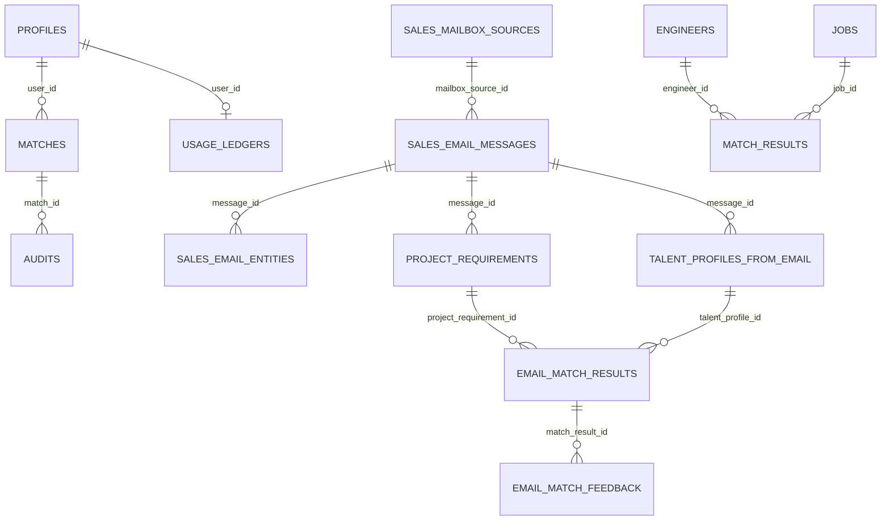

# 💾 Mighty Skill-Bridge: データベース設計書 (database.md)

**Mighty-Link AI Connect: Project "Mighty Skill-Bridge"**
*本番稼働中スキーマの正本ドキュメント。エンジニア／案件のフィット診断、社内HR（適性・勤怠）、営業メールAIマッチング、フィードバック／サポート、利用アナリティクス／SLA を横断するデータモデルを記述する。*

> ⚠️ **正本の所在（Single Source of Truth）**
> スキーマの正本はコードです。本ドキュメントは読解用の要約であり、DDL の正本ではありません。
>
> - **Supabase 本番スキーマの正本**: [`supabase/migrations`](../supabase/migrations)（プロダクトドメイン表 + RLS + SLA ビュー）
> - **アプリ実行時スキーマ**: [`db/migrations`](../db/migrations)（`postgres` / `sqlite` / `rollback`。legacy `engineers` / `jobs` / `match_results` と互換層）
> - **起動時ブートストラップ**: `src/app.py` の `init_db()`（Cloud Run コールドスタートおよびローカル SQLite フォールバック用に冪等作成）
> - **変更管理手順**: [`docs/DB_MIGRATION_MANAGEMENT_RUNBOOK.md`](./DB_MIGRATION_MANAGEMENT_RUNBOOK.md)
>
> Supabase 公式のベストプラクティス（2026-07 確認）に従い、本番 DB を直接変更せず、すべての DDL は `supabase/migrations` のファイルを経由する。公開スキーマ（`public`）の全テーブルは RLS を有効化する。

---

## 1. アーキテクチャ概要

| 層 | 採用技術 | 役割 |
| :--- | :--- | :--- |
| 認証 | **Firebase Auth** | ユーザー ID (`user_id` = Firebase UID) の発行。JWT の `sub` を RLS 判定に使用。 |
| データベース | **Supabase PostgreSQL 17.6** | 本番データ永続化。プロダクトドメイン表・RLS・SLA KPI ビュー。 |
| 行レベル認可 | **Row Level Security (RLS)** | `public.firebase_uid()`（JWT `sub` 抽出関数）を用い、本人データのみアクセス許可。 |
| ローカル／フォールバック | **SQLite** | オフライン開発・テスト・AI 未接続時の deterministic fallback 用の互換スキーマ。 |
| 接続 | **Supavisor (transaction pooler, IPv4)** | Firebase Functions / FastAPI からのプール接続（T759 / T795）。 |

本番 DB は現在 **22 テーブル**が適用済みで、`uptime_checks` および 6 つの SLA KPI ビューは `supabase/migrations` に定義済みだが本番適用待ち（T778、`SUPABASE_DB_URL` を要する運用者工程）である。リポジトリ全体では **23 テーブル + 6 ビュー**を定義する。

> **DDL 正本一元化（R114 / R117 の教訓）**: `init_db()` が作成する全テーブルは必ず正規の migration ソース（`supabase/migrations` または `db/migrations`）にも定義される。migration にない表を `init_db()` だけが作る状態（＝本番未適用ドリフト）を防ぐため、[`scripts/audit_schema_doc_consistency.py`](../scripts/audit_schema_doc_consistency.py) がこの索引と実スキーマの整合を CI で検証する。

---

## 2. ドメイン別 ER 図

*完全なカラム定義・制約・インデックス・RLS ポリシーは各 migration ファイルを正とする（本書は関係の俯瞰）。*

---

## 3. ドメイン別テーブル詳細

### 3.1 コア診断ドメイン（Firebase Auth + RLS / `supabase/migrations/20260606000000_init_schema.sql`）

| テーブル | 主なカラム | 説明 |
| :--- | :--- | :--- |
| `profiles` | `user_id`(Firebase UID, UNIQUE), `name`, `email`, `resume_profile`(JSONB) | 本人プロフィール。`firebase_uid()` により本人のみ read/update/insert。 |
| `matches` | `user_id`, `project_id`, `fit_score`(NUMERIC), `score_details`(JSONB), `matched_skills`/`missing_skills`(TEXT[]) | 4 軸フィット診断結果。`user_id` で `profiles` に FK。 |
| `audits` | `match_id`(FK), `prompt_version`, `raw_prompt`, `raw_response`, `tokens_used` | AI 判定の監査ログ（プロンプト／応答／トークン）。 |
| `usage_ledgers` | `user_id`(UNIQUE), `daily_calls_count`, `daily_tokens_count`, `limit_exceeded`, `reset_at` | 日次利用量・上限管理（サーキットブレーカー基盤）。 |

### 3.2 レガシー互換（アプリ実行時 / `db/migrations/postgres/20260614000000_app_core_schema.sql`）

初期 PoC（T102）からの互換表。現行 UI／API の一部と SQLite フォールバックが参照する。`supabase/migrations` には含めず、`db/migrations` と `init_db()` で管理する。

| テーブル | 主なカラム | 説明 |
| :--- | :--- | :--- |
| `engineers` | `name`, `resume_raw`, `parsed_skills`, `career_goals` | エンジニア経歴（構造化スキルは JSON テキスト）。 |
| `jobs` | `title`, `company`, `job_description`, `parsed_requirements`, `company_culture` | 案件情報（必須／歓迎スキルは JSON テキスト）。 |
| `match_results` | `engineer_id`(FK), `job_id`(FK), `fit_ratio`, `score_skill`/`score_culture`/`score_growth`/`score_performing`, `interview_questions` | 4 次元フィット分析結果（Sheets マッチングログ連携ベース）。 |

### 3.3 フィードバック／サポートドメイン

| テーブル | 定義元 | 説明 |
| :--- | :--- | :--- |
| `feedback_events` | `20260616000000_feedback_events.sql` | 診断結果の「役立った/改善したい」・NPS・任意コメント（1000 字上限）。 |
| `support_requests` | `20260616000001_support_requests.sql` | 問い合わせ（category/priority/status のステートマシン）。 |

### 3.4 営業メール AI マッチングドメイン（9 テーブル / `20260618000000_sales_email_matching_schema.sql`）

個人情報最小化のため、送信者・本文は **ハッシュ（CHAR(64)）+ redacted excerpt（≤1000 字）のみ**保存し、本文全文・直接連絡先は保持しない（T817_7 / T817_7_1）。

| テーブル | 説明 |
| :--- | :--- |
| `sales_mailbox_sources` | 取り込み元（gmail/eml/txt/csv/api）と保持日数。 |
| `sales_email_messages` | 取り込みメール（`dedupe_key` UNIQUE で重複排除、`sender_hash`/`body_hash`）。 |
| `sales_email_entities` | 抽出エンティティ（project/talent/company/skill/condition）と信頼度。 |
| `project_requirements` | 案件要件（必須／歓迎スキル JSONB、単価、勤務地、リモート区分、レビュー状態）。 |
| `talent_profiles_from_email` | 匿名化人材プロファイル（`anonymized_talent_key` UNIQUE）。 |
| `requirement_skill_tags` | 案件／人材のスキルタグ（importance: required/nice_to_have）。 |
| `email_parse_runs` | 抽出バッチ実行ログ（件数、モデル名、fallback 有無）。 |
| `email_match_results` | 双方向マッチ結果（direction、score、matched/missing/mismatch）。 |
| `email_match_feedback` | 人間レビューの採用／却下／補正ログ。 |

### 3.5 社内 HR ドメイン（適性・勤怠）

要配慮情報を避ける設計。`subject_pseudonym`（仮名）と同意バージョン必須、直接識別子・原本ファイル名は保存しない（T840 / T841）。

| テーブル | 定義元 | 説明 |
| :--- | :--- | :--- |
| `employee_assessment_responses` | `20260624000000_employee_assessment_responses.sql` | 社内適性・状況アンケート（motivation/culture 1–5、同意必須、削除期限）。 |
| `attendance_punch_events` | `20260624000001_attendance_workflow.sql` | 勤怠打刻（clock_in/out・break）。 |
| `attendance_timesheet_imports` | `20260624000001_attendance_workflow.sql` | 勤務表 CSV/Excel 集計（労働/残業/深夜/休日、承認状態）。原本非保存・`file_digest` のみ。 |

### 3.6 アナリティクス／SLA ドメイン

| オブジェクト | 定義元 | 説明 |
| :--- | :--- | :--- |
| `usage_analytics_events` | `20260627000200_usage_analytics_events.sql` | 匿名イベント計測（`session_pseudonym`、個人情報最小化）。 |
| `uptime_checks` ⏳ | `20260705000000_sla_measurement_views.sql` | 死活監視の記録（UP/WARNING/DOWN、応答 ms）。**本番適用待ち (T778)**。 |
| SLA KPI ビュー 6 種 ⏳ | 同上 | 日次診断／週次アクティブ／週次匿名セッション／月次可用性／日次 P95／週次診断精度。**本番適用待ち (T778)**。 |

---

## 4. 行レベルセキュリティ (RLS)

Supabase 公式ガイド（2026-07 確認）に従い、**公開スキーマ (`public`) の全テーブルで RLS を有効化**する。認可は Firebase Auth の JWT `sub`（Firebase UID）を抽出する `public.firebase_uid()` 関数で判定し、本人データのみを許可する。匿名・認証済みロールへの直アクセスは剥奪し、サービス層（Firebase Functions / FastAPI）経由の利用を前提とする（営業メール系・HR 系は特に厳格）。RLS ポリシー本文の正本は各 migration ファイルにある。

---

## 5. 全オブジェクト索引（機械可読）

> 下表は [`scripts/audit_schema_doc_consistency.py`](../scripts/audit_schema_doc_consistency.py) がパースし、実スキーマソースとのドリフトを検証する。行の追加・削除は migration の変更と同一 PR で行うこと。⏳ = 本番適用待ち。

<!-- SCHEMA-INVENTORY:START -->

| 名前 | 種別 | ドメイン | 定義元 | RLS | 本番反映 |
| :-- | :-- | :-- | :-- | :-- | :-- |
| `profiles` | テーブル | コア診断 | supabase/migrations | 有 | 適用済 |
| `matches` | テーブル | コア診断 | supabase/migrations | 有 | 適用済 |
| `audits` | テーブル | コア診断 | supabase/migrations | 有 | 適用済 |
| `usage_ledgers` | テーブル | コア診断 | supabase/migrations | 有 | 適用済 |
| `engineers` | テーブル | レガシー互換 | db/migrations | 有 | 適用済 |
| `jobs` | テーブル | レガシー互換 | db/migrations | 有 | 適用済 |
| `match_results` | テーブル | レガシー互換 | db/migrations | 有 | 適用済 |
| `feedback_events` | テーブル | フィードバック/サポート | supabase/migrations | 有 | 適用済 |
| `support_requests` | テーブル | フィードバック/サポート | supabase/migrations | 有 | 適用済 |
| `sales_mailbox_sources` | テーブル | 営業メールAI | supabase/migrations | 有 | 適用済 |
| `sales_email_messages` | テーブル | 営業メールAI | supabase/migrations | 有 | 適用済 |
| `sales_email_entities` | テーブル | 営業メールAI | supabase/migrations | 有 | 適用済 |
| `project_requirements` | テーブル | 営業メールAI | supabase/migrations | 有 | 適用済 |
| `talent_profiles_from_email` | テーブル | 営業メールAI | supabase/migrations | 有 | 適用済 |
| `requirement_skill_tags` | テーブル | 営業メールAI | supabase/migrations | 有 | 適用済 |
| `email_parse_runs` | テーブル | 営業メールAI | supabase/migrations | 有 | 適用済 |
| `email_match_results` | テーブル | 営業メールAI | supabase/migrations | 有 | 適用済 |
| `email_match_feedback` | テーブル | 営業メールAI | supabase/migrations | 有 | 適用済 |
| `employee_assessment_responses` | テーブル | 社内HR | supabase/migrations | 有 | 適用済 |
| `attendance_punch_events` | テーブル | 社内HR | supabase/migrations | 有 | 適用済 |
| `attendance_timesheet_imports` | テーブル | 社内HR | supabase/migrations | 有 | 適用済 |
| `usage_analytics_events` | テーブル | アナリティクス/SLA | supabase/migrations | 有 | 適用済 |
| `uptime_checks` | テーブル | アナリティクス/SLA | supabase/migrations | 有 | 適用待ち(T778) |
| `kpi_daily_diagnoses` | ビュー | アナリティクス/SLA | supabase/migrations | - | 適用待ち(T778) |
| `kpi_weekly_active_users` | ビュー | アナリティクス/SLA | supabase/migrations | - | 適用待ち(T778) |
| `kpi_weekly_anonymous_sessions` | ビュー | アナリティクス/SLA | supabase/migrations | - | 適用待ち(T778) |
| `kpi_monthly_availability` | ビュー | アナリティクス/SLA | supabase/migrations | - | 適用待ち(T778) |
| `kpi_daily_response_time` | ビュー | アナリティクス/SLA | supabase/migrations | - | 適用待ち(T778) |
| `kpi_weekly_diagnosis_accuracy` | ビュー | アナリティクス/SLA | supabase/migrations | - | 適用待ち(T778) |

<!-- SCHEMA-INVENTORY:END -->

**集計**: テーブル 23（適用済 22 + 適用待ち 1）／ビュー 6（適用待ち 6）。

---

## 6. スキーマ変更時のチェックリスト

1. `supabase/migrations`（本番）または `db/migrations`（アプリ実行時）へ migration ファイルを追加する（本番 DB を直接変更しない）。
2. `public` スキーマの新規テーブルは RLS を有効化し、`anon`/`authenticated` 権限を明示管理する。
3. 本書 §5 の索引へ行を追加し、`種別`／`定義元`／`RLS`／`本番反映` を記入する。
4. `python -m pytest tests/test_schema_doc_consistency.py` と `python scripts/audit_schema_doc_consistency.py` を実行し、10 仮説が全数 PASS（ドリフト 0）であることを確認する。
5. 本番適用は [`docs/DB_MIGRATION_MANAGEMENT_RUNBOOK.md`](./DB_MIGRATION_MANAGEMENT_RUNBOOK.md) に従い、適用証跡を残す（R114 / R117 再発防止）。

---
*T102 で新規作成、T880 (2026-07-09) で本番稼働スキーマ（23 テーブル + 6 ビュー）へ全面現状化。ドリフトは `scripts/audit_schema_doc_consistency.py` が継続検証する。*
