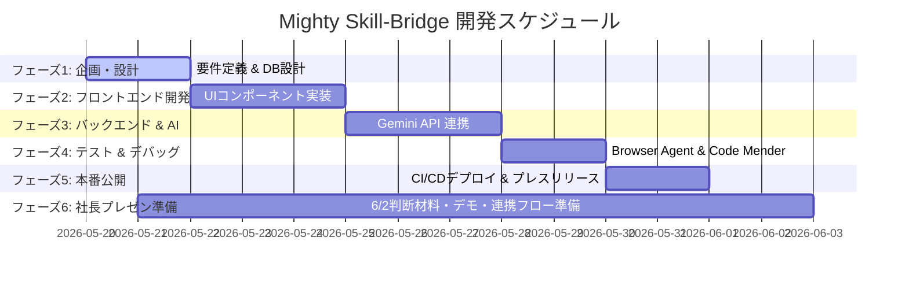

# Mighty Skill-Bridge NotebookLM Source Pack

Generated: 2026-05-29 00:23:31 UTC+09:00

## Purpose

This source pack is designed for NotebookLM before the 2026-06-02 CEO meeting.
Use it to generate concise explanations, likely CEO questions, and decision
points about the prototype, WBS, Google Workspace sync, and knowledge-flow tools.

## Current WBS Snapshot

- Total tasks: 98
- Done: 98
- In progress: 0
- Not started: 0
- Completion rate: 100%
- CEO presentation phase tasks: 83
- CEO presentation phase done: 83

## Knowledge Flow Tasks

- T616: 開発フロー設計 / NotebookLM・Slack・Notion・Obsidian連携の役割分担整理 / 完了 / 2026-05-21 - 2026-05-21
- T617: NotebookLM連携 / 社長説明用のNotebookLM投入資料パックと利用シーン整理 / 完了 / 2026-05-21 - 2026-05-21
- T618: Slack連携 / 進捗通知・レビュー依頼・決定ログ共有のSlack運用設計 / 完了 / 2026-05-24 - 2026-05-25
- T619: Notion連携 / 仕様・議事録・意思決定DB・バックログ管理のNotion運用設計 / 完了 / 2026-05-25 - 2026-05-26
- T620: Obsidian連携 / ローカルナレッジ・ADR・プロンプト資産のObsidian運用設計 / 完了 / 2026-05-26 - 2026-05-27
- T621: 連携デモ導線 / 4ツール連携を社長へ見せる説明順・画面遷移・価値訴求整理 / 完了 / 2026-05-21 - 2026-05-21
- T622: 権限・情報管理 / NotebookLM/Slack/Notion/Obsidian利用時の権限・機密情報ルール整理 / 完了 / 2026-05-27 - 2026-05-28
- T623: 連携採用判断 / 6/2で決める連携ツール優先順位・導入範囲・責任分担の確認リスト作成 / 完了 / 2026-05-21 - 2026-05-21
- T624: 連携成果物生成 / NotebookLM/Slack/Notion/Obsidianデモ成果物生成スクリプト実装 / 完了 / 2026-05-21 - 2026-05-21
- T625: NotebookLM実体化 / NotebookLM投入用Source Pack生成と想定質問セット作成 / 完了 / 2026-05-21 - 2026-05-21
- T626: Slack実体化 / 社長レビュー向けSlack進捗投稿案の生成 / 完了 / 2026-05-21 - 2026-05-21
- T627: Notion実体化 / Notion用意思決定DB・バックログCSVの生成 / 完了 / 2026-05-21 - 2026-05-21
- T628: Obsidian実体化 / Obsidian vault雛形・ADR・議事録・プロンプトノート生成 / 完了 / 2026-05-21 - 2026-05-21
- T629: 連携UIデモ / 公開デモ/ローカルUIへ開発ナレッジ連携デモセクション追加 / 完了 / 2026-05-21 - 2026-05-21
- T630: 連携APIデモ / FastAPIにKnowledge Flow生成・状態確認APIを追加 / 完了 / 2026-05-21 - 2026-05-21
- T631: 連携成果物検証 / 生成成果物・公開URL・API・Sheets/Calendar同期の総合確認 / 完了 / 2026-05-21 - 2026-05-21
- T632: GitHub Issues連携 / GitHub Issuesに6/2社長デモ向け連携タスクを起票 / 完了 / 2026-05-21 - 2026-05-21
- T633: GitHub Project連携 / GitHub Project board取得・配置のCLI権限確認 / 完了 / 2026-05-21 - 2026-05-23
- T634: NotebookLM実連携 / NotebookLM投入用Source PackをGoogle Drive/Docsへアップロード / 完了 / 2026-05-21 - 2026-05-21
- T635: Notion実連携 / Notion MCPで社長デモ用の連携証跡ページを作成 / 完了 / 2026-05-21 - 2026-05-21
- T636: Slack連携確認 / Slack CLI/MCPの利用可否と投稿先確認フローを整理 / 完了 / 2026-05-21 - 2026-05-21
- T637: Obsidian実連携 / Obsidian vaultとして開ける設定ファイルを追加 / 完了 / 2026-05-21 - 2026-05-21
- T638: 連携証跡台帳 / CLI/MCP連携の実行結果を社長説明用ドキュメントへ集約 / 完了 / 2026-05-21 - 2026-05-21
- T640: 連携デモリハーサル / NotebookLM/Slack/Notion/Obsidian/GitHubのデモ順を通しで確認 / 完了 / 2026-05-22 - 2026-05-23
- T642: NotebookLMプレゼン資料化 / NotebookLMでプレゼン資料を作るためのPresentation Brief生成とGoogle Docs化 / 完了 / 2026-05-21 - 2026-05-21
- T643: NotebookLMスライド草案 / NotebookLMへSource Pack and Presentation Briefを投入し、8枚以内のプレゼン草案を作る / 完了 / 2026-05-22 - 2026-05-22
- T646: Slack送信権限確認 / Slack投稿先チャンネルと送信権限を確認し、投稿案を実送信できる状態にする / 完了 / 2026-05-24 - 2026-05-25
- T648: Workspace Google Docs再作成 / NotebookLM用Google Docsをk-umezawa@ml-mightylink.com所有で再作成 / 完了 / 2026-05-22 - 2026-05-22
- T650: NotebookLM CLI認証復旧 / NotebookLM CLIをk-umezawa@ml-mightylink.comで再認証 / 完了 / 2026-05-22 - 2026-05-22
- T651: NotebookLM Agent Brief取得 / NotebookLMの要約をAIエージェント開発入力として保存 / 完了 / 2026-05-22 - 2026-05-22
- T653: Slack連携実送信準備 / Slack送信ツール・投稿先チャンネル・社長共有範囲の確定 / 完了 / 2026-05-24 - 2026-05-25
- T654: Notion証跡更新 / NotebookLM docs同期結果をNotion証跡ページ配下に追加 / 完了 / 2026-05-22 - 2026-05-22
- T655: Obsidian Agent Brief導線 / Obsidian vaultにNotebookLM Agent Brief参照導線を追加 / 完了 / 2026-05-22 - 2026-05-22
- T656: NotebookLM補助ログイン導線 / NotebookLM CLIのログイン保存を補助するWorkspace専用スクリプト作成 / 完了 / 2026-05-22 - 2026-05-22
- T657: NotebookLM社長スライド草案取得 / NotebookLMからCEO向け8枚以内のプレゼン草案を取得して保存 / 完了 / 2026-05-22 - 2026-05-22
- T658: NotebookLM PowerPoint化 / NotebookLM CLIで取得したCEO Slide Outlineを社長説明用PowerPointへ変換 / 完了 / 2026-05-22 - 2026-05-22
- T660: Notion PPTX証跡更新 / Notion MCPでPPTX生成・Drive共有・残課題を証跡ページへ記録 / 完了 / 2026-05-22 - 2026-05-22
- T662: Slack MCP/CLI到達性証跡 / Slack CLIと送信MCPの利用可否を確認し、投稿案と残課題を整理 / 完了 / 2026-05-22 - 2026-05-22
- T663: 6/2資料最終パックレビュー / PPTX、NotebookLM資料、WBS、Calendar、Issue、Notion証跡を通しで確認 / 完了 / 2026-05-30 - 2026-06-01
- T664: 三ツール開発フロー整備 / Antigravity + Gemini / VSCode + Codex / VSCode + Claude Codeの役割と毎セッション運用ルールを共有手順へ固定 / 完了 / 2026-05-22 - 2026-05-22

## Recommended NotebookLM Questions

1. 6/2の社長打ち合わせで、最初に説明すべき到達点を3分で要約してください。
2. NotebookLM / Slack / Notion / Obsidian の導入優先順位を比較してください。
3. 社長が確認すべきリスク、権限、情報管理ルールを一覧化してください。
4. 6/2後にWBSへ反映すべき次アクション候補を出してください。
5. このプロトタイプをサービス化する場合に、決めるべき事項と決めなくてよい事項を分けてください。

## Source: README.md

# Mighty-Link AI Connect

Mighty Skill-Bridge は、エンジニア経歴書と案件情報の AI フィット診断、WBS 管理、Google Workspace 連携を行うローカルプロトタイプです。

## Quick Start

```powershell
pip install -r requirements.txt
python src/app.py
```

ブラウザで `http://localhost:8000` を開きます。

公開デモURLを変更前後に確認する場合:

```powershell
python scripts/verify_public_demo.py --url https://kanta13jp1.github.io/mighty-link-ai-connect/
```

NotebookLM / Slack / Notion / Obsidian の社長説明用デモ成果物を生成する場合:

```powershell
python scripts/generate_knowledge_flow_demo.py
python scripts/generate_ceo_presentation_deck.py
```

CLI/MCPで実施した連携証跡は `docs/INTEGRATION_DEMO_EVIDENCE_2026-06-02.md` にまとめています。
NotebookLMでプレゼン資料のたたき台を作るための入力資料は `exports/knowledge_flow/notebooklm_presentation_brief.md` に生成されます。
NotebookLM CLIのCEO Slide OutlineをPowerPoint化した成果物は `exports/knowledge_flow/mighty_skill_bridge_ceo_presentation_2026-06-02.pptx` です。

Google Workspace 連携アカウントを確認する場合:

```powershell
python scripts/verify_google_workspace_account.py
```

## Documents

- [セットアップ・運用手順書](docs/SETUP_GUIDE.md)
- [Antigravity 2.0 開発ガイド](docs/ANTIGRAVITY_GUIDE.md)
- [Multi-AI 開発ワークフロー (3-tool 体制)](docs/MULTI_AI_WORKFLOW.md) - Antigravity+Gemini / VSCode+Codex / VSCode+Claude Code の役割分担と handoff 規約
- [Google Workspace 移行・共有作業手順書](docs/GOOGLE_WORKSPACE_MIGRATION_RUNBOOK.md)
- [Codex 継続作業メモ](docs/CODEX_CONTINUATION_NOTES.md)
- [Backend AI Pipeline 設計メモ](docs/BACKEND_AI_PIPELINE.md) - deterministic fallback と AI 監査ログ
- [6/2 社長打ち合わせ プレゼン準備ブリーフ](docs/CEO_PRESENTATION_PREP_2026-06-02.md)
- [6/2 社長打ち合わせ 判断材料パック](docs/CEO_PRESENTATION_DECISION_PACK_2026-06-02.md)
- [6/2 社長打ち合わせ 論点・選択肢・確認質問リスト](docs/CEO_PRESENTATION_DISCUSSION_POINTS_2026-06-02.md) - T605 deliverable
- [6/2 社長打ち合わせ 想定 QA パック](docs/CEO_PRESENTATION_QA_PACK_2026-06-02.md) - T607 deliverable
- [6/2 社長打ち合わせ 運用・体制・リスク・費用感 論点](docs/CEO_PRESENTATION_OPS_DISCUSSION_2026-06-02.md) - T606 deliverable
- [6/2 決定後ロードマップ枠](docs/CEO_PRESENTATION_POST_DECISION_ROADMAP_2026-06-02.md) - T615 deliverable
- [6/2 社長 事前共有メモ + 当日アジェンダ短文](docs/CEO_PRESENTATION_PRESHARE_MEMO_2026-06-02.md) - T614 deliverable
- [6/2 社長プレゼン Canva / Figma リデザイン手順 + 8 枚コピペカード](docs/CEO_PRESENTATION_CANVA_FIGMA_GUIDE_2026-06-02.md) - T658-extend (手動版)
- [Canva / Figma MCP セットアップ + 自動化フロー](docs/MCP_CANVA_FIGMA_SETUP_GUIDE_2026-06-02.md) - T658-mcp-extend (自動化版、推奨)
- [Figma Slides: Mighty Skill-Bridge CEO Brief 2026-06-02](https://www.figma.com/slides/PAQWzAUPoPTy3ibLcOmPDC) - 2026-05-24 Figma MCP で 9 slides 自動生成、当日プレゼン用第一候補
- [Branded PPTX on Drive: CEO Presentation Deck 2026-06-02 (Branded)](https://docs.google.com/presentation/d/1myH1m8TKiukdxR7F_EertJ1102CfglBC/edit?usp=drivesdk) - 2026-05-24 アップロード、PowerPoint フォールバック
- [UI Wireframes — Live Catalog (10 動くプロト)](exports/wireframes/index.html) - 2026-05-24 materialize、ローカル `python src/app.py` 起動後 `http://localhost:8000/exports/wireframes/` で 10 WF をブラウザ確認可能
- [UI Wireframes — Implementation-Ready Spec Pack](docs/wireframes/README.md) - 2026-05-24 生成、10 WF を AI に渡して即実装できる spec md x10 + 機械可読 JSON。社長 6/2 判断後の AI 実装着手用
- [UI Wireframes — 10 Patterns (Canva, Branded — Drive)](https://docs.google.com/presentation/d/1JKu7tAw1h4BqXMAsF41qolbQPUKj8KLW/edit?usp=drivesdk) - 2026-05-24 Canva MCP 生成、cyber palette フルカラー版、社長判断材料の第一候補
- [UI Wireframes — 10 Patterns (Canva — edit)](https://www.canva.com/d/Mft5giDcMgir88Y) / [view](https://www.canva.com/d/lLCcnCJnbJE9Xsa) - Canva 上で 12 ページを編集可能
- [UI Wireframes — 10 Patterns (greyscale, Drive)](https://docs.google.com/presentation/d/1qTdOWsLhUf0GzVDkztiuuLczcYkQuQfo/edit?usp=drivesdk) - 2026-05-24 python-pptx 生成、印刷向け greyscale 版
- [UI Wireframes Companion (Figma file)](https://www.figma.com/design/aiQt3c1Cenru4x6GMcLuL5) - Figma 上で 10 パターンを編集可能 (MCP rate limit 解除後に同内容を流し込み予定)
- [6/2 社長プレゼン 最終レビュー チェックリスト](docs/CEO_PRESENTATION_FINAL_REVIEW_CHECKLIST.md) - T663 deliverable
- [Sheets 追加タブ スキーマ (課題管理表 / QA 表)](docs/SHEETS_TRACKERS_SCHEMA.md)
- [開発ナレッジ連携フロー手順書](docs/DEVELOPMENT_KNOWLEDGE_FLOW.md)
- [6/2 社長デモ向け 連携実施証跡](docs/INTEGRATION_DEMO_EVIDENCE_2026-06-02.md)
- [プロジェクト構成方針](docs/PROJECT_STRUCTURE.md)
- [WBS 同期ガイド](docs/WBS_SYNC_GUIDE.md)
- [シーケンス図集 (Mermaid)](docs/SEQUENCE_DIAGRAMS.md) - 2026-05-26 新規。AI フィット診断 / Mock fallback / 3-tool 開発フロー / 採用 LP エントリー の 4 パターン
- [シーケンス図 HTML 版 (インタラクティブ)](exports/sequence-diagrams/index.html) - 同 4 図を Mermaid runtime で描画する HTML。公開デモから「Architecture」リンクで遷移

## Source: docs/CEO_PRESENTATION_PREP_2026-06-02.md

# 6/2 社長打ち合わせ プレゼン準備ブリーフ

作成日: 2026-05-21

## 前提

6/2 の社長打ち合わせまでは、実際の企画・サービス内容を決め打ちしない。
当日決定するための判断材料、デモ環境、論点、選択肢、次アクションの受け皿を整える。

## 打ち合わせの目的

- 現在のプロトタイプで何が見せられるかを短時間で共有する。
- Google Workspace 連携、WBS管理、公開デモ保護など、開発基盤の到達点を確認する。
- サービス内容・ターゲット・優先機能・6/2以降の開発方針を社長と決定する。
- 未決事項を残したままでも、次のWBS更新に即反映できる状態にする。

## 当日までに用意するもの

| 区分 | 内容 | 対応WBS |
| --- | --- | --- |
| デモ | 公開URL、Seedance API動画デモUI、ローカルFastAPI、Google Sheets WBS、Calendar同期状況 | T602, T603, T608, T667, T668 |
| 説明資料 | 目的、現状、デモ導線、判断ポイント、次アクション、1枚絵サマリー | T604, T610 |
| 論点整理 | サービス内容、対象ユーザー、収益/運用、優先機能、リスク、判断マトリクス | T605, T606, T611 |
| 想定QA | 社長からの質問、回答方針、保留時の扱い | T607 |
| 代替導線 | 公開URL障害時のローカル実行、スクリーンショット、ICS説明 | T613 |
| 事前共有 | 社長へ送る確認ポイント、当日アジェンダの短文ドラフト | T614 |
| 決定後の受け皿 | 議事録、WBS差し替え、Calendar更新、Git反映、決定後ロードマップ枠 | T609, T612, T615 |
| 開発ナレッジ連携 | NotebookLM、Slack、Notion、Obsidian を使った資料要約・通知・議事録・ローカル知識管理の候補整理 | T616, T617, T618, T619, T620, T621, T622, T623 |
| 連携デモ成果物 | NotebookLM投入資料、Slack投稿案、Notion CSV、Obsidian vault、UI/API生成導線 | T624, T625, T626, T627, T628, T629, T630, T631 |
| CLI/MCP連携証跡 | GitHub Issues、Google Drive/NotebookLM、Notion、Obsidian、Slack確認、GitHub Project権限課題、PowerPoint成果物 | T632, T633, T634, T635, T636, T637, T638, T639, T640, T641, T642, T643, T644, T645, T646, T647, T648, T649, T650, T651, T652, T653, T654, T655, T656, T657, T658, T659, T660, T661, T662, T663 |

## 関連ドキュメント

- [CEO_PRESENTATION_DECISION_PACK_2026-06-02.md](CEO_PRESENTATION_DECISION_PACK_2026-06-02.md): スライド構成、判断マトリクス、議事録テンプレート、デモ代替導線。
- [CEO_PRESENTATION_DISCUSSION_POINTS_2026-06-02.md](CEO_PRESENTATION_DISCUSSION_POINTS_2026-06-02.md): 17 論点 (D 系 / C 系 / O 系 / X 系) と当日 CEO への確認質問 (T605 deliverable)。
- [CEO_PRESENTATION_QA_PACK_2026-06-02.md](CEO_PRESENTATION_QA_PACK_2026-06-02.md): 22 想定 QA + 保留フロー + 機材チェックリスト (T607 deliverable)。
- [CEO_PRESENTATION_OPS_DISCUSSION_2026-06-02.md](CEO_PRESENTATION_OPS_DISCUSSION_2026-06-02.md): 開発体制・運用責任分担・リスク R9-R13・費用感 12 Q-OPS (T606 deliverable)。
- [CEO_PRESENTATION_POST_DECISION_ROADMAP_2026-06-02.md](CEO_PRESENTATION_POST_DECISION_ROADMAP_2026-06-02.md): 方向性 A/B/C/D 別の Phase 7 WBS テンプレ + 共通 Phase 7-common + 議事録 → WBS 反映手順 (T615 deliverable)。
- [CEO_PRESENTATION_PRESHARE_MEMO_2026-06-02.md](CEO_PRESENTATION_PRESHARE_MEMO_2026-06-02.md): 社長への事前共有メモ (長文 / 短文 / 当日アジェンダ短文) + 送付前チェックリスト (T614 deliverable)。
- [CEO_PRESENTATION_CANVA_FIGMA_GUIDE_2026-06-02.md](CEO_PRESENTATION_CANVA_FIGMA_GUIDE_2026-06-02.md): Canva PPTX import + Figma 代替パス + 8 枚コピペカード + Mighty Skill-Bridge ブランドカラー (T658-extend、手動版)。
- [MCP_CANVA_FIGMA_SETUP_GUIDE_2026-06-02.md](MCP_CANVA_FIGMA_SETUP_GUIDE_2026-06-02.md): Canva MCP + Figma MCP セットアップ + 自動化プロンプト + プラン別機能マトリクス (T658-mcp-extend、自動化版、推奨)。
- **Figma Slides ファイル (2026-05-24 自動生成)**: [Mighty Skill-Bridge CEO Brief 2026-06-02](https://www.figma.com/slides/PAQWzAUPoPTy3ibLcOmPDC) — Figma MCP `use_figma` で 9 slides (1 cover + 8 content) を Mighty Skill-Bridge brand colors + デモスクショ埋め込みで自動生成。当日の社長プレゼン用第一候補。
- **Branded PPTX on Google Drive (2026-05-24 アップロード)**: [Mighty Skill-Bridge CEO Presentation Deck 2026-06-02 (Branded)](https://docs.google.com/presentation/d/1myH1m8TKiukdxR7F_EertJ1102CfglBC/edit?usp=drivesdk) — `_branded.pptx` (Seedance cyber theme + デモスクショ embed) を k-umezawa@ml-mightylink.com 所有で Drive アップロード済。Figma が使えない / PowerPoint で操作したい場合のフォールバック。
- **UI Wireframes — Implementation-Ready Spec Pack (2026-05-24 生成、AI 実装着手用)**: [docs/wireframes/README.md](wireframes/README.md) — 10 WF を AI に渡して即実装できる spec md x10 (各 13 セクション: Identity / ASCII Layout / Component Tree / State Machine / Data Flow / Tokens / Interaction / A11y / Responsive / Out of Scope / Acceptance / LLM Prompt / Starter Snippet) + [exports/wireframes/wireframes_spec.json](../exports/wireframes/wireframes_spec.json) (機械可読版)。社長 6/2 判断後、`@docs/wireframes/WF-XX_*.md を実装` プロンプトで AI が `static/wireframes/wf-XX.html` を生成可能。
- **UI Wireframes — 10 Patterns (Canva, Branded — 2026-05-24 生成、第一候補)**: [Canva 版 PPTX on Drive](https://docs.google.com/presentation/d/1JKu7tAw1h4BqXMAsF41qolbQPUKj8KLW/edit?usp=drivesdk) / Canva 編集: <https://www.canva.com/d/Mft5giDcMgir88Y> / Canva 閲覧: <https://www.canva.com/d/lLCcnCJnbJE9Xsa> — Canva MCP (HANDOFF-26/27) 経由で 12 ページ (Cover + 10 patterns + Next Steps)、Mighty cyber palette 適用、WF-NN バッジ + 💡 Rationale prefix 付きフルカラー版。社長 UI 方向性判断の第一候補。
- **UI Wireframes — 10 Patterns (greyscale — 2026-05-24 生成、印刷用フォールバック)**: [python-pptx 版 PPTX on Drive](https://docs.google.com/presentation/d/1qTdOWsLhUf0GzVDkztiuuLczcYkQuQfo/edit?usp=drivesdk) — 同じ 10 パターン (Vertical Hero / Split Form / Step Wizard / Chat / DnD / Kanban / Comparison / Dashboard / Inline Live / Search Catalog) の greyscale wireframe 版。Figma companion: <https://www.figma.com/design/aiQt3c1Cenru4x6GMcLuL5> (Starter plan rate limit 解除後に同内容を MCP で構築予定)。
- [CEO_PRESENTATION_FINAL_REVIEW_CHECKLIST.md](CEO_PRESENTATION_FINAL_REVIEW_CHECKLIST.md): 6/1 21:00 JST Final Review 用 35 項目 checklist (T663 deliverable)。
- [SHEETS_TRACKERS_SCHEMA.md](SHEETS_TRACKERS_SCHEMA.md): 課題管理表 + QA表

## Source: docs/CEO_PRESENTATION_DECISION_PACK_2026-06-02.md

# 6/2 社長打ち合わせ 判断材料パック

作成日: 2026-05-21

## 位置づけ

この資料は、6/2 の社長打ち合わせで企画・サービス内容を決定するための判断材料です。
6/2 以前にサービス内容を確定させるものではなく、公開デモ、WBS、Google Workspace 連携、開発体制を見ながら、当日に意思決定しやすくするための下準備として扱います。

## 当日のゴール

- 現在のプロトタイプで見せられる価値を短時間で共有する。
- サービス方向性、対象ユーザー、最優先機能を社長と決める。
- 6/2 以降に更新する WBS、Calendar、Git 運用の入口を明確にする。
- 決めない事項と保留事項を分け、次回までのアクションに落とす。

## プレゼン構成案

| # | スライド | 伝えること | 対応WBS |
| --- | --- | --- | --- |
| 1 | 本日決めたいこと | 企画確定ではなく、方向性・優先順位・次アクションを決める場であること | T601, T610 |
| 2 | 現在の到達点 | 公開デモ、FastAPI、AI fallback、Sheets/Calendar 連携、公開URLガード | T603, T610 |
| 3 | 公開デモ | 経歴書/案件票からフィット診断へ進む体験を見せる | T602 |
| 4 | 管理基盤 | CATS型WBS、Summary、Timeline、Calendar同期で進捗管理できること | T603 |
| 5 | AI復帰時の伸びしろ | Gemini quota 回復後に structured context を渡して精度改善できること | T304, T305 |
| 6 | 方向性の選択肢 | 複数案を比較し、当日決める判断軸を提示する | T605, T611 |
| 7 | 運用・体制論点 | 誰が使うか、誰が更新するか、どこまで公開するか | T606 |
| 8 | リスクと対策 | 公開URL、認証、Google API、デモ障害時のバックアップ | T607, T613 |
| 9 | 決定後の反映方法 | 議事録から WBS / Calendar / Git へ即時反映する流れ | T609, T612 |
| 10 | 開発ナレッジ連携 | NotebookLM / Slack / Notion / Obsidian をどう使うか | T616, T617, T621, T623 |
| 11 | 連携成果物デモ | NotebookLM投入資料、Slack投稿案、Notion CSV、Obsidian vaultを見せる | T624, T625, T626, T627, T628, T629, T630 |
| 12 | CLI/MCP実連携証跡 | Google Drive、Notion、GitHub Issues、Project権限課題、Slack到達点を見せる | T632, T633, T634, T635, T636, T637, T638, T639 |
| 13 | NotebookLMプレゼン資料化 | NotebookLMでプレゼン草案を作る入力資料とプロンプトを見せる | T642, T643 |
| 14 | 社長への確認事項 | 決定してほしい項目、保留してよい項目、次回までの宿題 | T614, T615, T622, T631, T640, T641, T644, T645, T646 |

## 判断マトリクス

| 判断軸 | 方向性A: AIフィット診断支援 | 方向性B: Workspace連携型PM支援 | 方向性C: AI PoC高速構築支援 |
| --- | --- | --- | --- |
| 想定利用者 | 営業、人材担当、エンジニア | 経営、PM、現場責任者 | 新規事業、営業企画、開発責任者 |
| 見せやすいデモ | 経歴書と案件票のマッチング結果 | WBS、Sheets、Calendarの同期管理 | 短期間でAIデモを形にする流れ |
| 現プロトタイプとの親和性 | 高い | 高い | 中から高い |
| 6/2以降の初期実装 | スコア根拠、質問生成、案件候補管理 | WBS更新、社長レビュー、進捗可視化 | テンプレート化、デモ生成手順化 |
| 価値の説明しやすさ | 採用・SES・案件配属の効率化 | 経営報告と進捗管理の高速化 | 顧客提案速度と検証回数の増加 |
| 主なリスク | 入力データ品質、AI精度、個人情報 | 運用定着、権限管理、更新責任 | 汎用化しすぎて価値がぼやける |
| 6/2で決めたいこと | 最初の対象業務と評価指標 | 誰の管理業務に適用するか | どの顧客/案件でPoC化するか |

## 開発ナレッジ連携の判断材料

| ツール | 6/2までの位置づけ | 社長に見せる価値 | 確認したい判断 |
| --- | --- | --- | --- |
| NotebookLM | 資料要約・想定QA生成の候補 | 社長説明前に `docs/` とWBSを読み込み、論点を短時間で掴める | 社長向け説明準備に使うか |
| Slack | 進捗通知・レビュー依頼・同期結果共有の候補 | WBS同期、GitHub Actions、公開URL検証の結果を短文で追える | 通知先チャンネルと共有範囲 |
| Notion | 議事録・意思決定DB・バックログ管理の候補 | 6/2決定事項から次アクションまで一元管理できる | 公式台帳にするか |
| Obsidian | ローカル思考メモ・ADR・プロンプト資産管理の候補 | 未整理の設計判断を溜め、公式化する内容だけ `docs/` へ昇格できる | 個人メモ運用に限定するか |

詳細は [DEVELOPMENT_KNOWLEDGE_FLOW.md](DEVELOPMENT_KNOWLEDGE_FLOW.md) にまとめる。

## 実装済み連携デモ成果物

| 対象 | 生成物 | 説明 |
| --- | --- | --- |
| NotebookLM | `exports/knowledge_flow/notebooklm_source_pack.md` / `exports/knowledge_flow/notebooklm_source_pack.txt` | `docs/` とWBSをまとめた投入用資料。TXT版はGoogle Docs化済み。 |
| NotebookLM | `exports/knowledge_flow/notebooklm_presentation_brief.md` / `exports/knowledge_flow/notebooklm_presentation_brief.txt` | プレゼン資料のたたき台をNotebookLMで作るための入力資料。 |
| Slack | `exports/knowledge_flow/slack_ceo_update.md` | 社長レビュー前に投稿できる進捗共有文案。 |
| Notion | `exports/knowledge_flow/notion_decision_log.csv` | 意思決定DBとして取り込めるCSV。 |
| Notion | `exports/knowledge_flow/notion_backlog_import.csv` | WBS連携バックログとして取り込めるCSV。 |
| Obsidian | `exports/knowledge_flow/obsidian_vault/` | ADR、議事録、プロンプトを含むローカルvault雛形。 |
| UI/API | 公開デモの「開発ナレッジ連携デモ」 / `/api/knowledge-flow/generate` | 画面から成果物の存在を説明し、ローカルでは再生成できる。 |
| 連携証跡 | `docs/INTEGRATION_DEMO_EVIDENCE_2026-06-02.md` | Google Docs、Notionページ、GitHub Issues、Project/Slackの残課題を説明する。 |

このデモは、秘密情報を含まない範囲で外部連携の到達点も見せる。Slack投稿とGitHub Project配置は、投稿先・権限が整ってから正式化する。

## CLI/MCP実連携の見せ方

| 連携先 | 見せるもの | 補足 |
| --- | --- | --- |
| Google Drive / NotebookLM | https://docs.google.com/document/d/1qPjlbvvkfYdw0FrkPMz8JCnMjrIuPy3toEoH6hVriGQ/edit | Local OAuth Drive APIでTXT版をGoogle Docs化し、所有者が `k-umezawa@ml-mightylink.com` であることを確認した。 |
| Google Drive / NotebookLM Presentation | https://docs.google.com/document/d/1TFCrubKMa17L-ebIiMBPGpekabuEfd9NNQw3rVWpFoI/edit | プレゼン構成・話す要点・想定QAをNotebookLMで作るためのブリーフ。Local OAuth Drive APIでWorkspace側へ再作成済み。 |
| Google Drive / NotebookLM docs同期 | `exports/knowledge_flow/notebooklm_docs_manifest.json` | `docs/*.md` 22件をWorkspace所有Google Docsへ同期。NotebookLM CLI再認証後にsource追加とAgent Brief取得を実行する。 |
| Notion / NotebookLM証跡 | https://www.notion.so/3671d736b9db8164b46dc143befa29eb | docs同期、Issue #9/#10、NotebookLM CLI再認証手順をNotion証跡ページとして追加。 |
| Notion | https://www.notion.so/3671d736b9db818aaa33da0a5f1a3951 | 6/2社長デモ用の連携証跡ページ。 |
| GitHub Issues | https://github.com/kanta13jp1/mighty-link-ai-connect/issues | Issue #1-#11/#13/#14/#16で連携タスクと課題を管理。 |
| GitHub Project | Issue #5 / #8、WBS `T633`, `T641`, `T644`, `T645` | `gh` tokenの `read:project` / `project` スコープ復旧後にProjectへ配置。 |
| Slack | `exports/knowledge_flow/slack_ceo_update.md` | 送信先チャンネルと共有範囲を6/2に確認。 |

## 当日質問リスト

- 最初に解決したい業務課題は、営業支援、人材管理、PM支援、顧客提案のどれか。
- 社長が最初に見せたい相手は、社内、既存顧客、見込み顧客のどれか。
- 6/2 以降の2週間で、デモ品質、AI精度、運用基盤、資料化のどれを優先するか。
- Google Workspace 連携は、社内運用前提か、顧客提示価値の一部にするか。
- 公開URLの扱い

## Source: docs/DEVELOPMENT_KNOWLEDGE_FLOW.md

# 開発ナレッジ連携フロー手順書

作成日: 2026-05-21

## 目的

NotebookLM、Slack、Notion、Obsidian を開発フロー候補として整理し、6/2 の社長打ち合わせで「どこまで導入するか」「誰が使うか」「どの情報を流すか」を判断できる状態にする。

6/2 までは、実際の企画・サービス内容や正式運用範囲を決め打ちしない。ここでは、Mighty Skill-Bridge の開発・報告・意思決定を速くするための情報導線として扱う。

## 基本方針

- GitHub と `docs/` をコード・公式手順・変更履歴の主ソースにする。
- Google Sheets / Calendar は WBS、進捗、日程の主ソースにする。
- NotebookLM は社長説明前の資料読み込み・質問生成・要約支援の候補にする。
- Slack は進捗通知、レビュー依頼、短い意思決定ログの候補にする。
- Notion は議事録、意思決定DB、バックログ、社長レビュー用ページの候補にする。
- Obsidian はローカルの思考メモ、ADR、プロンプト資産、未整理アイデアの候補にする。
- 認証情報、個人情報、未承認の顧客情報は、外部サービスへ投入しない。

## ツール別の役割

| ツール | 主な役割 | 入れる情報 | 入れない情報 | 6/2で確認すること |
| --- | --- | --- | --- | --- |
| NotebookLM | 社長説明前の資料要約、質問生成、論点抽出 | `docs/` の手順書、WBS、判断材料パック | 認証JSON、個人情報、未承認顧客情報 | 社長向け説明準備に使うか |
| Slack | 日次進捗、レビュー依頼、障害/同期完了通知 | WBS更新、GitHub Actions結果、同期結果サマリー | 秘密鍵、全文ログ、未確認の個人データ | どのチャンネルに何を流すか |
| Notion | 議事録、意思決定DB、バックログ、社長レビュー資料 | 6/2決定事項、タスク、保留事項、ロードマップ | 認証情報、検証前の機密データ | 公式管理台帳にするか |
| Obsidian | ローカル知識ベース、ADR、プロンプト、アイデアメモ | 開発メモ、設計判断、プロンプト改善案 | 外部共有前提の正式資料のみ | 個人開発メモの置き場にするか |

## 推奨フロー案

1. Codex / Antigravity で実装・検証する。
2. 変更内容を `docs/`、`data/WBS.tsv`、Git commit に反映する。
3. WBS を Google Sheets と Calendar に同期する。
4. 社長説明前に、`docs/` の主要資料を NotebookLM に読み込ませ、想定質問と要約を作る。
5. 進捗・同期結果・レビュー依頼は Slack に短文で流す。
6. 6/2 の議事録と決定事項は Notion DB または Google Docs に集約する。
7. Obsidian には、公開前の設計メモ、ADR、プロンプト検証ログを残す。
8. 公式化した情報だけを `docs/` と WBS に戻し、Git 管理する。

## 6/2 プレゼンで見せる価値

- 社長が資料を読む時間を減らせる。
- 開発中の意思決定が Slack / Notion / WBS に残り、後から追える。
- 個人の思考メモと公式資料の境界を分けられる。
- Gemini quota 制限中でも、Codex、GitHub、Google Workspace、NotebookLM で開発判断を止めにくい。
- 6/2 後にサービス内容が決まったら、選んだ導線だけを正式運用へ昇格できる。

## 6/2 で決める確認事項

- NotebookLM は、社長向け説明資料の要約・QA生成に使うか。
- Slack は、社長向け通知まで含めるか、開発チーム内の通知に限定するか。
- Notion は、議事録と意思決定DBの公式台帳にするか。
- Obsidian は、個人/開発者メモに限定し、公式資料は `docs/` と Notion に戻す運用にするか。
- 4ツールすべてを導入するか、まずは NotebookLM + Notion など最小構成から始めるか。
- 機密情報、個人情報、認証情報の投入禁止ルールをどこまで文書化するか。

## 6/2 までの運用

- 確定機能として実装しない。
- API連携や自動投稿は、社長確認後に正式運用へ昇格する。
- ただし、社長に「実際にやった状態」を見せるため、認証情報や個人情報を含まない範囲で Google Drive / Notion / GitHub Issues への実体連携は証跡として実施する。
- Slack投稿は送信先チャンネルと共有範囲の確認後に行う。
- 手動で見せられる資料導線、画面導線、運用イメージを優先する。
- 追加した WBS タスク `T616` から `T641` は、連携採用判断と実体デモのための準備タスクとして扱う。

## 実装済みデモ成果物

2026-05-21 時点で、社長に「実際にやった状態」を見せるため、外部サービスへ送信しないローカル生成方式で以下を実装した。

生成コマンド:

```powershell
python scripts/generate_knowledge_flow_demo.py
```

ローカル FastAPI 起動中は、画面の「開発ナレッジ連携デモ」からも生成できる。

```text
POST /api/knowledge-flow/generate
GET  /api/knowledge-flow/status
```

生成先:

| 成果物 | パス | 見せ方 |
| --- | --- | --- |
| NotebookLM投入資料 | `exports/knowledge_flow/notebooklm_source_pack.md` / `exports/knowledge_flow/notebooklm_source_pack.txt` | TXT版をGoogle Docsへ変換し、NotebookLM source候補として見せる |
| NotebookLMプレゼンブリーフ | `exports/knowledge_flow/notebooklm_presentation_brief.md` / `exports/knowledge_flow/notebooklm_presentation_brief.txt` | NotebookLMで8枚以内の社長向けプレゼン構成・話す要点・想定QAを作る入力資料として使う |
| Slack投稿案 | `exports/knowledge_flow/slack_ceo_update.md` | 投稿前レビュー用の進捗共有文として見せる |
| Notion意思決定DB | `exports/knowledge_flow/notion_decision_log.csv` | Notion DBへCSV importする候補として見せる |
| Notionバックログ | `exports/knowledge_flow/notion_backlog_import.csv` | WBS連携バックログのimport候補として見せる |
| Obsidian vault | `exports/knowledge_flow/obsidian_vault/` | ローカルvaultとして開ける雛形を見せる |
| デモ手順 | `exports/knowledge_flow/CEO_KNOWLEDGE_FLOW_DEMO_GUIDE.md` | 6/2当日の説明順として使う |
| 連携証跡 | `exports/knowledge_flow/integration_evidence.md` | Drive、Notion、Issues、Project/Slackの到達点を見せる |

この実装では、`client_secret.json`, `credentials.json`, `authorized_user.json` は生成スクリプトから読み込まない。外部連携は、Codexセッションで明示的に実行したDriveアップロード、Notionページ作成、GitHub Issues起票の範囲に限定する。

## 2026-05-21 CLI/MCP 実連携証跡

| 対象 | 実施内容 | URL/結果 |
| --- | --- | --- |
| Google Drive / NotebookLM | `notebooklm_source_pack.txt` をLocal OAuth Drive APIでGoogle Docsへ変換 | https://docs.google.com/document/d/1qPjlbvvkfYdw0FrkPMz8JCnMjrIuPy3toEoH6hVriGQ/edit |
| Google Drive / NotebookLM Presentation | `notebooklm_presentation_brief.txt` をLocal OAuth Drive APIでGoogle Docsへ変換 | https://docs.google.com/document/d/1TFCrubKMa17L-ebIiMBPGpekabuEfd9NNQw3rVWpFoI/edit |
| Notion | 連携証跡ページをNotion MCPで作成 | https://www.notion.so/3671d736b9db818aaa33da0a5f1a3951 |
| GitHub Issues | CEOデモ向け連携タスクを8件起票 | https://github.com/kanta13jp1/mighty-link-ai-connect/issues |
| GitHub Project | `gh project list` と `gh auth refresh` を再試行 | `read:project` / `project` スコープ復旧が必要。Issue #5 / #8、WBS `T633`, `T641`, `T644`, `T645` で管理 |
| Slack | CLI/MCP利用可否を確認 | Slack CLI未検出、送信先チャンネル未確定。Issue #2 / WBS `T636` で管理 |

## 2026-05-22 Workspace OAuth Google Docs 再作成

Google Docsホームで資料が見えない問題に対応するため、Google Drive MCPではなく `authorized_user.json` のLocal OAuth Drive APIを使ってNotebookLM用Google Docsを再作成した。

- 実行アカウント: `k-umezawa@ml-mightylink.com`
- 検証コマンド: `python scripts/verify_google_workspace_account.py`
- 再作成コマンド: `python scripts/upload_notebooklm_docs_to_drive.py`
- Source Pack: https://docs.google.com/document/d/1qPjlbvvkfYdw0FrkPMz8JCnMjrIuPy3toEoH6hVriGQ/edit
- Presentation Brief: https://docs.google.com/document/d/1T

## Source: docs/INTEGRATION_DEMO_EVIDENCE_2026-06-02.md

# 6/2 社長デモ向け 連携実施証跡

作成日: 2026-05-21
更新日: 2026-05-22

## 目的

6/2 の社長打ち合わせで「実際にやった状態」を見せるため、NotebookLM、Slack、Notion、Obsidian、GitHub Issues、GitHub Project の連携状況を証跡として残す。

実際の企画・サービス内容は 6/2 に決定するため、本資料では開発フローとタスク管理の実装・確認結果だけを扱う。

## 実施済み

| 項目 | 実施内容 | 証跡 |
| --- | --- | --- |
| GitHub Issues | CEOデモ向け連携タスクを13件起票 | [#1](https://github.com/kanta13jp1/mighty-link-ai-connect/issues/1), [#2](https://github.com/kanta13jp1/mighty-link-ai-connect/issues/2), [#3](https://github.com/kanta13jp1/mighty-link-ai-connect/issues/3), [#4](https://github.com/kanta13jp1/mighty-link-ai-connect/issues/4), [#5](https://github.com/kanta13jp1/mighty-link-ai-connect/issues/5), [#6](https://github.com/kanta13jp1/mighty-link-ai-connect/issues/6), [#7](https://github.com/kanta13jp1/mighty-link-ai-connect/issues/7), [#8](https://github.com/kanta13jp1/mighty-link-ai-connect/issues/8), [#9](https://github.com/kanta13jp1/mighty-link-ai-connect/issues/9), [#10](https://github.com/kanta13jp1/mighty-link-ai-connect/issues/10), [#11](https://github.com/kanta13jp1/mighty-link-ai-connect/issues/11), [#13](https://github.com/kanta13jp1/mighty-link-ai-connect/issues/13) |
| NotebookLM / Google Drive | `notebooklm_source_pack.txt` をLocal OAuth Drive APIでGoogle Docsへ変換 | https://docs.google.com/document/d/1qPjlbvvkfYdw0FrkPMz8JCnMjrIuPy3toEoH6hVriGQ/edit |
| NotebookLM / プレゼン作成 | `notebooklm_presentation_brief.txt` をLocal OAuth Drive APIでGoogle Docsへ変換 | https://docs.google.com/document/d/1TFCrubKMa17L-ebIiMBPGpekabuEfd9NNQw3rVWpFoI/edit |
| Notion | Notion MCPで連携証跡ページを作成 | https://www.notion.so/3671d736b9db818aaa33da0a5f1a3951 |
| Obsidian | `exports/knowledge_flow/obsidian_vault/` にvault雛形と `.obsidian` 設定を追加 | `exports/knowledge_flow/obsidian_vault/Mighty Skill-Bridge Home.md` |
| Slack | 投稿案を生成し、CLI/MCP利用可否を確認 | `exports/knowledge_flow/slack_ceo_update.md` |
| Google Workspace OAuth | `authorized_user.json` の実行アカウントをDrive APIで検証 | `k-umezawa@ml-mightylink.com` |
| NotebookLM docs同期 | `docs/*.md` 22件をWorkspace Google Docsへ同期 | `exports/knowledge_flow/notebooklm_docs_manifest.json` |
| NotebookLM CLI | ローカルCLI認証とsource状態確認 | notebook `75521ea6-6b9b-47b2-9508-50050d8ab2d5`、22 sources ready |
| Notion証跡更新 | NotebookLM docs同期の子ページを作成 | https://www.notion.so/3671d736b9db8164b46dc143befa29eb |

## CLI / MCP 実行結果

| 操作 | コマンド/ツール | 結果 |
| --- | --- | --- |
| GitHub Issue起票 | `gh issue create` | Issue #1〜#11 と #13 を作成 (#12 はPR番号) |
| NotebookLMプレゼン導線 | `python scripts/upload_notebooklm_docs_to_drive.py` | Presentation Brief を `k-umezawa@ml-mightylink.com` 所有のGoogle Docsへ変換し直した |
| GitHub Project確認 | `gh project list --owner kanta13jp1 --format json` | `read:project` スコープ不足で停止 |
| GitHub Project認証再試行 | `gh auth refresh -h github.com -s read:project -s project` | 2分でタイムアウト。Issue #8として手動認証待ちに分離 |
| Google Drive連携 | `python scripts/upload_notebooklm_docs_to_drive.py` | TXT source pack を `authorized_user.json` 経由でGoogle Docsへ変換し、ownerが `k-umezawa@ml-mightylink.com` であることを確認 |
| Notion連携 | Notion MCP `_notion_create_pages` | GitHub配下のNotionページとして証跡を作成 |
| Slack CLI確認 | `Get-Command slack` | ローカルCLIは未検出 |
| Google Workspaceアカウント確認 | `python scripts/verify_google_workspace_account.py` | `authorized_user.json` が `k-umezawa@ml-mightylink.com` に紐づいていることを確認 |
| NotebookLM docs同期 | `python scripts/sync_docs_to_notebooklm.py` | Google Docs同期、NotebookLM source追加、Agent Brief、CEO Slide Outline生成が完了 |
| GitHub Issues追加 | `gh issue create` / `gh issue comment` | Issue #9 / #10 / #11 / #13を追加し、Issue #8へProject権限不足の最新状況を追記 |
| GitHub Issues完了反映 | `gh issue close` | Issue #7 / #9 / #10 / #11 / #13 を成果物リンク付きでクローズ |

## 2026-05-22 Google Docsアカウント修正

Google DocsホームでNotebookLM用資料が表示されない問題があったため、Codex/Google Drive MCPで作成した旧Docsではなく、ローカルOAuth `authorized_user.json` を使うDrive APIアップロードへ切り替えた。

- Source Pack: https://docs.google.com/document/d/1qPjlbvvkfYdw0FrkPMz8JCnMjrIuPy3toEoH6hVriGQ/edit
- Presentation Brief: https://docs.google.com/document/d/1TFCrubKMa17L-ebIiMBPGpekabuEfd9NNQw3rVWpFoI/edit
- owner: `k-umezawa@ml-mightylink.com`
- 証跡JSON: `exports/knowledge_flow/google_drive_workspace_docs.json`

## 2026-05-22 docs配下のNotebookLM同期

`scripts/sync_docs_to_notebooklm.py` を追加し、`docs/*.md` 22件をWorkspace所有のGoogle Docsへ同期した。NotebookLM CLIは補助ログイン導線で再認証し、source追加と要約取得まで完了した。

- Manifest: `exports/knowledge_flow/notebooklm_docs_manifest.json`
- Next steps: `exports/knowledge_flow/notebooklm_cli_next_steps.md`
- 再ログイン補助コマンド: `python scripts/notebooklm_login_workspace.py` → `python scripts/sync_docs_to_notebooklm.py`
- NotebookLM notebook: `75521ea6-6b9b-47b2-9508-50050d8ab2d5`
- Agent Brief: `exports/knowledge_flow/notebooklm_agent_brief.md`
- CEO Slide Outline: `exports/knowledge_flow/notebooklm_ceo_slide_outline.md`
- GitHub Issue #9: https://github.com/kanta13jp1/mighty-link-ai-connect/issues/9
- GitHub Issue #10: https://github.com/kanta13jp1/mighty-link-ai-connect/issues/10
- Notion子ページ: https://www.notion.so/3671d736b9db8164b46dc143befa29eb

## GitHub Project の現状

GitHub Project は、現在の

## Source: docs/BACKEND_AI_PIPELINE.md

# Backend AI Pipeline 設計メモ

作成日: 2026-05-21

## 目的

Gemini quota 復帰後に live AI を接続した瞬間、既存の FastAPI バックエンドへ自然に高度な推論を流し込めるよう、`src/app.py` の fallback ロジックを固定 mock から構造化された解析パイプラインへ拡張した。

## 今回の実装範囲

- スキル分類辞書 `SKILL_TAXONOMY` を追加。
- `ParsedProfile` データ構造を追加。
- 経歴書 / 案件票から以下を抽出する deterministic parser を追加。
  - タイトルまたは氏名
  - 役割
  - 経験年数
  - カテゴリ別スキル
  - 強み
  - 確認ポイント
- 4軸評価の deterministic evaluator を追加。
  - Skill-Fit
  - Culture-Fit
  - Growth-Fit
  - Performing-Fit
- `matched_skills` / `missing_skills` を含む `structured` payload を `/api/match` のレスポンスに追加。
- Gemini live 実行時の prompt に、local deterministic pre-parse / pre-score を structured context として渡す準備を追加。
- `/api/parse` / `/api/match` の判定結果を、後から根拠確認できるローカル監査ログへ保存。
- `/api/audit/recent` を追加し、直近の AI 判定イベントを raw document body なしで確認できるようにした。

## API 契約

### `/api/parse`

従来どおり `parsed_content` を返す。追加で `structured_profile` を返す。

```json
{
  "status": "success",
  "ai_mode": "deterministic_fallback",
  "parsed_content": "...",
  "audit_event_id": "a1b2c3d4e5f6...",
  "structured_profile": {
    "doc_type": "engineer",
    "title": "...",
    "role": "...",
    "experience_years": 8,
    "skills_by_category": {}
  }
}
```

### `/api/match`

従来の UI が使う `final_score`, `scores`, `summary`, `qa`, `roadmap_week1` から `roadmap_week4` は維持する。追加で AI 復帰時の橋渡しになる `structured` を返す。

```json
{
  "final_score": 89,
  "scores": {
    "skill": 95,
    "culture": 88,
    "growth": 92,
    "performing": 82
  },
  "ai_mode": "deterministic_fallback",
  "audit_event_id": "a1b2c3d4e5f6...",
  "structured": {
    "candidate": {},
    "job": {},
    "matched_skills": [],
    "missing_skills": []
  }
}
```

### `/api/audit/recent`

ローカル監査ログ `data/audit/ai_audit.jsonl` から直近イベントを返す。原文全文は保存せず、要約・スキル・スコア・短い excerpt・digest のみを扱う。

```json
{
  "status": "success",
  "audit_log": "data/audit/ai_audit.jsonl",
  "events": [
    {
      "event_id": "...",
      "timestamp_utc": "2026-05-21T...",
      "event_type": "match",
      "payload": {
        "ai_mode": "deterministic_fallback",
        "final_score": 93,
        "matched_skills": ["python", "fastapi"]
      }
    }
  ]
}
```

## Gemini 復帰時の接続方針

1. `AI_FORCE_MOCK` を解除する。
2. `GEMINI_API_KEY` を設定して `python src/app.py` を起動する。
3. `/api/parse` は deterministic pre-parse を Gemini prompt に渡し、Gemini が文脈補正する。
4. `/api/match` は deterministic pre-score を Gemini prompt に渡し、Gemini が深い評価文・Q&A・ロードマップへ昇華する。

## 運用メモ

- quota 中でも UI と Sheets 連携は止めない。
- deterministic fallback は最終品質ではなく、live AI に渡すための骨格と安全網。
- 監査ログ本体 `data/audit/*.jsonl` は Git 管理対象外。構成維持用の `.gitkeep` のみ管理する。
- 監査ログは Gemini 復帰後のプロンプト改善、スキル辞書調整、Sheets ログ拡張の検討材料として使う。
- 今後は `SKILL_TAXONOMY` を外部 JSON 化し、業務ドメイン別に差し替えられるようにする。

## Source: docs/WBS.md

# 📊 Mighty-Link AI Connect: プロジェクトWBS (作業分解構成図)

> [!NOTE]
> **本WBSの設計思想**
> 開発するプロダクト **『Mighty Skill-Bridge（エンジニア＆案件 AIフィットシミュレーター）』** を、Antigravity 2.0 およびGoogle Gemini APIの現行モデルを用いて開発するための完全詳細タスクリストです。
> 最新の **Google Workspace API (Sheets/Docs/Calendar) ＆ Gemini API 連携** の思想に基づき、スプレッドシートにコピペするだけで即座に動的なプロジェクト管理ボードとして機能するフォーマットで設計されています。

---

## 📅 WBS フェーズ別サマリー



---

## 📑 WBS 詳細テーブル

*※この表は、`data/WBS.tsv` ファイルからスプレッドシートにコピペするだけで、全く同じレイアウトでスプレッドシート上に再現されます。*

| タスクID | 大フェーズ | 小フェーズ | タスク名 | 担当 | 実行エンジン | Sheets Live 連携アクション |
| :--- | :--- | :--- | :--- | :--- | :--- | :--- |
| **T101** | 1. 企画・設計 | 要件定義 | `requirements.md` の策定 | 人間 + AI | Gemini API 現行モデル | 完了時に Docs Live へ自動文書書き出し |
| **T102** | 1. 企画・設計 | DB設計 | `database.md` とスキーマ設計 | AIエージェント | Gemini API 現行モデル | テーブル定義をスプレッドシートへ自動同期 |
| **T201** | 2. フロント開発 | UI/UX実装 | PDF/画像ドラッグ＆ドロップ画面 | AIエージェント | Antigravity 2.0 | 実装進捗を Sheets Live にリアルタイム反映 |
| **T202** | 2. フロント開発 | UI/UX実装 | フィット分析結果（レーダーチャート等） | AIエージェント | Antigravity 2.0 | UIコンポーネントのテスト結果をセルへ記録 |
| **T301** | 3. バックエンド | API開発 | ファイルアップロード＆パースAPI | AIエージェント | Gemini API 現行モデル | API仕様書を Docs Live に自動同期 |
| **T302** | 3. バックエンド | AIコア連携 | Gemini API マルチモーダル解析 | AIエージェント | Gemini API 現行マルチモーダルモデル | プロンプト応答ログを Sheets Live に蓄積 |
| **T303** | 3. バックエンド | 提案生成 | 面談想定質問＆育成ロードマップ生成 | AIエージェント | Gemini API 現行モデル | 生成結果のフォーマットを Sheets 側で管理 |
| **T304** | 3. バックエンド | AI基盤肉付け | 構造化プロファイル抽出・4軸スコアリングfallback実装 | Codex | VSCode + Codex | AI復帰時に渡す structured_profile / gap_analysis を Sheets ログへ拡張可能にする |
| **T305** | 3. バックエンド | AI監査基盤 | AI判定監査ログ(JSONL)・recent audit API実装 | Codex | VSCode + Codex | AI評価根拠・matched/missing skills をローカル監査ログへ蓄積し復帰後の改善に利用 |
| **T306** | 3. バックエンド | 公開デモ保護 | GitHub Pages root index ガード・CI検証 | Codex | VSCode + Codex | 社長共有済み公開URLのREADME fallbackを防止し、push前後のUIマーカー検証を必須化 |
| **T307** | 3. バックエンド | WBS可視化強化 | CATS型WBSスプレッドシートUI・集計/タイムラインタブ実装 | Codex | VSCode + Codex | 参照WBSに近い階層・進捗・予定/実績・集計ビューをSheetsへ自動生成 |
| **T401** | 4. 検証・品質 | テスト実行 | Browser Agent による自律UI/UXテスト | AIエージェント | Browser Agent | テスト合格率・バグ率を Sheets Live にプロット |
| **T402** | 4. 検証・品質 | セキュリティ | Code Mender による脆弱性自動修正 | AIエージェント | Code Mender | 脆弱性修復ログを Sheets セキュリティタブに同期 |
| **T501** | 5. デプロイ | インフラ | CI/CD（GitHub Actions）設定 | AIエージェント | Gemini API 現行モデル | デプロイ成否・本番URLを Sheets に自動書き込み |
| **T502** | 5. デプロイ | リリース | プレスリリース・SNS告知文の自動生成 | 人間 + AI | Gemini API 現行モデル | 告知文候補（3パターン）を Docs Live に書き出し |
| **T601** | 6. 社長プレゼン準備 | 方針整理 | 6/2打ち合わせの目的・決定事項・判断軸整理 | Codex | VSCode + Codex | プレゼン準備ブリーフをDocs/Sheetsへ同期できる形で整備 |
| **T602** | 6. 社長プレゼン準備 | デモ構成 | 公開URLデモの見せ方・説明順・想定操作シナリオ設計 | Codex | VSCode + Codex | デモシナリオと確認観点をWBS Summaryへ反映 |
| **T603** | 6. 社長プレゼン準備 | 安定稼働確認 | 公開URL・ローカルAPI・Google Sheets同期の本番前ヘルスチェック | Codex | VSCode + Codex | Public Demo Guardと同期結果を作業ログへ記録 |
| **T604** | 6. 社長プレゼン準備 | 資料骨子 | 社長向けプレゼン構成・スライド見出し・説明順の作成 | Codex | VSCode + Codex | 決定前提ではなく判断材料としてプレゼン骨子を管理 |
| **T605** | 6. 社長プレゼン準備 | 選択肢整理 | サービス内容決定前の論点・選択肢・確認質問リスト化 | Claude Code | VSCode + Claude Code | `CEO_PRESENTATION_DISCUSSION_POINTS_2026-06-02.md` へ6/2で決める論点・未決事項を整理済 |
| **T606** | 6. 社長プレゼン準備 | 運用・体制論点 | 6/2以降の開発体制・運用・リスク・費用感の論点整理 | Claude Code | VSCode + Claude Code | `CEO_PRESENTATION_OPS_DISCUSSION_2026-06-02.md` へ社長確認が必要な運用論点を整理済 |
| **T607** | 6. 社長プレゼン準備 | 想定QA | 社長からの想定質問・回答方針・保留時の対応整理 | Claude Code | VSCode + Claude Code | `CEO_PRESENTATION_QA_PACK_2026-06-02.md` へ想定QAと保留時対応を整理済 |
| **T608** | 6. 社長プレゼン準備 | 最終リハーサル | 公開デモ・WBS・説明資料の最終確認とバックアップ準備 | 人間 + Codex | VSCode + Codex | 最終チェック結果とバックアップURL/手順を記録 |
| **T609** | 6. 社長プレゼン準備 | 決定事項反映準備 | 6/2打ち合わせ後の決定事項・次期WBS反映テンプレート作成 | Codex | VSCode + Codex | 議事録後すぐWBS/Calendarへ反映できる更新枠を準備 |
| **T610** | 6. 社長プレゼン準備 | スライド化素材 | 1枚絵サマリー・デモ導線・判断ポイントのスライド素材整理 | Codex | VSCode + Codex | プレゼン当日の説明順をDocs化し、未確定内容は選択肢として明記 |
| **T611** | 6. 社長プレゼン準備 | 判断マトリクス | サービス方向性・対象ユーザー・優先機能の判断マトリクス作成 | Codex | VSCode + Codex | 6/2で決める選択肢を比較表として整理 |
| **T612** | 6. 社長プレゼン準備 | 議事録テンプレート | 決定事項・保留事項・次アクション記録テンプレート作成 | Codex | VSCode + Codex | 打ち合わせ直後にWBS/Calendar/Gitへ反映できる議事録枠を準備 |
| **T613** | 6. 社長プレゼン準備 | デモバックアップ | 公開URL障害時のローカル実行・スクリーンショット代替手順整理 | Codex | VSCode + Codex | Public Demo Guard結果と代替導線を本番前チェックリストへ反映 |
| **T614** | 6. 社長プレゼン準備 | 事前送付メモ | 社長へ事前共有する確認ポイント・当日アジェンダ短文作成 | Claude Code | VSCode + Claude Code | `CEO_PRESENTATION_PRESHARE_MEMO_2026-06-02.md` へ長文版・短文版・当日アジェンダ短文を整理済 |
| **T615** | 6. 社長プレゼン準備 | 決定後ロードマップ枠 | 6/2決定内容別の次期WBS更新パターン準備 | Claude Code | VSCode + Claude Code | `CEO_PRESENTATION_

## Source: docs/SETUP_GUIDE.md

# Mighty Skill-Bridge セットアップ・運用手順書

この手順書は、Mighty-Link AI Connect / Mighty Skill-Bridge のローカル実行、Google Workspace 連携、WBS 同期、共有作業を再現できるようにまとめたものです。

## 1. 現在の前提

- 実行アカウント: `k-umezawa@ml-mightylink.com`
- 共有先: `kobayashi-masami@ml-mightylink.com`
- Google Cloud プロジェクト: `mighty-link-ai-connect`
- 進捗管理スプレッドシート ID: `1L99HCBHr4IsVUWqnUuG6OgoUmxEQUdfaYQim1n6etB8`
- WBS カレンダー名: `Mighty Skill-Bridge 開発計画`
- ローカルサーバー: `http://localhost:8000`

詳細な移行作業ログは [GOOGLE_WORKSPACE_MIGRATION_RUNBOOK.md](GOOGLE_WORKSPACE_MIGRATION_RUNBOOK.md) を参照してください。
Gemini quota 制限中の Codex 継続運用は [CODEX_CONTINUATION_NOTES.md](CODEX_CONTINUATION_NOTES.md) を参照してください。

## 2. フォルダ構成

```text
mighty-link-ai-connect/
├── src/
│   ├── app.py
│   └── index.html
├── scripts/
│   ├── sync_wbs_to_calendar.py
│   ├── sync_wbs_to_sheets.py
│   ├── generate_knowledge_flow_demo.py
│   ├── share_resources.py
│   └── verify_public_demo.py
├── docs/
│   ├── SETUP_GUIDE.md
│   ├── GOOGLE_WORKSPACE_MIGRATION_RUNBOOK.md
│   ├── CODEX_CONTINUATION_NOTES.md
│   ├── BACKEND_AI_PIPELINE.md
│   ├── CEO_PRESENTATION_PREP_2026-06-02.md
│   ├── CEO_PRESENTATION_DECISION_PACK_2026-06-02.md
│   ├── DEVELOPMENT_KNOWLEDGE_FLOW.md
│   ├── PROJECT_STRUCTURE.md
│   ├── WBS.md
│   ├── WBS_SYNC_GUIDE.md
│   ├── ANTIGRAVITY_GUIDE.md
│   ├── database.md
│   └── requirements.md
├── data/
│   ├── WBS.tsv
│   └── audit/
├── exports/
│   ├── mighty_development_plan.ics
│   └── knowledge_flow/
├── credentials.json
├── client_secret.json
├── authorized_user.json
├── credentials.json.template
├── requirements.txt
├── README.md
└── .gitignore
```

認証ファイルはプロジェクトルート直下に置きます。`.gitignore` で Git 管理対象外にしているため、GitHub へアップロードしないでください。

## 3. 初回セットアップ

依存ライブラリをインストールします。

```powershell
pip install -r requirements.txt
```

Google Cloud Console 側では、以下の API と OAuth 設定が必要です。

- Google Sheets API
- Google Drive API
- Google Calendar API
- OAuth 2.0 デスクトップクライアント
- テストユーザー: `k-umezawa@ml-mightylink.com`

OAuth クライアント JSON は `client_secret.json` にリネームして、プロジェクトルートへ配置します。

## 4. 開発ツール切り替え方針

通常開発は Antigravity + Gemini で進めます。Antigravity 側で Gemini の baseline quota 制限に達した場合は、作業を止めずに VSCode + Codex へ切り替えて開発を継続します。

切り替え時の運用ルール:

- 実装、ドキュメント整備、ローカル検証、Git 操作は VSCode + Codex で継続する。
- Gemini API の quota を消費しないよう、必要に応じて `AI_FORCE_MOCK=1` で FastAPI を起動する。
- Google Workspace 連携は既存の `authorized_user.json` を使い、`k-umezawa@ml-mightylink.com` の OAuth 認証を継続利用する。
- quota 回復後に Gemini live 実行へ戻す場合は、`AI_FORCE_MOCK` を解除してサーバーを再起動する。

quota 制限時の詳細手順は [CODEX_CONTINUATION_NOTES.md](CODEX_CONTINUATION_NOTES.md) を参照してください。

## 5. WBS を Google カレンダーへ同期

```powershell
python scripts/sync_wbs_to_calendar.py
```

初回実行時はブラウザが開きます。`k-umezawa@ml-mightylink.com` でログインし、カレンダー、スプレッドシート、Drive への権限を許可します。

成功すると次の状態になります。

- `Mighty Skill-Bridge 開発計画` カレンダーが作成または再利用されます。
- WBS 開発スケジュールと 6/2 社長プレゼン準備イベントが同期されます。`data/WBS.tsv` で完了済みのWBSに紐づくイベントはGoogle Calendarから削除され、未完了・実行中・会議イベントだけが残ります。
- `exports/mighty_development_plan.ics` が生成されます。
- `authorized_user.json` がプロジェクトルートに保存され、次回以降は認証が自動化されます。
- `python scripts/verify_google_workspace_account.py` で、`authorized_user.json` が `k-umezawa@ml-mightylink.com` に紐づいていることを確認できます。
- Sheets / Calendar / FastAPI 同期は、実行前にDrive APIでアカウントを検証し、別アカウントの場合は停止します。

## 6. WBS を Google Sheets へ同期

既存の進捗管理スプレッドシートへ同期する場合:

```powershell
python scripts/sync_wbs_to_sheets.py 1L99HCBHr4IsVUWqnUuG6OgoUmxEQUdfaYQim1n6etB8
```

同期元データは [data/WBS.tsv](../data/WBS.tsv) です。

現在の同期スクリプトは、参考ファイル `【次期CATS】WBS_分析計画工程(後半).xlsx` の構成を踏まえ、以下の 3 タブを自動生成します。

- `Mighty-Link WBS`: 階層WBS、フェーズ行、予定/進捗、アラート、固定ヘッダー、フィルタ付きの管理表
- `WBS Summary`: フェーズ別の総数、完了数、未着手数、完了率、期間の集計
- `WBS Timeline`: タスク別の開始日、終了日、予定工数、進捗率の横断確認表

## 7. 小林社長へカレンダーと Sheets を共有

```powershell
python scripts/share_resources.py
```

このスクリプトは `authorized_user.json` の OAuth トークンを使い、以下を実行します。

- `Mighty Skill-Bridge 開発計画` カレンダーを `writer` 権限で共有
- 進捗管理スプレッドシートを `writer` 権限で共有

`File not found` が出る場合は、スプレッドシートのオーナー側から `k-umezawa@ml-mightylink.com` を編集者として共有してから再実行してください。

## 8. 6/2 社長プレゼン準備

6/2 の社長打ち合わせまでは、実際の企画・サービス内容を決め打ちせず、判断材料・デモ・論点整理・決定後の反映準備を進めます。

準備ブリーフ:

- [CEO_PRESENTATION_PREP_2026-06-02.md](CEO_PRESENTATION_PREP_2026-06-02.md)
- [CEO_PRESENTATION_DECISION_PACK_2026-06-02.md](CEO_PRESENTATION_DECISION_PACK_2026-06-02.md)
- [DEVELOPMENT_KNOWLEDGE_FLOW.md](DEVELOPMENT_KNOWLEDGE_FLOW.md)
- [INTEGRATION_DEMO_EVIDENCE_2026-06-02.md](INTEGRATION_DEMO_EVIDENCE_2026-06-02.md)

開発ナレッジ連携の位置づけ:

- NotebookLM: `docs/` とWBSを読み込み、社長説明前の要約・想定QA作成に使う候補。
- Slack: WBS同期、GitHub Actions、公開URL検証、レビュー依頼を短文で共有する候補。
- Notion: 6/2議事録、意思決定DB、バックログ、社長レビュー用ページの候補。
- Obsidian: ローカルの設計メモ、ADR、プロンプト改善案を蓄積する候補。

6/2 までは、これらを正式サービス機能として固定せず、導入優先順位と情報管理ルールを社長に確認する判断材料として扱います。秘密情報を含まない範囲では、Google Drive、Notion、GitHub Issues への実体連携証跡を残します。

実際に見せるための成果物生成:

```powershell
python scripts/generate_knowledge_flow_demo.py
```

生成される主なファイル:

- `exports/knowledge_flow/notebooklm_source_pack.md`
- `exports/knowledge_flow/notebooklm_source_pack.txt`
- `exports/knowledge_flow/notebooklm_presentation_brief.md`
- `exports/kno
